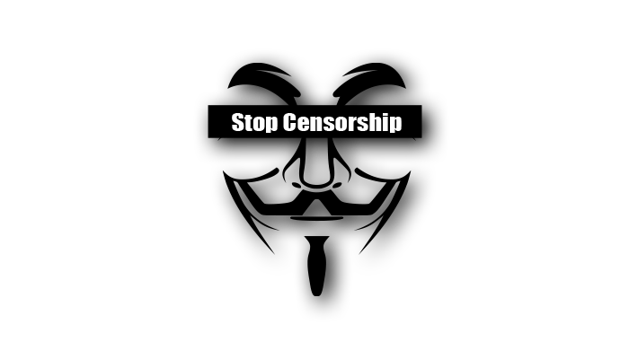

---

title: 番茄食用指南（科学上网教程）  
date: 2016-03-03  
updated: 2020-08-20   
categories: 翻墙方法   
tags: 突破网络审查 

---



每一个做外贸，搞设计，写代码或者对数字生活有追求的人，开始「网上冲浪」之前，都会带上足量的 🍅 番茄（[翻墙](https://zh.wikipedia.org/wiki/%E7%AA%81%E7%A0%B4%E7%BD%91%E7%BB%9C%E5%AE%A1%E6%9F%A5) 的谐音），确保可以顺利出海。

<!-- more -->

## ⚠️ 前言

番茄是一种恶魔果实，可以让食用者得到一种特殊的能力：越过长城，走向世界，访问任何一个网站（例如 Google、YouTube、Twitter 等）。但是，如果在中国大陆吃番茄，请注意以下事项。


**🙊 审查就在你的身边**

出海冲浪（Surfing the internet）是为了工作、学习、娱乐和提高网络生活质量，请勿违反法律法规，发布违反国家相关法律法规及「九不准」管理规定的信息，如：
- 反对宪法所确定的基本原则危害国家安全；
- 泄露国家秘密，颠覆国家政权，破坏国家统一；
- 损害国家荣誉和利益；
- 煽动民族仇恨、民族歧视，破坏民族团结；
- 侮辱、滥用英烈形象，否定英烈事迹，美化粉饰侵略战争行为的；
- 破坏国家宗教政策，宣扬邪教和封建迷信；
- 散布谣言，扰乱社会秩序，破坏社会稳定；
- 宣扬淫秽、色情、赌博、暴力、凶杀、恐怖或者教唆犯罪；
- 煽动非法集会、结社、游行、示威、聚众扰乱社会秩序；
- 诽谤他人，泄露他人隐私，侵害他人合法权益；
- 含有法律、行政法规禁止的其他内容的信息。

Ting 我 Talk 一句：只要肉身在中国大陆，我们的一切行动听党（Ting Dang）指挥，千万别以为吃了番茄就可以为所欲为。否则你可能就会重蹈庭勃士的覆辙：因转发 Twitter 的「不当言论」到微信（WeCheck）群，被抓进派出所 [喝茶](https://tingtalk.me/yum-cha/)。

话不多说，即刻开车，带你翻山涉水，出海买番茄。


## 💰 买番茄

[点击这里](https://tingtalk.me/fq-ever/) 查看曾经推荐过的番茄商（flycloud、Just My Socks），因为价格或稳定性，不推荐购买。

[点击这里](https://tingtalk.me/fq-free/) 查看免费的番茄商（推荐使用迷雾通） ，如果本文中提供的番茄购买链接被封了，可以作为临时的备用访问途径，不推荐长期使用。因为时间宝贵，请对自己好一点。

我目前的主力出海工具是 ssrcloud，多年老机场，节点不少，价格适中，目前还行。

近期 ssrcloud 被攻击，可以选择 [LinkHub](https://linkhub.cool/auth/register?code=Dnj1) 这个低价机场过渡一下：

```
https://linkhub.cool/auth/register?code=Dnj1
```

- 注册邀请码：`Dnj1`
- 八折促销码：`LinkHubAFF`


### 📧 注册

用手机或者电脑的本机浏览器打开 [ssrcloud](https://邀请01.很有精神.com/auth/register?code=iQuU)，或者复制下面这个网址，粘贴到浏览器的地址栏：
```http
 https://邀请01.很有精神.com/auth/register?code=iQuU
```
- 邀请码是 `iQuU`
- 通过我的邀请链接注册，你可能会获得 ￥1 的初始出海资金。
- 备用注册链接：https://cnix-gov-cn.com/auth/register?code=iQuU
- 官网不是一成不变的。刷新订阅链接，即可在某个节点中看到最新的官网。

注册后，登录。

### 💸 充值

在左侧菜单栏往下滑，找到 `商店` - `充值`（2020 年 7 月 23 日下架了月付 ￥10 的套餐）：

- 月付 ￥15：150 GB
- 季付 ￥60：600 GB
- 年付 ￥150：1500 GB
- ……  

### 🛒 购买

限时优惠码：`Kukumbukira Zimphona`

在左侧菜单栏往下滑，找到 `套餐购买`：为了保险起见，不管是买哪一家的番茄，我都推荐先买一个月的量试用一下，觉得好用（周末高峰期也能稳定使用），再季付（也要慎重），年付（做好跑路无悔的准备）可以等敏感期（6 月份）过了之后再买。为什么：

- 每个用户所在的地理位置不一样，选用的运营商也不相同，所以网速和稳定性是因人而异的。
- 道高一次，魔高一丈，中国的网管可不是吃素的（可怕的食肉动物），对番茄这种水果极其厌恶。万一发飙，种植技术一般的番茄商可能就 Game Over 了，所以我也不敢保证我现在用的这家机场会不会跑路。

在左侧菜单栏，找到 `我的` - `用户中心` - 滑倒底部，找到 `快速添加节点`，粘贴订阅链接到对应的番茄客户端即可食用。

Windows 用户推荐使用 Clash，教程在下面「吃番茄」的章节。

Android 用户推荐使用 ShadowsocksR 客户端，但是也可以把 Clash for Windows 订阅链接用在 Clash for Android 上，教程在下面「吃番茄」的章节。

苹果用户，选择很多，挑一个顺手的即可。


### 💁 售后

**公告**

- Telegram 通知频道：https://t.me/airkoryochannel

**客服**

- 在 Telegram 上联系**售后**客服：[@cnix01](https://t.me/cnix01)
- 无法私聊时，请联系 [@cnix_support_pm_bot](https://t.me/cnix_support_pm_bot)

**群组**

- Telegram 群组：https://t.me/airkoryo


### 🔁 续费

目前 ssrcloud 不支持自动续费，请在账号到期前重新购买套餐。如果觉得每月都要重复操作，可以购买季付或者年付套餐。

对于不熟悉代理规则的用户，账号过期后，请退出番茄客户端/app，再登录官网续费。

官网会被封锁，更新你的节点列表，最新的官网地址就会出现。

购买新套餐后，无法通过订阅连接更新节点，怎么办：

1. 登录 ssrcloud，点击左侧菜单栏的 `节点列表`
3. 打开其中一个节点的 `配置二维码`
4. 右键 ShadowsocksR 客户端 - `服务器` - `扫描二维码`
5. 现在应该可以更新节点了


## 🍅 吃番茄

先按照番茄商提供的教程食用番茄，本章节是纯文字教程，作为官方指南的补充。

**图文教程请参阅**

- [Dler Cloud 文档中心](https://docs.dler.io/black-hole/)
- [全球互联交互 - 帮助中心](https://world.crisp.help/zh/)
- [使用教程汇总 - 神奇海螺](https://wiki.kache.moe/2019/12/17/%E6%95%99%E7%A8%8B%E6%B1%87%E6%80%BB/)


**番茄客户端与番茄供应商**

以下列举的软件只是代理工具，不提供任何代理服务器。打个比喻，飞机延误或停飞，不关飞机制造商（波音/空客）的事，请找航空公司客服人员。如果节点不可用：

- 先尝试更换节点
- 套餐是否到期了
- 最坏的结果就是机场跑路了


**吃番茄有多种方式**

**吃法①：手动输入**

- `Server IP`（服务器地址）
- `Port`（服务器端口）
- `Password`（密码）
- `Encryption`（加密方式）

**吃法②：自动导入**

- 导入单个番茄
  - 复制番茄商提供的单节点地址，打开番茄客户端， `从剪贴板导入 URL`
  - 打开番茄商提供的二维码，打开番茄客户端，`扫描屏幕上 / 手机上的二维码`
- 导入批量番茄 👍
  - `服务器订阅`：通过一个订阅地址，一次性导入大量番茄；支持更新节点（有些番茄会烂掉）


**备用下载链接**

番茄客户端的安装包一般是放在国外网站（例如 GitHub），有时候下载较慢，因此我把这些安装包手动上传到蓝奏云，供读者享用（不保证是最新版，而且某些安装包会被蓝奏云迫于不可抗力删除）：
- [番茄客户端备用下载链接 by TingTalk](https://lanzous.com/b00t9wiva)
- [各平台客户端备用下载链接 by rixCloud](https://rixcloudkb.io/kb/client-application-download/)
- iOS（iPhone & iPad）：因为只能通过 App Store 下载，教程请参考下文。


**关联阅读**

- [订阅链接转换 API](https://bianyuan.xyz/)
- [ClashR News](https://telegra.ph/ClashR-03-06)


**🚫 远离国产流氓软件**

它们不仅会上报给网管（城管）谁在吃番茄，还会偷偷地在你的番茄里下毒。如果你打不开本文中的链接，很可能就是它们搞的鬼。

| ✔️                                                            | ❌                                                            |
| :----------------------------------------------------------- | :----------------------------------------------------------- |
| [火绒安全](https://www.huorong.cn/) <br/>Windows 10 自带的安全中心 | 360 安全卫士<br />腾讯电脑管家<br />金山毒霸<br />……         |
| [Google Chrome](https://www.google.cn/chrome/)（谷歌浏览器）<br/>[Firefox](https://www.mozilla.org/zh-CN/firefox/)（火狐浏览器）<br/>[Microsoft Edge](https://www.microsoftedgeinsider.com/en-us/)（Windows 10 自带） | 360 浏览器<br />QQ 浏览器<br />搜狗浏览器<br />UC 浏览器<br />…… |
| Windows 10 自带的拼音 / 五笔输入法                           | 搜狗输入法 <br/>QQ 输入法 <br/>百度输入法<br/>……             |

关联阅读：[Windows 电脑佳软推荐](https://tingtalk.me/windows/)。


### 🖥 Windows（PC）


#### Shadowsocks

##### 下载

- 下载 [Shadowsocks.zip](https://github.com/shadowsocks/shadowsocks-windows/releases)（[备用下载链接](https://lanzous.com/b00t9wiva)）

##### 解压

- 在非系统盘新建一个名为 `Shadowsocks` 的文件夹，例如 `D:\Program Files\Shadowsocks`，把下载好的安装包剪切到这里，解压，打开 `Shadowsocks.exe` 
- Windows 7 用户如果无法正常运行 `Shadowsocks.exe`，请下载并安装 [.NET Framework 4.7.2](https://dotnet.microsoft.com/download/thank-you/net472) 后，再尝试打开 `Shadowsocks.exe`

##### 配置

- 方法一（自动）：复制番茄商提供的 URL（网址），右键点击小飞机 > `服务器` > `从剪贴板导入 URL`
- 方法二（自动）：打开番茄商提供的二维码，右键点击小飞机 > `服务器` > `扫描屏幕上的二维码`
- 方法三（手动）：双击桌面右下角任务栏的小飞机，输入 `Server IP`（服务器地址）、`Port`（服务器端口）、`Password`（密码）和 `Encryption`（加密方式），点击 `确定`（不要把空格复制进去！）


右键点击小飞机：

- `PAC 模式` > `从 GFWList 更新本地 PAC`
- `系统代理` > `PAC 模式`（智能分流模式，只代理被屏蔽的网站），即可畅游全球网络
- `开机自启` 

> 代理自动配置（英语：Proxy auto-config，简称 PAC）是一种网页浏览器技术，用于定义浏览器该如何自动选择适当的代理服务器来访问一个网址。


##### 进阶

- [Shadowsocks Windows 使用说明（官方）](https://github.com/shadowsocks/shadowsocks-windows/wiki/Shadowsocks-Windows-%E4%BD%BF%E7%94%A8%E8%AF%B4%E6%98%8E)
- [simple-obfs](https://github.com/shadowsocks/simple-obfs/releases)
  - 插件程序：`obfs-local`
  - 插件选项：`www.bing.com` 可以改为其他网站
    - `obfs=tls;obfs-host=www.bing.com`
    - `obfs=http;obfs-host=www.bing.com`


#### ShadowsocksR

##### 下载

- `原版` [ShadowsocksR](https://github.com/shadowsocksrr/shadowsocksr-csharp/releases) by shadowsocksrr
- `魔改` [ShadowsocksR](https://cdn.rixcloud.io/download/ShadowsocksR-Windows.zip) by rixCloud 👍
- `魔改` [ShadowsocksR](https://github.com/HMBSbige/ShadowsocksR-Windows/releases) by Bruce Wayne：更新频繁，界面友好。我目前的选择。
- `备用` [下载链接](https://lanzous.com/b00t9wiva)


##### 安装

- 复制 `ShadowsocksR-win.zip` 到非系统盘，例如 `D:\Program Files\ShadowsocksR`
- 解压
- 双击 `ShadowsocksR-dotnet4.0.exe` 或 `ShadowsocksR-dotnet2.0.exe`


##### 订阅

右键点击任务栏右侧的 ShadowsocksR（白色小飞机）

- `服务器负载均衡`：点击一下，即可去掉勾选，此时小飞机会变成其他颜色则表示禁用成功
- `服务器订阅`
  - `SSR 服务器订阅设置` - `Add` - `网址`：复制并粘贴番茄商提供的 SSR 订阅地址（覆盖默认网址）
  - `更新 SSR 服务器订阅（不通过代理）`：稍等片刻，就会提示订阅更新成功
- `服务器` - `编辑服务器`：选择 `FreeSSR-public`，`删除`，`确定`
- `服务器`：在更新的众多节点中，选一个节点（一般来说，离中国越近，延迟越低，例如香港节点）
- `系统代理模式`：`全局`
- `代理规则`：`绕过局域网和大陆` ❗️
- `选项设置`：`开机启动`
- 测试是否可以访问 [Google](https://www.google.com/search?q=%E5%BA%AD%E8%AF%B4)。如果无法访问 Google，请换另外一个番茄


**关联阅读**

- [大概是萌新也看得懂的 SSR 功能详细介绍&使用教程 - 神代綺凜](https://moe.best/tutorial/shadowsocksr.html)
- [系统代理模式、PAC、代理规则三者之间的关系 by vimcaw](https://vimcaw.github.io/blog/2018/03/12/Shadowsocks(R)%E8%AE%BE%E7%BD%AE%EF%BC%9A%E7%B3%BB%E7%BB%9F%E4%BB%A3%E7%90%86%E6%A8%A1%E5%BC%8F%E3%80%81PAC%E3%80%81%E4%BB%A3%E7%90%86%E8%A7%84%E5%88%99/)


#### ShadowsocksD

- 下载 [ShadowsocksD.exe](https://github.com/TheCGDF/SSD-Windows/releases) （[备用下载链接](https://lanzous.com/b00t9wiva)）
- [ShadowsocksD](https://github.com/TheCGDF/SSD-Windows/releases) 在 [Shadowsocks](https://github.com/shadowsocks/shadowsocks-windows/releases) 的基础上增加了订阅功能。
- 不兼容 ShadowsocksR 协议。
- 必须卸载「360 / 2345 / 腾讯 全家桶」才能运行。莫慌，这是 [Windows 佳软](https://tingtalk.me/windows/) 推荐。
- 使用方法跟 Shadowsocks 大同小异，不在赘述。


#### Clash for Windows

仅支持 64 位的 Windows 系统。

##### 下载

- 官方：[Clash for Windows.exe](https://github.com/Fndroid/clash_for_windows_pkg/releases)  by Fndroid，下载速度可能比较慢。
  - 安装版：`Clash.for.Windows.Setup.exe`
  - 便携版：`Clash.for.Windows-win.7z`
- 备用：下载速度较快，但可能不是最新版，不过不影响使用。
  - [rixCloud](https://cdn.rixcloud.io/download/Clash-Windows.exe)
  - [蓝奏云](https://lanzous.com/b00t9wiva)

##### 安装
- 双击安装
- 授权运行：点击 `更多信息`，然后选择 `仍要运行`
- 为 `所有用户` 安装
- `C` 改为 `D`：`D:\Program Files\Clash for Windows`

##### 使用

从机场复制 Clash 订阅 URL（托管配置链接）。打开 Clash for Windows，在左侧的标签页中依次选择：

**[Profile](https://docs.cfw.lbyczf.com/contents/ui/profiles.html)（配置）**  

1. 在顶部输入框粘贴订阅配置链接，然后点击 `Download` 按钮。Clash for Windows 会自动下载远程配置文，如果一切顺利，你应当可以看到绿色提示信息。`Success!`，并且可以看到一个新的配置文件（如果弹出 `Could not switch to this profile! `，关闭软件，以 `管理员身份运行`。）。
2. 点击新的配置文件，就能切换到该配置。
3. 点击配置文件的 ℹ️（Change information），在 `Update Interval (hour)` 填入 `24`，即 24 小时自动更新一次配置文件。


**[Proxies](https://docs.cfw.lbyczf.com/contents/ui/proxies.html)（代理）**  
用于切换代理模式和接入点（节点）。

1. 将顶部的代理模式选择为 `Rule`（规则）：所有请求根据配置文件规则进行分流。
2. 点击 `Proxy` 智能分流 [策略组](https://github.com/Fndroid/jsbox_script/wiki/%E5%85%B3%E4%BA%8E%E7%AD%96%E7%95%A5%E7%BB%84%E7%9A%84%E7%90%86%E8%A7%A3)（各家称呼不一样，一般排在第一位）。
3. 点击右侧的 ⚡ 进行测速。
4. 选择一个较快的接入点（`ms` 毫秒数最小）。


**[General](https://docs.cfw.lbyczf.com/contents/ui/general.html)（常规）**   

`System Proxy`（系统代理）：`On`

`Start with Windows`（开机自启）：`On`

`GeoIP Database`：点击更新 MaxMind 的 GeoIP2 Lite 数据库。此数据库用于 Geo 规则和 DNS 判断，建议每月至少更新一次。

`UWP Loopback`

> UWP 是微软在 Windows 10 中引入的新概念，由于所有 UWP 应用均运行在被称为 App Container 的虚拟沙箱环境中，其安全性及纯净度远胜于传统的 EXE 应用。但 App Container 机制同时也阻止了网络流量发送到本机（即 loopback）， 使大部分网络抓包调试工具无法对 UWP 应用进行流量分析。同样的，该机制也阻止了 UWP 应用访问 localhost，即使你在系统设置中启用了代理，也无法令 UWP 应用访问本地代理服务器，十分恼人。by [通过设置为 Win 10 UWP 应用解除网络隔离 - SHY](https://sspai.com/post/41137)

如何开启用本地回环代理：
1. 点击 `Launch Helper`。
2. 点击 `Exempt All` 勾选所有 UWP 应用。
3. 点击 `Save Changes` 保存设置。
4. 点击右上角关闭，此时 UWP 应用的网络问题就可以解决了，例如 Microsoft To Do 可以同步了。

❗ 请注意：安装新的 UWP 应用后，需要重新设置。


**Clash for Windows 所有节点测试延迟都显示 Timeout 怎么办？**
访问 [Time.is](https://time.is/)  ，确保你的电脑系统时间与标准时间的时间差不超过 1 分钟。


**关联阅读**

- 文字教程：[UWP 应用联网 - Fndroid](https://github.com/Fndroid/clash_for_windows_pkg/wiki/UWP%E5%BA%94%E7%94%A8%E8%81%94%E7%BD%91)
- 图文教程：[Clash for Windows 官方文档 - Fndroid](https://docs.cfw.lbyczf.com/)
- 图文教程：[如何在 Clash for Windows 上进行配置 - rixCloud](https://rixcloudkb.io/kb/configured-by-clash-for-windows/)
- 视频教程：[Clash(R) for Windows 教程 | 可能是Windows上最好用的代理工具 - Sabrina](https://merlinblog.xyz/wiki/cfw.html)
- [Clash Editor](https://clash.skk.moe/)：一个 实验性质 的 Clash 配置文件编辑向导。


### 🤖 Android（安卓手机）

**始终开启 VPN**

以 MIUI 为例，打开 `设置` > `VPN`，选择某个配置右侧的齿轮图标 ⚙，打开 `始终开启的 VPN`（随时和 VPN 保持连接）。

接下来可以把**翻墙 app 锁定在后台，并设置为开机自启**（可选步骤）。大部分 Android 系统都会因为电池策略导致 翻墙 app 应用程序被杀掉导致无法连接网络。出现这种情况的特征是通知栏中 VPN 连接仍然存在，但无法访问网络（包括国内网络）。这是因为 翻墙 app 主程序和 VPN 框架是独立存在的，主程序被系统清理后会导致流量仍然通过 VPN 路由到本地但没有应用程序来处理这些流量，导致无法上网。

还可以在下拉/上拉通知栏中开启对应翻墙 app 的快捷方式，像开关 Wi-Fi 一样决定是否启用代理。

由于代理软件的特殊性，可能导致系统将所有因为网络连接而消耗的电量都计算在代理软件上，这是正常情况，并非严重的续航影响。


#### Shadowsocks

- 下载 Shadowsocks.apk
  - `原版` shadowsocks.apk 下载链接：[GitHub](https://github.com/shadowsocks/shadowsocks-android/releases) | [Google Play](https://play.google.com/store/apps/details?id=com.github.shadowsocks)
  - `魔改` [Shadowsocks.apk](https://cdn.rixcloud.io/download/Shadowsocks.apk) by rixCloud 👍
  - `备用` [下载链接](https://lanzous.com/b00t9wiva)

- 安装后，打开 App，点击右上角的 `＋`，任选一种方法，添加节点信息
  - 手动设置：正确填写（检查是否有空格） `服务器`、`远程端口`、`密码`、`加密方式`
  - 扫描二维码
  - 从剪贴板导入
- 路由选择 `绕过局域网和中国大陆网址`
- 点击右上角的 `✔`
- 选择刚刚创建的配置文件，点击底部小飞机 `✈️️`（网络连接请求选 `确定`）
- 打开浏览器，在地址栏输入 `google.com/ncr` 测试是否可以访问 [Google](https://www.google.com/search?q=%E5%BA%AD%E8%AF%B4)


#### ShadowsocksR

图文教程请参阅 [ShadowsocksR 小飞机使用教程- 神奇海螺](https://wiki.kache.moe/2019/12/06/Android-ShadowsocksR/)，以下是纯文本教程：

- 下载 ShadowsocksR.apk
  - `原版` [ShadowsocksR.apk](https://github.com/shadowsocksrr/shadowsocksr-android/releases) by shadowsocksrr
  - `魔改` [ShadowsocksR.apk](https://cdn.rixcloud.io/download/ShadowsocksR.apk) by rixCloud 👍
  - `魔改` [ShadowsocksR](https://github.com/HMBSbige/ShadowsocksR-Android/releases) by Bruce Wayne
  - `魔改` shadowsocksRb.apk 下载途径：[GitHub](https://github.com/shadowsocksRb/shadowsocksRb-android/releases) | [Telegram Channel](https://t.me/ShadowsocksRb)
  - `魔改` [Maying](https://apkpure.com/maying/co.tgbot.peekfun)：内置了 [ACL4SSR](https://github.com/ACL4SSR/ACL4SSR) 路由规则。我目前的选择。
  - `魔改` [喵帕斯修改版](https://xn--i2ru8q2qg.com/downloads/client/ssr-android.apk)：基于届时 SSRR [最新版](https://github.com/shadowsocksrr/shadowsocksr-android/releases/tag/3.5.4) 代码去掉了节点列表乱序功能，不能与之共存。
  - `备用` [下载链接](https://lanzous.com/b00t9wiva)
- 轻触 App 图标打开，点击左上角的 `ShadowsocksR` ，进入配置文件管理页面，然后点击右下角的 `+`，在弹出的选项中选择 `添加/升级 SSR 订阅`
- 在弹出的菜单中选择 `添加订阅地址`，在新窗口中粘贴之前从番茄商里获取的地址
- 添加完成后会自动返回到之前的菜单，打开 `自动更新`，然后点击 `确定并升级`
- 自动获取完节点后，轻触右上角的 ⚡ 进行 `完整延时测试`，等待若干分钟（节点很多的话，可以中断测试，因为 100 毫秒以下的节点都是可以接受的），在轻触 ⚡ 右边的三道杠 `基于延时自动排序`，选择第一个节点（0 ms 代表节点不可用，所以要选择 18 ms 到 50 ms 左右的节点）
- 在  `功能设置` 选项卡
  - `路由` 中选择 `绕过局域网及中国大陆地址`
- 在 `其他` 选项卡，打开 `自动连接`
- 最后，点击右上角的纸飞机 ✈ 开启代理（初次使用时会弹出 `网络连接请求`，点击 `确定` 即可）


**进阶设置（小白不必理会）**

- `路由` - `自定义 ACL 文件`
  ```
  https://cdn.rixcloud.io/resource/rules/Android/ACL/banAD.acl
  ```
- 打开 `IPv6 路由`（如果国外社交软件（例如 Instagram）等无法加载内容时）
- 打开 `UDP 转发`
- 设置 `China DNS` 为
  ```
  119.28.28.28:53,119.29.29.29:53,1.2.4.8:53
  ```
- 设置 `DNS` 为
  ```
  1.1.1.1:53
  ```


#### ShadowsocksD

- 下载 [ShadowsocksD.exe](https://github.com/TheCGDF/SSD-Android/releases)（[备用下载链接](https://lanzous.com/b00t9wiva)）
- ShadowsocksD 在 [Shadowsocks](https://github.com/shadowsocks/shadowsocks-android/releases) 的基础上增加了订阅功能
- 不兼容 ShadowsocksR 协议
- 目前的开发者厌恶华为 / 锤子 / 小米（MIUI）设备，可能会存在兼容性问题


#### Clash for Android

**特点**

- 界面简洁美观
- 支持策略分流
- 支持访问控制模式（分应用代理、绕行模式）

**下载**

- [Google Play](https://play.google.com/store/apps/details?id=com.github.kr328.clash&hl=zh)：需要 Google 服务框架。
- [GitHub](https://github.com/Kr328/ClashForAndroid/releases)：下载速度较慢。
- [蓝奏云](https://lanzous.com/b00t9wiva)：下载速度较快，但可能不是最新版，不过不影响使用。


**教程**

使用方法和 Clash for Windows 类似，这里不再赘述。

Clash(R) for Android 图文教程：[东半球第二好用的安卓翻墙工具 - Sabrina](https://merlinblog.xyz/wiki/cfa.html)


**动态**

Telegram Channel（电报频道）：[Clash for Android Channel Gateway](https://t.me/clash_for_android_channel)


### 📱 iOS（iPhone & iPad）

番茄客户端无法在中国区 App Store 下架，但可以注册非中国区的 Apple ID 登录 App Store。获得国外的 Apple ID 后，你就可以下载番茄客户端了：

- 免费：[Potatso Lite](https://apps.apple.com/us/app/potatso-lite/id1239860606)
- 付费：[Shadowrocket](https://itunes.apple.com/us/app/shadowrocket/id932747118?mt=8) 和 [Quantumult](https://itunes.apple.com/us/app/quantumult/id1252015438?mt=8)

**如何购买付费的 App：**

- 慢且安全的方法：[自己注册一个非中国区的 Apple ID](https://tingtalk.me/us-apple-id/)，然后找万能的淘宝充值，接着付费下载番茄 App。
- 快但危险的方法：[找一个已经购买过付费番茄客户端的 Apple ID](https://tingtalk.me/us-apple-id-share/)。操作不当，手机「变砖」。所以请严格教程里的步骤操作。


#### 🍥 Potatso Lite

使用非中国区的 Apple ID 可以安装免费的 [Potatso Lite](https://apps.apple.com/us/app/potatso-lite/id1239860606)（土豆丝入门版）

- `立即使用` - `现在添加`：选择合适的添加方式
    - `自动导入`：`订阅`
        - `Name`（名字）：填写番茄商的名字或随便写一个
        - `Auto Update`（自动更新）：打开
        - `Subscription URL`（订阅链接）
    - `手动输入`
        - 类型：Shadowsocks / ShadowsocksR
        - 服务器
        - 端口
        - 加密
        - 密码
- 选择一个代理
- 开启 `智能路由`：只允许被封的网站走代理通道
- `开始` - `Allow`（允许）- 输入密码
- 打开 Safari 浏览器，在地址栏输入 `google.com/ncr` 测试是否可以访问 [Google](https://www.google.com/search?q=%E5%BA%AD%E8%AF%B4)


#### 🚀 [Shadowrocket](https://itunes.apple.com/us/app/shadowrocket/id932747118?mt=8)

`$2.99` 俗称「小火箭」：

添加订阅节点，请参考图文教程 [iOS - Shadowrocket (小火箭) 使用教程 - 神奇海螺](https://wiki.kache.moe/2019/11/16/iOS-Shadowrocket/)。以下是是纯文字教程。


##### 底部导航栏：`首页`

- 点击右上角的 `＋` > `类型：Subscribe` > `URL：从番茄商那里获取` > `完成（右上角）` 回到 `首页`
- 点击 `连通性测试`，选一个最快的（ms 数最小的）
- 点击 `全局路由`，选择 `配置`
  - 配置（PAC）：智能分流
  - 代理（Proxy）：全部网络连接走代理，即全局模式。某些网站上不了，可以临时使用这个模式。
  - 直连（Direct）：暂停科学上网
  - 场景：小白不必了解，但这也是小火箭的厉害之处
- 火箭发射（发射按钮在右上角 `+` 的下方）
  - 第一次连接时会弹出 `"Shadowrocket" Would like to Add VPN Configurations`，点击 `Allow`（允许）


##### 底部导航栏：`配置`

- 复制下面这个 URL，点击右上角的 `＋`，URL 会自动粘贴	
	```http
	https://raw.githubusercontent.com/lhie1/Rules/master/Shadowrocket/Complete.conf
	```
- 在 `远程文件` 列表，点击刚刚添加的配置文件 `https://raw.github…Complete.conf` > `使用配置` > 下载
- 在 `本地文件` 列表，点击 `Complete.conf` 即可启用

如需进一步了解，请访问 [Shadowrocket 配置文件使用手册 - lhie1](https://github.com/lhie1/Rules)


##### 底部导航栏：`数据`

- `iCloud` > `自动同步：开启`，如此一来，换了 iPhone，配置还在。

 

##### 底部导航栏：`设置`

- 滑到底部 `其他` > `服务器订阅`
  - `打开时更新`：`开启`
  - `自动后台更新`：`开启`
  - `根据 Ping 排序`：`开启`（最快的节点排在最前面）


#### 🧬 [Quantumult](https://itunes.apple.com/us/app/quantumult/id1252015438?mt=8) 

`$4.99` 俗称「圈」。

教程请参阅：

- [iOS - Quantumult (圈) 使用教程 - 神奇海螺](https://wiki.kache.moe/2019/11/17/iOS-Quantumult/)
- [如何在 Quantumult 上进行配置 - rixCloud](https://rixcloudkb.io/kb/configured-by-quantumult-on-ios/)


### 💻 macOS（苹果电脑）

如果下方链接失效或下载速度慢，请访问 [备用下载链接](https://lanzous.com/b00t9wiva)。


#### ShadowsocksX-NG

- 下载最新的 [ShadowsocksX-NG.zip](https://github.com/shadowsocks/ShadowsocksX-NG/releases)
- 接下来的设置参考 Shadowsocks for Windows，或参考这个 [教程](https://github.com/hongwanzhang/Share-SSR-V2ray/blob/master/SS/3-macos-setup-guide-cn.md)


#### ShadowsocksX-NG-R

- 下载途径
  - 通过 [GitHub](https://github.com/qinyuhang/ShadowsocksX-NG-R/releases) 下载
  - 通过 [rixCloud](https://cdn.rixcloud.io/download/ShadowsocksX-NG-R8.dmg) 下载
- 接下来的设置参考 ShadowsocksR for Windows


#### ClashX

- 下载地址
  - 首选：[ClashX by Yicheng](https://cdn.rixcloud.io/download/ClashX.img) 
  - 备选：[ClashX by RicCloud](https://cdn.rixcloud.io/download/ClashX.img) 
- 接下来的设置参考 Clash for Windows


## 🤙 后记

### 💾 备选菜园

- 如果以上推荐的番茄供应商不能满足你的要求，去这个 [菜市场](https://github.com/387099/SSR/issues/1) 找找。
- 在 [菜市场](https://github.com/387099/SSR/issues/1) 买不到钟意的番茄，买 [一块地](https://www.vultr.com/?ref=7230883)，自己 [种番茄](https://tingtalk.me/fq-diy/)。
- 一劳永逸的方法：肉翻出国。


### 🚚 进阶技巧

❗ 小白用户可以略过本章节。

`tingtalk.me` 因为不可抗力，在中国大陆遭到屏蔽，此时在 [智能分流（PAC）模式](https://github.com/gfwlist/gfwlist) 下无法正常访问庭说的博客。于是不得不切换为 `全局模式`，但这样一来，其他可以正常访问的网站（例如 sspai.com）也走代理通道了（速度慢（取决于番茄的质量），费流量）。所以阅读完我的博客之后，不得不换回 PAC 模式。这个时候，借助 [SwitchyOmega](https://github.com/FelisCatus/SwitchyOmega/) 可以创建属于自己的规则列表（任意网站，走不走代理，几时走代理，通通你说了算）。详情参阅 [SwitchyOmega 使用教程](https://tingtalk.me/switchyomega/)。


### 🧹 清除 DNS 缓存

一切都设置好了，但还是无法访问 Google，可能是 DNS 受到污染了。怎么办：

手机的话，开启「飞行模式」，再关闭。

Windows 设备，请刷新 DNS 缓存：

1. 按下键盘快捷键 `Windows 徽标键` + `R`，调出「运行」窗口。
2. 输入 `cmd`，回车，打开「命令提示符」窗口。
3. 复制或输入以下命令，回车。
   ```
   ipconfig/flushdns
   ```
4. 显示 `Windows IP 配置 已成功刷新 DNS 解析缓存。`
5. 现在应该就可以正常访问 Google 了。


### 🔍 善用 Google

Search before you ask（遇事不明，搜索引擎）。这篇保姆级的教程写得那么详细，手再伸出来就砍了。如果暂时无法访问 [Google](https://www.google.com/ncr)，推荐使用 [必应搜索（国际版）](https://cn.bing.com/)。苦寻无果，与我联系，手把手教你越过互联网的藩篱（My mission is to give you freedom）。


### 📞 与我联系

- 加入庭说的后花园： [Telegram 群组](https://t.me/tingtalk)（`@tingtalk`），那里百花盛开，充满自由的气息。这是 [Telegram 新手教程](https://tingtalk.me/telegram/)。
- 添加庭勃士的微信号 `tingtalkme`：接头暗号「番茄」。

虽然庭说的博客和公众号都已被封了，我也可能因此再次被 invited for some tea。请看以下来自一位法律人士（未交叉验证）的案例：

- 一人使用 [蓝奏云](https://www.lanzou.com/) 网盘传播翻墙软件 [蓝灯](https://getlantern.org/zh_CN/)，被蓝奏云举报，检察院建议判二缓三。
- 一人接到公安局的电话，要求做笔录、并保证书不再使用 Twitter。

但也不必过于悲观，因为我没有以牟利为目的去制售翻墙相关软件和服务（机场不是我开的）。我只是无偿帮助读者获取信息自由，改善网络环境，方便学习和工作，不包含任何政治目的。

这也是我的一个小小梦想：信息可以像水和空气一样自由流动。只要我还能表达，青山不改，绿水长流。