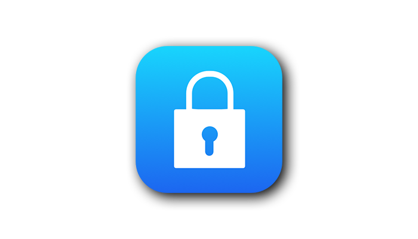

 

在 Apple 的严厉打击下，此法逐渐失效。[自行注册 Apple ID](https://tingtalk.me/us-apple-id)，才是终极且安全的解决办法。

<!-- more -->

共享的 Apple ID 只能用于登录 **App Store** ❗️ 千万不要在 **iCloud** 登录 ❗️ 所以请严格按照以下路径操作。否则设备被锁，申诉无门，Tim Cook 也救不了你的 iPhone。

## 获取 Apple ID

因为多人共用会触发风控，所以多试几个 Apple ID。当找到一个可用的 Apple ID 后，把它记在备忘录或者微信收藏，方便日后调用。

2020-12-16 亲测可用：

- 账号：hashkeyhub002@yandex.com
- 密码：Hashkeyhub2019

### GitHub

1. 打开在 [GitHub](https://github.com/search)。
2. 输入 [Apple ID](https://github.com/search?o=desc&q=Apple+ID&s=updated&type=Repositories)、[苹果账号](https://github.com/search?o=desc&q=%E8%8B%B9%E6%9E%9C%E8%B4%A6%E5%8F%B7&s=updated&type=Repositories)、[小火箭](https://github.com/search?o=desc&q=%E5%B0%8F%E7%81%AB%E7%AE%AD&s=updated&type=Repositories) 和 [Shadowrocket](https://github.com/search?o=desc&q=Shadowrocket&s=updated&type=Repositories) 等关键词，搜索。
3. `Sort`（排序）: `Recently updated`（最近更新）。

以下是我找到的一些资源：

- [openwrt-ssr](https://github.com/openwrt-ssr/appleid/wiki/2020%E8%8B%B9%E6%9E%9C%E7%BE%8E%E5%9B%BD-%E9%9F%A9%E5%9B%BD-%E6%97%A5%E6%9C%AC-%E9%A6%99%E6%B8%AF-%E5%8F%B0%E6%B9%BE-%E8%8B%B1%E5%9B%BD%E7%AD%89%E5%9C%B0%E5%8C%BAApple-ID%E8%B4%A6%E5%8F%B7%E5%85%8D%E8%B4%B9%E5%88%86%E4%BA%AB)：2020-04-17 亲测可用。
- [shadowrocketHelp](https://github.com/shadowrocketHelp/help/wiki/%E5%9B%BD%E5%A4%96-appstore-id-%E8%B4%A6%E5%8F%B7%E5%88%86%E4%BA%AB)
- [insdown](https://github.com/insdown/ins/wiki/%E7%BE%8E%E5%9B%BDapple-id-appstore-id%E8%B4%A6%E5%8F%B7%E5%88%86%E4%BA%AB)

### Website

- [苹果帝](https://appledi.com/)：2020-12-18 亲测可用。
- [小火箭账号 の 分享站](https://wohaobang.cn/)：未测试。

### Telegram

- [Shadowrocket 小火箭苹果  ID 免费分享](https://t.me/shadowrocketid)（@shadowrocketid）：较难找到可用 Apple ID。
- [人人翻墙，则墙自倒！](https://t.me/cnhumanright99)

## 切换 Apple ID

iPhone / iPad 上可以使用不同的账户登录 iCloud 和 App Store（应用商店），而**共享的 Apple ID 只能用于 App Store**，所以请严格按照以下路径操作（全程未出现 iCloud 字样）：

1. 打开 iPhone。
2. `设置` - `iTunes Store 与 App Store`，点击顶部的 `Apple ID: ****@***` - `退出登录`（哪里退出，哪里登录）。
3. 切换到免费的共享 Apple ID。

## 安装番茄 App

打开 App Store（苹果应用商店），搜索并下载番茄 App，例如：

- [Potatso Lite](https://apps.apple.com/us/app/potatso-lite/id1239860606)：免费，配置简单，功能简陋
- [Shadowrocket](https://itunes.apple.com/us/app/shadowrocket/id932747118?mt=8)：付费，但是共享 Apple ID 的主人已经给你买单了

## 退出 Apple ID

安装好番茄 App 后，**退出共享 Apple ID**，切换回自己的 Apple ID。