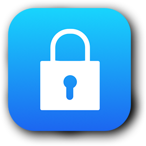

---

title: 美区苹果账号（Apple ID）注册指南
date: 2019-05-15  
updated: 2020-03-22    
categories: 翻墙方法
tags: [突破网络审查, Apple ID]  

---

当你在中国区的 App Store 找不到想要的 app 时，例如 Skype、Shadowrocket、Quantumult 和 Surge 等，才会知道美（国）区 Apple ID 的可贵。

<!-- more -->

不想折腾的用户：

- 花金钱 [购买一个 Apple ID](https://istore.app/)，然后修改邮箱和密保
- 花时间寻找 [免费的共享美区 Apple ID](https://tingtalk.me/us-apple-id-share/)

## 准备工作

核心思想是伪装成在美国上网的美国人：

- 1 个美国 IP
  - [买一个](https://tingtalk.me/fq/) 或白嫖 [迷雾通](https://geph.io/zhs/)（安装包已上传至 [蓝奏云](https://wwa.lanzous.com/b00t9wiva)）
  - 选择一个美国的线路，并 [测试 IP](https://whoer.net/zh)  归属地是否为美国
- 1 个美国地址
  - 借助 [地址生成器](https://www.fakeaddressgenerator.com/World/us_address_generator) 获得一个虚假的美国人信息
  - 优选免税州（State）：Delaware / Montana / New Hampshire / Oregon。并把这个地址备份在记事本，在以后数字移民的过程中，可能会再次用得上，例如 [注册美国区的 PayPal + 绑定美国区的 Apple ID](https://bigfoxgod.com/notes/2020/02/17/sign-up-paypal-and-successfully-bind-to-us-appleid-2020/)
- 1 个未注册过 Apple ID 的 email
  - 优选 [Outlook](https://outlook.live.com/owa/)（不用梯子）或者 [Gmail](https://mail.google.com/)（需要梯子）
  - 次选 163 邮箱和 QQ 邮箱
- 1 台安装了 iTunes 的设备（任选其一）
  - Windows 电脑需要下载并安装 [iTunes](https://www.apple.com/itunes/)
  - MacBook 电脑自带  iTunes

## 开始注册

### 获取美国 IP

1. 打开迷雾通
2. 注册并登录账号
3. 选择一条美国线路并开启

### 创建 Apple ID

- 在 iTunes 上找到的 `账户` - `登录` - `创建新 Apple ID`
- `电子邮件`：最好全球通用的 Email
- `密码`：8 个字符以上，包含数字，大写字母和小写字母
- `国家/地区`：美国（United States），然后界面语言会自动切换成英文
- `Continue`（下一步）

### Personal Information

假如你叫李狗蛋。

- `First Name`（名）：可以填写中文「狗蛋」、拼音 Goudan，或英文名
- `Last Name`（姓）：Li（李）
- `Birthday`（生日）：Month（月）- Day（日）- YYYY（年）；解锁账户时要用到，请牢记！
- `Security information`（密保问题）：可以填写中文答案；解锁账户时要用到，请牢记！
- `Continue`（下一步）

### Create Apple ID

- `Payment Method`（付款方式）：None（无）

如果没有出现 `None`。官网联系 [Apple 客服](https://getsupport.apple.com/?caller=cups)，选择 `立即与 Apple 支持部门人员通话。`，2 分钟之内就会接到客服电话，然后如实回答即可。

> 如果你的支付方式里没有 “无” 这个选项，不要惊慌，可能是苹果通过网络环境判断你不在美国。你可以拨打大陆地区的 Apple 服务热线，找人工客服阐述你遇到的问题 —— 注册美区账号无法成功绑定支付方式，他们会非常热情地配合你解决问题，并由专员在后台进行操作，让你的支付方式里有 “无” 这一选项。当然如果你事先准备了美国的云梯，顺利的话是会有 “无” 的，没有也没关系。by [iRex](https://sspai.com/post/53973)

### Billing Address

借助 [地址生成器](https://www.fakeaddressgenerator.com/World/us_address_generator) 获得一个虚假的美国人信息。

- `Street`（街道）
- `Apt., suite, bldg.`：可为空
- `City`（城市） - 州 - `ZIP`（邮编）- `United States`
- `Area code`（电话号码前 3 位）- `Phone`（电话号码后 7 位）
- `Continue`（下一步）

### Verify Your Apple ID

- 输入邮箱验证码，并 `Verify`（验证）

### 完成注册

- ❗ 最后一定要记得点 `Continue`，不然功亏一篑！
- 然后将代理软件切换回智能分流模式（PAC）

## 下载 App

- 自己注册的 Apple ID 可以用于登录 `iCloud`，但我还是推荐你只在 `App Store` 登录。
  - 依次选择 `设置` - `iTunes Store 与 App Store`，点击顶部的 `Apple ID: ****@***` - `退出登录`，切换到刚刚注册好的美区 Apple ID（哪里退出，哪里登录）。
  - 如果需要验证 Phone Number，填写中国的手机号码也可以通过。
- 现在，你可以尽情下载美区 App Store 里的 app。
- 安装完成之后，你有 2 个选择
  - 切换回以前 Apple ID
  - 把美区 Apple ID 作为主账号（在 iCloud 也登录）以躲避当局的审查。但是 app 是跟着 ID 走的，当时用哪个 ID 下载，升级 app 时也要用那个 ID，所以如果不想使用旧版 app，请使用新的非中国区 Apple ID 卸载重装。

**关联阅读**

- 图文教程：[如何注册并使用美区 Apple ID - 魅影极速](https://docs.maying.co/tutorial/appleid_us)（方法与本文略有不同）
- 文字教程：[如何使用美区 Apple ID 购买付费 App - TARESKY](https://taresky.com/post/Apple-ID-US)