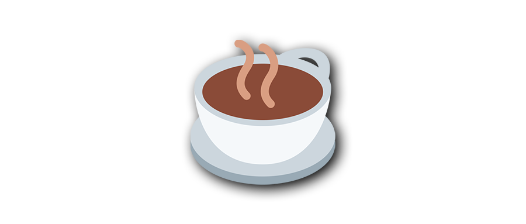

> 发表异议观点，可能有相关人员暗下谈话劝阻，因为此过程中会喝茶（请人谈话或做客，一般会沏茶），因此成为被中共相关机构调查或拘留的代称。by [维基百科](https://zh.wikipedia.org/zh-hans/%E9%A3%B2%E8%8C%B6_(%E6%B6%88%E6%AD%A7%E7%BE%A9))

<!-- more -->

「喝茶」还有另一种隐晦的解释：

> 一种通过饮用茶叶饮品而与历史进行深度沟通，对文化进行传承，对灵魂进行洗涤与升华的仪式。by [小鸡词典](https://jikipedia.com/definitions/user/443757271)

本文于 2018 年 3 月 13 日首发在庭说的长篇 [日志](https://tingtalk.me/whisper/#2018-03-13) 里，今稍作润色，独立成文，以飨（xiǎng）读者。

## 转发评论

24 岁的第 2 天中午，又是一个仓促的午觉。醒来不愿去上班，于是拿起手机，刷刷微信。突然，我又被拉进一个 24 人的「xx 男生群」，虽然反复退群，因为我很讨厌里面某些人无休无止的抱怨。微信就不能让用户有拒绝入群的权利吗？

这次他们在讨论「xx 供电局 2 名员工的不雅视频」。群成员知道我会翻墙，让我去外网搜搜看。根据我所学到的 [搜索技巧](https://tingtalk.me/search-tips/)，很快就在 Twitter 上找到了相关信息。好死不死，我随手转发了其中一条评论到微信群，大意是修宪连任，千秋万代，这成为了人生首次喝茶的契机。看完 Twitter 的全部相关信息，发现 [不雅影像并非来自 ** 电网直播事故](https://twitter.com/Mr_Desperation/status/973208585890013184?s=20)，并将这一辟谣信息告诉群成员。

喧嚣一场过后，班还是得上。

## 电话传唤

`16:57` 接到 95050 的电话，问我是不是 xx，是不是在 xx 上班，是不是在「xx 群」发表了「对党和国家领导人」不当言论……请你来 xx 派出所一趟，没空的话我们会派警车去接你。一开始我当真了，立刻退群。然后发现不对劲，为什么不是派出所的电话打过来？因此暂且判定为诈骗电话。

`17:50` 一个中国移动的私人手机号码打过来，未被标记为诈骗电话，再次问我自己过去还是他来接我去派出所。同事斩钉截铁地认为这是诈骗电话，但是我根本想不出这个诈骗团伙的牟利点在哪里？仅仅是让我去派出所出丑？忐忑地在公司吃完晚餐，回到公司宿舍，警车真的来了。

`18:27` 另外一个中国移动的手机号码打电话给我，响铃 13 声，没接到，也不敢回拨，侥幸地认为警车只是恰巧来这里办其他事情。

`18:41` 电话又打来了，说警车就在门口，出来吧，别紧张，只是问你一些话。我知道逃不了了，于是让室友 LMZ 陪我一起去局里壮壮胆。

## 坐上警车

这是我第一次做警车。车上只有一个开车的警察叔叔，后排是无锈钢座椅，在昏暗的车厢里散发出冰冷的光。但是开车叔叔并不冰冷，所以我的情绪也比较平静。**办案民警说是这是某部门下达的命令，核实不当言论的真实性**。

来到派出所，警察问什么，我答什么，没有严刑逼供。另外一位警察还呵斥我严肃一点，不要嘻嘻哈哈（天性乐观）。做完笔录，画押；写完保证书，画押……罪名「传播不当言论」。

盘查完之后，警察把笔录和保证书呈报给上级。发现有疑点，让我重新做笔录。这一次，他们发现我除了传播不当言论之外，还给不雅视频辟了谣，并及时退群了。但是警察反复盘问我是不是说了不该说的话，我始终想不起来。看了笔录中的那段「不当言论」后才勉强恢复了一点点记忆。

为什么我不记得那段「不当言论」？午觉醒来，迷迷糊糊，觉得那条推特评论写得颇有文采，能把各种官话融入时评中，有力反讽了当局，转。我认同的是它的文字技法，文字内容并未深究。从 2016 年开始写文章，我对雄文没有抵抗力。罢了，这些都是后话，是我没有意识到当前言论环境的恶劣。说句自私的心里话，我一点都不在乎中国的政治制度，我只在乎我能不能拥有自由的网上冲浪。

## 平安归来

为此，我付出了惨痛的代价，写了 4 份保证书、2 份笔录和 1 份训诫书才得以在 `22:24` 走出派出所的大门。是否留下案底，我也不清楚，只记得警察反复说道，此事可大可小。

庆幸评论不是我写的，而是转发的。此外，爱较真的作风，居然连不雅视频都会去求证，会不会是这一点，警察觉得我是好人？

## 有所收获

我把这段难忘的经历写下来，最后得出以下教训：

- 在中国，一切行动听党指挥。
- 不管你是大人物还是小人物，网络言论审查就在身边，刀子嘴，打断腿。
- 在派出所不能拍照、录音、录像，我就被警察发现了。
- 警察问话时要严肃，纵使你是勇于承认「错误」的乐天派。
- 爱笑的男孩运气都不会太差。
- 喝茶的时候，警察并不会给约谈者沏茶，连白开水都没有。
- 少用微信，多用 [Telegram](https://tingtalk.me/telegram/)。

一看时间，凌晨三点，黑夜总会过去，光明总会到来。第二天早上，不到八点，我就醒了，这茶（审查经历）够提神的。

2 年过去了，跟人谈起此事，我总是津津乐道，仿佛这是我的荣光。在战争时期，刀疤是男人的证明，而在网络高度审查的当下，这是「庶民的胜利」。

**延伸阅读**

- [简易指南：如何应对被国安喝茶 - iYouPort](https://www.iyouport.org/%E7%AE%80%E6%98%93%E6%8C%87%E5%8D%97%EF%BC%9A%E5%A6%82%E4%BD%95%E5%BA%94%E5%AF%B9%E8%A2%AB%E5%9B%BD%E5%AE%89%E5%96%9D%E8%8C%B6/)
- [国保国安请我喝茶怎么办？会被枪毙？人间蒸发？被嫖娼？这里领取一份应对喝茶指南 - 时代黑白](https://www.youtube.com/watch?v=61hscYtg94g)
- [小人物喝茶记 - 颜色无色](https://matters.news/@gujinpintan/%E5%B0%8F%E4%BA%BA%E7%89%A9%E5%96%9D%E8%8C%B6%E8%AE%B0-zdpuAzmiVMZaipYfkHYXsR2ay5s26j8ndRqyhcJkjNnqzGzb3)
- [我在北京被“喝茶” - 慕容雪村](https://cn.nytimes.com/opinion/20140721/c21murong/)
- [当他不听话时就找他的家人 - 王五四](https://chinadigitaltimes.net/chinese/2015/09/%E7%8E%8B%E4%BA%94%E5%9B%9B%EF%BC%9A%E5%BD%93%E4%BB%96%E4%B8%8D%E5%90%AC%E8%AF%9D%E6%97%B6%E5%B0%B1%E6%89%BE%E4%BB%96%E7%9A%84%E5%AE%B6%E4%BA%BA/)

