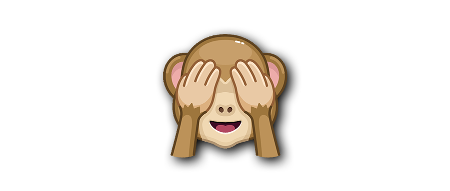

---

title: Telegram 动态大表情合集
date: 2020-03-01  
updated: 2021-05-31 
categories: 数字生活  
tags: [Telegram, 网上冲浪指南]

---

静态的 Emoji，在被 Telegram 注入灵魂之后，一个个变得鲜活（Animated）起来了。

<!-- more -->

发送**单个** ❤️ 并碰它一下，手机会震动，那是 Telegram Team  赋予 Emoji 的心跳（If your emoji has a heart, we'll give it a beat or unleash their spirit in motion）。

还有一个好玩的 Animated Emoji 是 See-No-Evil Monkey 🙈，纵使见到了你也当作没看到（非礼勿视）。

[Animated stickers 的特点](https://telegram.org/blog/voice-chats#sticker-outlines)：

- 矢量格式（infinite resolution）
- 小于 50 KB
- 180 帧动画

**电报 Emoji 小游戏**

| 发送单个 | 触发效果                                                     |
| -------- | ------------------------------------------------------------ |
| 🎲        | 掷骰子 [dice](https://telegram.org/blog/folders#and-one-more-thing) |
| 🎯        | 扔飞镖 [darts](https://telegram.org/blog/400-million#bullseye) |
| 🏀        | 投篮 basketball                                              |
| ⚽        | 射门 [football](https://macos.telegram.org/#v6-3-1-2020-07-31) |
| 🎳        | 保龄球 bowling                                               |
| 🎰        | 老虎机 [jackpot](https://telegram.org/blog/pinned-messages-locations-playlists#jackpot) / slot machine |

## 😀

| Animated Emoji | Emojipedia                                                   |
| -------------- | ------------------------------------------------------------ |
| 😀              | [Grinning Face](https://emojipedia.org/grinning-face/)       |
| 😃              | [Grinning Face with Big Eyes](https://emojipedia.org/grinning-face-with-big-eyes/) |
| 😄              | [Grinning Face with Smiling Eyes](https://emojipedia.org/grinning-face-with-smiling-eyes/) |
| 😁              | [Beaming Face with Smiling Eyes](https://emojipedia.org/beaming-face-with-smiling-eyes/) |
| 😆              | [Grinning Squinting Face](https://emojipedia.org/grinning-squinting-face/) |
| 😅              | [Grinning Face with Sweat](https://emojipedia.org/grinning-face-with-sweat/) |
| 😂              | [Face with Tears of Joy](https://emojipedia.org/face-with-tears-of-joy/) |
| 🤣              | [Rolling on the Floor Laughing](https://emojipedia.org/rolling-on-the-floor-laughing/) |
| 🥲              | [Smiling Face with Tear](https://emojipedia.org/smiling-face-with-tear/) |
| ☺️              | [Smiling Face](https://emojipedia.org/smiling-face/)         |
| 😊              | [Smiling Face with Smiling Eyes](https://emojipedia.org/smiling-face-with-smiling-eyes/) |
| 😇              | [Smiling Face with Halo](https://emojipedia.org/smiling-face-with-halo/) |
| 🙂              | [Slightly Smiling Face](https://emojipedia.org/slightly-smiling-face/) |
| 🙃              | [Upside-Down Face](https://emojipedia.org/upside-down-face/) |
| 😉              | [Winking Face](https://emojipedia.org/winking-face/)         |
| 😌              | [Relieved Face](https://emojipedia.org/relieved-face/)       |
| 😍              | [Smiling Face with Heart-Eyes](https://emojipedia.org/smiling-face-with-heart-eyes/) |
| 🥰              | [Smiling Face with Hearts](https://emojipedia.org/smiling-face-with-hearts/) |
| 😘              | [Face Blowing a Kiss](https://emojipedia.org/face-blowing-a-kiss/) |
| 😗              | [Kissing Face](https://emojipedia.org/kissing-face/)         |
| 😙              | [Kissing Face with Smiling Eyes](https://emojipedia.org/kissing-face-with-smiling-eyes/) |
| 😚              | [Kissing Face with Closed Eyes](https://emojipedia.org/kissing-face-with-closed-eyes/) |
| 😋              | [Face Savoring Food](https://emojipedia.org/face-savoring-food/) |
| 😛              | [Face with Tongue](https://emojipedia.org/face-with-tongue/) |
| 😝              | [Squinting Face with Tongue](https://emojipedia.org/squinting-face-with-tongue/) |
| 😜              | [Winking Face with Tongue](https://emojipedia.org/winking-face-with-tongue/) |
| 🤪              | [Zany Face](https://emojipedia.org/zany-face/)               |
| 🧐              | [Face with Monocle](https://emojipedia.org/face-with-monocle/) |
| 🤓              | [Nerd Face](https://emojipedia.org/nerd-face/)               |
| 😎              | [Smiling Face with Sunglasses](https://emojipedia.org/smiling-face-with-sunglasses/) |
| 🥸              | [Disguised Face](https://emojipedia.org/disguised-face/)     |
| 🤩              | [Star-Struck](https://emojipedia.org/star-struck/)           |
| 🥳              | [Partying Face](https://emojipedia.org/partying-face/)       |
| 😏              | [Smirking Face](https://emojipedia.org/smirking-face/)       |
| 😒              | [Unamused Face](https://emojipedia.org/unamused-face/)       |
| 😞              | [Disappointed Face](https://emojipedia.org/disappointed-face/) |
| 😔              | [Pensive Face](https://emojipedia.org/pensive-face/)         |
| 😟              | [Worried Face](https://emojipedia.org/worried-face/)         |
| 😕              | [Confused Face](https://emojipedia.org/confused-face/)       |
| 🥺              | [Pleading Face](https://emojipedia.org/pleading-face/)       |
| 😢              | [Crying Face](https://emojipedia.org/crying-face/)           |
| 😭              | [Loudly Crying Face](https://emojipedia.org/loudly-crying-face/) |
| 😤              | [Face with Steam From Nose](https://emojipedia.org/face-with-steam-from-nose/) |
| 😡              | [Pouting Face](https://emojipedia.org/pouting-face/)         |
| 🤬              | [Face with Symbols on Mouth](https://emojipedia.org/face-with-symbols-on-mouth/) |
| 🤯              | [Exploding Head](https://emojipedia.org/exploding-head/)     |
| 😳              | [Flushed Face](https://emojipedia.org/flushed-face/)         |
| 🥵              | [Hot Face](https://emojipedia.org/hot-face/)                 |
| 🥶              | [Cold Face](https://emojipedia.org/cold-face/)               |
| 😱              | [Face Screaming in Fear](https://emojipedia.org/face-screaming-in-fear/) |
| 😨              | [Fearful Face](https://emojipedia.org/fearful-face/)         |
| 🤗              | [Hugging Face](https://emojipedia.org/hugging-face/)         |
| 🤔              | [Thinking Face](https://emojipedia.org/thinking-face/)       |
| 🤭              | [Face with Hand Over Mouth](https://emojipedia.org/face-with-hand-over-mouth/) |
| 🤫              | [Shushing Face](https://emojipedia.org/shushing-face/)       |
| 🤥              | [Lying Face](https://emojipedia.org/lying-face/)             |
| 😶              | [Face Without Mouth](https://emojipedia.org/face-without-mouth/) |
| 😐              | [Neutral Face](https://emojipedia.org/neutral-face/)         |
| 😑              | [Expressionless Face](https://emojipedia.org/expressionless-face/) |
| 😬              | [Grimacing Face](https://emojipedia.org/grimacing-face/)     |
| 🙄              | [Face with Rolling Eyes](https://emojipedia.org/face-with-rolling-eyes/) |
| 😯              | [Hushed Face](https://emojipedia.org/hushed-face/)           |
| 😦              | [Frowning Face with Open Mouth](https://emojipedia.org/frowning-face-with-open-mouth/) |
| 😧              | [Anguished Face](https://emojipedia.org/anguished-face/)     |
| 😮              | [Face with Open Mouth](https://emojipedia.org/face-with-open-mouth/) |
| 😲              | [Astonished Face](https://emojipedia.org/astonished-face/)   |
| 🥱              | [Yawning Face](https://emojipedia.org/yawning-face/)         |
| 😴              | [Sleeping Face](https://emojipedia.org/sleeping-face/)       |
| 🤤              | [Drooling Face](https://emojipedia.org/drooling-face/)       |
| 🥴              | [Woozy Face](https://emojipedia.org/woozy-face/)             |
| 🤢              | [Nauseated Face](https://emojipedia.org/nauseated-face/)     |
| 🤮              | [Face Vomiting](https://emojipedia.org/face-vomiting/)       |
| 🤧              | [Sneezing Face](https://emojipedia.org/sneezing-face/)       |
| 😷              | [Face with Medical Mask](https://emojipedia.org/face-with-medical-mask/) |
| 🤒              | [Face with Thermometer](https://emojipedia.org/face-with-thermometer/) |
| 🤕              | [Face with Head-Bandage](https://emojipedia.org/face-with-head-bandage/) |
| 🤑              | [Money-Mouth Face](https://emojipedia.org/money-mouth-face/) |
| 🤠              | [Face with Cowboy Hat](https://emojipedia.org/cowboy-hat-face/ "🤠 Face with Cowboy Hat Emoji") |
| 😈              | [Smiling Face with Horns](https://emojipedia.org/smiling-face-with-horns/) |
| 👿              | [Angry Face with Horns](https://emojipedia.org/angry-face-with-horns/) |
| 🤡              | [Clown Face](https://emojipedia.org/clown-face/)             |
| 💩              | [Pile of Poo](https://emojipedia.org/pile-of-poo/)           |
| 👻              | [Ghost](https://emojipedia.org/ghost/)                       |
| 💀              | [Skull](https://emojipedia.org/skull/)                       |
| ☠️              | [Skull and Crossbones](https://emojipedia.org/skull-and-crossbones/) |
| 🎃              | [Jack-O-Lantern](https://emojipedia.org/jack-o-lantern/)     |
| 😺              | [Grinning Cat](https://emojipedia.org/grinning-cat/)         |
| 😸              | [Grinning Cat with Smiling Eyes](https://emojipedia.org/grinning-cat-with-smiling-eyes/) |
| 😹              | [Cat with Tears of Joy](https://emojipedia.org/cat-with-tears-of-joy/) |
| 😻              | [Smiling Cat with Heart-Eyes](https://emojipedia.org/smiling-cat-with-heart-eyes/) |
| 😼              | [Cat with Wry Smile](https://emojipedia.org/cat-with-wry-smile/) |
| 😽              | [Kissing Cat](https://emojipedia.org/kissing-cat/)           |
| 🙀              | [Weary Cat](https://emojipedia.org/weary-cat/)               |
| 😿              | [Crying Cat](https://emojipedia.org/crying-cat/)             |
| 😾              | [Pouting Cat](https://emojipedia.org/pouting-cat/)           |
| 🙌              | [Raising Hands](https://emojipedia.org/raising-hands/)       |
| 👏              | [Clapping Hands](https://emojipedia.org/clapping-hands/)     |
| 🤝              | [Handshake](https://emojipedia.org/handshake/)               |
| 👍              | [Thumbs Up](https://emojipedia.org/thumbs-up/)               |
| 👎              | [Thumbs Down](https://emojipedia.org/thumbs-down/)           |
| ✊              | [Raised Fist](https://emojipedia.org/raised-fist/)           |
| 🤞              | [Crossed Fingers](https://emojipedia.org/crossed-fingers/)   |
| ✌️              | [Victory Hand](https://emojipedia.org/victory-hand/)         |
| 🤟              | [I Love You Hand Sign](https://emojipedia.org/love-you-gesture/) |
| 🤘              | [Sign of the Horns](https://emojipedia.org/sign-of-the-horns/) |
| 👌              | [OK Hand](https://emojipedia.org/ok-hand/)                   |
| 🤌              | [Pinched Fingers](https://emojipedia.org/pinched-fingers/)   |
| 👈              | [Backhand Index Pointing Left](https://emojipedia.org/backhand-index-pointing-left/) |
| 👉              | [Backhand Index Pointing Right](https://emojipedia.org/backhand-index-pointing-right/) |
| 👆              | [Backhand Index Pointing Up](https://emojipedia.org/backhand-index-pointing-up/) |
| 👇              | [Backhand Index Pointing Down](https://emojipedia.org/backhand-index-pointing-down/) |
| ☝️              | [Index Pointing Up](https://emojipedia.org/index-pointing-up/) |
| 👋              | [Waving Hand](https://emojipedia.org/waving-hand/)           |
| 💪              | [Flexed Biceps](https://emojipedia.org/flexed-biceps/)       |
| 🦾              | [Mechanical Arm](https://emojipedia.org/mechanical-arm/)     |
| 🖕              | [Middle Finger](https://emojipedia.org/middle-finger/)       |
| 💋              | [Kiss Mark](https://emojipedia.org/kiss-mark/)               |
| 👮‍♀️             | [Woman Police Officer](https://emojipedia.org/woman-police-officer/) |
| 👩‍⚕️             | [Woman Health Worker](https://emojipedia.org/woman-health-worker/) |
| 👨‍⚕️             | [Man Health Worker](https://emojipedia.org/man-health-worker/) |
| 👨‍🏫             | [Man Teacher](https://emojipedia.org/man-teacher/)           |
| 🤶              | [Mrs. Claus](https://emojipedia.org/mrs-claus/)              |
| 🎅              | [Santa Claus](https://emojipedia.org/santa-claus/)           |
| 🧛‍♀             | [Woman Vampire](https://emojipedia.org/woman-vampire/)       |
| 🧛              | [Vampire](https://emojipedia.org/vampire/)                   |
| 🧛‍♂️             | [Man Vampire](https://emojipedia.org/man-vampire/)           |
| 🧟‍♀             | [Woman Zombie](https://emojipedia.org/woman-zombie/)         |
| 🧟              | [Zombie](https://emojipedia.org/zombie/)                     |
| 🧟‍♂             | [Man Zombie](https://emojipedia.org/man-zombie/)             |
| 🤷‍♀️             | [Woman Shrugging](https://emojipedia.org/woman-shrugging/)   |
| 🤷‍♂️             | [Man Shrugging](https://emojipedia.org/man-shrugging/)       |
| 💑              | [Couple with Heart](https://emojipedia.org/couple-with-heart/) |
| 👛              | [Purse](https://emojipedia.org/purse/)                       |

## 🐱

| Animated Emoji | Emojipedia                                                   |
| -------------- | ------------------------------------------------------------ |
| 🙈              | [See-No-Evil Monkey](https://emojipedia.org/see-no-evil-monkey/) |
| 🙊              | [Speak-No-Evil Monkey](https://emojipedia.org/speak-no-evil-monkey/) |
| 🐣              | [Hatching Chick](https://emojipedia.org/hatching-chick/)     |
| 🦇              | [Bat](https://emojipedia.org/bat/)                           |
| 🕷              | [Spider](https://emojipedia.org/spider/)                     |
| 🕸              | [Spider Web](https://emojipedia.org/spider-web/)             |
| 🎄              | [Christmas Tree](https://emojipedia.org/christmas-tree/)     |
| 🌞              | [Sun with Face](https://emojipedia.org/sun-with-face/)       |
| 🌝              | [Full Moon Face](https://emojipedia.org/full-moon-face/)     |
| 🌛              | [First Quarter Moon Face](https://emojipedia.org/first-quarter-moon-face/) |
| 🌜              | [Last Quarter Moon Face](https://emojipedia.org/last-quarter-moon-face/) |
| 🌚              | [New Moon Face](https://emojipedia.org/new-moon-face/)       |
| 🌕              | [Full Moon](https://emojipedia.org/full-moon/)               |
| 🌖              | [Waning Gibbous Moon](https://emojipedia.org/waning-gibbous-moon/) |
| 🌗              | [Last Quarter Moon](https://emojipedia.org/last-quarter-moon/) |
| 🌘              | [Waning Crescent Moon](https://emojipedia.org/waning-crescent-moon/) |
| 🌑              | [New Moon](https://emojipedia.org/new-moon/)                 |
| 🌒              | [Waxing Crescent Moon](https://emojipedia.org/waxing-crescent-moon/) |
| 🌓              | [First Quarter Moon](https://emojipedia.org/first-quarter-moon/) |
| 🌔              | [Waxing Gibbous Moon](https://emojipedia.org/waxing-gibbous-moon/) |
| 💫              | [Dizzy](https://emojipedia.org/dizzy/)                       |
| ⭐️              | [Star](https://emojipedia.org/star/)                         |
| 🌟              | [Glowing Star](https://emojipedia.org/glowing-star/)         |
| ✨              | [Sparkles](https://emojipedia.org/sparkles/)                 |
| ⚡️              | [High Voltage](https://emojipedia.org/high-voltage/)         |
| 🔥              | [Fire](https://emojipedia.org/fire/)                         |
| ❄️              | [Snowflake](https://emojipedia.org/snowflake/)               |
| ☃️              | [Snowman](https://emojipedia.org/snowman/)                   |
| ⛄️              | [Snowman Without Snow](https://emojipedia.org/snowman-without-snow/) |

## 🍎

| Animated Emoji | Emojipedia                                                   |
| -------------- | ------------------------------------------------------------ |
| 🍑              | [Peach](https://emojipedia.org/peach/)                       |
| 🍆              | [Eggplant](https://emojipedia.org/eggplant/)                 |
| 🎂              | [Birthday Cake](https://emojipedia.org/birthday-cake/)       |
| 🥂              | [Clinking Glasses](https://emojipedia.org/clinking-glasses/) |
| 🍾              | [Bottle with Popping Cork](https://emojipedia.org/bottle-with-popping-cork/) |

## 🏀

| Animated Emoji | Emojipedia                                           |
| -------------- | ---------------------------------------------------- |
| ⚽️              | [Soccer Ball](https://emojipedia.org/soccer-ball/)   |
| 🏀              | [Basketball](https://emojipedia.org/basketball/)     |
| 🎲              | [Game Die](https://emojipedia.org/game-die/)         |
| 🎯              | [Direct Hit](https://emojipedia.org/direct-hit/)     |
| 🎮              | [Video Game](https://emojipedia.org/video-game/)     |
| 🎰              | [Slot Machine](https://emojipedia.org/slot-machine/) |

## 🚘

| Animated Emoji | Emojipedia                                       |
| -------------- | ------------------------------------------------ |
| 🚗              | [Automobile](https://emojipedia.org/automobile/) |
| 🚕              | [Taxi](https://emojipedia.org/taxi/)             |
| 🚓              | [Police Car](https://emojipedia.org/police-car/) |
| 🚑              | [Ambulance](https://emojipedia.org/ambulance/)   |
| 🗿              | [Moai](https://emojipedia.org/moai/)             |
| 🎇              | [Sparkler](https://emojipedia.org/sparkler/)     |
| 🎆              | [Fireworks](https://emojipedia.org/fireworks/)   |

## 💡

| Animated Emoji | Emojipedia                                                   |
| -------------- | ------------------------------------------------------------ |
| ⌨️              | [Keyboard](https://emojipedia.org/keyboard/)                 |
| 🧭              | [Compass](https://emojipedia.org/compass/)                   |
| ⏳              | [Hourglass Not Done](https://emojipedia.org/hourglass-not-done/) |
| 💡              | [Light Bulb](https://emojipedia.org/light-bulb/)             |
| 💸              | [Money with Wings](https://emojipedia.org/money-with-wings/) |
| 💎              | [Gem Stone](https://emojipedia.org/gem-stone/)               |
| ⚰️              | [Coffin](https://emojipedia.org/coffin/)                     |
| 💊              | [Pill](https://emojipedia.org/pill/)                         |
| 💉              | [Syringe](https://emojipedia.org/syringe/)                   |
| 🦠              | [Microbe](https://emojipedia.org/microbe/)                   |
| 🧻              | [Roll of Paper](https://emojipedia.org/roll-of-paper/)       |
| 🧼              | [Soap](https://emojipedia.org/soap/)                         |
| 🧽              | [Sponge](https://emojipedia.org/sponge/)                     |
| 🎊              | [Confetti Ball](https://emojipedia.org/confetti-ball/)       |
| 🎉              | [Party Popper](https://emojipedia.org/party-popper/)         |
| 💌              | [Love Letter](https://emojipedia.org/love-letter/)           |
| 📬              | [Open Mailbox with Raised Flag](https://emojipedia.org/open-mailbox-with-raised-flag/) |
| 📁              | [File Folder](https://emojipedia.org/file-folder/)           |
| 📂              | [Open File Folder](https://emojipedia.org/open-file-folder/) |
| 🗂              | [Card Index Dividers](https://emojipedia.org/card-index-dividers/) |
| 🧮              | [Abacus](https://emojipedia.org/abacus/)                     |
| 📝              | [Memo](https://emojipedia.org/memo/)                         |
| 🔍              | [Magnifying Glass Tilted Left](https://emojipedia.org/magnifying-glass-tilted-left/) |
| 🔎              | [Magnifying Glass Tilted Right](https://emojipedia.org/magnifying-glass-tilted-right/) |
| 🔐              | [Locked with Key](https://emojipedia.org/locked-with-key/)   |

## 💚

| Animated Emoji | Emojipedia                                                   |
| -------------- | ------------------------------------------------------------ |
| ❤️              | [Red Heart](https://emojipedia.org/red-heart/)               |
| 🧡              | [Orange Heart](https://emojipedia.org/orange-heart/)         |
| 💛              | [Yellow Heart](https://emojipedia.org/yellow-heart/)         |
| 💚              | [Green Heart](https://emojipedia.org/green-heart/)           |
| 💙              | [Blue Heart](https://emojipedia.org/blue-heart/)             |
| 💜              | [Purple Heart](https://emojipedia.org/purple-heart/)         |
| 🖤              | [Black Heart](https://emojipedia.org/black-heart/)           |
| 🤍              | [White Heart](https://emojipedia.org/white-heart/)           |
| 🤎              | [Brown Heart](https://emojipedia.org/brown-heart/)           |
| 💔              | [Broken Heart](https://emojipedia.org/broken-heart/)         |
| ❣️              | [Heart Exclamation](https://emojipedia.org/heart-exclamation/) |
| 💕              | [Two Hearts](https://emojipedia.org/two-hearts/)             |
| 💞              | [Revolving Hearts](https://emojipedia.org/revolving-hearts/) |
| 💓              | [Beating Heart](https://emojipedia.org/beating-heart/)       |
| 💗              | [Growing Heart](https://emojipedia.org/growing-heart/)       |
| 💖              | [Sparkling Heart](https://emojipedia.org/sparkling-heart/)   |
| 💘              | [Heart with Arrow](https://emojipedia.org/heart-with-arrow/) |
| 💝              | [Heart with Ribbon](https://emojipedia.org/heart-with-ribbon/) |
| 💟              | [Heart Decoration](https://emojipedia.org/heart-decoration/) |
| ❌              | [Cross Mark](https://emojipedia.org/cross-mark/)             |
| 💯              | [Hundred Points Symbol](https://emojipedia.org/hundred-points/) |
| 💢              | [Anger Symbol](https://emojipedia.org/anger-symbol/)         |
| ♨️              | [Hot Springs](https://emojipedia.org/hot-springs/)           |
| ❗              | [Heavy Exclamation Mark](https://emojipedia.org/exclamation-mark/) |
| ❕              | [White Exclamation Mark](https://emojipedia.org/white-exclamation-mark/) |
| ❓              | [Question Mark](https://emojipedia.org/question-mark/)       |
| ❔              | [White Question Mark](https://emojipedia.org/white-question-mark/) |
| 💬              | [Speech Balloon](https://emojipedia.org/speech-balloon/)     |
| 💭              | [Thought Balloon](https://emojipedia.org/thought-balloon/)   |
| 🗯️              | [Right Anger Bubble](https://emojipedia.org/right-anger-bubble/) |
| 💤              | [Zzz](https://emojipedia.org/zzz/)                           |
| 💱              | [Currency Exchange](https://emojipedia.org/currency-exchange/) |
| 📣              | [Megaphone](https://emojipedia.org/megaphone/)               |
| 🇧🇾             | [Flag: Belarus](https://emojipedia.org/flag-belarus/)        |

**发布记录**：[February 13, 2020](https://telegram.org/blog/new-profiles-people-nearby#new-animated-emoji)、[September 5, 2019](https://telegram.org/blog/scheduled-reminders-themes#more-animated-emoji)、[August 9, 2019](https://telegram.org/blog/silent-messages-slow-mode#animated-emoji)、[March 30, 2020](https://telegram.org/blog/folders#new-animated-emoji)、[April 24, 2020](https://telegram.org/blog/400-million#bullseye) 、[September 30, 2020](https://telegram.org/blog/filters-anonymous-admins-comments)、[October 30, 2020](https://telegram.org/blog/pinned-messages-locations-playlists#and-ghoulishly-delightful-animated-emoji)、[December 23, 2020](https://telegram.org/blog/voice-chats)

**表情合集**：有人把以上 Animated Emojies 做成了一个表情包，比原版更大，且支持循环播放，[点此](https://t.me/addstickers/AnimatedEmojies) 添加。

**[表情搜索](https://telegram.org/blog/unsend-privacy-emoji#emoji-search-and-gifs)**：在 Telegram 的消息框输入 [关键词](https://translations.telegram.org/zh-hans/emoji)，你会看到一些相关 Emoji 弹出。

**最新动态**：关注 [Animated Emojis](https://t.me/AnimatedEmojis) 的 Telegram 频道。

**关键阅读**：

- [Telegram（电报）：新手指南、使用教程及频道推荐](https://tingtalk.me/telegram/)
- [emojiall.com](https://www.emojiall.com/zh-hans) 是一个支持中文的 Emoji 搜索网站