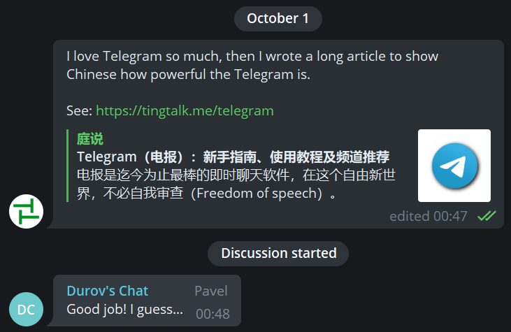

电报是迄今为止最棒的即时聊天软件，在这个自由新世界，不必自我审查（Freedom of speech）。

<!-- more -->

🧱 TG 在中国大陆必须 [翻墙](https://tingtalk.me/fq/) 后才能使用。不过，学会科学上网，难道不是当代数字公民的必备技能吗？

📁 tingtalk.me 在 2020-04-04 被墙了，如需在墙内传阅，请下载本文的 [PDF](https://wwa.lanzous.com/b00twozof) 或 [GitHub](https://raw.githubusercontent.com/ting-talk/blog/master/source/_posts/digital-life/telegram.md)（可编辑的 Markdown 源文档）。

💡 全文有两万三千多字，善用右侧的目录栏和查找功能（`Ctrl` + `F`），助你快速定位想要看到的内容。你也可以移步到 [电报内阅读此文的精简版](https://t.me/tingtalk/4)。

## ✈️ 电报介绍

2013 年 5 月 20 日，斯诺登向《卫报》媒体透露棱镜计划（[PRISM](https://zh.wikipedia.org/zh-hans/%E7%A8%9C%E9%8F%A1%E8%A8%88%E7%95%AB)）：

> 我愿意牺牲掉这一切（工作、收入和女朋友）（把真相告诉世人），因为美国政府利用他们正在秘密建造的这一个庞大监视机器摧毁隐私、互联网自由和世界各地人们的基本自由的行为让他良心不安。by [Edward Snowden](https://zh.wikipedia.org/zh-cn/%E7%88%B1%E5%BE%B7%E5%8D%8E%C2%B7%E6%96%AF%E8%AF%BA%E7%99%BB)

许多人第一次意识到 Ta 们的数字通信遭到了监视（The year Telegram was born was marked by the Snowden Revelations, when many people realized for the first time their digital communications were being watched.）。

2013 年 8 月 14 日，杜洛夫兄弟（[Pavel Durov](https://zh.wikipedia.org/wiki/%E4%BF%9D%E7%BE%85%C2%B7%E6%9D%9C%E6%B4%9B%E5%A4%AB) 和 [Nikolai Durov](https://zh.wikipedia.org/zh-cn/%E5%B0%BC%E5%8F%A4%E6%8B%89%C2%B7%E6%9D%9C%E6%B4%9B%E5%A4%AB)）正式发布了开源（[Open Source](https://telegram.org/faq#q-why-not-open-source-everything)）的 Telegram（特指客户端）。这个充满理想主义的软件不接受外部投资（不需要向任何股东负责），也不会通过广告盈利，且挣钱永远不会是 Telegram 的终极目标（[Making profits will never be an end-goal for Telegram](https://telegram.org/faq#q-how-are-you-going-to-make-money-out-of-this)），所以 Telegram 至今没有向第三方披露过一个字节的用户私人数据。Telegram 只会默默地践行一个理念：这个星球上的每个人都享有自由的权利（Everyone on the planet has a right to be free.）。This is the Telegram way：

> We believe that humans are inherently intelligent and benevolent beings that deserve to be trusted; trusted with freedom to share their thoughts, freedom to communicate privately, freedom to create tools. This philosophy defines everything we do. 我们相信人类天生就是聪明和仁慈的，值得信任的；坚信人类可以自由地分享想法，自由地私下交流，自由地创造工具。 这种哲学定义了我们所做的一切。by [Pavel Durov](https://telegram.org/blog/200-million)

截止 2020 年 12 月 23 日，[Telegram 已有 5 亿月活跃用户](https://t.me/durov/142)。

### 👍 近乎完美

- **[高度加密](https://telegram.org/faq#q-what-are-your-thoughts-on-internet-privacy)**：使用独有的网络传输协议 [MTProto](https://core.telegram.org/mtproto)，无惧被黑客攻击。
- **[没有审查](https://telegram.org/faq#q-wait-0-o-do-you-process-take-down-requests-from-third-parties)**：不用担心被封号，[除非执法调查单位能证明用户是恐怖分子](https://telegram.org/faq#q-there-39s-illegal-content-on-telegram-how-do-i-take-it-down)。
- **没有广告**：一个纯碎极致的大众化即时通讯软件（Instant Messaging App）。
- **[不占内存](https://telegram.org/blog/cache-and-stickers)**：聊天记录保存在云端（Cloud-Based），任何设备，无缝同步，随取随用。
- **超大群聊**：封顶 20 万人，配合各种管理工具（例如限制发言间隔），让大型社群的交流也能井井有条。  
- **[表情贴纸](https://telegram.org/blog/animated-stickers)**：采用 [矢量](https://tingtalk.me/raster-to-vector/) 格式，高清而富有趣味；并且支持自制表情包（[Custom Sticker Sets](https://telegram.org/blog/stickers-revolution)）。

### 👎 瑕不掩瑜

欢迎访问 [Feature Suggestion Platform](https://bugs.telegram.org/)，向 Telegram 提交缺陷报告和功能建议（Bugs and Suggestions），一起帮扶 Telegram 做大做强。

#### 🐼 中文搜索体验差

##### 方法一：手动分词

Telegram 的中文搜索是以「词组」为单位的，以标点符号或空格作为词的间隔。

辜鸿铭说过：真正的自由，并不意味着可以随心所欲，而是可以自由地做正确的事情。

在搜索框输入：

- `真正的自由`
- `并不意味着可以随心所欲`
- `而是可以自由地做正确的事情`

都可搜到这条历史信息，因为标点符号充当了分词符。但是这些词未免太长了吧？！也记不住呀。不过别忘了 Telegram 分词规则，我们可以手动添加多余的标点符号（例如井号 `＃`）或空格来**分词**：

`#辜鸿铭 说过：真正的 #自由，并不意味着可以随心所欲，而是可以自由地做正确的事情。`

点击以下词组，或者在搜索框输入：

- `#辜鸿铭`
- `#自由`

都可以找到这句话。建议频道主在发布内容的时候，用 `#` 打上相应的标签，方便订阅者找到想要的信息。


##### 方法二：导出文件

嫌手动分词太麻烦了？那就在电脑上导出 HTML 或 JSON 格式的聊天记录，想怎么搜就怎么搜。

不过，已经有人向 Telegram 提交了 [改善中文搜索的提案](https://bugs.telegram.org/c/724)，所以请为这个 Suggestion 投票和鼓气。拜托了。


**关联阅读**

> - [为什么 Telegram 不能搜索中文讯息 - 翁君牧](https://medium.com/@nevik.w39/%E7%82%BA%E4%BB%80%E9%BA%BC-telegram-%E4%B8%8D%E8%83%BD%E6%90%9C%E5%B0%8B%E4%B8%AD%E6%96%87%E8%A8%8A%E6%81%AF-6b7d07690e6f)
>- [Telegram 中文搜索方案探索 - Newlearner](https://www.newlearner.site/2020/04/25/telegram-search.html)


#### 🙃 硬币的另一面

在加密通信「庇护」下的土壤，滋生了臭名昭著的网络性犯罪案件：[N 号房事件](https://zh.wikipedia.org/zh-hans/N%E5%8F%B7%E6%88%BF%E4%BA%8B%E4%BB%B6)。所幸的是，2020 年 11 月 26 日，主犯赵主彬一审判处监禁 40 年。

以及存在大量的 NSFW 内容、币圈广告和灰色产业链。科技能否向善，在于我们能否约束自己内心的 [邪念](https://zh.wikiquote.org/zh-hans/%E7%BD%97%E7%BF%94)。


#### 📱 只能用手机号码注册

- 国外：手机号不用实名制，相对安全。
- 国内：通过 Google Voice 注册电报，并且可以绕开私聊限制。

而且，添加陌生人到通讯录（Add to contacts），记得**每次**都要取消勾选 `Share my phone number with ***`。Telegram 在这个方面上没有记住用户习惯，不应该呀，我去反馈反馈。

另外，如果你的手机号码，被某人保存在 Ta 的手机通讯录，Ta 也开放了通讯录给 Telegram。当你用这个手机号码注册 Telegram 后，Ta 就会第一时间知道你也加入 Telegam 了。所以对隐私有要求，请使用无需实名的虚拟号码或者单独小号来注册。


### 🗓️ 逃离微信

我与 Telegram 的结缘，始于 2016 年春。那时我刚学会了科学上网，并下载了 Telegram 这个 Instant Messaging app。虽然我在电报上找不到朋友和我聊天，但我并没有卸载 Telegram，因为相比输入法和微信，Telegram 提供了丰富的 [Emoji](https://emojipedia.org/) 供我选择。如此一来，我在 Android 手机上也能使用最新的 Emoji 点缀朋友圈。

近年来，天下苦微信久矣。

- WeChat 掌门人可能是一个无马（码）不欢的 [骑兵](https://jikipedia.com/definition/854299075)：每次登录微信电脑版都要扫码时，我的心中都会万马奔腾。
- 只能发送小于 100 MB 的文件；一次只能发送 9 张图片，而且每次发送都要勾选原图（Telegram 会记住这个用户习惯）。
- 占用巨大的存储空间，备份与同步的体验特别差，也不能换成欧盟号码导出用户数据。

> 注册微信的时候，用户会默认同意 [腾讯微信软件许可及服务协议](https://weixin.qq.com/agreement?lang=zh_CN) ，其中在 7.1.2 提到一个霸王条款：「微信帐号的所有权归腾讯公司所有，用户完成申请注册手续后，仅获得微信帐号的使用权，且该使用权仅属于初始申请注册人。……」。
>
> 用户免费使用微信（无所有权），微信收集用户的私人数据，贩卖给广告商，这无可厚非。但当用户想要取回 Ta 所创造的内容（数字资产）时，例如导出微信个人数据（朋友圈数据和收藏功能数据等），只好借助欧盟的 GDPR（通用数据保护条例）行使数据可携权。于是我花了 5.26 USD（含税）买了一个比利时的手机号码，微信却猖言道：「[由于当地法规限制，WeChat 暂不支援中国大陆用户将绑定的手机号码更换为欧盟手机号码。](https://help.wechat.com/cgi-bin/micromsg-bin/oshelpcenter?opcode=2&id=1208117b2mai141125mnzm6j)」
>
> 请问是哪条「当地法规」？这不是「法制」，而是「Fuck 制」：强奸一个个没有反抗能力的用户！`2020-04-22`

原谅我「口吐芬芳」，不懂中国特色。另外，随着言论审查力度的加大，任何「风吹草动」都要「斩草除根」：

- [Cyberspace Administration of China](http://www.cac.gov.cn/)（网信办）会因为我转发一则关于 [中华人民共和国宪法修正案](https://zh.wikipedia.org/zh-hans/%E4%B8%AD%E5%8D%8E%E4%BA%BA%E6%B0%91%E5%85%B1%E5%92%8C%E5%9B%BD%E5%AE%AA%E6%B3%95%E4%BF%AE%E6%AD%A3%E6%A1%88_(2018%E5%B9%B4)) 的 Twitter 评论到 24 人的微信同学群，几小时后，请我到最近的派出所「[喝茶](https://tingtalk.me/yum-cha/)」，那是我第一次坐警车。
- 微信上无法发送某些链接（例如纽约时报的文章），也不显示发送失败，让你以为发出去了，其实只对你可见。
- 微信会秋后算账，删除我之前写的一篇介绍 [搜索技巧](https://tingtalk.me/search-tips/) 的公众号文章，接着 [博客](https://tingtalk.me/) 在中国大陆地区被墙，[公众号](https://tingtalk.me/mp-archives/) 被永久封号。虽然公众号写了 4 年只有五百多个关注者，但每一个订阅者都来之不易。就这样，我跟读者们都失联了。

经过一系列发生我身上的 [屏蔽事件](https://zh.wikipedia.org/zh-hans/%E4%B8%AD%E5%8D%8E%E4%BA%BA%E6%B0%91%E5%85%B1%E5%92%8C%E5%9B%BD%E7%BD%91%E7%BB%9C%E5%AE%A1%E6%9F%A5) 后，让我意识到中文互联网已经完全沦陷了，于是逃难到 Telegram。经过一段时间的使用后，我彻底成为了 Telegram 的 [自来水](https://jikipedia.com/definition/13187)，见人就夸。然而身边的亲朋好友却不为所动，不愿跟我一起 [数字移民](https://tsb2blog.com/what-means-digital-immigrants-in-china.html) 到这个可以安心说话的地方，甘愿做「温室里的花朵」和「笼的传人」，享受表面上的岁月静好。我不会责怪 Ta 们，如果你看过[《肖申克的救赎》](https://ddrk.me/the-shawshank-redemption/)，就能理解这种「放弃抗争」的心态。

> 刚入狱的时候，你痛恨周围的高墙，慢慢地，你习惯了生活在其中，最终你发现，自己不得不依靠它而生存。by *The Shawshank Redemption*

既然说不动认识我的人，但世界那么大，人口那么多，网络世界上一定有一群人，Ta 们和我一样，反感「温室园丁」不透明的做法，不愿做一只数字农场里的电子绵羊，相信「自由价更高」。

我要当一个 [踹车轮](https://kenengba.com/post/3393.html) 的人，为我心中的理想世界投票。因此我熬了几个月，把 Telegram 官网的 [FAQ](https://telegram.org/faq) 和 [Blog](https://telegram.org/blog) 全部看完了（从 2013 年创立电报至今），结合 Google 搜索引擎旁征博引，整理出这篇~~可能是~~中文互联网内容最翔实，排版最精美的《电报指南》，目的就是尽可能地为读者呈现 Telegram 的强大、私密以及友好的用户体验。



> 在 [Durov's Chat](https://t.me/durovschat) 用蹩脚的中式英语给教程做推广，受到 [Pavel 的肯定](https://t.me/durovschat/283)。


> 2016 年国庆，我花了一周时间看完了「即刻 app」的所有主题（圈子），写了一篇三千多字文章：《即刻 App - 不再错过你感兴趣的资讯》([图文版](https://wemp.app/posts/6e4830bc-845d-4f2c-ad78-959c9a89e4eb) | [文字版](https://tingtalk.me/mp-archives/)）。~~即刻已经没有复活的可能了~~（[即刻 App](https://m.okjike.com/download) 居然在 2020 年 6 月 10 日回来了，但是缺失了话题追踪功能），Telegram 顺势成了新的资讯中心。

人生苦短，逃离微信（[Escape from the WeChat](https://theinitium.com/article/20200619-technology-escape-from-wechat/)）。stay-away-from-wechat 项目收集微信的反人性设计、无理审查行为、侵犯用户隐私、监控聊天记录、试图控制人民生活相关信息，期望用户认识到微信的弊病，倡导用户用脚投票、拒绝使用微信 👎️。欢迎提交 [Issues](https://github.com/TomBener/get-rid-of-wechat/issues) 和 [Pull requests 🤖️](https://github.com/TomBener/get-rid-of-wechat/pulls)。

欢迎读者们转移到没有监控和审查的地方 ，一起在这片乐土上过上~~没羞没臊~~体面的数字生活。


## 🌟 注册使用

### 👇 下载登录

请进入 [Telegram Apps 的官方下载页面](https://telegram.org/apps)，选择对应的平台，下载，安装，注册。

自由开放的 Telegram 在各平台都有数十种客户端，各有哪些优缺点，又该如何选择呢？请查阅 [Telegram 客户端版本比较](https://tlgr.tw/)，但我不推荐使用第三方电报客户端，安全没有保证。


**如果你有注册或登录问题**

先从 [常见登录问题](https://telegra.ph/Common-Login-Problems-03-12) 中寻找方法，无果，联系 Telegram：

- 途径一：请使用此 [表格](https://telegram.org/support) 与 Telegram 联系。
- 途径二：在 Twitter 上联系 [Telegram Login Help](https://twitter.com/smstelegram)（@smstelegram）


**如何在电脑上使用 Telegram for Desktop**

1. 打开客户端
2. 点击右上角的 `SETTINGS`（设置）> `Connection type`（连接类型）> `Use custom proxy`（使用自定义代理）> `ADD PROXY`（添加代理），以 Shadowsocks(R) 为例：
	- SOCKS	
	- Hostname: `127.0.0.1`
	- Port: `1080`（不同的翻墙客户端，端口略有不同）

使用 Clash 翻墙的用户，可跳过这一步，选择 `Use system proxy settings`（使用系统代理设置）。


### 🐼 汉化界面

既然已经出来混了（突破网络墙），首选使用英文版的 Telegram（突破语言墙），好像加起来也没几个单词。要是一点英文底子都没有：

1. [点此安装官方简体中文语言包](https://t.me/setlanguage/zh-hans-beta) 
2. 选择 `CHANGE`（更改）
3. 即可把界面语言替换为简体中文

截至 2020 年 11 月 01 日，Telegram for Android 翻译已完成 95% 了，但不妨碍日常使用。


## 🔒 账号设置

- 支持视频头像（[Profile Videos](https://telegram.org/blog/profile-videos-people-nearby-and-more#profile-videos)）。
- 支持登录多个账号。手机端长按另一个账号，不切换账号，也能快速预览消息。[Multiple accounts: preview chat list. You can press and hold on another connected account in Settings for a sneak peek of its chats list.](https://t.me/TelegramTips/178)


### 👤 设置用户名

你可以在 `Setting`（设置）里面填写一个 `Username`（用户名）。设置后，别人能够在不知道你的电话号码的情况下，通过搜索用户名找到你。

- 用户名可以随时更改或删除（用户名为空）。
- 用户名不区分大小写（TingTalk = tingtalk），但 Telegram 会记住大小写偏好。

**侵权**

- [如果一个骗子假装是你](https://telegram.org/faq#q-what-if-someone-is-pretending-to-be-me)，联系 [@notoscam](https://t.me/notoscam)。
- 如何举报假冒的频道或群组：点击右上角的 `...` > `Report` > `Fake Account` 
- 针对品牌方，[用户名被占用怎么办？](https://telegram.org/faq#q-what-do-i-do-if-my-username-is-taken)把你在 Facebook、Twitter 或 Instagram 的用户名（两个平台以上）发给 [@username_bot](https://t.me/username_bot)。
- 如果你看到表情包（sticker sets）、频道（channels）或机器人（bots）侵犯了你的版权，请提交投诉到 dmca@telegram.org

**联系人**

- 添加和删除联系人（Contacts）都是单向操作，双方的通讯录都是独立的（你中有我，我中可能没有你），也没有通知。
- （单向）添加联系人之后，加入共同小组后，通讯录好友会排在小组名单前面。如果你想加入一些不想让别人知道的群组，还是用小号吧。
- 点击左侧菜单栏 > `Contacts`（联系人）> `Find People Nearby`（寻找附近的人）。你也可以创建一个基于本地的群聊。

### 🔓 解除私聊限制

自由的土壤吸引了比特币、社工库、NSFW 等灰色产业到电报野蛮生长，因为这些国产老鼠屎对电报的滥用，导致使用中国大陆的手机号码（+86）注册 Telegram 后，私聊 Ta 人时，可能会提示 `Sorry, you can only send messages to mutual contacts at the momet.`（对不起，你现在只能发送私信给双向联系人。），这表明此账号被判定为 Spam（垃圾信息）账号了。

如何解除私聊限制：在 Telegram 搜索 [@SpamBot](https://t.me/SpamBot)，点击 `START`，然后依次点击底部出现的菜单或回复以下话术（仅供参考）：

1. But I can't message non-contacts.
2. No, I'll never do any of this.
3. I can't chat with non-contacts.
4. Accident.

大概半小时之后（有些人要十几天），即可解除禁言。

另外，若用户在 24 小时内访问超过 200 个群组或频道的链接（点击打开就算访问，不需要加入），就会被打入冷宫 24 小时。禁闭期间，无法通过链接访问新的群组或频道（点击链接一直转圈而无法访问）。


### ⛑️ 隐私和安全

依次点击 `Setting`（设置）> `Privacy and Security`（隐私和安全）


#### 🙈 隐藏手机号码

`Phone number`（手机号码）> `Who can see my phone number`（谁可以看到我的手机号码：`Nobody` 不允许任何人）

对隐私有要求，或者彻底解除 +86 开头的手机号码的私聊限制，可以把手机号码换绑到非中国区的手机号码，例如 Google Voice：

1. [注册 Google 账号](https://tingtalk.me/google-account/)。
2. 在 Google 或淘宝上搜索关键词 `Google Voice` 或 `GV` ，购买别人注册下来的号码。
3. 转移到自己的 Google 账号上。


**以及**

- 🧨 **再次强调**：添加陌生人到通讯录（Add to contacts），记得**每次**都要取消勾选 `Share my phone number with ***`。
- 开启 SIM 卡的密码，纵使别人捡到你的手机（卡），没有 PIN 码就不能使用你的手机号码，也就不能收到登录验证码，以此来登录 Telegram。


#### 🎭 [匿名转发](https://telegram.org/blog/unsend-privacy-emoji#anonymous-forwarding)

`Forwarded messages: Nobody`（引用转发来源：不允许任何人）

启用此设置后，转发你的消息将无法指向（链接）回你的帐户，只会在 `From ***`（`来自***`）字段中显示一个无法点击的昵称（非用户名）。而昵称不是唯一的，所以通过这种方式，将没有证据证明某条消息是你发送的（无法溯源）。


#### 📍 隐藏通话 IP 地址

`Calls` > `Peer-to-Peer`：`Nobody`

Telegram 为了提高语音通话的质量，默认采用端对端连接（Peer-to-Peer）。由于流量没有经过 Telegram 服务器中转，所以会暴露用户的 IP 地址。但是禁用端对端通话后，通话质量会略有下降。

另外，配合使用 [Tor](https://www.torproject.org/)（The Onion Router、洋葱路由器）可以隐藏用户真实 IP 地址、避免网络监控及流量分析。


#### 🔐 [本机锁定码](https://telegram.org/blog/photo-editor-and-passcodes)

`Passcode Lock` 相当于给 Telegram 加上应用锁。这样一来，临时借用你设备的人也看不到你的小秘密。

设置完密码锁之后，可以在下方的自动锁（`Auto-lock`）设定时长，一旦超过时长未操作，那么 Telegram 将自动上锁。或者在聊天列表页面上主动点击锁头图标，Telegram 就会立即锁定应用，新消息通知将不包括文本或发件人姓名。再次进入应用时，要求输入锁定码。

在 Android 客户端上，还可以关闭「在任务切换页面显示内容」（`Show App Content in Task Switcher`），同时在 Telegram 内也无法截屏。

密码锁只在当前设备可用，不会同步到云端或其他设备，所以在不同的设备上可以设置不同的密码锁。如果忘记，只能重装 App，而且重新登录之后，需要重新设置新的密码锁，私密聊天（Secret Chat）也不会同步回来。


#### ✌️ [两步验证](https://telegram.org/blog/sessions-and-2-step-verification#two-step-verification)

`Two-step verification`（两步验证：添加密码提示和 ❗️ 安全邮箱 ❗️）

以后登录时，输入验证码后，还要输入密码。

- 安全密码：请勿使用纯数字密码，可使用开源的 [KeePass](https://keepass.info/) 生成高强度密码。
- 电子邮箱：忘记密码，可以通过 Email 找回密码。尽量选择国外邮箱服务，例如 Gmail 或者 Outlook


#### 💥 删除账户

`Delete my account if away for 1 month/3 months/6 months/1 year `（删除我的帐户若离线时间达 1 个月 / 3 个月 / 6 个月 / 1 年）

**自动删除**：以上就是电报自带账户自毁机制（[Account Self-Destruction](https://telegram.org/blog/android-2-0#account-self-destruction)）

**主动删除**：[不想使用此账号](https://telegram.org/faq#q-how-do-i-delete-my-account)，可 [永久删除账户（Delete Account）](https://my.telegram.org/auth?to=delete)

**为什么要给账户设置自毁机制**

- Telegram 作为一个免费的非商业软件，没有任何收入来源，为了节约服务器的存储空间，Telegram 会自动删除长时间不上线的用户。再说了，Telegram 也不需要你的私人数据。
- 如果不慎丢失了 SIM（手机卡），此前未开启 SIM 卡的 PIN 码（强烈建议开启）和 Telegram 账户的两步验证，新的「主人」就能把你的 Telegram 账号占为己有。但是假如你设置了 1 个月不上线就销户，坏人在第 32 天捡到你的手机，不过此时你的 Telegram 账号已经不存在了。


#### 🛡️ 其它隐私设置

- 使用没有个人特征的头像（记得在个人资料里删除历史头像）、昵称和用户名，确保硅基身份不会和碳基身份产生关联。
- 不使用 Touch ID 或 Face ID 解锁你的手机，只以密码锁屏（数字 + 字母），以免被「执法人员」控制身体后强行解锁。


## 💬 对话界面

Telegram 有一个非常人性化的特性：**记忆浏览进度**，打开对话界面会自动跳转到未读消息 `Unread Messages`（The app restores your previous scroll position when you switch back to a chat）或者上次的未读位置。纵使重新安装 Telegram，没看完的消息，状态依旧是未读的。


### ✏️ 消息发送前

打上句号之前，检查一遍内容是否有误，虽然 Telegram 支持无限期的（撤回）修改。


#### ↩️ 引用消息

**手机**
- 左滑（Swipe left）[Reply](https://telegram.org/tour/groups#replies) 消息。
- 长按，在弹出的界面中选择 Reply。

**电脑**
- 左键双击消息的空白处，例如在时间附近。
- 左键单击对话框的右上角的 Reply。
- 右击消息，在弹出的菜单中选择 Reply。

点击引用的消息，就会向上滚动到原始消息（[If you tap on the quote, the app scrolls up to the original message](https://telegram.org/blog/replies-mentions-hashtags#replies)）。

假设从 `Unread Messages` 开始浏览动态（已发布 120 条 Post），遇到新消息引用了旧消息，例如庭说频道的第 100 条消息 https://t.me/tingtalk/100 引用第 56 条消息 https://t.me/tingtalk/56，点击引用的消息，即可定位到第 56 条消息。如何回到第 100 条消息，点击右下角的 🔽 就会回到第 100 条消息，而不是回到最新的消息（shows an arrow button to go back to the previous location. This makes navigating conversations in groups easy even if you've been away for a while）。这是一个非常动人的细节，深深地被 Telegram 折服。

电脑右击 / 手机点按被引用消息（右下角有个 `↶`），在弹出的菜单里选择 `View * Reply`，就能展开所有对此话题的讨论（回复）。


#### 📝 [文本格式化](https://t.me/TelegramTips/86)

学会插入超文本链接，避免冗长的 URL 霸屏（简短的网址例外），是一种网络美德。

##### 全平台适用

采用有限的几种 [Markdown](https://tingtalk.me/markdown) 语法，例如：

- **加粗**（前后加入两个星号）：`**`bold`**`
- ~~删除线~~（前后加入两个波浪号）：`~~`strikethrough`~~`
- `等宽字体`（前后加入一个重音符）：`` ` ``monospace`` ` ``
- *斜体*（前后加入两个下划线）：`__`italic`__`（原生 Markdown 语法是前后一个星号）


##### Desktop（桌面电脑端）

1. 在编辑区输入文本。
2. 左键选择想要格式化的文本。
3. 右击 > `Formatting`（格式选项）。

| Formatting                                    | Shortcut for Windows   |
| --------------------------------------------- | ---------------------- |
| **Bold**（加粗 ）                             | `Ctrl` + `B`           |
| *Italic*（斜体）                              | `Ctrl` + `I`           |
| <u>Underline</u>（下划线）                    | `Ctrl` + `U`           |
| ~~Strikethrough~~（删除线）                   | `Ctrl` + `Shift` + `X` |
| `Monospace`（等宽字体）                       | `Ctrl` + `Shift` + `M` |
| [Create link](https://tingtalk.me/)（超链接） | `Ctrl` + `K`           |
| Plain text（纯文本）                          | `Ctrl` + `Shift` + `N` |

重磅推荐 `Ctrl` + `K`！简单几步，让排版清清爽爽。

##### Android（安卓）

1. 在编辑区输入文本。
2. 长按选择想要格式化的文本。
3. 原生 Android 系统会直接弹出格式化选项；魔改安卓系统（例如 MIUI）需要轻触界面右上角的三个点（在顶栏右侧，大概在通知栏电量 🔋 的下方。非常刁钻的一个位置），才能看到文本格式化选项。

##### iOS（iPhone & iPad）

1. 在编辑区输入文本。
2. 长按选择想要格式化的文本，会弹出一些文字操作的选项。
3. 轻触 `BIU`（或许藏在 ▶️ 后面），即可看到文本格式化选项。


如果觉得以上格式化文本的方法太麻烦，打乱了输入节奏，可在任意聊天框输入 [@bold](https://telegram.me/bold)，接着使用 [Markdown](https://tingtalk.me/markdown/) 编辑消息（最多输入 256 字符），最后选择 `Custom markdown`。


#### #️⃣ 主题标签

任何以 `#` 开头的词组，以标点符号或空格结尾的词组（[hashtags](https://telegram.org/blog/replies-mentions-hashtags#hashtags)）都可以被点击搜索，也相当于用标签给消息分组。

康德说过：`#自由 不是让你想做什么就做什么，自由是教你不想做什么，就可以不做什么。` 

消息发出后，`#自由 ` 就会变成一个可点击搜索的状态。


#### 🌅 发送原图

先选择想要发送的图片（不止于 9 张）：

- Android：点击弹出窗口右上角的三个点，`Send without compression`
- iOS、macOS 和 Windows：`Send as a file`

请注意：

- 原图不会压缩图片，但是会暴露文件名、隐藏的 GPS 信息和拍摄信息，慎重发送。
- Telegram 会记住你的操作习惯，下次发送图片时不必再次勾选原图选项。


#### 🎬 发送视频

**支持时间戳（[Timestamp](https://telegram.org/blog/silent-messages-slow-mode#timestamps-and-improved-scrubbing)）**：发送本地视频或 YouTube 视频时，在 `Add a caption`（添加标题）里标记你最喜欢的时刻（mark your favorite moments），例如：

```
建议直接跳到 05:06 开始欣赏，有惊喜。
```

`05:06` 会自动高亮显示，点击 `05:06`，视频就会从第 5 分 6 秒播放。其中 `05:06` 必填项，提示的话可以选填。

引用回复本地视频或 YouTube 视频也支持加入时间戳（[Timestamps in replies and captions open videos and YouTube links to that exact moment.](https://t.me/TelegramTips/84)）。

你发现了吗？YouTube 和哔哩哔哩的评论区也是支持这种时间戳。

**不支持时间戳的软件和网页，怎么办**

- YouTube：https://www.youtube.com/watch?v=SyM3jMFjess&t=05m06s
  - 右键点击进度条
  - 在弹出的菜单中选择 `复制当前时间的视频网址`
- 哔哩哔哩：https://www.bilibili.com/video/av55857100?t=14m15s
  - 不支持复制当前时间的视频网址，需要手动填写

**参数说明**

- `?t=` / `&t=` 时间  time
- `h` 时 hour
- `m` 分 minute
- `s` 秒 second

发送视频时，可选择压缩等级。[Change the resolution of a video from the editor’s quality slider.](https://t.me/TelegramTips/114)

**内置视频播放器**（[in-app media player](https://telegram.org/blog/share-preview#new-video-player)）：
直接在 app 内观看 YouTube 或 Vimeo 视频，不必跳转到浏览器或者相应的视频 app。操作逻辑与国外视频 App 保持一致：双击左侧快退，双击右侧快进。

**制作 GIF 动图**
在发送视频时，点击视频打开编辑窗口，使其静音（tap the mute audio button），新的 GIF 就诞生了，还会自动保存在最近使用的 GIF 里（recent GIFs tab）。


### 📡 消息发送时

手机上长按（电脑上右击）消息发送键：

- `Send without sound`（静音发送）：纵使对方在睡觉，你的 urgent idea 也不会搅人春梦，简直就是为健忘的人而设计。
- `Scheduled Message`（[定时发送](https://telegram.org/blog/scheduled-reminders-themes)）
  - 发送日程消息时，对方是不知道你使用了定时发送。
  - 在 [Saved Messages](https://telegram.org/blog/albums-saved-messages#saved-messages)（我的收藏）也可以发送定时消息作为提醒（Set a reminder）。
  - `Send when * comes online`（[当对方上线时发送](https://telegram.org/blog#send-when-online)）：这样就可以排在对方聊天列表的前面（Put you right at the top of their chat list.）。此功能需要对方在隐私设置里开启展示最后上线时间（This option only appears for users who share their Last Seen status with you, and vice versa.）

接收者可屏蔽联系人 / 群组 / 频道的消息通知（[Mute Notifications](https://telegram.org/blog/shared-files#mute-notifications)）：

- 1 个小时
- 4 个小时
- 18 个小时
- 3 天
- 永久静音


### 🔙 消息发送后

点击消息，选择 `Pin`，即可在频道、群组或私聊界面中置顶多个消息（[Multiple Pinned Messages](https://telegram.org/blog/pinned-messages-locations-playlists#multiple-pinned-messages)）。在群组中置顶消息时，可强制通知全员（notify all members），即使成员的群组已经设置为静音。


#### ✔️ 消息状态

消息的读取状态（回执）分为两种

- One check（✔️）：发送成功。在微信，有些消息没发送出去，只对你可见，也不会有发送失败的感叹号 ❗。这是对用户赤裸裸的欺骗 。
- Two checks（✔️✔️）：消息已阅。瞥见状态栏弹出来的消息，不会产生已读标记。因此，一直显示单勾，不代表对方没看到信息。

一个偷看消息的小技巧：在对话列表，长按头像可预览消息，但消息状态不会变为已读。（[Pull up a preview of messages – without making messages as read.](https://t.me/TelegramTips/257) ）


#### ✏️ 消息更正

在 Telegram，说出去的话不会像泼出去的水收不回来，在 48 小时内（频道和群组是无限期修改），你都可以重新编辑（[Edit your messages after posting](https://telegram.org/blog/edit)），包括文字、图片和视频（[Edit sent media to re-crop, re-decorate or completely replace photos and videos.](https://t.me/TelegramTips/81)），所以：


- 文字出现 typos，不用删除，多久之前发的消息都能随时更正（Edit）。
- 图片忘记打马赛克，但因为有图片说明（配文），懒得撤回重输，可以当场抹除敏感信息，当场换图片（[Replace Media](https://telegram.org/blog/unread-replace-2x#replace-media-and-add-captions)）。
- 视频发错了，善后方式与图片同理。
- 图片换视频，视频换图片，Why not?

如何替换图片或视频？长按或右击消息，选择 `Edit`：

- 通用法：点击笔头图标 ✏️（或 Replace file/photo），弹出资源窗口，选择正确的图片和视频即可替换。
- 桌面端：复制正确的图片和视频，回到 Telegram，粘贴即可替换。

并且支持直接标记别人发来的图片，修改完再发出去，无需保存在本地图库。[Instantly edit and send back media you receive to add notations or decorations without saving it to your gallery.](https://t.me/TelegramTips/118)

在电脑端，把鼠标放在 `edited` 上，会显示最后修改消息的时间。


#### 👇 长按消息


- 消息可以无限期撤回（[Delete Messages](https://telegram.org/faq#q-can-i-delete-my-messages)）：删除信息时，勾选 `Also delete for ***`，聊天记录就可以双向删除。通话记录也支持这个特性（[Call history can also be deleted for all sides at any time.](https://telegram.org/blog/move-history#control-your-digital-footprint)）。电报服务器更不会存储被删除的聊天记录和通话记录，因此数据将彻底永远消失。
- 选择部分消息（[Select Parts of Messages](https://telegram.org/blog/verifiable-apps-and-more#select-parts-of-messages)）：长按 2 次消息，可选择部分文字，而不是复制全文（Copy Selected Text）。
- 长按网址可以选择打开（Open）或者复制（Copy）。
- [转发消息时，长按联系人 / 群组 / 频道可多选。](https://telegram.org/blog#multi-sharing-from-other-apps)


#### 🗣 朗读消息

[Announce Messages](https://telegram.org/blog/voice-chats#announce-messages-on-ios) 目前由 iOS 用户独占。你可以让 Siri 在你的耳机里大声读出你收到的信息，即使是在洗碗的时候也可以保持聊天的最新状态。

开启路径：iOS Settings > Notifications > Announce Messages。


#### ⏳ 自动删除

- 自动删除只适用于定时器设置后发送的消息，以前的消息将保留在聊天记录中。
- 倒计时在消息发送时开始计时；而秘密聊天是阅后即焚，是从已读后开始计时。


### 🗣️ 语音消息

- 支持 2 倍速播放（[2X playback](https://telegram.org/blog/unread-replace-2x#double-time-playback-for-voice-and-video-messages)）。
- 支持滑动进度条。（[Slide forward and back on voice messages to skip ahead or repeat something you missed.](https://t.me/TelegramTips/105)）
- [记忆播放位置](https://telegram.org/blog/verifiable-apps-and-more#podcast-and-audiobook-support)：超过 20 分钟的音频文件（[2021 年 3 月 18 日取消此限制](https://telegram.org/blog/voice-chats-on-steroids#and-more)），Telegram 会帮你记住最后的播放位置，以便中断后再次收听（Telegram apps will remember your last position when resuming playback of audio files longer than 20 minutes.）。

此外，在 Telegram 上进行语音通话（打电话），需要在翻墙服务端/客户端开启 UDP 转发。


### 📲 视频通话

发起视频通话和音频通话后，如果屏幕上的 4 个 Emoji 一致，表示此连接已采用端到端加密，100% 安全。

[Video Calls](https://t.me/TelegramTips/193): All voice and video calls are protected with end-to-end encryption. To confirm your connection, compare the four emoji shown on screen. If they match with your partner’s, your call is 100% secure.


### 🙈 生动表情

**Emoji（绘文字）**

按关键字搜索表情（[Search emoji by keyword](https://telegram.org/blog/unsend-privacy-emoji#emoji-search-and-gifs)）：在消息框输入关键词，就会弹出相关的 Emoji。
- [能触发 Emoji 的英文关键词合集](https://translations.telegram.org/en/emoji)
- [能触发 Emoji 的简体中文关键词合集](https://translations.telegram.org/zh-hans/emoji)


**部分 Emoji 支持动态播放（Animated Emoji）**
在任意聊天窗口发送 1 个 [非礼勿视猿](https://zh.wikipedia.org/zh/%E4%B8%89%E7%8C%BF) 🙈（[See-No-Evil Monkey](https://emojipedia.org/see-no-evil-monkey/)），再动 Ta 试试，可爱吧！查看更多被 Telegram 赋予「生命」的动态 Emoji，请参阅 [Telegram Animated Emoji List](https://tingtalk.me/telegram-animated-emoji/)。


**部分 Emoji 可以作为打赌小游戏**

| 发送单个 | 触发效果                                                     |
| -------- | ------------------------------------------------------------ |
| 🎲        | 掷骰子 [dice](https://telegram.org/blog/folders#and-one-more-thing) |
| 🎯        | 扔飞镖 [darts](https://telegram.org/blog/400-million#bullseye) |
| 🏀        | 投篮 basketball                                              |
| ⚽        | 射门 [football](https://macos.telegram.org/#v6-3-1-2020-07-31) |
| 🎳        | 保龄球 bowling                                               |
| 🎰        | 老虎机 [jackpot](https://telegram.org/blog/pinned-messages-locations-playlists#jackpot) / slot machine |


**如何在句中（mid-message）快捷添加 Emoji？**
语法是 `:（英文半角冒号）` + `关键词`。例如输入 I am `:happy`，就会弹出开心相关的 Emoji，这样就不用从 Emoji 面板挑选 Emoji 了。


**Stickers（表情包）**

截至 2021 年 1 月 13 日，Telegram 上已有 20,000+ 免费的高清表情包。

在聊天窗口输入 [@sticker](https://t.me/sticker) + Emoji，可以检索**所有**与 Emoji 相关表情包，例如 `@sticker 👍`。


📤 **如何导出电报上的表情包**

1. 选择一个 Sticker to GIF Converter，例如 [@tgstogifbot](https://t.me/tgstogifbot) 或 [@Sticker2GIFBot](https://t.me/Sticker2GIFBot)（后一个 Bot 可下载整套表情包）
2. 发送 Stickers，Bots 就会把 Telegram 上 tgs 格式的表情包转换为 gif 格式


🗜️ **在限制多多的微信 App 上，小于 1 MB 的 GIF 图片才会自动播放。如何压缩：**

1. 打开 [图贴式](https://www.tutieshi.com/compress/)（网站），选择 GIF 压缩
2. 宽度设置为 `240`，压缩质量 70（默认）
3. 选择或拖拽一个或多个 GIF 到压缩窗口，`开始压缩`
4. 压缩完成后，（推荐使用 [IDM](https://tingtalk.me/windows/#%E4%B8%8B%E8%BD%BD%E5%B7%A5%E5%85%B7)）`打包下载`

此时某些表情包可能大于 1 MB，需要再压一次：

- 方法一：修改 [图贴式](https://www.tutieshi.com/compress/) 的压缩质量等级（压得太狠会失真）
- 方法二：使用 [docsmall](https://docsmall.com/gif-compress)（网站）或者 [图压](https://tuya.xinxiao.tech/)（软件）二次压缩

为什么不用 Photoshop 压缩 GIF？因为会产生毛糙的白边。

两外，推荐一个可以批量修改图片尺寸的网站：[iLoveIMG](https://www.iloveimg.com/zh-cn/resize-image)


### 📊 [投票功能](https://telegram.org/blog/polls-2-0-vmq)

只支持在群组和频道中发起，因为 [they feel lonely in one-on-one chats.](https://t.me/TelegramTips/175)

**发起人**

- 支持：匿名投票（Anonymous Voting）、多选（Multiple Answers）、答题模式（ [Quiz Mode](https://telegram.org/blog#quiz-mode)）。
- 不支持：修改发出的 Poll。

**投票者 / 答题者**

- 不满意长按或右击投票（Poll）可以撤回投票（Retract vote）。

**缺点**

- Telegram 内置投票可被任意用户转发至其他对话内（如群组）进行投票，这对于公开性的投票来说是增加统计数据量的好方式，但该特性对于有私密/非公开需求的投票来说实为不利。（截止 2021 年 5 月 28 日 by [TGgeek](https://t.me/s/TGgeek/851)）
- 改善方法：通过 [@vote](https://t.me/vote) 创建投票。


### 🖥️ 电脑版技巧

Windows 的 `Ctrl` 等于 macOS 中 `Command` ⌘。

- **快速多选**：在对话界面的空白位置，按着鼠标左键不放，即可多选信息，然后选择转发或者删除。
- **链接直达**：按住 `Ctrl` 再点击 URL，直接打开链接，不必弹窗确认（Open this link? CANCEL / OPEN）。
- **缩放图片**：按住 `Ctrl` 再旋转鼠标的滚轮，即可放大或缩小图片。
- **快捷回复**：直接在桌面右下角的消息弹窗里回复消息。
- **切换分组**：
  - Ctrl / Command + 1（对应第一个分组）
  - Ctrl / Command + 2（第二分组）
  - Ctrl / Command + 3（第三分组）
  - ……


## 📖 通用技巧

### 🌐 互联开放

公开（Public）的频道或群组，是可以被搜索引擎抓取的（The contents of public channels can be seen on the Web without a Telegram account and are indexed by search engines.），并且不注册 Telegram 账号也看到公开频道或群组中的内容，方法就是在 Public link（公开链接）中加一个 `s`，例如在浏览器的地址栏输入 [t.me/s/tingtalk](https://t.me/s/tingtalk)，即可查阅庭说频道的所有内容。

一个用户最多可创建 10 个公开用户名（public usernames），包括公开的频道和群组。


### 🔍 搜索资源

去哪里找钟意的频道（Channel），群组（Group）和机器人（Bot）呢？

☝️ 在 Telegram 内直接搜索关键词，但中文搜索识别较差。例如，「庭说」的频道是 https://t.me/tingtalk

- 搜索英文 `tingtalk`（`t.me/` 后面的字符就是 ID），可以准确识别。
- 搜索中文 `庭说`，可能无法识别。

✌️ 在 [Google](https://www.google.com/search?q=site:tingtalk.me) 上搜索，配合一些 [Google 搜索技巧](https://tingtalk.me/search-tips/)：

- 搜索结果较少：`关键词 + site:t.me`，例如 [电子书 site:t.me](https://www.google.com/search?q=%E7%94%B5%E5%AD%90%E4%B9%A6%20site:t.me)
- 搜索结果较多：`关键词 + telegram 及其别称`，例如：[电子书 telegram OR 电报 OR tg](https://www.google.com/search?q=%E7%94%B5%E5%AD%90%E4%B9%A6%20telegram%20OR%20%E7%94%B5%E6%8A%A5%20OR%20tg)

这也再次证明了 Telegram 的内容是可以被 Google 等搜索引擎抓取的。反观国内的互联网江湖，各自割据，搞得网民苦不堪言。就拿微信来说，你不能在 Google 或者百度搜到公众号文章，这也是庭说另开一个独立博客的原因。

👌 Telegram 搜索引擎（非官方），可能包含不少 NSFW 内容。

- 索引机器人
  - [@zh_secretary_bot](http://t.me/zh_secretary_bot) 
  - [@hao1234bot](http://t.me/hao1234bot)
  - [@hao6bot](http://t.me/hao6bot)

- 网页版
  - [名刀电报搜索](https://xtea.io/ts.html#gsc.tab=0)
  - [sssoou.com](http://www.sssoou.com/)
  - [Telegram 公眾索引系統](https://tgtw.cc/)

### 🔍 全局搜索

[Search Filters](https://t.me/TelegramTips/189): To quickly find a specific message or media item, search filters allow users to refine results by keyword, source, media type and time period – all at once. 这里指电报内的全局搜索。

隐藏技巧：如何按日期搜索？

1. 打开在 Telegram 移动端首页
2. 点击搜索框
3. 输入日期，即可按照日期筛选历史消息
   * `2021`：2021 年
   * `01.2021` / `Jan 2021`：2021 年 1 月
   * `01.13.2021`：2021 年 1 月 13 日


### 📅 创建日期

在任意对话窗口（例如 Saved Messages）输入 `https://t.me` / `ID` / `1`，例如 https://t.me/tingtalk/1

或者在浏览器的地址栏输入 `https://t.me` / `s` / `ID` / `1`，例如 https://t.me/s/tingtalk/1

就会跳转到该群组或频道（未删除的）第一条消息，在其上方，可以看到创建日期（Channel created）


### ☁️ 多端同步

 Telegram 可以在多个设备上**同时**使用。以下是我的设备列表：

* 2 台 Windows 电脑（开机自启）
* 1 部 Android 手机
* 1 部 iPhone 手机
* 1 个 [网页端](https://web.telegram.org/)
* ……


并且具备以下优势：

- 登录过的设备，下次登录时，不必再次扫描二维码或者输入密码。
- 云草稿（[Cloud drafts](https://telegram.org/blog/drafts)）：除了消息可在各个平台同步之外，连未完成编辑的消息（草稿）都可以跨设备同步。Now you can start typing on your phone, then continue on your computer – right where you left off. 但是长文本还是不要放在草稿箱了，就怕 Bug 爬上来。如果草稿丢失，在桌面端按 Ctrl + Z 试试。
- 与 WhatsApp 不同的是，手机下线 Telegram 后，其他设备的 Telegram 并不会退出。


允许传送最大 2000 MiB 的文件，简直就是绝佳的「文件传输助手」：

- 把 [Saved Messages](https://telegram.org/blog/albums-saved-messages#saved-messages)（收藏夹）当作是 [GTD](https://tingtalk.me/gtd) 中 Inbox。并且每条保存的消息都有一个 ▶️ 按钮，可以将你带到最初发布消息的位置。
- 建立多个私人频道（无数量限制），分类存放你的信息和资讯。你甚至可以在 Telegram 上传本地音乐或者录音到自己的频道，建立自己的云端音乐播放库和播客（Podcast）。[Create playlists by sending multiple songs at the same time.](https://t.me/TelegramTips/108) 


### 📁 对话列表

在对话列表长按某个对话的左侧（头像）即可预览消息（Preview media）。

在对话列表长按某个对话的右侧：

- **删除对话（Delete chat）**：勾选 `Also delete for ***`，即可同时删除双方所有的聊天记录。
  - 不用经过对方同意。如果你的朋友遭遇不测，你可以及时清除消息来保护自己和对方。
  - 反之，需要保留证据时，请及时截图或（在桌面端）导出聊天记录。
- **归档对话（[Archive chat](https://telegram.org/blog/folders#archived-chats)）**：把不常用的群组和频道放到归档文件夹中，精简对话列表，[Everything in its place](https://telegram.org/blog/archive-and-new-design#everything-in-its-place)。
  - 在移动端的对话列表里，从顶部往下拉，即可看到「已归档对话」，[长按可标记全部归档对话为已读状态](https://telegram.org/blog#mark-archive-as-read)。
  - 当未设置静音的存档对话收到通知时，它将从归档列表中返回到聊天列表中。


### 📂[对话分组](https://telegram.org/blog/folders)

从 `Settings` > `Folders` 进入 [分组管理](tg://settings/folders) 设置：

- 最多创建 10 个分组。
- 每个分组都能置顶无数个对话（[Unlimited Pins](https://telegram.org/blog/folders#unlimited-pins)）。

**默认分组**

- Unread：未读消息组，快速消灭未读红点。
- Personal：个人私聊组。

Creat New Folder（新建分组）时有以下筛选条件可选：
- Contacts（联系人） 
- Non Contacts（非联系人）
- Groups（群组）
- Channels（频道）
- Bots（机器人）
- ……

**操作技巧**

- 在对话列表界面，长按或者右击分组名可进行 Reorder（排序）、Edit（重命名）、Delete（删除）和 Mark ad read（标记为已读）等操作。
- 在 Telegram for Windows 中（macOS 电脑客户端同理），切换分组的键盘快捷键是：
    - Ctrl + 0（收藏夹 Save Messages）
    - Ctrl + 1（第一个分组）
    - Ctrl + 2（第二个分组）
    - Ctrl + 3（第三个分组）
    - ……
    - Ctrl + 9（已归档对话 Archived Chats）
- 目前只支持在电脑客户端中设置分组图标（Folder Icons）。


### 🔴 关闭通知

1. `Settings`（设置）> `Notifications and Sounds`（通知和声音）。
2. `Badge Counter`（未读消息数量显示）：取消 `Include Muted Chats`（包含已关闭通知的对话）

如此设置，只有未静音的对话（私聊 / 群组 / 频道）来消息了，才会收到「小红点」。


### 🧹 清除缓存

此举只是暂时释放存储空间，因为媒体文件都会保留在 Telegram 云端，若需要可以再次下载，例如翻看历史消息的时候。

1. `Settings`（设置）
2. `Data and Storage`（数据和存储）
3. `Storage Usage`（存储使用情况）
4. `Clear Telegram Cache`（清理缓存）


### 📲 [导入数据](https://telegram.org/blog/move-history)

每个人都可以通过 WhatsApp、 Line 和 KakaoTalk 等应用程序将聊天记录（包括视频和文档）迁移到 Telegram 上。以 WhatsApp 为例：

**iOS**

1. 打开 WhatsApp 的联系方式或群组信息页面（Contact Info or Group Info）
2. 点击导出聊天（Export Chat）
3. 然后在共享（Share）菜单中选择 Telegram

**Android**

1. 打开 WhatsApp 聊天
2. 点击更多（More） > 导出聊天（Export Chat）
3. 然后在分享菜单中选择 Telegram

借助 Telegram 的云存档功能，再也不用担心聊天记录丢失的问题。


### 🗃️ [导出数据](https://telegram.org/blog/export-and-more)

⚠️此功能需在 [Telegram 电脑版](https://desktop.telegram.org/) 上运行。

> The original meaning of the paper plane on the Telegram logo means “freedom”. For us, freedom of choice and data portability are paramount. People should be in complete control over their own data – and their own lives. Telegram 标志上的纸飞机的原意是「自由」。对我们来说，选择自由和数据便携性是最重要的。人们应该完全控制自己的数据——以及自己的生活。by [Pavel Durov](https://t.me/durov/150)

聊天历史会被存储在 Telegram 云端，但是也可以导出部分（或全部）聊天记录到电脑上离线回味，而且排版还是原来的样子。

1. 打开 Telegram Desktop
2. 选择某个对话
3. 点击对话界面右上角的设置（三个点 ...）
4. 导出聊天记录（Export chat history）


你也可以导出 Telegram 的所有数据。对，是所有，不仅仅是聊天记录，还有账号信息：

1. 打开 Telegram Desktop
2. 依次点击 `Settings` > `Advanced` > `Export Telegram data`
3. 选择要导出的数据类型


### 🔞 解锁敏感内容

如何在 iOS 原生客户端查看敏感内容（例如 NSFW），即使频道或群组被封禁：

1. 登录 [Telegram Web](https://web.telegram.org/)（网页版）或者下载并登录 [Telegram Desktop](https://desktop.telegram.org/)（客户端）。
2. `Settings`（设置）> `Privacy and Security`（隐私和安全）。
3. `Sensitive content`（敏感内容）
   - 客户端：打开 `Disable filtering`（关闭过滤）
   - 网页版：打开 `Show Sensitive Content`

操作完成后，重新启动 iOS 原生客户端，即可 `Display sensitive media in public channels on all your Telegram devices`（允许在您所有登录 Telegram 的设备上显示公共频道内的敏感内容）。


## 📣 频道推荐

[Channels](https://telegram.org/tour/channels) 是向大众传播信息的完美工具（[The perfect tool for broadcasting messages to the masses](https://telegram.org/blog/channels)），类似微信公众号。

通过 [Post Widget](https://core.telegram.org/widgets/posts)，你可以将频道或公共群组的任何消息嵌入到任何地方（You can embed messages from public groups and channels anywhere.）。


**对于频道主**

- [Hashtags](https://telegram.org/tour/channels#hashtags)：多用 `#` （标签）给消息分类，方便快速检索（点击高亮的关键词，或者在搜索框手动输入 `# + 关键词`），然后把标签放在置顶信息里或者频道介绍里。
- 频道分析（[Channel Stats](https://telegram.org/blog/folders#channel-stats)）📈：订阅人数超过 50 人（之前是 1,000  人）的频道会有详细的统计数据分析报告（[Statistics](https://telegram.org/tour/channels#detailed-statistics)）。
- 频道可以有无数个订阅者，但是创建者只能邀请前 200 个成员到你的频道。
- 重新编辑（Edit）消息，多久之前发的 Post 都可以。
- 可以删除系统消息，减少对订阅者干扰，例如更换置顶的消息通知 `*** pinned ***`、更换频道头像的消息通知 `Channel photo updated`。群组同理。


**对于订阅者**

- [Subscriber Privacy](https://telegram.org/tour/channels#subscriber-privacy)：关注者无法得知频道创建者（creator）是谁，也无法得知谁关注了这个频道，但是频道主知道谁关注了频道。
- 频道/超级群组的关注上限是 500 个（具体数字未得到官方的求证），但是限制是一定存在的，因为限制提示语出现在官方翻译页面：抱歉，您已加入太多频道/超级群组。请先退出一些频道/超级群组后再加入。（[Sorry, you have joined too many channels and supergroups. Please leave some before joining this one.](https://translations.telegram.org/zh-hans/tdesktop/groups_and_channels/lng_join_channel_error)）


**如何通过 RSS 订阅 Telegram 频道**

有些用户觉得 Telegram 用手机号码注册不安全，但是又想第一时间获得 Telegram 公开频道的更新，那么可以 [借助 RSSHub 生成电报公开频道的 RSS 订阅链接](https://docs.rsshub.app/social-media.html#telegram)，例如：

```
https://rsshub.app/telegram/channel/tingtalk
```

只要把 `tingtalk` 替换成其他公共频道的 Permanent link（永久链接）后缀即可。


**2020 年 9 月 30 开始，电报频道原生支持评论功能（[Channel Comments](https://telegram.org/blog/filters-anonymous-admins-comments#channel-comments)）**

首先要 [在频道的设置里绑定一个群聊（Group）](https://telegram.org/blog/privacy-discussions-web-bots#broadcasts-meet-group-chats)，频道中的每条新帖子（new post）都会自动转发到该群组并被置顶（Pin）。

频道发送消息后，有两个评论入口：
- 频道：点击 `Leave a comment` 即可进入留言板（无需加入讨论组）。
- 群组：
  - 第一层评论：引用（Reply）回复对应的频道消息。
  - 第二层评论：接龙引用第一层评论。
  - 第 N 层评论：以此类推。

通过 [@LikeComBot](https://t.me/LikeComBot) 给频道的消息下增加 Emoji 按钮，例如 👍、👎、😐。


须知参差多态，乃是电报之福。术业有专攻，**欢迎向我推荐其它领域的优质频道**：

1. 在 Telegram 搜索 [@tingbot](https://t.me/tingbot)
2. 简单说明推荐理由
3. 优质频道将会更新在这篇《电报教程》里，让好内容得到更多的展现

以下是我收集的频道，不代表同意其观点，也许为了丰富文章内容。如果你发现某些频道开始「作恶」了或者失效了，请联系我从这个列表中删除。

2021 年，你需要多运动，多吃蔬果，偶尔听 [播客](https://podcasts.cosmosrepair.com/)，放下手机早点睡觉，少看鸡零狗碎的消息。


### ✈️ 电报

| 频道                                                  | 详情                                                         |
| ----------------------------------------------------- | ------------------------------------------------------------ |
| [Telegram News](https://t.me/telegram)                | 👍 电报官方新闻频道。                                         |
| [Durov's Channel](https://t.me/durov)                 | 👍 杜罗夫（Telegram 创始人和 CEO）的频道。                    |
| [TGgeek](https://t.me/TGgeek)                         | 👍 TG 极客：分享 Telegram 使用技巧、重要资讯、常见问答、中文汉化、版本更新等信息。 |
| [Telegram Tips](https://t.me/TelegramTips)            | 👍电报小贴士（Tips）官方频道。                                |
| [电报小助手](https://t.me/dbxzs)                      | 用简体中文同步翻译来自 @TelegramTips 的小技巧。              |
| [Telegram APKs for Android](https://t.me/TAndroidAPK) | Official channel for Telegram Android APKs. You can also download them [here](https://telegram.org/dl/android/apk). |
| [Telegram Designers](https://t.me/designers)          | 向电报提你想要的功能 [@design_bot](https://t.me/design_bot)  |
| [Desktop Themes Channel](https://t.me/themes)         | [电脑客户端主题创建指引](https://telegra.ph/Create-Theme-Desktop-FAQ) \| [Custom Themes 的简单介绍](https://telegram.org/blog/android-themes) |
| [Android Themes Channel](https://t.me/AndroidThemes)  | [安卓客户端主题创建指引](https://telegra.ph/Create-Theme-Android-FAQ) \| 更多技术细节参阅 [Custom Cloud Themes](https://core.telegram.org/themes) |
| [Telegram Auditions](https://t.me/TelegramAuditions)  | 加入 Telegram Support Force，帮扶 Telegram 做大做强，详情参阅这份 [Initiative](https://tsf.telegram.org/)。 |
| [Telegram Contests](https://t.me/contest)             | Here we announce Telegram coding contests in Android Java, iOS Swift, JS, C/C++. |
| [ISIS Watch](https://t.me/ISISwatch)                  | 电报官方反恐频道：[每日汇报有多少恐怖组织相关的频道被封了](https://t.me/isiswatch/2)。 |
| [Trending Stickers](https://t.me/TrendingStickers)    | Telegram 又新增了哪些表情包。                                |
| [紙飛機](https://t.me/tgflight)                       | 欢迎搭乘纸飞机，Porsche 和你聊聊 Telegram 的大小事。[播客 RSS 订阅链接](https://feeds.buzzsprout.com/837646.rss)。 |
| [Anti Revoke Plugin](https://t.me/AntiRevoke)         | Telegram 本地消息防撤回插件，安全性未知。[GitHub 项目地址](https://github.com/SpriteOvO/Telegram-Anti-Revoke/blob/master/README-CN.md)。 |
| [SCP-079-INFO](https://t.me/SCP_079_INFO)             | 免费并开源的群组管理机器人，需 [申请](https://scp-079.org/ApplyForUse/) 通过后才能使用。[查看项目介绍](https://scp-079.org/readme/)。 |
| [SE-索引公告板](https://t.me/zh_secretary)            | Telegram 中文圈资源索引服务（包含 NSFW）。                   |
| [电报指南 & 精品排行榜](https://t.me/TgTrillion)      | 👍 电报中文群组和频道收录。                                   |
| [CN 导航](https://t.me/CN_DH)                         | 中文导航频道。                                               |


### 🦠 疫情

| 频道                                                         | 详情                                                         |
| ------------------------------------------------------------ | ------------------------------------------------------------ |
| [2019-nCoV 疫情实时播报](https://t.me/nCoV2019)              | 👍 COVID-19 中文消息 by NFNF。                                |
| [Coronavirus Info](https://t.me/corona)                      | 各国官方疫情通报频道列表（A list of official channels with information on COVID-19）。 |
| [Financial Times: Coronavirus news](https://t.me/FinancialTimes) | COVID-19 英文消息 by 金融时报。                              |


### 📰 新闻

在一个后真相时代，要分清事实和观点:

- 对于事实，要有多个独立信源交叉验证。
- 对于观点，要注意论述逻辑和因果关系。

| 频道                                                  | 详情                                                         |
| ----------------------------------------------------- | ------------------------------------------------------------ |
| [看鉴中国 OutsightChina](https://t.me/OutsightChina)  | 👍 一个健康的社会，不该只有一种声音。看鉴中国，每天聚焦一则关于中国的新闻事件，带你对比来自中外不同媒体多元的、不一样的观点。 |
| [乌鸦观察](https://t.me/bigcrowdev)                   | 👍 不定期推送新闻和杂谈。                                     |
| [有据](https://t.me/chinafactcheck)                   | [China Fact Check](https://chinafactcheck.com/) 是一个专注于对中文国际资讯进行事实核查的计划，是基于志愿和网络协作原则的事实核查计划，努力连接大学、媒体和平台三方力量。 |
| [新闻实验室](https://t.me/newslab2020)                | 推荐订阅方可成老师的 [Newsletter](https://sibforms.com/serve/MUIEABj_H1nZN9Jj5HLcOE61NoO8So-r5phaSIn4ZUqqLv_WdJP-bpiAazMxwp2uOWb-aeF-hiOScIzPxwovvRjNYF6METjZVOafOAQANa9tnIeocTm6fv6RurLCTUVGzKrjBrhtIj9q2wVOmIYoltrV310MEOEi-vg3E0uPES0voX-FjBRHd4mPx0woiIsLiZ6-YXnI80PyhpUH)。[微信公众号文章备份](https://github.com/Newslab2020/Contents/blob/master/wechataccount.md)。 |
| [南方周末](https://t.me/infzm)                        | 在这里，读懂中国。非官方。                                   |
| [iDaily](https://t.me/idaily_rss)                     | [每日环球视野](http://idai.ly/)。                            |
| [新周刊](https://t.me/neweekly)                       | 一本杂志和一个时代的体温。                                   |
| [南都观察](https://t.me/nanduguancha_rss)             | RSS 地址：https://www.nanduguancha.cn/rss                    |
| [新闻联播（文字版）](https://t.me/cctv_news_official) | 《新闻联播》是中国中央电视台每日在北京时间晚间 19:00 播出的一個重点时政新闻节目，于 1978 年 1 月 1 日启播。 |
| [中国数字时代消息推送](https://t.me/cdtchinesefeed)   | 致力于聚合「中国的社会与政治新闻，和它在世界上的新兴的角色」有关的报道和评论。 |
| [多数派Masses](https://t.me/masses2020)               | 我们是一群反对资本主义、反对帝国主义、反对父权制、反对一切压迫和宰制的青年。[Matters 的创作空间站](https://matters.news/@masses2020) \| [Newsletter](https://www.masseshere.com/%e8%ae%a2%e9%98%85%e7%94%b5%e5%ad%90%e6%8a%a5/) |
| [60 秒读懂世界](https://t.me/SharedResources)         | 来自 60 秒读懂世界公众号。                                   |
| [突发新闻](https://t.me/breakingnews_t)               | 突发新闻推送服务（简体中文）。                               |
| [NFW](https://t.me/NewsFW)                            | News for Work, Not for Work.                                 |
| [电报时报](https://t.me/times001)                     | 提供全天候热点中国及国际新闻，涵盖突发新闻、时事、财经、娱乐、体育，评论、杂志和博客等。 |
| [蘋果日報](https://t.me/appledailyhk)                 | [Apple Daily](https://hk.appledaily.com/) 为香港上市公司壹传媒旗下繁体中文报纸，由大股东黎智英所创立，被民主派支持者普遍认为是香港目前唯一未被「染红」的媒体。by [维基百科](https://zh.wikipedia.org/zh-cn/%E8%98%8B%E6%9E%9C%E6%97%A5%E5%A0%B1_(%E9%A6%99%E6%B8%AF)) |
| [台湾 中央社 香港 苹果日报](https://t.me/ttww_rss)    | 如题。                                                       |
| [竹新社](https://t.me/tnews365)                       | 7×24 不定时编译国内外媒体的即时新闻报道。                    |
| [NGOCN](https://t.me/ngocn01)                         | [NGOCN](https://ngocn2.org/) 是一家中国独立媒体，非营利性质，致力向公众提供进步、负责任且多元的纪实性内容，目前由认同其理念志愿者运营。 |
| [端傳媒 Initium Media](https://t.me/the_InitiumMedia) | 由程式自動獲取並推送端傳媒 RSS 所有文章，链接至官网。        |
| [端传媒 RSS](https://t.me/theinitium_rss)             | 链接至 Telegraph 和官网。RSS 地址：https://rsshub.app/initium/latest/zh-hans |
| [端传媒](https://t.me/lnitiumMedia)                   | 每日推送端传媒（付费）文章.pdf。手头宽裕，还是 [付费购买端会员](https://theinitium.com/subscription/offers/) 或购买 [新闻通讯 Newsletter](https://i.init.shop/collections/newsletter/products/daily-newsletter-original)。 |


🌐 **国外媒体（简体中文）**

| 频道                                                       | 详情                                                         |
| ---------------------------------------------------------- | ------------------------------------------------------------ |
| [纽约时报中文网](https://t.me/niuyueshibao_rss)            | 👍 [The New York Times (NYT)](https://cn.nytimes.com/) 创刊于 1851 年，世界上最著名的报纸之一。美国严肃报刊的代表，获得过 122 项普利策奖，是获奖最多的媒体。 |
| [BBC 中文网](https://t.me/bbczhongwen_rss)                 | [BBC News](https://www.bbc.com/zhongwen/simp) 是世界最大的公共广播公司，位于英国，资金主要来自英国国民缴纳的电视牌照费，是一家独立运作的公共媒体（非商业媒体，也不由英国政府控制）。 |
| [联合早报](https://t.me/zaobaosg)                          | zaobao.sg 早报 + 晚报 + 新明新闻。                           |
| [路透中文网](https://t.me/lutouzhongwen_rss)               | [Reuters](https://cn.reuters.com/) 世界三大通讯社之一，成立于 1851 年，总部位于英国伦敦。 |
| [德国之声](https://t.me/dw_rss)                            | [Deutsche Welle (DW)](https://www.dw.com/zh/) 按德国公法设立的国际化公共媒体，从联邦政府获得拨款，总部位于波恩和柏林。 |
| [澳大利亚广播公司](https://t.me/abc_rss)                   | [Australian Broadcasting Corporation (ABC)](https://www.abc.net.au/news/chinese/) 是澳大利亚的国家公共广播机构，它由政府出资，向澳大利亚和海外提供电台、电视、互联网服务。总部设在悉尼。 |
| [法国国际广播电台](https://t.me/rfi_rss)                   | [Radio France Internationale (RFI)](https://www.rfi.fr/cn/) 是法国专责世界大部分地区之国际广播的电台广播机构，现隶属法国国营国际广播公司法国世界媒体旗下。by [维基百科](https://zh.wikipedia.org/zh-cn/%E6%B3%95%E5%9B%BD%E5%9B%BD%E9%99%85%E5%B9%BF%E6%92%AD%E7%94%B5%E5%8F%B0) |
| [美国之音中文网](https://t.me/meiguozhiyin_rss)            | [Voice of America (VOA)](https://www.voachinese.com/) 成立于 1942 年 2 月，是美国政府对外设立和资助的国有非军事国际广播宣传喉舌，由美国国际媒体署管理，旗下拥有广播电台与电视台，总部座落在首都华盛顿。by [维基百科](https://zh.wikipedia.org/zh-cn/%E7%BE%8E%E5%9B%BD%E4%B9%8B%E9%9F%B3) |
| [华尔街日报](https://t.me/wsj_rss)                         | RSS 地址：https://feedx.net/rss/wsj.xml                      |
| [俄罗斯卫星通讯社新闻](https://t.me/ru_rss)                | [Sputnik](http://sputniknews.cn/) 是俄罗斯政府控制的新闻机构今日俄罗斯媒体集团于 2014 年 10 月开通的新闻通讯社、新闻网站、广播电台与媒体新闻中心。by [维基百科](https://zh.wikipedia.org/zh-cn/%E5%8D%AB%E6%98%9F%E9%80%9A%E8%AE%AF%E7%A4%BE) |
| [韩国新闻](https://t.me/korea_rss)                         | [朝鲜日报](https://cnnews.chosun.com/) + [中央日报中文版](http://chinese.joins.com/) |
| [日本新闻](https://t.me/jp_rss)                            | [共同网](https://china.kyodonews.net/) + [朝日新闻中文网](https://asahichinese-j.com/) + [日本经济新闻中文版](https://cn.nikkei.com/) |
| [双语新闻](https://t.me/shuangyunews_rss)                  | [纽约时报双语新闻](https://cn.nytimes.com/) + [中国日报网英语点津](http://language.chinadaily.com.cn/) |
| [Twitter Subscription](https://t.me/twitter_subscriptions) | 搬运以下 Twitter 账号：BBC News 中文、DW 中文- 德国之声、国际特赦组织中文、纽约时报中文网。 |
| [新闻播报 PDF](https://t.me/news_pdf)                      | 每天为大家送来 NYT 和 BBC 的新闻 PDF。                       |
| [What's News](https://t.me/whatsnws)                       | 推送各种英文外刊和杂志的 PDF。                               |

以上部分介绍来自西方媒体查一查。查询可信度和倾向性，请安装 [浏览器插件](https://chrome.google.com/webstore/detail/%E8%A5%BF%E6%96%B9%E5%AA%92%E4%BD%93%E6%9F%A5%E4%B8%80%E6%9F%A5/bpejcaojjipcgcnjkfmnkhokdpimcmij)，或者访问 [微信小程序](https://minapp.com/miniapp/4395/)。


💸 **财经新闻**

| 频道 | 详情 |
| ---- | ---- |
| [财经快讯](https://t.me/fnnew)                       | 全球财经资讯 24 小时不间断直播。                             |
| [FT 中文网](https://t.me/ftzhongwen_rss)             | [Financial Times](https://m.ftchinese.com/)（金融时报）创刊于 1888 年，编辑总部位于伦敦，2015 年被日本经济新闻收购。 |


### 💾 科技

| 频道                                                 | 详情                                                         |
| ---------------------------------------------------- | ------------------------------------------------------------ |
| [少数派](https://t.me/sspai)                         | 👍 少数派致力于更好地运用数字产品或科学方法，帮助用户提升工作效率和生活品质。 |
| [Solidot](https://t.me/solidot)                      | 👍 奇客的资讯，重要的东西。                                   |
| [Newlearnerの自留地](https://t.me/NewlearnerChannel) | 👍 不定期推送 IT 相关资讯。                                   |
| [Appinn Feed](https://t.me/appinnfeed)               | 👍 分享免费、小巧、实用、有趣、绿色的软件。                   |
| [科技爱好者周刊](https://t.me/scitech_fans)          | 👍 记录每周值得分享的科技内容，周五发布；非官方频道。[科技爱好者周刊合集](https://www.yuque.com/ruanyf/weekly)。 |
| [TestFlight 科技花](https://t.me/TestFlightCN)       | 👍 发布科技新闻、App 测试版链接、软件使用相关话题。           |
| [Hacker News](https://t.me/hacker_news_feed)         | Top stories from news.ycombinator.com (with 100+ score).     |
| [科技圈的日常](https://t.me/misakatech)              | 科技圈内的大事小事。                                         |
| [Telegram 中文 NEWS](https://t.me/YinxiangBiji_News) | [聪聪](hhttps://congcong0806.github.io/2018/04/24/Telegram/) 的频道：提供印象笔记、Telegram、科学上网等新闻。[Telegram 知识汇总](https://t.me/YinxiangBiji_News/954)。 |
| [每日消费电子观察](https://t.me/CE_Observe)          | 不公正，不客观，不理性。                                     |
| [cnBeta](https://t.me/cnbeta_com)                    | cnBeta.COM 中文业界资讯站是一个提供 IT 相关新闻资讯、技术文章和评论的观点的中文网站。 |
| [IT 之家](https://t.me/ithome_rss)                   | RSS 地址：https://www.ithome.com/rss/                        |
| [果核 Apple Nuts](https://t.me/AppleNuts)            | 一个果粉（[Hackl0us](https://hackl0us.com/)）的闲言碎语， 用来推送苹果（Apple） 相关的技术、新闻资讯、技巧、产品/软件心得体会等。 |
| [APPDO 数字生活指南](https://t.me/appdodo)           | 优质数字生活指南，传递数码生活和设计理念。                   |
| [AppPie](https://t.me/AppPie)                        | Apple 相关的数字生活指南。                                   |
| [VPS 信号旗播报](https://t.me/vps_xhq)               | 关注 VPS 和通信自由。                                        |
| [硬核小卒](https://t.me/yinghexiaozu)                | 分享优质的科技/商业资讯。                                    |
| [知乎日报](https://t.me/zhihuribao_rss)              | 越来越难用的问答网站。                                       |
| [Daily Tech News](https://t.me/DailyTechNewsCN)      | 每日科技新闻。                                               |
| [每日 AWESOME 观察](https://t.me/awesomeopensource)  | 每日更新分享最炫酷的开源项目。                               |
| [LetITFly News](https://t.me/LetITFlyW)              | 主题包括但不限于 Android、Windows、Web、消费电子相关，吹水为主。 |


### 📚 博主

| 频道                                                      | 详情                                                         |
| --------------------------------------------------------- | ------------------------------------------------------------ |
| [庭说](https://t.me/tingtalk)                             | 👍 第一时间获取博客的更新通知以及碎片化思考。                 |
| [小破不入渠](https://t.me/forwardlikehell)                | 👍 科技评论人 Jesse Chan，博客是 [大破进击](https://jesor.me/)。 |
| [一天世界](https://t.me/yitianshijie)                     | 👍 [一天世界](https://yitianshijie.net/)，昆乱不挡。不鸟万如一主理。IPN 出品。 |
| [caoz 的梦呓](https://t.me/caozsay)                       | 👍 认识曹政之后，感觉互联网终于入门了。by Fenng               |
| [ZUOLUOTV](https://t.me/zuoluotvofficial)                 | 👍 科技 / 旅行 / 摄影 / 生活方式 / [博客](https://luolei.org/) |
| [不求甚解](https://t.me/fakeye)                           | 👍 [Newlearnerの自留地](https://t.me/NewlearnerChannel) 编辑；设计师 [oooooohmygosh](https://space.bilibili.com/38053181) 的代言人。 |
| [小道消息](https://t.me/WebNotes2)                        | 大道无形，小道消息；[公众号备份站点](https://hutu.me/)。     |
| [卖桃者说](https://t.me/mactalk)                          | 博客是 [MacTalk](http://macshuo.com/)：池建强的随想录关注技术和人文。 |
| [数字移民](https://t.me/shuziyimin)                       | 无法肉身移民的情况下，在数字生活上追求一定的自由；[博客](https://blog.shuziyimin.org/)。 |
| [Real Spencer Woo](https://t.me/realSpencerWoo)           | 开发者 / 设计师 / 少数派 / 学生 / [博客](https://blog.spencerwoo.com/)。 |
| [Sukka's Notebook](https://t.me/SukkaChannel)             | Belongs to [Hexo](https://github.com/hexojs) dev team / [博客](https://blog.skk.moe/)。 |
| [扫地僧笔记](https://t.me/lover_links)                    | 每天所见所闻所想，是个树洞。                                 |
| [一方天地](https://t.me/world2us)                         | 心留一方天地，世界依旧美好。                                 |
| [湾区日报](https://t.me/wanqu_official)                   | 关注创业与技术，不定期推送 5 篇优质英文文章。                |
| [海龙说](https://t.me/haotalk)                            | 牢记梦想，自然生长。by [郝海龙的博客](https://haohailong.net/) |
| [荔枝木](https://t.me/lychee_wood)                        | 这个世界很复杂，我尝试着去理解它。                           |
| [KAIX.IN](https://t.me/kaix_in)                           | 思考碎片，[博客](https://kaix.in/) 更新。                    |
| [TSBBLOG](https://t.me/tsbblog)                           | [影子的博客](https://tsb2blog.com/)：独立观察及记录。        |
| [AK 讲废话](https://t.me/joinchat/AAAAAEWbURDTisztrTcwqA) | 科普视频系列：[无线技术](https://www.youtube.com/watch?v=JVh6sUHRxjg&list=PLqybz7NWybwULxQ2xMyUND_x2ziMLbn7R)、[显示技术](https://www.youtube.com/watch?v=MVVQl0gJH-U&list=PLqybz7NWybwWcl_s-VLB_tXqbbBww6nbK)、[翻墙技术](https://www.youtube.com/watch?v=XKZM_AjCUr0&list=PLqybz7NWybwUgR-S6m78tfd-lV4sBvGFG)…… |
| [P3TERX ZONE](https://t.me/P3TERX_ZONE)                   | `P3TERX` 读作 Peter X。                                      |
| [值物志](https://t.me/zhiwuzhi)                           | 分享各种值得尝试的事物：值得读的书、值得用的软件、值得看的电视剧…… |
| [小虎の自留地](https://t.me/xiaohudejia)                  | 讨论家装心得或者有趣实用的家具电器。                         |
| [Leonn 的博客](https://t.me/liyuans)                      | 低价主机（VPS）资源。                                        |
| [Yachen's Channel](https://t.me/yachme)                   | 刘亚晨是 Surge 的开发者\| [Yachen's Blog](https://yach.me/)  |
| [BennyThink's Blog](https://t.me/mikuri520)               | 随便分享点什么，可能是某部剧，可能是某首歌，可能是一点点感动的瞬间，也可能是我最爱的老婆。 |
| [MolunSays](https://t.me/molun)                           | 希冀笔尖之下，世界兴旺繁华 \| [博客](https://molun.net/)     |
| [日常人间观察](https://t.me/hayami_kiraa)                 | 关心科技 / 人文 / 艺术 / 城市公共空间 / 女性和性别议题 / 劳工权益 / 个体叙事 / 电影 / 音乐 / 书 / 星星…… |
| [In The Flux](https://t.me/intheflux)                     | 关于文化、艺术与技术的信息流。                               |
| [为也行](https://t.me/weiyexing)                          | 「书籍 \| 电影 \| 资源 \| 技巧 \| 摸鱼图」大多原创，少部分转发。 |
| [Jerry Zhang 的频道](https://t.me/JerryZhang)             | 在渥太华的长春人。<br />博客：[Overflow](https://jerryzhang.blog/)，向信息过载的世界大喊。<br />播客：[《科技聚变》](https://techfusionfm.com/)（TechFusion），我们谈论有关互联网的一切。 |
| [老人和糟](https://t.me/dizzyninja)                       | 没有频道简介，科技相关。                                     |
| [Karen 医生の日常](https://t.me/KarenMoe)                 | 一个小医生的通讯站。不想出名，只传播一些信息和科普。         |
| [𝑾𝒊𝒌𝒊𝑫𝑩](https://t.me/wikidb)                             | The right way, or the easy way.                              |
| [人海拾贝FlipRadio](https://t.me/flipradio)               | 翻转电台的 Channel，一些零零散散的要分享的东西。             |
| [Find Blog](https://t.me/FindBlog)                        | 发现优秀的博客与创作者。                                     |

[中文独立博客列表](https://github.com/timqian/chinese-independent-blogs) by timqian


### 🔔 RSS

| 频道                                        | 详情                                                         |
| ------------------------------------------- | ------------------------------------------------------------ |
| [RSSHub 布告栏](https://t.me/awesomeRSSHub) | 万物皆可 RSS。                                               |
| [All About RSS](https://t.me/aboutrss)      | 关于 RSS 技术的应用、周边、介绍、方法、教程、指南、讨论、观点。 |
| [RSS 频道收集](https://t.me/rss_channels)   | 收集推送 RSS 的频道，把 TG 变成 RSS 阅读器。                 |


### 🎞️ 影视

| 频道                                             | 详情                                                         |
| ------------------------------------------------ | ------------------------------------------------------------ |
| [4K 影视屋](https://t.me/dianying4K)             | 蓝光无损电影。                                               |
| [电影频道](https://t.me/Cctv365)                 | 想看什么电影请在评论区留言。                                 |
| [远鉴字幕组发布频道](https://t.me/VisionarySub)  | 本字幕组致力于非院线海外电影及海外剧集的译制与分享。         |
| [人人影视字幕文件](https://t.me/yyets_subtitles) | 这个频道与人人影视及其字幕组无任何关联。                     |
| [霸王龙发布频道](https://t.me/T_rex2333)         | 做一个有温度，有思想，懂粉丝的压制组。<br/>每天定时更新，选取优质影片源。<br/>专注于韩美剧，经典的电影榜单。 |
| [苍炎影院](https://t.me/cangyanmovie)            | 分享最新最热门的优质电影。                                   |
| [迷影果醬](https://t.me/cinephiliajam)           | 无规律放映影片。                                             |
| [4K 影视屋](https://t.me/dianying4K)             | 4K 电影种子发布频道。                                        |
| [四库全书视频精选](https://t.me/video4lib)       | 一个不断收集互联网有价值内容的企划。                         |


### 🎙 播客

| 频道                                                         | 详情                                                         |
| ------------------------------------------------------------ | ------------------------------------------------------------ |
| [「利器x播客」计划](https://t.me/liqixpodcast)               | [官网](https://liqixpodcast.typlog.io/)                      |
| [独立播客](https://t.me/indiepod)                            | 分享关于播客的一切。by Zac                                   |
| [中文播客精选](https://t.me/greatpodcasts)                   | 分享精选优质中文播客，目前推荐单期节目为主。by [白昼电台](https://day.pcast.me/) 的主播 Stella |
| [Your Daily Dose of Podcast](https://t.me/daily_dose_podcast) | 每天推荐一集让人心潮澎湃、若有所思、打开新世界大门的播客节目。by 穿堂风<br />推荐的播客会同步更新在 [Medium](https://medium.com/@chuantangfeng)<br />[我在豆瓣上分享了 400 集播客节目，有什么用？](https://www.douban.com/note/776029208/) |
| [交差点](https://t.me/jiaochadian)                           | Technology alone is not enough.                              |
| [不客观 Not Objective](https://t.me/notobjective)            | 一档搭建在 Telegram 的简易播客，纯主观感受。by [郝海龙](https://haohailong.net/) |
| [白昼电台 The Day](https://t.me/baizhoutheday)               | 黑夜已深，白昼将近，我们就当脱去暗昧的行为，带上光明的兵器。 |
| [维生素 E](https://t.me/vitamineEpodcast)                    | 经济学与哲学知识分享。                                       |
| [Go 夜聊](https://t.me/talkgofm_channel)                     | 一档由杨文和欧长坤主持的针对 Go 语言的播客节目               |
| [阿乐杂货铺](https://t.me/hoiale)                            | 这里每日推送小人物播客及播客周边；职业发展、自我成长、读书电影、海外工作与生活碎片。 |


### 🎵 音乐

| 频道                                             | 详情                                         |
| ------------------------------------------------ | -------------------------------------------- |
| [知音](https://t.me/Musiccnchannel)              | 👍 发一些关于音乐的东西。                     |
| [Imusic](https://t.me/Imusic_zz)                 | 音乐，就是理想的挽歌，年代久远，依然飘扬。   |
| [杂鱼Music Channel](https://t.me/ZAYU_music)     | 我相信，爱音乐的人都有着一颗柔软的心。       |
| [音乐世界](https://t.me/lumingguandj)            | 温柔被我唱成了歌，伴你人山人海不停留。       |
| [心声：音乐分享频道](https://t.me/yyfx_p)        | 分享一些能引起共鸣的音乐。                   |
| [每日一歌](https://t.me/dailymusich)             | 愿你也能在这里找到属于你自己的共鸣。         |
| [Classical Music](https://t.me/exploreclassical) | 一起来听古典音乐吧。                         |
| [蛙音通讯](https://t.me/wahyin)                  | Feels wonderful again man.                   |
| [无损音乐频道](https://t.me/undamaged_music)     | 分享无损音乐、高品质音乐、原碟整轨分轨音频。 |
| [浦镇青年](https://t.me/Asdzxcyuihjkqwe)         | 李志。                                       |
| [崔健无损](https://t.me/CuiJianDiscography)      | 中国大陆摇滚先驱者。                         |
| [音乐分享频道](https://t.me/yyfx_pd)             | 一般为无损音乐。                             |
| [音乐屋](https://t.me/Music_home0)               | 发现音乐新世界：live、黑胶、磁带             |

下载音乐，还可以查阅下文中提到的音乐机器人。


### 🏫 读书

人类的悲喜并不互通，但读书是走向共同理解的捷径。

| 频道                                                       | 详情                                                         |
| ---------------------------------------------------------- | ------------------------------------------------------------ |
| [Word Power Made Easy](https://t.me/pieroots)              | 利用词根（原始印欧语、拉丁语、古希腊语）学习英语单词。       |
| [英语精读学习](https://t.me/englishlearn2020)              | 夜空中最亮的星，就是你自己！我们一起精读英语，一起进步，遇见更好的自己吧！资料不定时更新哟！ |
| [ENGLISH PODCASTS](https://t.me/Podcast_English_listening) | INFINITY PODCASTS CHANNEL WITHOUT ANY LIMITS.                |
| [中文社科讲座资讯](https://t.me/chwebinars)                | 一个讲座信息聚合和 PPT 共享平台。                            |
| [ReadFine 电子书屋](https://t.me/Readfine)                 | 致力于电子书分享的读书频道。EPUB 电子书一站式阅读体验（包括豆瓣评分、书籍简介、封面截图），一键下载，享受读趣。 |
| [什么书值得读](https://t.me/zreadpush)                     | 仅推送某亚原版资源，可同时下载 `.azw3` `.epub` `.mobi` 的电子书。 |
| [好书分享频道](https://t.me/haoshufenxiang)                | 学习，是一辈子的大事。                                       |
| [小声读书](https://t.me/weekly_books)                      | 一个探索数字阅读可能性和未来的开放项目，致力于打破信息茧房，挖掘价值信息。 |
| [值得一看的文章](https://t.me/readgoods)                   | 阅读更少，收获更多。                                         |
| [云上报刊亭](https://t.me/magazinesclub)                   | 英文报刊杂志、电子书、报纸和外文杂志精选。                   |
| [Λ-Reading](https://t.me/GoReading)                        | 分享书和阅读、认知科学、科技哲学、新科技以及其它给生活带来一丝美好的事物 \| [Newsletter](https://rizime.substack.com/) |
| [臭（xiù）文字](https://t.me/SniffAtWord)                  | 诗歌频道；我是一个嗅觉特别发达的人，你说，然而，没有一种艺术可供我的鼻子用武，只有生命可以。 |
| [已有丹青約［書畫］](https://t.me/CultureTG)               | 高清油画档案（超过两万张）。                                 |

插播一个免费的广告：学英语，推荐购买郝海龙老师的[《英语自学手册》](https://sspai.com/series/77)（￥119）。


### 🚀 翻墙


**软件**

| 频道                                                         | 详情                                                         |
| ------------------------------------------------------------ | ------------------------------------------------------------ |
| [Fndroid 的日常](https://t.me/fndroid_news)                  | 👍 Clash for Windows                                          |
| [Clash .NET 公告](https://t.me/ClashDotNetFrameworkAnncmnt)  | A Clash GUI Proxy For Windows Based On .NET 5                |
| [Clash for Android Channel](https://t.me/joinchat/uCUxZwHNjZxlYThl) | A Graphical user interface of Clash for Android              |
| [SagerNet Apks](https://t.me/SagerNetApks)                   | 支持 SOCKS、HTTP(S)、Shadowsocks、ShadowsocksR、VMess、VLESS、Trojan……等协议 |
| [Shadowrocket News](https://t.me/ShadowrocketNews)           | iOS 上小火箭                                                 |
| [Quantumult News](https://t.me/quantumultappnews)            | Quantumult 的非官方频道。                                    |
| [Quantumult X News](https://t.me/QuanXNews)                  | 此频道用于发布 Quantumult 与 Quantumult X 的相关资讯。       |
| [迷雾通（Geph）](https://t.me/gephannounce)                  | 与众不同的开源翻墙软件，提供完全免费的中速浏览，够浏览新闻、查邮件、看标清视频等。超快速度的付费 Plus 账号仅需 €5/月。截至 2021 年 5 月 29 日，暂不支持 iOS 设备。 |


**协议 & 脚本 & 规则**

| 频道                                                         | 详情                                                         |
| ------------------------------------------------------------ | ------------------------------------------------------------ |
| [V2Fly](https://t.me/V2Fly)                                  | Shadowsocks 是一个纯粹的代理工具，而 V2Ray 定位为一个平台，任何开发者都可以利用 V2Ray 提供的模块开发出新的代理软件。by [新 V2Ray 白话文指南](https://guide.v2fly.org/) |
| [ACL4SSR](https://t.me/ACL4SSR)                              | https://github.com/ACL4SSR/ACL4SSR 官方频道。                |
| [QuanX & Surge & Loon 脚本收集](https://t.me/NobyDa)         | 各种脚本。                                                   |
| [Cool Scripts](https://t.me/cool_scripts)                    | QuanX, Loon, Surge, JsBox, Pythonista, Scriptable, Shortcuts 等脚本分享。 |
| [DivineEngine](https://t.me/DivineEngine)                    | 神机规则 | [秋水逸冰](https://t.me/qiushuiyibing)                       | [Teddysun](https://teddysun.com/about) 会不定期在此发布一些本人的作品。 |                                                    |

**评测**

| 频道                                              | 详情                                                         |
| ------------------------------------------------- | ------------------------------------------------------------ |
| [毒药机场评测](https://t.me/DuyaoSS)              | 由于大陆地区网络环境十分复杂，测速不代表推荐。另外，有些机场会泄露个人信息，选购时多加搜索或者进入机场用户群打探打探。 |
| [科学上网与机场观察](https://t.me/jichangtj)      | 科学上网与机场相关观察、点评、随想和新闻资讯。               |
| [人人翻墙，则墙自倒](https://t.me/cnhumanright99) | 免费提供 Trojan、Vmess 节点。                                |

**关联阅读**

- [番茄食用指南（科学上网教程） | 庭说](https://tingtalk.me/fq)
- [番茄种植指南（梯子搭建教程） | 庭说](https://tingtalk.me/fq-diy/)


### 🗄️ 搬运

| 频道                                          | 详情                                                         |
| --------------------------------------------- | ------------------------------------------------------------ |
| [煎蛋无聊图](https://t.me/jandan_pic)         | 自动抓取煎蛋首页推荐无聊图及其评论。                         |
| [内涵段子：皮一下](https://t.me/duanzitg)     | 如题。                                                       |
| [美图与沙雕](https://t.me/shadiaotu)          | 如题。                                                       |
| [糗事百科](https://t.me/qiushibaike)          | 如题。                                                       |
| [心惊报](https://t.me/xinjingdaily)           | 又一个沙雕图频道，每日随缘更新。                             |
| [你知道的太多了](https://t.me/uknow2much)     | 不定期发布和转载各类不一定靠谱的内幕、流言蜚语、小知识等。   |
| [蛋挞报](https://t.me/pincongessence)         | 分享阅读体验。                                               |
| [微信搬运工](https://t.me/WeChatEssence)      | 有些微信的内容分享了之后就和谐了，本频道可以做个备份，以及丰富电报上的中文内容（不可否认还是有很多非政治的优质内容在微信公众号里）。 |
| [微博精选](https://t.me/weibo_read)           | 来自微博的文章、资源和观点。                                 |
| [豆瓣精选](https://t.me/douban_read)          | 豆瓣书影音，以及相关讨论。                                   |
| [鹅组精选](https://t.me/douban_goose)         | [豆瓣鹅组](https://www.douban.com/group/blabla) 非官方搬运。 |
| [即刻精选](https://t.me/jike_collection)      | 精选即刻 app 热门话题更新。我的即刻 ID 是 [Dr_Ting](https://m.okjike.com/users/Zhong_Waiting)。 |
| [你不知道的内幕消息](https://t.me/inside1024) | 同时抓取来自即刻 app 的 #大公司的负面新闻。                  |
| [Matters 閲讀精選](https://t.me/MattersHub)   | matters.news 一個自主、永續、有價的創作與公共討論空間。      |


### 🆓 资源

| 频道                                                | 详情                                                         |
| --------------------------------------------------- | ------------------------------------------------------------ |
| [Google Play 限免信息](https://t.me/playsales)      | 不定时推介 Play Store 上的限免游戏和 App。                   |
| [纯粹的 App Store 应用推荐](https://t.me/app_store) | iOS 实用免费、精选限免、优质冰点应用推荐。                   |
| [反斗限免](https://t.me/apprcn)                     | 这里有反斗软件和反斗限免的文章更新。更新频繁高。             |
| [如有乐享](https://t.me/ruyoblog)                   | 更新 [如有乐享博客](https://51.ruyo.net/) 的内容：云服务器、优惠活动、羊毛信息以及各种 Bug。 |
| [iShare News](https://t.me/iShareNews)              | 一个没有简介的资源分享频道。                                 |
| [Zapro Notice](https://t.me/zaproshare)             | 软件分享。                                                   |
| [App 喵](https://t.me/appmew)                       | 破解软件资源共享。                                           |
| [Google Drive 资源](https://t.me/gdurl)             | 各种 Google Drive 资源，包括电影、电子书、无损音乐等，10 万+ 关注。 |
| [Google Voice 靓号](https://t.me/voice_google)      | 一个 GV 卖家。                                               |
| [Windows 10 激活码分享](https://t.me/win10keymaxs)  | 🤫                                                            |


### 😺 其它

| 频道                                                        | 详情                                                         |
| ----------------------------------------------------------- | ------------------------------------------------------------ |
| [iYouPort](https://t.me/iyouport)                           | IYP 不是过眼云烟的新闻网站，我们提供实战能力，这里是值得您反复回看的档案室。 |
| [安全上网注意事项](https://t.me/anquanshangwang)            | 转载一些关于安全上网的文章，这些文章都比较浅显。             |
| [博海拾贝](https://t.me/bohaishibei)                        | [博海拾贝](https://bh.sb/) 的网站：bh.sb                     |
| [回形针PaperClip & 灵光灯泡](https://t.me/papercliphub)     | 回形针内容推送。                                             |
| [合租](https://t.me/hezu2)                                  | Netflix、YouTube、Spotify、Office 365、HBO、Apple、Surge……   |
| [History](https://t.me/History)                             | Digging Past. Photos from Past who shaped today.             |
| [每日无数猫](https://t.me/miaowu)                           | 让我们打造一个全是猫的世界！ฅ^•ﻌ•^ฅ                          |
| [NS 新闻转报](https://t.me/SwitchNewCN)                     | 任天堂（Nintendo）相关的新闻。                               |
| [基督讲道](https://t.me/TelBaptist)                         | 基督讲道资源频道。                                           |
| [就要造反](https://t.me/ZaoFaner)                           | 此频道立足生活，以非常古怪的文字风格进行生存经验书写，绘制景观与消费社会中极具现实性的个案，以此为个体提供可操的、创造性的抵制策略与造反计谋。为一切造反者辩护，为所有无用与丰饶辩护。 |
| [One Piece Deluxe](https://t.me/onepiecedeluxe)             | Receive the latest updates from One Piece (海贼王), including chapters, episodes, spoilers and much more. |
| [海贼王 One Piece 更新提醒](https://t.me/tingtalk_onepiece) | 由初中开始追《海贼王》 [@TingTalk](https://t.me/tingtalk) 创建。 |

此外，Telegram 上也有 [国家或地区的领导人官方频道](https://t.me/durov/148)。

## 🤖 [机器人推荐](https://telegram.org/faq#bots)

Bots 就像运行在 Telegram 内部的小程序。借助 [Telegram 开放的 APIs](https://core.telegram.org/api)，可以实现很多让你意想不到的功能。


### 💠 内联机器人

在任意对话界面的消息编辑框，输入 [Inline Bots](https://core.telegram.org/bots/inline) 的名字，即可将 Ta 们唤醒（Just type `@inlinebots keywords` in any chat.）。

| Bot                                              | Info                                                         |
| ------------------------------------------------ | ------------------------------------------------------------ |
| [@bing](https://telegram.me/bing)                | [图片搜索 by Bing](https://www.bing.com/images)（支持中英文）。 |
| [@bold](https://telegram.me/bold)                | 👍 使用 [Markdown](https://tingtalk.me/markdown/) 编辑消息（有字数限制）。 |
| [@coub](https://telegram.me/coub)                | [Coub](https://coub.com/oftheday) 是一个视频共享网站（时长十秒的循环视频）。 |
| [@creationdatebot](https://t.me/creationdatebot) | 获取注册 Telegram 的日期。                                   |
| [@fanyi_bot](https://t.me/fanyi_bot)             | 为全世界语言提供中文翻译。                                   |
| [@foursquare](https://telegram.me/foursquare)    | 帮你找到附近的餐馆或附近的地方，并将其地址发送给朋友。       |
| [@gamee](https://telegram.me/gamee)              | 在群组中输入 `@gamee`，选择一个游戏，立刻和你的朋友 [在 Telegram 上玩小游戏](https://telegram.org/blog/games#ready-to-play)。 |
| [@gif](https://t.me/gif)                         | 👍 GIF 动图搜索，支持中文。例如 `@gif 你好`。                 |
| [@imdb](https://telegram.me/imdb)                | 查看影视作品在 [互联网电影资料库（IMDb）](https://www.imdb.com/)的评分。 |
| [@GoogleDEBot](https://telegram.me/GoogleDEBot)  | 在任意聊天框使用 Google 搜索引擎。                           |
| [@like](https://t.me/like)                       | 👍 添加 emoji-based like buttons，例如 👍 / 👎。在搜索框输入 `@like`，预设一些喜欢的投票符号（最多 6 个），然后就可以在聊天框输入 `@like` 调用这些预设。 |
| [@music](https://telegram.me/music)              | 帮你找到动听的古典音乐。                                     |
| [@pic](https://telegram.me/pic)                  | [图片搜索 by Yandex](https://yandex.com/images/)（支持中英文）。 |
| [@QuizBot](https://t.me/QuizBot)                 | [答题机器人](https://telegram.org/blog#bot-api-and-quiz-bot)：创建一份只有单选题的考卷。[点此](https://t.me/QuizBot?start=TelegramHistory) 开始测试你对 Telegram 的了解程度。访问 [quiz.directory](https://quiz.directory/) 查看更多问卷。 |
| [@sticker](https://t.me/sticker)                 | 👍 检索所有与 Emoji 相关表情包。例如 `@sticker 😎 `。          |
| [@telegraph](https://t.me/telegraph)             | 👍 登录和编辑 [Telegraph](https://telegra.ph/) 文章，并 [统计 telegra.ph 的浏览量](https://telegram.org/blog/telegraph#telegraph-api)。 |
| [@vid](https://t.me/vid)                         | 帮你查找 YouTube 视频（支持中文搜索）。                      |
| [@vote](https://t.me/vote)                       | 投票机器人。                                                 |
| [@wiki](https://telegram.me/wiki)                | [维基百科](https://www.wikipedia.org/)。搜索中文条目 `@wiki zh 猫`；搜索英文条目 `@wiki en cat` |
| [@youtube](https://telegram.me/youtube)          | 帮你查找 YouTube 视频（不支持中文搜索）。                    |


### 🧱 非内联机器人

以下 Bots 不能在聊天窗口调取使用。


#### 🧡 RSS 机器人

> （如果）你不懂得 RSS，上网的效率和乐趣都要大打折扣。by [阮一峰](http://www.ruanyifeng.com/blog/2006/01/rss.html)

相比于传统的 RSS 客户端，Telegram 上的 RSS 订阅器的优点是：

- 自动记录上次浏览的位置
- 某些 RSS Bots 支持 `⚡ INSTANT VIEW`


在 [All About RSS](https://github.com/AboutRSS/ALL-about-RSS#telegram-rss-bots) 里推荐了很多 RSS Bots：
- [@FeedManBot](https://t.me/FeedManBot)
- [@TheFeedReaderBot](https://t.me/TheFeedReaderBot)：不仅可以订阅 RSS 源，还可以在 Telegram 上浏览 Twitter。
- [@Feed2Telegram_bot](https://t.me/Feed2Telegram_bot)：免费用户只有 5 条 Feeds；发送 Twitter（推特）链接，即可追踪。
- [@el_monitorro_bot](https://t.me/el_monitorro_bot)
- [@newlearner_rss_bot](https://t.me/newlearner_rss_bot)
- [@NodeRSS_bot](https://t.me/NodeRSS_bot)
- ……

以上大部分 Bots 都能免费使用，但是保不齐哪天服务器撑不住，就停止运营了，所以记得定期导出 OPML 文件作为备份。

如果有 VPS，[自己搭一个专用的 RSS Bot](https://www.google.com/search?q=telegram+rss+bot) 会是不错的选择。


#### 🎵 音乐机器人

通过 [@ChinoNyanBot](https://t.me/ChinoNyanBot) 可以在 Telegram 上在线点歌。


**点歌教程**

- 网易音乐：`/netease` + `歌名 / 歌手名`
- 腾讯音乐：`/tencent` + `歌名 / 歌手名`
- 虾米音乐：`/xiami` + `歌名 / 歌手名 `
- 酷狗音乐：`/kugou` + `歌名 / 歌手名 `


**其它点歌（下歌）机器人**

- [@vkm_bot](https://t.me/vkm_bot)
- [@vkmusic_bot](https://t.me/vkmusic_bot)
- [@haoyybot](https://t.me/haoyybot)
- [@u2bu_mp3_bot](https://t.me/u2bu_mp3_bot)
- [@SongIDbot](https://t.me/SongIDbot)：听歌识曲。
- [@getmediabot](https://t.me/getmediabot)：下载音乐、歌词、视频等媒体。
- [@YTAudioBot](https://t.me/YTAudioBot)：下载 YouTube 音频。

**小技巧**：在音频播放器中，长按住「下一首」 和「上一首」按钮可以快进和倒带。[Press and hold on the *Next* and *Previous* buttons to **fast-forward** and **rewind**.](https://telegram.org/blog/move-history#improved-audio-player)


#### 💽 DC 查询

Telegram 的服务器分布在世界各地的数据中心（[Data Center](https://core.telegram.org/api/datacenter)，简称 DC）。如何查询自己所在的数据中心（好像没啥用）：

第一步，在隐私和安全设置中，（临时）开启所有人都能查看你的头像（Profile Photos）。

第二步，选择一个查询 Bot：

| Bot                                          | Info         |
| -------------------------------------------- | ------------ |
| [@luxiaoxun_bot](https://t.me/luxiaoxun_bot) | 鲁小迅       |
| [@WooMaiBot](https://t.me/WooMaiBot)         | 干物妹！小霾 |

第三步，发送 `/dc`，即可获得你所在的数据中心。


#### 🎁 其它机器人

| Bot                                                    | Info                                                         |
| ------------------------------------------------------ | ------------------------------------------------------------ |
| [@bingdict_bot](https://t.me/bingdict_bot)             | 基于 Bing 开发的中英文翻译机器人。                           |
| [@BotsArchiveBot](https://t.me/BotsArchiveBot)         | 收集了上千个 Bots（仅限英文版）；[官网](https://botsarchive.com/index.html)。 |
| [@CorsaBot](https://t.me/CorsaBot)                     | 👍 Make Instant View from any article. 快速把文章把文章备份到 [Telegraph](https://telegra.ph/)。 |
| [@cnLottery_bot](https://t.me/cnLottery_bot)           | Telegram 群组抽奖工具。                                      |
| [@DogFatherPublicbot](https://t.me/DogFatherPublicbot) | App Store 价格监控。                                         |
| [@githubbot](https://t.me/githubbot)                   | 推送 GitHub 仓库的动态。                                     |
| [@GmailBot](https://t.me/GmailBot)                     | 👍 在 Telegram 上收发 📧 Gmail。                               |
| [@he_weather_bot](https://t.me/he_weather_bot)         | 和风天气小棉袄。另外还有 WIEN 产品的 [广州](https://t.me/cantonWeather)、[深圳](https://t.me/shamchunWeather)、[东莞](https://t.me/TungkwunWeather) 的天气速报频道。 |
| [@IFTTT](https://t.me/IFTTT)                           | [With this bot you can use IFTTT to link your Telegram groups or channels to more than 360 other services like Twitter and Instagram, or connected devices like Hue lights and Nest.](https://ifttt.com/telegram) |
| [@jobs_bot](https://t.me/jobs_bot)                     | This bot lists career opportunities at Telegram and accepts candidates' applications. Available at https://telegram.org/job |
| [@LivegramBot](https://t.me/LivegramBot)               | 👍 [不加好友也能私聊](https://telegra.ph/What-is-Livegram-Bot-03-17)，可用于收集反馈及绕开 `+86` 手机号码的限制。<br />因为经过一层转发，消息一旦发送，便无法删除，但有个短暂的修改期。 |
| [@MakeQrBot](https://t.me/MakeQrBot)                   | 发送文字，生成对应的二维码。                                 |
| [@sssoou_bot](https://t.me/sssoou_bot)                 | Telegram 搜索，支持中文。                                    |
| [@Stickers](https://t.me/Stickers)                     | 👍 创建属于自己的表情包。                                     |
| [@tweet_for_me_bot](https://t.me/tweet_for_me_bot)     | 在 Telegram 上发布 Twitter 动态。                            |
| [@tgstogifbot](https://t.me/tgstogifbot)               | 把 Telegram 上 tgs 格式的表情包转换为 gif 格式。             |
| [@utubebot](https://t.me/utubebot)                     | 同时下载 YouTube 的视频和音频，不过会推送一些广告。          |
| [@verifybot](https://t.me/verifybot)                   | 加了官方认证后，名字后面有个 ✅（[verify a big andactive official channel, bot or public group](https://telegram.org/verify)）。 |
| [@zzzdmbot](https://t.me/zzzdmbot)                     | 真正值得买推送机器人，可以根据关键词订阅推送什么值得买精选优惠信息。 |

更多 Bots 推荐，请参阅 [Raw 博客](https://blog.rawstack.co/post/telegram-bots/) 以及 [合集网](https://www.heji.ltd/376.html)。


## 👥 [群组管理](https://telegram.org/tour/groups)

庭说的群组是 [@tingtalk_group](https://t.me/tingtalk_group)

- 群组人数最高 20 万。转换为广播组（[Broadcast Group](https://telegram.org/blog/autodelete-inv2#groups-with-unlimited-members)）之后，人数将不受限制，但只有管理员可以说话，但是成员仍然可以加入语音聊天。注意，切换之后，将不能回退到普通群组。
- 静音群组只有在 `@` 提到你、 `Reply` 回复你和 `Pin` 管理员发布群通知时才会收到通知。
- 新加入的成员可以看到全部的群聊历史记录（[New members can see the entire message history when they join](https://telegram.org/blog/supergroups#supergroups)）。
- 加入群组之前，可看到（单向）好友是否在列。如果不想让好友知道你加入了某个群组，注册一个小号吧。
- 支持在任何设备上发起语音聊天（[Voice Chats](https://telegram.org/blog/voice-chats)）
  - 在 Telegram Desktop 和原生 macOS app 中，支持设置发言快捷键，例如大小写锁定键。（On [Telegram Desktop](https://desktop.telegram.org/) and in the [native macOS app](https://macos.telegram.org/), you can choose a **[push-to-talk key](https://t.me/TelegramTips/190)** for Voice Chats, to control your mic even when Telegram is not focused. At long last, we've found a use for your Caps Lock key.）
  - 需要在翻墙服务/软件上开启 UDP 转发。
  - 截至 2021 年 1 月 13 日，语音聊天支持 5000 人同时参与。[Voice Chats for up to 5,000 participants.](https://t.me/TelegramTips/233)
  - 主持人可以控制发言者的音量（[Adjust the Volume]()），这个设置是全局的，对所有听众有效。


**👮 管理之道**

- 可删除成员的单条消息或全部消息。
- [慢速模式（Slow Mode）](https://telegram.org/blog/silent-messages-slow-mode#slow-mode)：在 10 秒 / 30 秒 / 1 分钟 / 5 分钟 / 15 分钟 / 1 个小时内，成员只能发送一条消息，这样可以使小组中的对话更加有序，也可以提高每条信息的价值。
- [群组权限](https://telegram.org/blog/permissions-groups-undo)：管理员可以限制所有成员或单个成员只能发送特定类型的内容（[Partial bans](https://telegram.org/tour/groups#partial-bans)），如此一来，你便可建立一个没有表情贴纸或者 gif 的高质量交流社区。或者甚至完全限制成员发送信息，让管理员彼此交谈，而群成员则默默地旁观。
- 可对群主（creator）及管理员（administrators）设置自定义头衔[（Custom title）](https://telegram.org/blog/silent-messages-slow-mode#admin-titles)。
- 管理日志（[Recent Admin Actions](https://telegram.org/blog/admin-revolution#recent-admin-actions)）：当多个管理员在一起工作时，很容易搞不清楚哪个管理员或管理机器人，在什么时候做了什么。所以 Telegram 的管理员页面增加了「最近动作」功能。用于存储过去 48 小时内在组中执行的所有服务操作的日志，仅对管理员可见。
- 2020 年 9 月 30 开始，管理员可以匿名发布消息了（[Anonymous Group Admins](https://telegram.org/blog/filters-anonymous-admins-comments#anonymous-group-admins)）。
- 成员超过 500 人后，自动开通群组分析功能。[Owners of large groups with over 500 members can view beautiful, detailed graphs about its activity and growth.](https://t.me/TelegramTips/177)


**🔐 管理机器人**

在群组设置里搜索 Bots 名字，即可添加，然后赋予尽可能少的权限。

[@policr_mini_bot](https://t.me/policr_mini_bot)

- 开源验证机器人，详情参见 [官网](https://mini.telestd.me/)。同类的 Bot 还有 [SCP-079](https://scp-079.org/readme/)。
- 赋予 `Delete messages` 和 `Ban users` 权限。

[@DeleteEventsBot](https://t.me/DeleteEventsBot) 或 [@AntiServiceMessage_Bot](https://t.me/AntiServiceMessage_Bot)

- 删除冗余的事件通知，例如谁加入了群组。强烈建议群组管理员装备上这个 Bot，减少信息噪音。
- 赋予 `Delete messages` 权限。

[@areply_bot](https://t.me/areply_bot)

- 自动解除关联频道（Linked hannel）转发到群组的自动置顶消息，并恢复之前的置顶消息。
- 赋予 `Pin messages` 和 `Delete messages` 权限。


其它管理机器人：

* [@keyworddel_bot](https://t.me/keyworddel_bot)：自动删除群组推广、广告、博采等消息。

## 🤐 [私密聊天](https://telegram.org/faq#secret-chats)

**Cloud Chats**（默认聊天模式）

`客户端` -`服务器` / `服务器` - `客户端` 

信息存储在 Telegram Cloud 中进行加密，这使云消息既安全又可以立即从任何设备访问，即使丢失了设备。所以你不需要将所有的信息历史记录存储在手机上，当你需要的时候，你可以随时在 Telegram 下载（缓存）旧的信息和媒体，这为你节省了大量的磁盘空间和内存。


**Secret Chats**（不支持在 Windows 和 Web 上发起）

`客户端` - `客户端`

聊天记录不能云备份，因为私人数据没有经过 Telegram 的同步服务器，所以没有任何人可以破解，包含 Telegram 团队本身。

> 关联阅读：[为什么电报的端到端加密不是默认的？](https://telegra.ph/Why-Isnt-Telegram-End-to-End-Encrypted-by-Default-08-14)

- 只能通过原始设备访问历史消息。[退出并再次登录，将失去所有的秘密聊天记录](https://telegram.org/faq#q-how-do-i-start-a-secret-chat)。
- 可设置阅后即焚（self-destruct）计时器，自动销毁消息或媒体文件（只适用于计时器设置后发送的消息，对早期的信息没有影响）。
- 不能转发消息。
- 不能编辑已发送的消息。
- Android 设备不能截屏；iOS 设备可以截屏 ，但对方截屏时你会收到通知。不过，只建议与你信任的人分享敏感信息。 毕竟，对方可以用另外一台设备给屏幕拍照。
- 删除发送方的消息，接收方那边也会强制删除。


## 😎 Telegraph

[Telegraph](https://telegra.ph/) 一个极简的匿名内容发布工具（[Minimalist publishing tool](https://telegram.org/blog/telegraph)）。如果内容侵权了，例如使用有版权的图片，可能文章会被投诉下架。

### ☝️ 用法一

此法不需要注册账号与下载软件。

1. 在手机或电脑的浏览器的地址栏输入 [telegra.ph](https://telegra.ph/)
2. 写文章
3. 发布（PUBLISH）

⚠️ 内容发布之后，只要清除浏览器缓存，便无法再编辑文章，也不能追溯到文章作者。


### ✌️ 用法二

通过 Telegraph 机器人 [@telegraph](https://t.me/telegraph) 管理文章：
- 能看到你发了多少篇文章，多少人看了（但是读者依旧看不到作者是谁）。
- 在任意聊天窗口输入 [@telegraph](https://t.me/telegraph)，即可弹出你发布的所有文章。


#### 📝 发布流程

1. 在 Telegram 打开 Telegraph 的小管家 [@telegraph](https://t.me/telegraph)
2. 根据提示配置 Account
3. 写文章：Author 可以写频道或者群组的 Public link（例如 https://t.me/tingtalk），读者点击作者即可跳转。
4. 发布（PUBLISH）

#### ✍️ 修改流程

在任何一个设备（across any number of devices）都可以再次编辑文章的标题、作者和正文（除了文章链接）：

1. `Log in as *** on this device`
2. 返回 @telegraph
3. `My posts`，点击文章的标题
  - 电脑：自动跳转到浏览器打开，然后在右上角找到 `EDIT`
  - 手机：点击界面的右上角 3 个点，选择 `Open in…` 用浏览器打开，滑倒文章底部即可看到 `EDIT`


### 🔗 如何让文章链接更美观

URL = `https://telegra.ph`/`首次输入的标题`-`首次发表时的月份` -`首次发表时的日期`

如果你用中文撰写标题，例如《选择 Telegraph 的 10 个理由》，那么文章链接会变得又臭又长，且不能从链接或者文章主题：

```
https://telegra.ph/%E9%80%89%E6%8B%A9-Telegraph-%E7%9A%84-10-%E4%B8%AA%E7%90%86%E7%94%B1-12-04
```

1. 要想得到一个 friendlier-looking link，首次编辑请使用英文标题：
   - 英文单词全部小写：10 reasons to choose the telegraph
   - 把 the、a、an 等去掉：10 reasons to choose telegraph
   - 用连字符 `-` 代替标点和空格：10-reasons-to-choose-telegraph
   - 是否可以精简或者采用另外一种翻译：why-telegraph
2. 再用 `Edit` 功能修改标题为中文：选择电报的 10 个理由。


### 📝 如何让文章排版更美观

1. 使用 [Markdown](https://tingtalk.me/markdown/) 写文章（例如 [Typora](https://typora.io/)）
2. 复制 Markdown 预览（不是源代码）
3. 粘贴到 `telegra.ph`，即可快速排出精美的文章（不支持某些格式，例如多级项目列表）


## 🔗 关联阅读

- [Telegram FAQ](https://telegram.org/faq)：电报常见问题（英文网页）。
- [The Evolution of Telegram](https://telegram.org/evolution)：电报的演化（简史）。
- [Articles about Telegram](https://telegram.org/press)：这些文章涵盖了 Telegram 及其赞助商、全球企业家帕维尔•杜罗夫（Pavel Durov）。
- [Telegram Messenger - Twitter](https://twitter.com/telegram)：Keep evolving and stay in touch，官方推特会介绍各种 `#TelegramTips`。
- [Telegram - reddit](https://www.reddit.com/r/Telegram/)
- [Telegram logos](https://telegram.org/tour/screenshots)：Please feel free to use these Telegram logos.  Just make sure people understand you're not representing Telegram officially.
- [A long way from Moscow](https://mashable.com/2015/05/18/russias-mark-zuckerberg-pavel-durov/)：'Russia's Mark Zuckerberg' took on the Kremlin - and lost his country by Christopher Miller
-  [Telegram X 介绍视频](https://telegram.org/blog/telegram-x)：超级炫酷，一定要看。
-  [给电报找 Bug](https://telegram.org/blog/cryptocontest)：欢迎安全研究人员将 Ta 们在 Telegram 应用程序或协议中发现 🧐 的任何问题提交到 `security@telegram.org`。 根据问题的严重程度，奖金从 500 美元到 10 万美元或更多。
-  [Telegram 背后的故事](https://telegram.org/faq#q-who-are-the-people-behind-telegram)
-  [Telegram 传奇：一个关于俄罗斯富豪、黑客、极权和阴谋的创业故事 - 霍炬](https://jhuo.ca/post/telegram_russian_hacker/)
- [关于 Telegram 的一些事 - 守望的麦子](https://jsntn.com/software/2017/08/12/telegram.html)：我更加相信一定会有越来越多的理想主义者，他们相信 [平等](https://jsntn.com/equity.html) 和自由，坚守信念和价值观，每天充实地生活着。
- [我为什么选择 Telegram 来运营粉丝社群 | 规则、经验和思考 - 罗磊](https://luolei.org/why-i-choose-telegram/)
- [Telegram 教程全指南](https://www.notion.so/Telegram-95a6c23f0bb1466892b55f9ec8c755fd) by [TG极客](https://t.me/TGgeek)
- [Telegram 群组、频道、机器人 - 汇总分享 - 聪聪 Blog](https://congcong0806.github.io/2018/04/24/Telegram/)
- [Telegram 频道：Newlearnerの自留地 导航页](https://www.newlearner.site/2019/12/15/newlearnerchannel.html/#Telegram)

Stay home. Wash your hands. Be safe. And stay tuned for our next updates! It is already brewing in our dungeons! 呆在家，常洗手，敬请关注，更强大的 Telegram 已经在我们的地牢里酝酿中了！

## 📞 与我联系

欢迎读者在 Telegram 搜索 [@tingbot](https://t.me/tingbot) 与我取得联系：指出此文疏漏，推荐优质频道和机器人，一起跨越数字鸿沟，共享信息自由。
