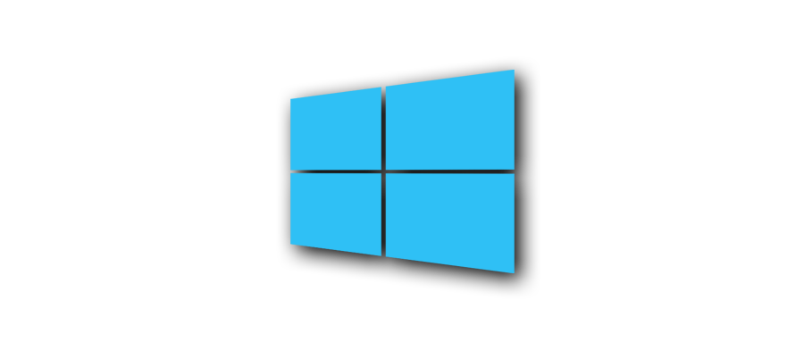

[全球 Windows 10 活跃设备已经超过 10 亿台](https://news.microsoft.com/zh-cn/window-10-%E5%8A%A9%E5%8A%9B10-%E4%BA%BF%E6%9C%88%E6%B4%BB%E8%B7%83%E8%AE%BE%E5%A4%87%E4%B8%BA%E5%85%A8%E7%90%83%E8%B5%8B%E8%83%BD/)，如何让 Windows 10 更好用？有哪些优质的实用软件？这篇文章一次性统统告诉你。

<!-- more -->

## 使用技巧

以下 Tips 可以帮你提高工作效率和电脑性能。

### 保持桌面整洁

文件不要放在桌面上，而是放在非系统盘（C 盘 以外），然后右键文件或文件夹，选择 `发送到：快捷方式到桌面` 或 `固定到“开始”屏幕`，这样做的好处是：

- 重装系统时（只动 C 盘的情况下），桌面会被清空。放在非系统盘，可以减少丢失文件的风险。
- 不会拖慢你的电脑运行速度（删除不常用的快捷方式）。


### 优化任务栏

- 右击任务栏不想展示出来的图标，选择 `在任务栏取消固定`。
- 右击任务栏任一空白处
  - 选择 `任务栏设置` > `合并任务栏按钮：任务栏已满时`。
  - 取消勾选 `人脉`、`任务视图`、`Cotana`（可用 `Win + C` 唤醒小娜）等。


### 键盘快捷键

`Windows 徽标键 ⊞` 是位于 `Ctrl` 和 `Alt` 的中间的视窗图标，以下简称 `Win`。

| 按该键                   | 执行以下操作                                                 |
| ------------------------ | ------------------------------------------------------------ |
| `Win + C`                | 召唤个人助理微软小娜（Cortana）。需在 `设置` 里开启。        |
| `Win + D`                | 显示桌面（Desktop），再按一次即可返回原本工作视窗。🔥<br />触摸板：三指下滑。 |
| `Win + E`                | 打开文件资源管理器（Explore）。🔥                             |
| `Win + I`                | 打开设置。                                                   |
| `Win + L`                | 锁定（Lock）你的电脑。                                       |
| `Win + R`                | 打开运行（Run）对话框。                                      |
| `Win + S`                | 打开搜索（Search）。<br />触摸板：三指点击。                 |
| `Win + V`                | 开启剪贴板历史记录功能。🔥                                    |
| `Win + W`                | 打开白板（Whiteboard）或全屏截图。                           |
| `Win + X`                | 打开「快速链接」菜单。按两下 `U` 即可关机。                  |
| `Win + 数字`             | 启动固定到任务栏的应用。                                     |
| `Win` + `.`（句点）      | 打开表情符号面板。                                           |
| `Win + Shift + S`        | 启动屏幕截图（Screenshot）。<br />可用 [Snipaste](https://zh.snipaste.com/) 代替。 |
| `Shift` + `小写字母`     | 输入大写字母。                                               |
| `Shift` + `鼠标左键单击` | 连续选择。                                                   |
| `Ctrl` + `鼠标左键单击`  | 多选。                                                       |
| `Ctrl + Shift + V`       | 纯文本粘贴（不带格式）。                                     |
| `Alt + Tab`              | 在打开应用之间切换（按住 `Alt` 不放，再按 `Tab`）。<br />触摸板：三指左右滑动。 |
| `Ctrl + Shift + N`       | 新建文件夹。🔥                                                |
| `F2 `                    | 重命名所选项目。                                             |
| `Backspace`              | 查看上一个文件夹。                                           |
| `Alt + F4`               | 关闭活动项，或者退出活动应用。                               |

**`Win + E` ≠ 快速访问**

1. 使用 `Win + E` 打开计算机（我的电脑）。
2. 依次点击左上角的 `查看` - `选项`。
3. 在 `常规` 选项卡上选择 `打开文件资源管理器时打开：此电脑`。

除此之外，切换 `查看` 选项卡 - `文件和文件夹` - 勾选 `登录时还原上一个文件夹窗口`。


**[虚拟桌面](https://sspai.com/post/43187)**

上班摸鱼的必备技能：一个桌面工作，一个桌面玩乐。或者在浏览器打开 [fakeupdate.net](https://fakeupdate.net/)，选一张系统「升级」的图片，全屏（`F11`），开始划水。

| 按该键           | 执行以下操作                    |
| ------------------------------ | ---------------------------------- |
| `Win` + `Tab`           | 打开任务视图。                     |
| `Win` + `Ctrl` + `D`     | 添加虚拟桌面。                     |
| `Win` + `Ctrl` + `向右键` | 在你于右侧创建的虚拟桌面之间切换。<br />触摸板：四指向左轻扫。 |
| `Win` + `Ctrl` + `向左键` | 在你于左侧创建的虚拟桌面之间切换。<br />触摸板：四指向右轻扫。 |
| `Win` + `Ctrl` + `F4`     | 关闭你正在使用的虚拟桌面。         |


**关联阅读**

- [Windows 中的键盘快捷方式 - Windows Help](https://support.microsoft.com/zh-cn/help/12445/windows-keyboard-shortcuts)
- [用动画的形式呈现常用 Windows 快捷键 by Gui Esp](https://guiesp.com/shortcuts)：[哔哩哔哩](https://www.bilibili.com/s/video/BV1oQ4y1P78A) | [YouTube](https://www.youtube.com/watch?v=hi6TH5Gz_ms)


### 触摸板手势

| 手势                                               | 执行以下操作            |
| -------------------------------------------------- | ----------------------- |
| 点击触摸板。                                       | 选择项目                |
| 将两个手指放在触摸板上，然后以水平或垂直方向滑动。 | 滚动                    |
| 将两个手指放在触摸板上，然后收缩或拉伸。           | 放大或缩小              |
| 使用两根手指点击触摸板，或按右下角。               | 显示更多命令 = 右键单击 |
| 用三根手指点击触摸板。                             | 打开 Cortana            |
| 将三根手指放在触摸板上，然后朝上轻扫。             | 查看所有打开的窗口      |
| 将三根手指放在触摸板上，然后朝下轻扫。             | 显示桌面                |
| 将三根手指放在触摸板上，然后向右或向左轻扫。       | 在打开的窗口之间切换    |
| 用四根手指点击触摸板。                             | 打开操作中心            |
| 将四根手指放在触摸板上，然后向右或向左轻扫。       | 切换虚拟桌面            |

资料来源：[适用于 Windows 10 的触摸板手势 - Microsoft 支持](https://support.microsoft.com/zh-cn/help/4027871/windows-10-touchpad-gestures) 

视频教程：[让你的触摸板物尽其用 - 联想小新官方账号](https://www.bilibili.com/video/BV1nJ411w72M)


### 提高电脑性能

- 更新 Windows：选择 `开始` 菜单 ，然后依次选择 `设置` > `更新和安全` 
- 更新设备驱动程序（借助 [360 驱动大师](http://www.360.cn/qudongdashi/) 更新）
- [Process Lasso](https://bitsum.com/)：Real-Time CPU Optimization and Automation
- 删除从不使用的程序；定期清理系统垃圾；定期重启
- 最后的大招：初始化电脑（恢复出厂设置、格式化）：依次选择 `开始` 按钮  > `设置` > `更新和安全` > `恢复`

#### 禁用不必要的开机启动程序

- 选择 `开始` 菜单 ，然后依次选择 `设置` > `应用` > `启动`
- 在 `启动应用` 下，找到你想要停止自动启动的程序，然后将其设置为 `关`
- 或者通过火绒安全的启动项管理功能关闭不需要自启的服务

#### 调整 Windows 的外观和性能

- Windows 10 包含许多视觉效果，例如动画和阴影效果。这些效果看起来很棒，但它们也可能使用额外的系统资源，并且可能降低电脑速度，当你的电脑内存（RAM）量较小时尤其如此
- 在任务栏上的搜索框中（`Win + S`），键入 `性能`，然后选择 `调整 Windows 的外观和性能`。在 `视觉效果` 选项卡上，依次选择 `调整为最佳性能` > `应用`（可以勾选 `平滑屏幕字体边缘` 和 `显示缩略图，而不是图标`）

#### 修改电源计划

⚠️ 如果追求长续航，请勿选择以下 2 个电源计划。

##### 高性能

选择 `开始` 菜单 ，然后依次选择 `设置` > `系统` > `电源和睡眠` > `电源选项` > `其他电源设置` > `显示附加计划：高性能`

##### 卓越性能

1. `Win` + `X`：`Windows PowerShell (管理员)`。
2. 粘贴以下代码，Enter，提示 `电源方案 GUID: f97d2d63-94db-4240-b15b-6473d6c8c75f  (卓越性能)`。

```shell
powercfg -duplicatescheme e9a42b02-d5df-448d-aa00-03f14749eb61
```

3. 选择 `开始` 菜单 ，然后依次选择 `设置` > `系统` > `电源和睡眠` > `电源选项` > `其他电源设置` > `显示附加计划：卓越性能`

##### 开启休眠模式

1. 选择 `开始` 菜单 ，然后依次选择 `设置` > `系统` > `电源和睡眠` > `电源选项` > `其他电源设置`。
2. 点击左上角的 `选择电源按钮的功能` - `更改当前不可用的设置` - 勾选 `休眠`
3. 选择 `开始` 菜单，点击 `电源`，即可看到 `休眠` 选项。

**关联阅读**

- [关机、睡眠和休眠有啥区别 - MVP 刘晖](https://support.microsoft.com/zh-cn/help/971703)
- [关闭电脑，或使其进入睡眠或休眠状态 - Windows Help](https://support.microsoft.com/zh-cn/help/13770/windows-shut-down-sleep-hibernate-your-pc)


### 清理存储空间

按下键盘快捷键 `Win` + `S` 打开搜索，输入 `存储设置`

- `配置存储感知或立即运行`，按需配置。
- `查看其他驱动器上的存储使用情况`，选择磁盘，`临时文件`，扫描，`立即删除`。
- `更改新内容的保存位置`：把 `C:` 盘改为其他盘，释放系统盘的空间。


按下键盘快捷键 `Win` + `E`，打开计算机（我的电脑）：

1. 右键点击左侧的 `下载` - `属性`
2. 切换到 `位置` 选项卡，更改存储位置到 `D:\Downloads`


### 开启夜间模式

- 显示器会发出蓝光，影响你在夜间的睡眠。为了帮助你入睡，请开启夜间模式，此后显示器将在夜间显示让眼睛更加舒适的暖色调。
- 选择 `开始` > `设置` > `系统` > `显示` > `夜间模式设置` > 从 `日落到日出` 开启夜间模式。


### 管理剪贴板

- 通过 `Win + V` 即可开启剪贴板历史记录功能，并且可以固定经常使用的项目。如果你经常和文字打交道， `Win + V` 将会是你爱不释手的一个功能。
- 如果你的 Windows 没有更新（或者不想更新），可以用 [Ditto](https://ditto-cp.sourceforge.io/) 代替，详情见少数派的报道：[免费开源的 Windows 管理剪贴板，让你处理文字更高效](https://sspai.com/post/43700)。


### [清除工作区](https://www.microsoft.com/zh-cn/tips/home/get-organized#shakeoutclutter)

清除其他所有打开的应用，专心使用当前应用。选择并长按想要保留的窗口（的顶栏），然后来回轻微晃动鼠标（或手指）。所有其他打开的应用将自动最小化以清空你的工作区。


### [多任务处理](https://www.microsoft.com/zh-cn/tips/home/get-organized#snapapps)

选择任何打开的窗口，然后将它拖动并贴靠在屏幕的边缘或角落，它们会自动调整大小，然后并排贴靠在一起。


### 复制文件路径

`Shift` + 鼠标右键单击文件，在弹出菜单中选择 `复制文件地址`。


### 其它技巧

- 视频教程：[如何在局域网中共享电脑文件夹？- Topbook](https://topbook.cc/search/article?keywords=%E5%B1%80%E5%9F%9F%E7%BD%91&selectedArticle=1367)
- 视频教程：[如何在局域网中共享打印机？- Topbook](https://topbook.cc/search/article?keywords=%E5%B1%80%E5%9F%9F%E7%BD%91&selectedArticle=1275)
- 视频教程：[这 10 个设置，让你的电脑用起来更加干净舒服 - 喵喵折 App](https://www.bilibili.com/video/BV1954y1h7y3)
- 访问 microsoft.com/zh-cn/tips/home 查阅更多 Windows 使用技巧。


## 佳软推荐

- [不想卸载重装，如何把 C 盘已安装的软件转移到其他盘：FreeMove](https://topbook.cc/overview?selectedArticle=1750)
- 统一把安装包放在下载文件夹，例如 `D:\Downloads`
- 安装软件时
  - 安装路径中最好不要包含中文
  - 统一在**非系统盘**管理：直接把路径中的 `C` 改成 ` D`，并去掉 `x86`（`C:\Program Files (x86)\QQ` 改为 `D:\Program Files\QQ`）

假设我下载了一个名为 `Shadowsocks-4.1.9.3.zip` 到 `D:\Downloads`，那么如何验证这个文件完整性（未被篡改）呢？

**Step 1**：按下键盘快捷键 `Win` + `X`，选择 `Windows PowerShell`

**Step 2**：根据不同的加密算法，复制相应的解密命令：

MD5
```
CertUtil -hashfile D:\Downloads\Shadowsocks-4.1.9.3.zip MD5
```

SHA-1
```
CertUtil -hashfile D:\Downloads\Shadowsocks-4.1.9.3.zip SHA1
```

SHA-256
```
CertUtil -hashfile D:\Downloads\Shadowsocks-4.1.9.3.zip SHA256
```

SHA-512
```
CertUtil -hashfile D:\Downloads\Shadowsocks-4.1.9.3.zip SHA512
```

**Step 3**：与下载页面提供的哈希值对比，如果一致，说明此文件没有被篡改。


你还可以把文件的哈希值（File Hash）放到在线杀毒网站 [VirusTotal](https://www.virustotal.com/gui/home/search) 检测一下。

> VirusTotal 可以免费分析文件是否有：病毒、蠕虫、木马和各种恶意程序。VirusTotal 与传统杀毒软件的不同之处是，VirusTotal 通过**多种杀毒引擎**扫描文件，判断上传的文件是否为恶意软件。


**优选免安装的便携版（Portable）**

1. 把下载好的 `Portable.exe` 剪切到 `D:\Program Files`（或者其他路径）。
2. 右键点击文件 - `打开方式` -  `选择其他应用` - `更多应用` - `在这台电脑上查找其他应用`（勾选 `始终使用此应用打开 *** 文件`）。
3. 在 `D:\Program Files` 找到对应的 `Portable.exe` - `打开`


使用国内的搜索引擎查找软件，可能会下载夹带「私货」的「官方」软件。下面举一个真实的例子：

- 打开 `sogou.com`，搜索 `Geek Uninstaller`（一个用于卸载软件的小工具）。
- 第一个结果是英文官网 `geekuninstaller.com`，因为不是我的电脑，而没有网络代理工具时，下载速度很慢(2 MB 左右的软件也要下很久）。所以我选择了第二个 `搜狗下载`（赫然写着 `安全` 二字），但我没有上高亮加粗的 `高速下载` 通道，因为多年的网上冲浪经验告诉我，使用这类 `软件助手` 对你一点帮助也没有。所以我选择了 `普通下载` 模式。
- 不一会儿，`geek` 下载好了，不用安装，解压即可使用。正当我「大快朵颐」地卸载同事电脑里的流氓软件时，[火绒安全](https://www.huorong.cn/) 拉响了警报：通过 `搜狗下载` 的 `Geek Uninstaller` 正在偷偷安装其他软件。真是日了（搜）狗了！当然，其他国内搜索引擎也好不到哪里去！


💡 点击以下软件标题，即可直达官网下载链接（有些可能需要科学上网）。


### 系统工具


#### [科学上网](https://tingtalk.me/fq/)

提升互联网生活质量的第一步是打通全球网络，访问 tingtalk.me/fq 开启数字世界的另一扇大门。


#### 浏览器：[Chrome](https://www.google.com/chrome/)

**如何下载**

- [通用下载网址（需翻墙）](https://www.google.com/chrome/)：google.com/chrome
- [中国大陆地区（可直达）](https://www.google.cn/chrome/)：google.cn/chrome

**选用理由**

- Google Chrome（谷歌浏览器）作为全球 65.64% 用户的选择，你应该成为其中的一员（2019 年 4 月）。
- 你可以从超过 15 万款 Chrome 扩展程序中随心选择，按照自己的喜好扩展浏览器功能（Chrome 最强大的地方）。
- 开启同步功能（登陆 Google 账号）后，Chrome 便会在你的笔记本电脑、平板电脑和手机上自动同步您的最新活动状态（例如扩展程序、书签、历史记录、密码和其他设置）。这样，无论身在何处，都能在自己的设备上享受一致的体验。
- [跨设备共享网页](https://support.google.com/chrome/answer/9430554)。在需要共享的设备上登录 Google 帐号并为 Chrome 启用同步功能：
  - 桌面端：右键点击相应链接或网页，`发送到您的设备`，选择要将网页发送到的设备。
  - 移动端：点击地址框右侧的设置图标（右上角的三个点），依次点按 `分享…`，接着点击 `发送到您的设备`，选择要将网页发送到的设备。
- 更多玩法，参阅 [Chrome 插件（扩展程序） 清单 - 庭说](https://tingtalk.me/chrome/)


#### 电脑管家：[火绒安全](https://www.huorong.cn/)

- Windows 10 自带的 `安全中心` 对大部分人来说已经够用，如不放心，就加个 [火绒安全](https://www.huorong.cn/) 吧。强悍、干净、轻巧的火绒可以让你安全、安静、自由地使用电脑。此外，关注公众号「火绒安全实验室」（WeChat ID：HuorongLab） 你就会知道金山毒霸、360 安全卫士和腾讯电脑管等有多么恶毒。
- 火绒不会有广告弹窗等任何打扰用户的行为，也不会在安装包中随意捆绑其他软件。同时，火绒反捆绑和弹窗拦截还能帮助您的计算机变得更加干净。
- 家长控制：帮助家长保护、管教孩子，在孩子使用电脑时对孩子的上网行为进行管控。家长控制功能从上网时段控制、程序执行控制、网站内容控制、设备使用控制四个方面保护孩子。


#### 解压缩：[Bandizip](https://cn.bandisoft.com/bandizip/) 

- 轻巧、快速、免费、好看的解压缩软件。
- 最喜欢它的「自动解压」功能：不用再担心解压出一堆散乱文件或双层文件夹。
- 7.x 版本之后，需要 30 美元去广告，可前往 [蓝奏云](https://wwa.lanzous.com/b00t9wiva) 高速下载 6.x 版本。
- 关联阅读：[Bandizip | 也许是全球第二好用的压缩软件](https://www.xjcbt.com/bandizip.html)（为什么叫「第二好用」的压缩软件呢？因为每个人都有自己的的习惯，自己喜欢的才是最好用的。）


#### 系统优化：[Dism++](https://www.chuyu.me/zh-Hans/)

> DISM：Deployment Image Service and Management Tool，部署映像服务和管理。

也许是最强的 Windows 实用工具（系统优化工具），例如：
- 在桌面上的显示我的电脑
- 将用户账号控制程序（UAC）调整为从不通知
- 隐藏快捷方式小箭头
- 启用 Windows 照片查看器
- 关闭商店应用推广
- 打开资源管理器（`Win` + `E`）时显示此电脑
- 任务栏时钟精确到秒
- ……

即下即用，无广告、无后门，安心用。


#### 卸载工具：[Geek Uninstaller](https://geekuninstaller.com/)

通过控制面板卸载程序不会自动扫描残留的文件、文件夹和注册表项目。

**优点**
- 小巧（2 MB ）、绿色（无需安装）、易用（单文件）的卸载工具。
- 卸载完成，Geek Uninstaller 会自动扫描残留的文件（夹）和注册表项目。
- 支持卸载 `Windows Store App`（切换入口：顶部菜单栏 > `查看`）

**缺点**

- 部分用户反应会连带把其它软件一起卸载了，但是我用了几年没遇到过这种情况。
- 可选 [Bulk Crap Uninstaller](https://www.bcuninstaller.com/) 作为替代卸载软件（[视频介绍](https://www.bilibili.com/video/BV1u54y1d7yk/)）。
  - 免费开源
  - 支持多选卸载
  - 界面语言没有中文版

**下载**

- 官网（下载速度慢）：geekuninstaller.com。
- [蓝奏云](https://wwa.lanzous.com/b00t9wiva)（下载速度快）。

**使用**

1. 打开 `geek`。
2. 找到想要卸载的软件：
	- 底部有搜索框。
	- 点击 `程序名称`、`大小`、`安装时间`，即可改变软件排序。
3. 双击；或者右击 >`卸载(U)…`。
4. 卸载完成后，geek 会自动扫描残留的文件、文件夹和注册表项目（清理效果：★★★☆☆）。

**导出软件清单**

1. 点击顶部菜单栏的 `文件`。
2. `导出为 HTML(E)… Ctrl +S`。

重装电脑后，就可以照着这个清单武装你的电脑。


#### [360 驱动大师网卡版](http://weishi.360.cn/qudongdashi/index.html)

虽然很不想用 360 的产品，但是，无奈其他驱动管理软件（驱动精灵、驱动人生）都太流氓。

如不放心 360 家的软件，去各家驱动的官网更新，会是更好的选择。


#### 进程优化：[Process Lasso](https://bitsum.com/)

服役多年老电脑，会越来越卡了，使用 Process Lasso（Real-Time CPU Optimization and Automation）也许可以再撑一撑。

对于绝大多数用户来说，安装 Process Lasso 后无需任何设置，软件即可让老旧设备如获新生。详情请参阅 [Process Lasso – 进程实时优化，拯救老电脑，告别卡顿 - 数码荔枝](https://www.lizhi.io/review/50048528/)


### 下载工具


- [别再问我什么是 BT 种子 - 回形针PaperClip](https://www.bilibili.com/video/av57748098/)
- [磁力下载是什么原理？跟用种子下载的区别大不大？- 万物30秒](https://www.bilibili.com/video/BV1Ht411R7Y8)
- [什么是 BitTorrent（BT 种子）、磁力链接（Magnet URI scheme）、电驴链接（eD2k）和迅雷链接（Thunder）by 奔跑中的奶酪](https://mp.weixin.qq.com/s/dvTvWIwg5HeSo0noftX38w)


#### IDM

Internet Download Manager 是一个多线程下载管理器。虽然长得丑，但是可以大大提升你的下载幸福感。可惜只支持超文本（安全）传输协议（HTTP / HTTPS）和文件传输协议（FTP），不支持 BitTorrent（BT）、磁力链接（Magnet URI scheme）、电驴链接（eD2k）和迅雷链接（Thunder）。这个时候就得迅雷和其他下载软件出场了。

> 什么是多线程下载？打个比方，现在要接满 1 桶水，浏览器下载时只能开 1 个水龙头，接满 1 桶水时间为 1 小时。多线程下载器可以 32 个水龙头同时接水，接满 1 桶水时间缩短到 2 分钟，足足快了 32 倍。by [网盘直链下载助手](https://www.baiduyun.wiki/zh-cn/)

**下载**


- [Internet Download Manager 下载地址](https://www.lanzous.com/b0ug2rrc)（经济宽裕的读者还请付费支持）

**用途**

- 配合 [网盘助手](https://greasyfork.org/zh-CN/scripts/378301-%E7%BD%91%E7%9B%98%E5%8A%A9%E6%89%8B) 这个 [油猴脚本](https://tingtalk.me/userscripts/) 可以 [解决百度网盘限速](https://www.runningcheese.com/baiduyun)。如果网盘助手的生成链接不能下载，请更换 [应用 ID](https://greasyfork.org/zh-CN/scripts/378301-%E7%BD%91%E7%9B%98%E5%8A%A9%E6%89%8B)。
- 下载网页的各种音频和视频，例如 YouTube 视频。

**技巧**


- `下载` - `选项` - `连接`： `默认最大连接数` 修改为 `32`（不过开太多线程可能会被网站 Ban）
- 如何下载 [被墙](https://tingtalk.me/fq/) 的文件：`下载` - `选项` -  `代理服务器` - `手动配置代理 / socks`
  - `地址`：`127.0.0.1`
  - `端口`：`1080`
  - 配置好后，IDM 就可以下载被 Q 的内容了。但是下载完记得 `不使用代理 / socks`，除非你有很多 [番茄](https://tingtalk.me/fq/)。
- 快捷键：`下载` - `选项` - `快捷键`
  - 强制调用 IDM：点击时按住 `Insert` 键可以使 IDM 直接抢占浏览器的所有资源下载，从而避免二次请求带来的尴尬。
  - 暂停调用 IDM：按住 `Alt` 键则可以让 IDM 暂时停止接管浏览器的下载，让浏览器自行完成下载任务。
- 针对包含有效期的动态临时下载地址，在主界面中右击未完成的任务，选择 `刷新下载地址`。


#### 迅雷

根据 [阿虚同学](https://mp.weixin.qq.com/s/fxU1pIUvUZ29GgAQ9HMd6w) 的测试，最佳的下载搭档是：

- 方法一：[迅雷 X](https://www.lanzous.com/i9cym0h) + [比特彗星](https://www.lanzous.com/b073c7g4f)
- 方法二：[迅雷 X](https://www.lanzous.com/i9cym0h) + [迅雷 5](https://www.lanzous.com/i9cym8f)

**下载思路**

1. 先用迅雷 X 下载资源
2. 迅雷 X 搞不定的情况下，使用迅雷 5 或比特彗星（对资源无限制）

**下载链接**  

打开 [阿虚同学的储物间](http://kyon945.ys168.com/) 的第 8 栏。

小技巧：[把迅雷边下边看的默认播放器为 PotPlayer - AppSo](https://mp.weixin.qq.com/s/m-9XPn72p5sexlz7_GZ4fw)


#### [uTorrent](https://www.utorrent.com/)

- 建议安装 2.2.1 版本
- 图文设置教程：[如何优雅的使用 BitTorrent网络下载文件? - NovaOPCJ's Blog](https://blog.novaopcj.top/?p=74)


### 即时通讯

#### [Telegram](https://desktop.telegram.org/)

目前最好用的即时通信软件。教程请参阅：[Telegram：电报新手指南、使用技巧及频道推荐](https://tingtalk.me/telegram/)。


#### [微信](https://pc.weixin.qq.com/) 

超过十亿人使用的应用，难用也得用。有生之年，希望能看到微信向 [Telegram](https://telegram.org/) 靠拢。


#### [TIM](https://tim.qq.com/)

QQ 办公简洁版，界面清爽，支持在线编辑 Word 和 Excel，提供 10G 云盘。不过，缺少群视频功能（有主持人控场的那种）。


### 文档处理

#### [Typora](https://typora.io/)

现代汉语就像用脏了的人民币，要用 Markdown 洗一洗。

- 使用 Typora（谐音：太婆热）这款所见即所得（What You See Is What You Get）的 Markdown 编辑器，你会感觉自己的双手有了魔法一般，一敲一击，美好的文字皆优雅地排列在屏幕上，让人觉得舒服自然。相信我，通过它，你会找到写作的乐趣。
- 复制 Word 和 Excel 中的表格，Typora 会智能转换成 Markdown 格式的表格（Markdown 是轻量化标记语言，所以不支持合并 / 拆分单元格）。
- Typora 原生支持导出 PDF、HTML 等格式。你可以根据软件内的提示安装 Pandoc 插件来导出更多文件格式，例如 Word (.docx)，LaTeX 等格式。 
- 右键 `使用 Google 搜索`，真是妙不可言。
- `文件` > `偏好设置`
  - `启动选项`：`打开指定目录`，如何 Markdown 文档全部放在 1 个文件夹（允许有子文件夹），这个设置超级有用。
  - `开启自动保存`
- `Ctrl` + `Shift` + `3` 文件树视图
- `Ctrl` + `Shift` + `3` （全局）搜索视图：可检索 Markdown 文档里内容。Awesome！

关联阅读：[Markdown 入门教程及书写风格指南](https://tingtalk.me/markdown/)


#### [Microsoft Office](https://www.microsoft.com/zh-cn/microsoft-365/)

Markdown 是非常优秀的写作语言，但并不是人人都知道，所以电脑还是得备一个 Office 软件打开 Word、Excel 和 PowerPoint。

推荐使用 [Office Tool Plus](https://otp.landian.vip/zh-cn/) 下载 Microsoft Office。但是更推荐订阅 [Microsoft 365（原 Office 365）家庭版](https://www.microsoft.com/zh-cn/microsoft-365/buy/compare-all-microsoft-365-products)，一年的费用是 ¥498，最多可供 6 人使用，且每人有 1 TB 的 OneDrive 云存储空间。

还可以试试 [腾讯文档](https://docs.qq.com/)：
- 无需下载安装，打开网页或小程序就能查看和编辑，云端实时保存。
- 支持创建、导入和下载 Word、Excel 和 PPT。
- 多人实时编辑文档，权限安全可控。
- ❗ 但 Markdown 模式真的太丑太难用了。


#### [Visual Studio Code](https://code.visualstudio.com/)

微软开发的代码编辑器。


#### [Adobe Acrobat](https://acrobat.adobe.com/cn/zh-Hans/acrobat.html)

如果不需要修改 PDF 的内容，[Acrobat Reader](https://acrobat.adobe.com/cn/zh-Hans/acrobat/pdf-reader.html)、[Sumatra](https://www.sumatrapdfreader.org/free-pdf-reader.html)、Google Chrome（谷歌浏览器）、Microsoft Edge（ Windows 10 自带浏览器）和 WPS Office 都可以满足你的要求。但当您需要编辑 PDF 的时候，Acrobat Pro 就是您最佳的 PDF 解决方案，毕竟，PDF 是由 Adobe 1991 年发明的。

一年的费用 $359，去微博找 [@vposy](https://www.weibo.com/vposy) 的置顶微博说不定有惊喜。


#### [Sumatra PDF](https://www.sumatrapdfreader.org/)

开源小巧的 PDF 阅读器，更支持 eBook (ePub, Mobi), XPS, DjVu, CHM, Comic Book (CBZ and CBR) 。


#### [PDF 补丁丁](https://www.cnblogs.com/pdfpatcher/)

一个多功能 PDF 工具箱：修改 PDF、编辑 PDF 书签、导出 PDF 书签、导入书签、生成、合并、拆分、提取页内容、提取图片、OCR……永久免费，绝不过期，无广告，无弹出废话对话框。


### 图像处理


#### [qimgv](https://github.com/easymodo/qimgv)

Windows 的默认图片浏览器非常难用。而 qimgv 是一款开源的图片浏览器，小巧、快速（比 ImageGlass 快）、简洁，支持视频预览、剪裁、快捷移动等功能，非常适合替代 Windows 原生图片浏览器。

> 详情请参阅 [qimgv 的视频介绍](https://www.appinn.com/qimgv-for-windows/) by Appinn


想要不打开 Photoshop 直接预览 PSD 文件，试试 [Honeyview](https://cn.bandisoft.com/honeyview/)（蜂蜜浏览器）：

- 无需解压，直接预览图像
- 支持批量转换图片格式和调整大小


#### [Snipaste](https://zh.snipaste.com/)

- 在 Windows 10 中，按下 `Win + Shift + S`，然后拖动光标选择想要捕获的区域，即可完成部分屏幕截图。但想要获得更出色的截图体验，少不了 Snipaste（`Snip + Paste` 截图 + 贴图）这款效率工具。
- 对于经常写报告，写文章的人来说，开启双屏工作模式，工作效率可大大提高。原因很简单，看参考资料时，不必频繁在不同窗口之间切换。事实上，并不是很多人拥有两个屏幕。很多时候只能在一个屏幕上不停地调整两个窗口，一边码字，一边看参考资料。Snipaste 应运而生，下载（免安装）并打开 Snipaste，按下 `F1` 截图，再按 `F3`，截图就在桌面置顶显示了（重启电脑后，贴图依旧在）。就这么简单！
- 更多使用技巧参考 [Snipaste 用户指南](https://docs.snipaste.com/zh-cn/)。


#### [ShareX](https://getsharex.com/)

- 为截图自动加阴影，添加文字或者图片水印。
- 丰富的图像编辑器。
- 截图上传至图床。

> [一个软件，满足你所有的截图需求：ShareX - 少数派](https://sspai.com/post/43937)


#### [FastStone Capture](https://www.faststone.org/index.htm)

滚动截图（捕捉滚动窗口）的好帮手。

- 付款版：[FastStone Capture 9.3](https://portablesoft.lanzous.com/ibdhpja)
  - name（用户名）：bluman
  - serial（注册码）：VPISCJULXUFGDDXYAUYF
- 免费版：[FastStone Capture 5.3](https://wwa.lanzous.com/b00t9wiva)，有时会拼接失败。

解压后直接运行 FSCapture.exe（汉化便携版）即可，所有配置保存到 fsc.db 文件中。

若经济允许，请付费支持。

> 安装包来源：[FastStone Capture 9.3 汉化绿色便携版 - 极品屏幕截图工具 - PortableSoft](https://www.portablesoft.org/faststone-capture/) 


#### [LICEcap](https://www.cockos.com/licecap/)

- 免费开源的 GIF 录屏工具，支持 macOS 和 Windows 平台。
- 如果 LICEcap 不能满足你的要求，试试 [ScreenToGif](https://www.screentogif.com/)，不过录制出来的 GIF 体积偏大。
- [ezGIF](https://ezgif.com/)：免费的在线压缩工具。
- `Win + G` 启动录制屏幕工具。


#### [智图](https://zhitu.isux.us/)

- （批量）图片压缩和图片格式转换。
- 安装之前，请阅读 [安装指引](https://zhitu.isux.us/index.php/preview/install) 。


#### [Google Photos](https://photos.google.com/apps) 

- **无限空间**：在高画质上传模式下，Google 相册享有无限免费存储空间（目前我上传了接近 80GB 的相片和视频），文件缩小，画质几乎不减。
- **面容识别**：按相似的面孔将亲朋好友（或宠物）的照片分门别类（如何快速寻找亲友 10 年前的相片，这是我能想到最快的方式）。
- **一搜即达**：有一次，我想找一张正装照，但是照片太多了。突然想到还有 Google Photos，键入「正装」，我那些人模人样的「照骗」一下子筛选出来了。这小子，真帅！你还可以试试这些关键词，例如海滩、狗或日本，查找过去珍藏的照片。
- **往年今日**：显示过去拍摄的照片，重温数年前的这一天（如果你容易睹物思人，请不要上传前任的相片到 Google Photos）。但大部分美颜 app 修图后都会抹除拍摄时间，所以请尽量使用原生相机照相（配合 [Snapseed](https://support.google.com/snapseed) 轻微修图）。若干年后，你才不会觉得自己一直都是美得一塌糊涂（磨皮），以致忘了曾经的样子。
- **批量上传**：网页版只能上传单个文件夹里的相片。批量上传相片的话，请下载 Google Photos 的 PC 客户端，开启全局代理模式后，挂一晚上，明早就能收到智能助理自动为你创建的风格化修图、拼贴、动画和影片等内容。
- **批量导出**：借助 [Google Takeout](https://takeout.google.com/)，你可以导出所有的相片（QQ 空间相册似乎没有这个批量导出的功能）。


#### Adobe 系列

方法一：

1. 下载 [Adobe Creative Cloud](https://www.adobe.com/cn/creativecloud/catalog/desktop.html) 并安装。
2. 打开 Adobe Creative Cloud，登录 Adobe 账号，下载 Photoshop 和 Illustrator 等。
3. 使用 [GenP v2.5](https://jpsmile.com/genp-v2-5/) 破解，可能已失效。

方法二：

来自微博 https://weibo.com/vposy

2021.3.11 更新
2020 版除 PS 外已为最终版本。2021 SP 版和大师版实时更新。
百度： [网页链接](http://t.cn/A6tHVo2f) 提取码: eyxf
天翼： [网页链接](http://t.cn/A6tQ4B2b) 访问码：vu3d

解压密码 `@vposy`


#### Inkscape

开源的矢量绘图软件，我拿来 [位图矢量化](https://tingtalk.me/raster-to-vector/)，特别好用。


### 文件同步

#### [坚果云](https://www.jianguoyun.com/)

最安全、稳定、快速的云盘 / 网盘 / 企业网盘，提供跨平台的文件同步、备份、分享服务。以无限存储空间、多文件夹同步、速度最快的局域网同步为特点。

- 当前使用免费版（上传流量 1 G/月；下载流量 3 G/月）同步 Typora 写的 Markdown 文章，完全够用。
- Android 手机上使用 [坚果云Markdown](https://www.jianguoyun.com/static/html/markdown-landing/index.html) 编辑文章。
- 内置 [坚果云合同库]( https://legaldb.jianguoyun.com/)： 数万标准模板，例如《房屋租赁合同》、《离婚协议》、《 员工辞职信模板 》等，助您高效工作。


#### [百度网盘](https://yun.baidu.com/)

- 2012 年 9 月百度推出「百度云」。2016 年 10 月 11 日，百度云（Baidu Cloud）改名为百度网盘。
- 在国内大容量免费网盘相继「去世」的困境下，不知道百度网盘还能挺多久。虽然下载会限速，但是你可以通过 IDM 解除限速。
- ❗ 鸡蛋不要放在同一个篮子里，重要的数据还是乖乖地做好多个备份吧。


### 娱乐影音

#### [荐片播放器](https://jianpian.com/)

- 专治迅雷被封下载链接（号称）
- 免费高清视频在线观看 
- 关联阅读：[4 个方法教你如何下载影视资源](http://www.btfilm.cn/help.html)


#### [QQ 影音](https://player.qq.com/)

纯净的本地播放器。

- QQ 影音是腾讯为数不多的精品软件，当大家以为腾讯要放弃这个产品时，居然更新了。
- 除了 QQ 影音，你的另一个选择是 [PotPlayer](https://potplayer.daum.net/)：轻巧无广告，流畅不卡顿，强大而低调。详见 AppSo 的报道：[PotPlayer：Windows 看片神器，用了它我再也没用过别的播放器](https://www.ifanr.com/app/883744)。官网已无法正常访问（它只是一个单纯的本地视频播放器，它犯什么错了？！），所以需要你具备 [科学上网](https://tingtalk.me/fq/) 的能力。


### 其它软件

#### [ToDesk](https://www.todesk.com/)

**下班回到家，老板却不给你休息怎么办？**

1. 在单位和个人的电脑下载并安装 [ToDesk](https://www.todesk.com/) （个人免费）
2. 注册账号，并设为开机自启（私人设备可不自启）
3. 下班后，公司的电脑不要关机
4. 等待老板分配临时任务给你
5. 用「手机 / 私人电脑」远程控制公司的电脑桌面
6. 披星戴月，完成任务。Tomorrow is another day

详情，请参阅异次元软件世界的介绍：[ToDesk - 免费流畅不限速的远程控制软件](https://www.iplaysoft.com/todesk.html)

同类软件：

- [TeamViewer](https://www.teamviewer.cn/cn/) 个人使用也可能会被判定为商业用途。
- [向日葵](https://sunlogin.oray.com/personal/) 跟着月亮转，好似月光下的你跟着老板转


#### [Dynamic Theme](https://www.microsoft.com/zh-cn/p/dynamic-theme/9nblggh1zbkw)

免费的五星桌面壁纸软件，自动跟随 Bing 每日壁纸更新，无广告，无水印，支持自动保存壁纸到指定的文件夹。启动之后，也不会常驻在任务栏的通知区域，就像 Windows 10 系统自带的功能一样，可谓是「随风潜入夜，换图细无声」。每天通过一张漂亮的壁纸，去认识这个多姿多彩而又残酷的世界。


#### [Microsoft To Do](https://todo.microsoft.com/)

无论是想提高工作效率、缓解压力，还是只想少记点东西，微软待办均让你能够轻松规划你的一天、管理你的生活，让你从工作到娱乐都保持专注。

- **免费提供**：可在任意设备（iPhone、Android、Windows 10 和 Web）上使用和同步。
- **每日计划**：使用「我的一天」，用智能个性化建议更新每日待办事项列表，每天都完成有意义的工作。
- **支持附件**：向任意任务附加高达 25 MB 的文件。复制文件，在任务详情页 Ctrl + V 添加附件。
- **轻松共享**：从查阅简单购物清单到规划重要的日子，共享列表都可帮助你与家人、朋友和同事保持联系。
- **支持标签**：加上 `#` 打上 Tags 后，就能对代办事项进行分组了。
- **一个技巧**：清单（List）/ 组（Group）命名时以 Emoji 开头，清单（List）/ 组（Group）的图标也会变成对应的 Emoji。
- **需要帮助**：请访问 [Microsoft To Do 支持](https://todosupport.helpshift.com/a/microsoft-to-do)。


截至 2020 年 3 月 23 日，To Do 没有回收站功能。你可以新建一个叫「回收站」的清单，把已完成的任务移动或拖拽到这个清单列表里。或者去 Outlook 里还原已删除的任务：

1. 用同一个的 Microsoft 帐户登录 [Outlook](https://outlook.live.com/)（桌面网页版）。
2. 点击侧边文件夹列表中 `已删除邮件`。
3. 查找（`Ctrl` + `F`）已删除的待办事项，右键单击它，选择 `还原`。
4. 重新打开 To Do，即可在 `任务` 列表找到它，找不到就使用查找 🔍 功能。


#### [Microsoft Whiteboard](https://products.office.com/zh-cn/microsoft-whiteboard/)

一块自由形态数字画布，使用快捷键 `Win + W` 打开微软白板（Microsoft Whiteboard）。

**优点**

- 可导出 PNG 和 SVG。
- 提供 CC0 免费图库。
- 将墨迹转换为形状：目前支持正方形、矩形、三角形、圆、六边形、五边形和平行四边形。
- 双击查看整个白板（鸟瞰图）。更多用法参考 [Microsoft Whiteboard 帮助](https://support.office.com/zh-cn/article/microsoft-whiteboard-%E5%B8%AE%E5%8A%A9-d236aef8-fcdf-4b5e-b5d7-7f157461e920)


**不足**

- 目前仅支持 Windows 10 和 iOS。
- 需登录 [Microsoft 帐户](https://account.microsoft.com)，登陆之后自动保存，顺畅继续。


#### [Easy Cat Timer](https://cn.easycattimer.com/)

  一款简单可爱的倒计时软件，完全免费，支持中 [英](https://easycattimer.com/) 两种语言，有网络就用 [在线版](https://cn.easycattimer.com/)，离线使用就下载 [Windows 版](https://cn.easycattimer.com/download/index.html)。


#### 微软拼音

自带的输入法已经足够好用，而国产的输入法有关不完的广告弹窗。

 `Win` + `;` / `.`：可在任何应用程序中使用表情符号（Emoji）。

**通过自定义短语实时输入日期和时间**

日期：`%yyyy%-%MM%-%dd%`

时间：`%HH%:%mm%`

来源：[用微软拼音快速输入自定义格式的时间和日期 - walterlv](https://blog.walterlv.com/ime/2017/09/18/date-time-format-using-microsoft-pinyin.html)

**关联阅读**

- [一些小技巧，让你的 Windows 10 内置拼音输入法更好用 - 好奇狗熊](https://sspai.com/post/52101)
- [深蓝词库转换：一款开源免费的输入法词库转换程序 - studyzys](https://github.com/studyzy/imewlconverter)


#### [Fliqlo](https://fliqlo.com/screensaver/)

[Fliqlo - 时隔 10 年，翻页时钟屏保更新，不再需要 Flash - 小众软件](https://www.appinn.com/fliqlo-1-4/)


**关联阅读**

[Awesome Windows](https://github.com/Awesome-Windows/Awesome/blob/master/README-cn.md)：Windows上优质 & 精选的最佳应用程序及工具列表，其/中包含这篇文章没讲的 [数据恢复软件](https://github.com/Awesome-Windows/Awesome/blob/master/README-cn.md#%E6%95%B0%E6%8D%AE%E6%81%A2%E5%A4%8D)（因为我有良好的备份习惯）。

[FXXKMAKEDING](https://node4.mkdmirror.workers.dev/0:/)：Fuck 思杰马克丁，来这里下载「绿色」软件吧。


## 系统重装

下面介绍如何安装纯净的 Windows 10 系统。如果是较「老」的联想电脑，如 ThinkPad X220，不能通过以下方法重装系统，可用 [联想原厂系统镜像](https://okr.lenovo.com.cn/help.html) 在空白的 U 盘中制作 Windows 10 家庭中文版系统盘。

### 下载 Windows 10

- （使用 [迅雷](https://www.xunlei.com/)）下载 Windows 10 光盘映像（ISO 文件）：截至 2019-10-12，最新版是 [Windows 10 (business editions), version 1909 (x64) - DVD (Chinese-Simplified)](https://msdn.itellyou.cn/)
- 下载 [360 驱动网卡版](http://www.360.cn/qudongdashi/index.html) ：防止电脑安装后无法联网

下载系统的同时，备份好电脑 C 盘（系统盘）内的数据。重要数据，备份 2 次：

- 云盘 1 份
- U 盘或移动硬盘 1 份

通常情况下，D 盘和 E 盘等在安装过程中，数据不会被清除，但为了保险起见，还是备份一下 C 盘以外的数据，毕竟数据无价。 不过，我的做法是全盘清空。因为重装系统后，不管原先放在哪个盘的软件，全部都要重装一遍。何不彻底一点，来个大扫除。

### 安装 Windows 10

#### 直接安装

如果电脑可以正常开机，直接解压 Windows 10 镜像，双击 `setup`，按照提示，即可正常安装 Windows 10。

#### U 盘安装

如果电脑不能正常开机，例如忘记开机密码（意味着此法可以 [破解 Windows 本地开机密码](http://www.wepe.com.cn/ubook/password.html)），可以借助 U 盘（ 8G 以上；已备份好 U 盘内的数据）制作 WinPE 启动盘。

> Windows PreInstallation Environment（Windows PE，简称 WinPE），其中文含义为 Windows 预安装环境。简单来说，WinPE 就是一个超级迷你版的 Windows。它可以安装在 U 盘中，从而可以通过 U 盘启动电脑。


##### 制作 WinPE 启动 U 盘

1. 下载并安装 [微 PE 工具箱（Win10 PE 版）](http://www.wepe.com.cn/download.html)。
2. 插入 U 盘
3. 打开 `微 PE 工具箱`，选择右下角的 `其他安装方式` - `安装 PE 到 U 盘`。程序会自动识别待写入的 U 盘，其他参数默认即可。`立即安装进 Ｕ 盘`。
4. 安装完成后，把 Windows 镜像文件和网卡驱动一起复制到 U 盘里

##### 设置 BIOS

- [设置 BIOS 中 U 盘为引导启动设备](http://jijiupan.360.cn/startguide.html)
- `Secure Boot` 改为 `Disabled`，防止出现 `All boot options are tried`
- 有些笔记本电脑需要同时按 `Fn` + `F*`

##### 进入 WinPE 安装系统

安装之前，如果对系统盘（C 盘）的容量不满意，可以先分区。

1. 打开 `Windows 安装器`，选择 U 盘中的 Windows 安装文件。
2. `选择引导驱动器`：C 盘。
3. `安装磁盘的位置`：C 盘。
4. 开始安装，选择专业版。

##### 设置英文用户名（账户名）

避免某些程序不兼容。

**更多玩法**

- 参阅 [微 PE 优盘使用说明书](http://www.wepe.com.cn/ubook/)。
- [FirPE](https://www.firpe.cn/)：也许是最好用的 PE 维护系统,然而不够微 PE 好用。
  - [EasyRC 一键重装](https://firpe.cn/page-196)：也许是当前最简单、最快速的系统重装软件。EasyRC 摆脱了传统借助光驱、U盘等介质的繁琐，操作者无需任何技术基础，随时随地实现傻瓜式电脑系统重装（包括下载 Windows 镜像安装包）。

### 激活 Windows 10

数字许可证（在 Windows 10 版本 1511 中称为数字授权）是 Windows 10 的一种激活方法，该方法不需要输入产品密钥。

> 在 Windows 10 的所有系统中，无论系统是如何被激活的（通过 Windows7/8.1 升级或者购买零售密钥版密钥或者嵌入BIO，又名 MSDN 许可证）都会被转换成基于各自的设备硬件 ID（HWID）的一个数字许可证。这个证书储存在微软服务器并且每次安装系统时都会激活这台设备。只有当这台设备的硬件被更改（例如更换主板）时，才会导致许可证失效。通过将它绑定到一个微软账户（MSA）你可以在这种情况下转移证书从而激活这台（硬件被更改的）设备。
>
> 这个过程在每台机器上只需要执行一次。在以后的安装中只需要跳过任何需要密钥的地方（在安装的时候选择 `我没有激活密钥`），之后第一次联网的时候将自动联系微软服务器注册 HWID 并激活这台设备。
>
> 翻译自 [Justf](https://channel.justf.space/2018/06/17/Windows-activation-HWID/)


❗ 如果已使用密钥激活 Office 等产品，可能会丢失其激活状态。


**前提条件**

- 电脑已联网
- 关闭 VPN（退出翻墙客户端）
- 未关闭 Windows 更新服务（[如何启动 Windows Update 服务](https://www.cnblogs.com/xuexianqi/p/12342664.html)）


**激活步骤**

1. 下载最新的 [HWIDGen](https://www.lanzous.com/b394531/)。
2. 运行 `HWIDGen.exe`。
3. 点击右上角的工作模式（Work Mode），选择数字激活（HWID，Hardware Identity）。
4. 点击开始（START），几分钟后，提示激活 Professional 成功（Successfully actived Professional），确定。


**检查激活状态**

- **方法一**：按下键盘快捷键 `Win` + `X`，选择 Windows PowerShell，复制 `slmgr.vbs -xpr`，粘贴（右键点击），Enter，显示 `计算机已永久激活`。
- **方法二**：按下键盘快捷键 `Win` + `S`，输入 `激活`，选择 `激活设置`，显示 `Windows 已使用数字许可证激活` 或 `Windows 已使用与 Microsoft 帐户关联的数字许可证激活`，则表示激活成功。

关联阅读：[激活 Windows 10 - Windows Help](https://support.microsoft.com/zh-cn/help/12440/windows-10-activate)


**激活后，找回隐藏的桌面图标**
选择 `开始` 菜单 ，然后依次选择 `设置` > `个性化` > `主题` > `桌面主题设置` > 勾选想要放在在桌面上的图标，例如 `计算机`。


**购买新机**

收到电脑后，先不要联网激活，用 U 盘拷贝 [图吧工具箱](http://www.tbtool.cn/) 到新电脑，检测电脑的各项硬件。by [大终极笔记本电脑选购指南，帮你买到心仪的电脑｜大狸子切切里 - YouTube](https://www.youtube.com/watch?v=2TguunSEhRI)


**参考资料**

- [人生极简指南，解决 90% 要用什么软件的烦恼 - 奔跑中的奶酪](https://mp.weixin.qq.com/s/2cwq-Gtqm_cByu7F9zPsHg)
- [这份 Windows 优化指南，帮你拯救越用越慢的老电脑](https://sspai.com/post/43084) - [Eric_hong](https://sspai.com/u/ja69pqna/updates)
- [Windows - Topbook](https://topbook.cc/search/article?keywords=windows)