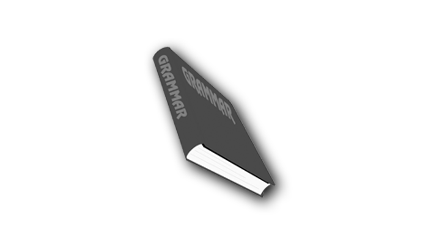

---

title: 英语语法  
date: 2019-10-14  
updated: 2021-05-17  
categories: 英语学习 
tags: 英语   

---

- 《英语阅读参考手册》为主，点此下载 [电子书](https://github.com/xiaolai/a-new-english-reading-handbook)。
- 《柯林斯 COBUILD 英语语法大全》为辅。
- 不想看书，就看英语兔的视频吧：[一个视频说清整个英语语法体系（重塑你的语法认知框架）- 哔哩哔哩 bilibili](https://www.bilibili.com/video/BV1r54y1m7gd)

<!-- more -->

## 英语时态

> [英语语法：16 种时态终极详解合集 by 英语兔 - 哔哩哔哩 bilibili](https://www.bilibili.com/video/BV1Sv411y7d8)

- 过去时：I had lunch already. 我吃过午饭。
- 现在时：I am having lunch. 我正在吃午饭。
- 未来时：I am going to have lunch. 我（将要）去吃饭了。
- 现在完成时（Present Perfect Tense）：I have had lunch. 我吃完午饭了。

**现在完成时（Present Perfect Tense）**：

|            |                        **Just**                         |                           **Yet**                            |                          **Still**                           |                         **Already**                          |
| :--------: | :-----------------------------------------------------: | :----------------------------------------------------------: | :----------------------------------------------------------: | :----------------------------------------------------------: |
|  **意思**  |                    刚刚、刚好、刚才                     |                           还未完成                           |               原本预计内应该要完成，但还未完成               |                  已经完成，比预期内提早完成                  |
|  **位置**  |               放在助动词 Have 与动词之间                |                             句末                             |                             句中                             |                  放在助动词 Have 与动词之间                  |
|  **语气**  |                            –                            |                             中立                             |                             批判                             |                              –                               |
| **否定型** |                            –                            |                              ✓                               |                              ✓                               |                              –                               |
|  **例句**  | I have just handed in my homework. (我刚刚递交了功课。) | I have not yet handed in my homework. (我还未递交功课。) (暗藏意味：尚未完成某些事，也不知道什么时候会完成，时间点比较模糊) | I still have not handed in my homework. (我仍然未递交功课。) (暗藏意味：期限已经过了，但是我还是没有交功课。) | I have already handed in my homework. (我已经递交了功课。) (暗藏意味：我在限期前交了功课。) |

什么是一般：简单的，默认的，普通的。

一般现在时：用来表述习惯或者客观事实。（和现在没啥关系）

什么是将来：非常确定会发生的事。

## 虚拟语气

> [英语虚拟语气就是这么简单 by 英语兔 - 哔哩哔哩 bilibili](https://www.bilibili.com/video/BV1bt4y1S779)

英语分 3 种语气：

- **陈述语气**：陈述事实（现实）、提出看法或问题等。所说的是真的。
  I like this book the best.  
  If you get up earlier, you will be able to catch the first bus.

- **祈使语气**：表示请求、命令或警告等。希望所说的成真。
  Don’t be so careless. 

- **虚拟语气**：表示假想或主观愿望。所说的与事实不符。
  I suggest that we should go tomorrow.   
  If you dropped the glass, it would break.   

How to 虚拟语气：

- 以动词的过去式作为表达「非事实」的手段。
- 过去式并不是过去时。虚拟语气中的过去式只是一个表示虚拟语气的形式，而不是表示过去的时态的形式。

### 表示相反

#### 虚拟现在

- 条件从句的谓语：用过去式（be 用 were）
- 主句谓语：should / would / could / might + 动词原形

e.g. (example given)

- If I were you, I would not tell him the truth.
- If we left now, we should arrive in good time.

#### 虚拟过去

因为时间本来就是过去，若还要用过去形态来表达非事实语气，就必须用过去完成的形态。

- 条件从句的谓语：had+ 过去分词
- 主句谓语：should / would / could / might + have+ 过去分词

e.g.

- If you had got up earlier, you would have caught the first bus.
- If he had been in that train then, he might have been killed in that accident. 

#### 虚拟将来

- 条件从句的谓语：用过去式（be 用 were）
- 主句谓语：should / would / could / might + 动词原形

e.g. 

- If he went, would you go too.
- If I asked him, I'm sure he'd help us. 
- 可能性特别低：should
  If I should win the lottery, I would buy you a car.
- 不可能发生：were to
  If I were to lie to her, I would lose her.

### 表示愿望

hope 中性

wish 可能小

- 与现在相反 wish + 过去式： I wish (that) I were a rabbit
- 与过去相反 wish + 过去完成式：I wish (that) I had eaten the carrot.
- 与将来相反 wish + woud / should / could / might + 动词原形：I wish (that) I could eat the carrot.

would rather 与 wish 有类似的用法：

- I would rather that you didn't eat the carrot.

### 表示请求

demand / suggest / insist / would rather + (should) + 动词原形

- I suggest that you (should) eat a carrot. (宾语从句)
- It is suggested that you (should) eat a carrot. (主语从句)
- The suggestion is that you (should) eat a carrot. (表语从句)
- It is (high) time that you ate a carrot. (定语从句)

倒装结构
If I were a boy, I might be very handsome. = Were I a boy, I might be very handsome.  

be 动词因虚拟语气变为过去式时只会变为 were，而永远不会变成 was。

混合时态会有一个明显的时间标识，例如 now：
If I had finished my work earlier, I could have dinner now.  
If you'd listened to me, you wouldn't be in such trouble now. 

混合语气
I could have caught that bus, only that I forgot to get any money out.

## 句子分类

以下特指陈述句的分类。

### 简单句

#### 主谓宾

主语 + 谓语 + 宾语，例如：I love her.

#### 主谓

主语 + 谓语，例如：I gave up.

#### 主系表

主语 + 系动词 + 表语，例如：Tom is shrewd.

表语之所以叫表语，意思是：**表示主语状态或性质的语法成分**。

#### 主谓 + 双宾语

主语 + 谓语 + 间接宾语 + 直接宾语，例如：I gave you a book.

如果你和我一样，经常分不清间接宾语和直接宾语，就记住上面这个例子，I gave you a book，我给了你一本书。当我拿着书递到你手上时，我直接接触的是书，所以叫直接宾语，间接接触你，所以叫间接宾语。

间接宾语和直接宾语的区别一般在疑问句里才有用，比如 Who did you buy the car for? 这句话翻译成汉语是「这辆车是你买给谁的？」，其中 who 充当了间接宾语，需要后面补出介词 for。即你不能这样问 Who did you buy the car?【误】

#### 主谓宾 + 宾补

主语 + 谓语 + 宾语 + 宾语补足语，例如：Tom viewed Jerry as a hero.

**宾语补足语 🆚 后置定语**

- **宾语补足语**：宾语在承受动作（谓语）之后才产生的属性，例如 We consider the answer correct.
- **后置定语**：表明的属性和谓语体现的动作无关，例如 Tom love the girl operating the machine.

**简单句 = 主干成分 + 非主干成分**

- 主干成分即五大基本句型的语法成分：主语、谓语（包括系动词）、宾语（包括直接宾语和间接宾语）、表语、宾语补足语。
- 非主干成分指修饰限定成分，通常指定语和状语。

**提取句子主干的步骤**

1. 找出句子谓语动词
2. 动作的发出者：主语
3. 动作的接受者：宾语
4. 描述主语状态或属性的成分：表语
5. 补充说明宾语的成分：宾语补足语

> [所有英语从句, 一个视频合集搞定 by 英语兔 - 哔哩哔哩 bilibili](https://www.bilibili.com/video/BV1764y1f7nq)

### 并列复合句

并列复合句指若干个**结构、功能、性质相同**的简单句用并列连词或表示并列的标点符号（通常是分号和冒号）连接所形成的句子。例如：

> The girl looked at me intently, and she invited me to her wedding.

这句话中 and 这个并列连词连接了两个不同的简单句，分别是：

1. The girl looked at me intently.
2. She invited me to her wedding.

形成了一个并列复合句。

**并列连词**

- for
- and
- nor (neither…nor…)
- but
- or (either … or…)
- yet
- so
- not only … but also …

首字母缩写为 fanboys（迷弟）。只有并列的对象是句子时，它才是并列复合句。

### 主从复合句

主从复合句指若干个简单句用从属连词、关系代词、关系副词连接所形成的句子。例如：

> She said that the President went to the hospital yesterday.

这句话由两个简单句组成，其中一个是 `she said …`，另一个是 `the President went to the hospital yesterday`，其中 `that` 引导了第二个句子，整体作为前面这个句子的宾语，即宾语从句。

 

#### 定语从句

也叫形容词从句或关系从句。

其指代对象就是先行词。

##### 关系代词引导

- which / that / who / whom / as …+ 非完整句（有时可以省略关系代词）
- whose …+ 完整句
- 介词 + 关系代词（非 that / as）… + 完整句

**that vs which**

- that：先行词是唯一的，有明确的对象，没得选
  The rabbit ate the largest carrot that I've ever seen.
  All the rabbits that ate a carrot.
  The only rabbit that ate a carrot.
  The first rabbit that ate a carrot.
- which：先行词多选一，可替换为 that
  The rabbit ate a carrot which i bought.
  The rabbit ate a carrot that bought.

**非限定性形容词从句作插入语**

- My head, ~~which is big~~, is useful when it rains.
  我有大头，下雨不愁。
- The biggest carrot, ~~which the rabbit ate~~, was on the table.
  最大的那根胡萝卜曾在桌上，兔子吃了它。

**非限定性形容词从句指代整句话**

- The rabbit ate the carrot, which was not surprising.
  兔子吃了胡萝卜，这事儿不令人吃惊。

##### 关系副词引导

when / where / why … + 完整句

#### 主语从句

- That / Whether / How / Where / When + 完整句 + 谓语动词 + …
- What / Who + 非完整句 + 谓语动词 + …

主语从句太长，让整个句子头重脚轻，就可以用 It 做形式主语：

- It（形式主语）+ 谓语动词 + … + that + 完整句
  - It is suggested / important / essential / necessary / demanded / insisted / ordered that you (should) eat a carrot. （虚拟语气）
  - That you (should) eat a carrot is suggested / important / essential / necessary / demanded / insisted / ordered.

#### 宾语从句

- 主语 + 及物动词 / 系动词 + that / whether / if / how … + 完整句
  - that 有时可省略：I know (that) the rabbit ate a carrot.
  - that 不可省略：I know, just like you do, that the rabbit ate the carrot.
- 主语 + 及物动词 / 系动词 + what / who / whom … + 非完整句

**否定加在谓语动词前，而非从句中**

- 正确：I don't think (that) the rabbit is smart.
- 错误：I think (that) the rabbit isn't smart

**主从时态一致（主句时态 = 宾语从句时态）**

- I don' t think (that) you're right.
- I didn't think (that) you were right.
- I knew (that) the rabbit liked carrots.
- 永恒 / 客观 / 不变现象是例外：I knew (that) the sun rises in the east.

#### 表语从句

主语 + 用（连）系动词 + 表语（主语补语）

- 主语从句 + 表语：That the rabbit ate a carrot is a secret.
- 主语 + 表语从句：The secret is that the rabbit ate a carrot.

系动词是非 be 动词

- It seems that the rabbit is hungry.
  `It` 是形式主语
- It feels that you're not telling the truth.

#### 同位语从句

名词性成分 + that / whether / who … + 完整句

- The fact that the rabbit ate the carrot did not surprise me.
  兔子吃了胡萝卜这个事实并没让我吃惊。
- The question whether the rabbit will eat the carrot is on all our minds.
  兔子是否会吃胡萝卜这个问题萦绕在我们所有人心中。
- I have no idea who ate the carrot.
  我不知道谁吃了那胡萝卜。

#### 状语从句

也叫副词从句。

状语从句通常会出现在主句的前面或后面，有时插入主句中间也会被两个逗号隔开，因此相对来说比较好拆分。其形式也很简单：连词 + 完整句。

##### 时间状语从句

| 连词          | 用法                                     |
| ------------- | ---------------------------------------- |
| before        | 之前                                     |
| when          | 某个时间点，突然                         |
| while         | 一个时间段                               |
| as            | 同时                                     |
| after         | 之后                                     |
| since         | 从之前某一个时间点开始算，一般用完成时态 |
| until         | 直到某一时间点                           |
| as soon as    | 一……就……                                 |
| the next time | 下次                                     |

##### 地点状语从句

The rabbit ate the carrot where he found it.

- 地点状语从句 `where he found it` = 地点

The rabbit ate the carrot at the place where he found it

- 定语从句 `where he found it` 修饰先行词 `place`

引导词 whee  的强调形式有 wherever、everywhere、anywhere

##### 比较状语从句

口语中可以省略句末的 be 动词。

**更**

- He is smarter than me /  l (am) .
- This carrot is bigger than that one (is) .
- She is more beautiful than Snow White (is).

**同样**

- He is as smart as I am / me.
- This carrot is as big as that one (is).
- She is as beautiful as Snow White (is).

**越……越……**

- The more you practice English, the more fluent you become.

##### 条件状语从句

条件句总是比主句在时态上落后一个时间段。

真实条件句：If I saw a carrot. I would eat it.
虚拟条件句：If I had seen a carrot, I would have eaten it. (虚拟语气表示与事实相反)

其它引导词：

- Unless you like (= If you don't like) this video, you will not give it a thumbs-up.
- Provided that my video is excellent, you will give it a thumbs-up.
- As long as I make excellent videos you will remain my follower.
- In case you don't understand, please comment below.

##### 让步状语从句

**具体情况**

- 假设：Even if I see a carrot, i will not eat it.

- 事实：Although I see a carrot, i will not eat it.
  - 引导词 Although = Though = Even though，后面主句不能加 but

**未知情况**

- No matter what happens, I will not eat the carrot.
- 引导词 No matter = Regardless of

##### 方式状语从句

**假设发生**

- 方式状语从句：You spend (so much) money as if you were a millionaire.
  - 主句 You spend (so much) money 已发生

- 虚拟语气：If you were a millionaire, you would spend a lot of money.
  - 从句 If you were a millionaire 未发生

**正在发生**

- Eat the carrot as i do.

---

方式（the way）状语从句换成定语从句：

- You spend money the way (in which) millionaires do.
- Eat the carrot the way (in which) I eat it.

由此可见，方式状语从句的表达更简洁。

##### 原因状语从句

### 其它句式

#### 倒装句

Here comes the rain again = The rain comes here again.

#### 不定式表结果

****

- I hurried to the railway station to find my train is gone.  
  ✔️ 我匆忙地赶到火车站（结果）却发现我的车已经出发了。  
  ❌ 我匆忙地赶到火车站，是为了发现我的车已经走了（目的）。  
- 🌰 A Pittsburgh-area woman with car trouble popped the hood of her vehicle to find squirrels had hidden more than 200 walnuts in the car's body.  
- 🌰 He survived to see the end of the war.

#### 特殊结构的句子

- She was the only person to survive the air crash.

**关联阅读**

- 博客：[Liam Huang 的语法笔记](https://liam.page/categories/English/)：通俗易懂。
- App：百词斩里的三分钟语法栏目。

