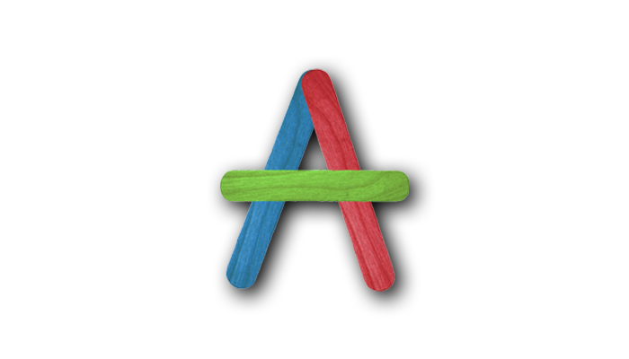

---

title: 英语杂货店   
date: 2019-07-14  
updated: 2020-06-17    
categories: 英语学习   
tags: [英语, 佳句]  

---

一本属于庭勃士的英语百科全书。

<!-- more -->

## A

### About

### How about 🆚 What about

**`What about`: objection or potential problem**

- Honey, I got a new job but I need to move to Beijing.  
 老婆，我刚刚获聘了但要迁到北京工作。
- What about me?  
  那我怎办？！

- Hey let's have a house party tonight.  
  嘿，我们今晚在家里聚会吧。
- Yeah but what about the neighbours?  
  好呀，但是邻居会怎么想？

**`How about`: suggestion or "open" possibilities**
- How about having lunch with us?  
  要不和我们一起吃午餐？

- How about we go on a picnic this weekend?  
  我们周末去野餐如何？（How about 后面可以接句子，What about 不可以）

### Already 🆚 Yet

**Already 多用于肯定句中**

- The staff have already finished the work.

**Yet 多用于疑问句与否定句中**
- Have you finished it yet? 
- I haven't finished it yet.

### Appreciate

后面必须加宾语：
- I appreciate your understanding and support.   
  谢谢你的理解和支持。
- I appreciate it.   
  谢谢了。

### Appearance

We all know that we should never judge a book by its cover, but in reality people do.  
我们都知道不应该以貌取人，但在现实生活中人们还是会这么做（Appearance doesn't tell you everything）。

## B

### Benefit

I usually give people the benefit of the doubt.  
把人往好处想。

### Begin

Well begun is half done.  
好的开始是成功的一半。

## C

### Call

- `正式` Hi, I have a missed call from this numbers. Who am I speaking with? / Who's that?
- `随意` Somebody called me from this number. Who's this?
- `随意` Hey, sorry I missed your call. / I apologize (for missing your call).  What's up? 
- My phone was on silent. 
  I was on anther line. 
  I didn't have my phone with me.
  I was in a meeting.
- This is Tim calling from ABC company. Is now a good time for you for a quick phone interview?

### Catfish

鲶鱼；[照骗](https://www.urbandictionary.com/define.php?term=catfish)。

### Check it out

看看这个：

- ✔️ Hey buddy, check it out.
- ✔️ You wanna check this out.
- ✔️ You wanna check out the catalog / video.
- ❌ Please have a look.
- ❌ Pease take a look.

### China

- National flag: 国旗
- National anthem: 国歌
- National anthem: 国歌
- October break for celebrating Chinese National Day lasts from Oct 1st to Oct 7th.     
	国庆节的假期是十月一日到七日。
- 70th anniversary of the founding of the People's Republic of China.   
	中华人民共和国成立70周年。
- They are very patriotic guys who are willing to give everything for their country.   
	他们非常爱国，愿为国家奉献一切。
- China rocks.   
	中国真厉害。
- China is magnificent.   
	中国宏伟壮丽。
- China is vibrant.   
	中国生气勃勃。
- China is dynamic.   
	中国充满活力。
- Chinese culture is rich and diverse.   
	中国文化丰富多彩。
- China has 5000 years of glorious history.  
	中国有五千年的辉煌历史。
- Chinese people are friendly and hospitable.   
	中国人友好好客。
- Chinese people are open-minded and full of can-do attitude.   
	中国人思想开明，充满积极乐观的态度。
- Chinese food is exquisite.   
	中国美食十分精致。

### Correct

**当回答不完全正确时**

- It's not 100% correct but you're getting there.
- You're pretty close.

- **当回答错误时**
- I'm afraid that's incorrect/inaccurate.
- I'm afraid you're not quite right.

**回答正确时**

- You nailed it.
- You got it.
- That's spot on.

### Cook

`I need to cook.`
- 我要去做饭了。

`Do you like to cook?`
- 你喜欢做饭吗？

`I do enjoy cooking.`
- 我很喜欢做饭。

`Cooking makes me feel relaxed.`
- 做饭对我来说就是休息。

`Are you good at cooking?`
- 你做饭在行吗？   

`What are we cooking?`
- 咱们晚饭做什么？

`I'm going to start making dinner.`
- 我该准备晚饭了。

`Can I take you out for dinner?`
- 我可以请你吃晚饭吗？

`My treat. It's on me.`
- 我请客。

`boxed meal`
- （从餐厅买的）盒饭

`My mom made me a packed lunch` / `My mom packed lunch`/ `My mom prepared me for a brown bag lunch` / `I just brown bag it`
- 外带午餐（bento）
- Have you finished eating?  
  你吃完了吗？
- I'll wash the dishes today, and you can wash them tomorrow.  
  Fair enough. 好吧。
- Warm up leftovers in the the microwave.

### Communication

We had a breakdown in communication.
我们没沟通好。

### Convenience 

Convenience store：便利店（特指 7 × 24）

### Cut-throat

Cut-throat competition：恶性竞争

### Curiosity

I can't simply switch off my curiosity.   
我无法压抑自己的好奇心。by Stephen Hawking（理论物理学家：斯蒂芬·霍金）

## D

### Date

| 介词 | 用法                                                         | 举例                                                         |
| ---- | ------------------------------------------------------------ | ------------------------------------------------------------ |
| `at` | 一个准确、特定的时刻 at precise time                    | at 07:11 at 10 o'clock at noon at noon yesterday at night at midnight at the same time |
| `in` | 一段较长而非特定的时间 in months, years, centuries, long periods | in the morning  in the afternoon  in the evening  in the week in January  in March, 2015  in 2015  in the spring   in the past year  in the 18th century  in the future |
| `on` | 特定日期、星期 at days and dates                        | on Monday on Tuesday morning on 28, April on New Year's Day on Christmas Day on the weekend |

| 英式日期 | 日 月, 年 | 22 July, 2016 |
| -------- | --------- | ------------- |
| 美式日期 | 月 日, 年 | July 22, 2016 |

**Q**：为什么我们用 `in the morning` 、`the afternoon`、 `in the evening` ，但却是用 `at night` 呢？  
**A**：`in` 用在一段较长而「非特定」的时间；`at` 用在一段「特定」的时刻，而 `night` 一般是英语人士表示睡前没事要做的那段「特定时间」，大概就是晚上九到十二点间，所以相较 `morning`、`afternoon` 这些范围较大且较无特定的时间，我们就相对会用 `at night`。

**Q**： 星期、日期、时间点放在一起，先说哪个？  
**A**： Please join us for an invitation-only event at the Bill Graham Civic Auditorium in San Francisco `on Wednesday, September 7, at 10:00 a.m.` 需要牢记的是，星期（day）总是放在日期（date）的前面。而具体时间点，则相对比较灵活，可以放在最前，也可位于最后，但不会放置在 day 和 date 之间。

### Dream

If you don't dream, you might as well be dead.  
做人如果没有梦想，跟咸鱼有什么分别。by George Foreman（职业拳击手：乔治·福尔曼）

## E

### Equal

All men are created equal.  
人生而平等。

## F

### Feature vs Function

- `Feature`：What's the difference? (特点、特征)
- `Function`：What's this? (功能、用途)

### Fine

- Don’t worry about me. I’ll be fine.   
  别担心我了，我没问题的。
- You’re having a fever? Drink a lot of warm water and you’ll be fine.   
  你发烧了？多喝热水，不会有事的。
- I hope the children are all right.   
  我希望孩子们平安无事。

### First

The first step is hardest.   
万事开头难。

### Focuse

Stop focusing on perfect, start focusing on done.  
先完成再完美。

### Food

- Rice vinegar  
  醋
- Ginger  
  生姜
- Hairy crab  
  大闸蟹 
- Comfort food  
  安慰食品（通常令人愉悦但并不健康的）
- Dipping sauce  
  蘸酱；沾料
- Food that reminds you of home. 
  唤起家乡回忆的食物
- Taste buds get duller.  
  味蕾变迟钝。
- Get your hands dirty.  
  把手弄脏。
- Extra ingredients will corrupt the flavor.
  多余的调料会破坏食物本来的风味。

### Forget

Just realized I forgot to add the shipping.

I've learned that people will forget what you said, people will forget what you did, but people will never forget how you made them feel.  
唯有感受难忘怀。by 马娅·安杰卢（Maya Angelou）

## G

### Good night

`Sleep well, Sleep tight.`

- 睡个好觉，睡个安稳觉 

`Sweet dreams.`

- 做个好梦

`Dream about me!`

- 睡个安稳觉

`Night-night!`

- 晚安（亲昵）

### Good bye

`It's been nice talking to you.`

- 翻译：与你聊天，甚是开心（nice 可以换成 interesting / fun / great）。
- 时态：可以把现在完成时换成过去时（It was nice talking to you.）
- 缩写：Nice talking to you.
- 区别：Nice to talk to you 用于对话的开始。
- 区别：Nice talking with you 没 Nice talking to you 常用，
- 示例：Well, it's been nice talking to you, but I really have to go. Talk to you soon.

`It's kind of late already.`

- 天色已晚。

### Good

`I'm good`

字面意思是「我很好」，引申为「我这样就很好了，不用再麻烦了」。比直接说 No 显得更委婉。  

- A: Do you want one more beer?（你想要再喝一杯啤酒吗？）
- B: I think I'm good. / No, I'm good. / I'm good. Thanks.（不用了，没关系。）

## H

### Happy

You make my day!  
你让我太开心了 /  这一天因你而美好。

### Hard work

Charisma is important, but so is hard work. You can't always charm your way through life.  
魅力固然重要，努力工作也同样重要。你不能一辈子都靠卖弄你的魅力过日子（帅又不能当饭吃，但下饭）。

## K

### Kindness

Let's make kindness go viral.  
我们一起让善良蔓延吧。

### Here

`Here it is`
- 「It is here」的倒装：（你要的）东西在这。

`Here we go`
- （就在此时此地）我们出发吧。

`Here goes`
- = Here it goes，一般是说话者开始做一件事时说的，以唤起別人注意，可译做「开始了」、「动手了」等
- "Here goes" he said, and jumped into the icy water（「看我的！」他说，纵身跳进冰冷的水里）。

`Here we are`
- （就在此时此地）我们到了。

`Here you are`
- 解释一：Here, you are served.
- 解释二：Here (is the item which) you are (looking for / requesting).
- 举例一：服务员把面送到你桌上，TA 会跟你说 「Here you are.」（你的面送到了，请您慢用）
- 举例二：出租车司机载你到目的地时，TA 跟你说 「Here you are.」（你去的地方到了）
- 举例三：朋友把东西递给你也说 「Here you are.」（你要的东西在这儿、拿去吧、给你）
- 同义词（近距离）：当店员正在拿**这**东西给你时，TA 会说 Here you go
- 同义词（远距离）：如果你手上正拿着想要买的东西，店员会说 There you go（你手上**那**个就是了）

**倒装**
- 这是汤姆和玛丽  
  Here are Tom and Mary（无代词就倒装）  
  Here they are（有代词不倒装）  
- 汤姆来了  
  There comes Tom（无代词就倒装）  
  There he comes（有代词不倒装）  

### Holiday

- Holidays are for everyone.
  -   Happy holidays! 节日快乐！这是为了顾及不过圣诞节的人们（尤其是犹太人）。因为圣诞节（Christmas）就是基督（Christ）也就是耶稣（ Jesus）的生日，而犹太人是不承认耶稣的。他们年底也有自己的节日。
- Vacation involves traveling.
- Staycation: stay at home 的 vacation.

## L

### Luck

- Goog luck.
- Best of luck.
- I got so/really/super lucky today. 
- I had such bad luck today.
- Better luck next time.
- Any luck? / No luck?   
  怎么样 / 成功了吗？

### Little

- Little by little：循序渐进

## M

### Mind

The smaller the mind, the greater the conceit.  
思想越狭隘，自负越膨胀。

### Money

- Trust me. That woman is a gold digger.   
  相信我，那女人就是个拜金女。
- She's a gold digger. She only wants your money.  
- I got a feeling she's a gold digger.  

## O

### Of course

回答一些理所当然的问题时才能用 Of course，隐含的意思是「还用说吗」。

**错误用法**  

> Do you hear what the boss said?   
> 你有听到老板说什么吗？  
> Of course!   
> 当然（隐含：我怎么可能没听到！）  

> Do you speak English?   
> 你会说英文吗?  
> Of course!    
> 当然（隐含：我怎么不会讲！）

**正确用法** 

> Can you help me?   
> 你能帮帮我吗？  
> Of course!  
> 当然愿意，这还用问吗？（也可以用 Sure / certainly）  

> Do you mind if I open the window?   
> 你介意我开窗吗？  
> Of course not.   
> 当然不会（介意）。  

### Orchard

We found a pick-your-own apple orchard `'ɔrtʃərd`.   
我们找到一个可以自己采摘的苹果园。

## P

### Pardon

- I didn’t  (really / quite) catch that. 我没怎么听清楚。
- I missed that. 我没听到。
- Pardon. / Pardon me. / I beg your pardon. 麻烦再说一遍。
- Could you repeat that? 
- Could you say it one more time?
- Could you run that by me again?
- Could you say that (a bit) louder? 您能说大声点吗？
- Could you say that (a bit) slower? 您能说慢点儿吗？

### Packaging vs Packing

- **Packaging**：产品的包装，例如彩盒包装、气泡袋包装……
- **Packing**：打包。有多少箱，每箱多少件。所以装箱单的英文是 Packing list。

### Post

- I'll keep you posted. 
  我有消息后同步给大家。
- Keep me posted. 
  有消息请同步给我。

### [Present 🆚 Gift](https://www.youtube.com/watch?v=E8CEEWM3i9k)

| Present                                                      | Gift                                                         |
| ------------------------------------------------------------ | ------------------------------------------------------------ |
| 随意                                                         | 正式                                                         |
| 通常价值较小                                                 | 价值可大可小                                                 |
| 在节日送给（家人或好友）的（具象的包装好的）礼物             | 使用范围更广，送礼对象更泛，也可指无形的礼物                 |
| Birthday present `ˈprezənt` 礼物；当下的；在场的 `prɪˈzent` 介绍；颁发；主持节目 | Birthday gift A gift from the gods（神的馈赠） Tim has a gift for `teaching English` / `languages`. (天赋) |

- Gift shopping  
  买礼物（的行为）
- Gift card  
  礼品卡
- Do you have any gift ideas?   
  你觉得送什么礼物好呢？
- I got you a present / gift.   
  我给你准备了礼物。
- I got a present / gift from Adam.   
  我在 Adam 那里收到了礼物。
- You shouldn't have.   
  你不该破费的。
- That's so kind / sweet / thoughtful of you.   
  你也太有心意了。
- It's so beautiful.   
  这个太漂亮了。
- Shall I open it now?  
  我可以现在就打开吗？
- Don't open this until Christmas.   
  千万别在圣诞节前打开哦。

### Precedence

A take precedence over B：A 优先于 B

- Have as much fun as possible at college, but don't let it take precedence over work.  
  在大学里尽情地玩，但别让玩乐优先于学习。
- Business people often think that fluency and communication take precedence over grammar when speaking.  
  商界人士常认为说话时流利程度和表达能力比语法重要。

## R

### Real

Keep it real.   
坚持真实。

### Road

Two roads diverged in a wood, and I took the one less traveled by, and that has made all the difference.
一片树林里分出两条路，而我选择了人迹更少的一条，从此决定了我一生的道路。by Robert Frost

## S

### Save

Seatbelts save lives. Buckle up, every time.   
时刻系好安全带，安全才能时刻在。by《超能陆战队》

### Sick

生病的

- `Sick` 口语中更常用；呕吐的：`seasick` 晕船、`carsick` 晕车、`airsick` 晕飞机
- `Ill` 比较正式

 生病的说法

- `Are you sick?` 你生病了吗？
- `I got a little sick` 生病了 
- `I'm not feeling very well.` 我身体不太舒服。
- `I don't feel well.` 我身体不太舒服。
- `I got food poisoning.` 我食物中毒了。
- `I ate something bad.` 我吃坏肚子了。
- `He is sick with influenza.` 他患了流行性感冒。

易错点

-  `I'm feeling bad, I couldn't make it to the party.` 没法去派对，我感到很遗憾。 

### Sleep

- sleep like a baby（宝宝）

- sleep like a log（木头）

- As soon as I closed my eyes I will fall asleep.   
  我闭上眼睛就睡着了。
  
- I was kept awake by the noise last night.   
  昨晚的吵闹声，吵得我睡不着。
  
- I had a sound sleep and didn't hear anything.   
  我睡得很香，什么也没有听到。
  
- Are you going to stay up late.   
  你打算熬夜不睡觉吗？
  
- I had a pain that kept me awake all night.   
  我疼得整夜睡不着觉
  
-  I'm used to sleeping late.  
  我习惯晚睡
  

### Sorry

- I am terribly sorry, but …
- I'm sorry to inform you that we charge $100 for cancellations.
- I'm sorry sir. It's management policy.

- 为现在的事抱歉：`sorry` + `to + 动词原形` / `that + 子句`
	- I'm sorry to interrupt, but there's a long- distance call for you.（长途电话）
	- I'm sorry (that) I'm late.
- 为过去的事抱歉：`sorry` + `for/about + 动词ing` / ` to have + 动词完成式` / `that + 子句`
	- I'm sorry for calling you a liar.（我曾说你不诚实，真对不起）。
	- I'm sorry to have called you a liar.
	- I'm sorry (that) I called you a liar.
	- I'm sorry to have kept you waiting = I'm sorry to keep you waiting.（由于等候才刚刚结束，当作现在的事并无不可。）

- I'm sorry to keep you waiting. / Sorry I couldn’t be on time.
	- I got stuck in traffic. / Traffic was slow.
	- I overslept. / My alarm didn‘t go off.
	- I misjudged the time.

### Social Media

`Are you on IG?`

- 你玩 Instagram 吗？

`Take flattering photos of you`

- 给你拍美美的照片（照骗）

`The picture/photo certainly/surely doesn't flatter you.`

- 照片没有本人好看。

`Lurking`

- （在互联网）潜水

`Lurkers`

- 潜水者（Ghost follower）；只看不发任何内容的参与者

### Specific vs Specification

- **Specific**：口述的参数或规格
- **Specification**：成册的规格书或参数表

### Supplier vs Vendor

**Supplier**

- A supplier may be the manufacturer of goods.
- A supplier is mostly a middleman who supplies goods or services to the vendor.

**Vendor**

- A vendor sells the goods to the consumer and is the last person involved in the supply chain.
- A vendor is rarely a manufacturer.

## T

### Think

What do you think? ≠ How do you think?

- What do you think?  
  你的想法是什么？  
  你觉得怎么样？  
  你觉得如何？  
  你怎么想呢？  
- How do you think?    
  你怎么思考的？  
  你如何思考的？  
  你如何想到的？  

**例句**

- I love this dress! What do you think?  
  好喜欢这件连衣裙！你觉得怎么样？  
- It looks great on you. Buy it!  
  你穿起来超好看。赶紧买下来！  
  You are broke. Forget about it.    
  你已经破产了。别想了。

### There you go

`You want to know the real reason why I left Toronto? I just couldn’t stand the climate. There you go. It was just too cold!`
- 你想知道我离开多伦多真正的原因吗？我受不了那里的气候。就因为这个。那里实在是太冷了。

`Let me show you how to open your smartphone. Just press… here. There you go. Easy.`
- 我教你怎么打开你的智能手机吧。按一下这里。就像这样。你看，简单吧。

`Keep stirring. Don’t stop. There you go… This cake is going to be delicious!`
- 继续搅拌。别停啊！这就对了… 这个蛋糕肯定会特别好吃！

`Just a few more steps now, one, two, three…. There you go. I knew you could do it!`

- 还有几步路了，一，二，三。太棒了！我就知道你能做到！

### Though

- 礼貌 / 委婉地拒绝某人  
  A: Stay for dinner!  
  B: That looks good. But I already ate. Thank you though.（不过还是谢谢你。）
- But + 想突出的 someone / something + though  
  A: We should (really try to) eat healthy tonight.  
  B: Yeah, we should. But cake though! （但是蛋糕太好吃了，抗拒不了呀！）
- 事物整体不好，但有一点好  
  A: This dress is so expensive.  
  B: But it's so pretty though! It's totally worthy it. You should try it on!

### Thoughtful

He is a thoughtful and caring man.  
他是一个体贴周到的男人。  

It was really thoughtful of you to remember my birthday.  
你真细心，还记得我的生日。  

### Thanks

- Thanks for your understanding.

## U

### Understand

- I didn't (really / quite) understand that. 我不是很懂。
- I didn't (really / quite) get that. 我不懂你的意思。

## V

### Variety

Variety is the spice of life.  
变化是生活的调味品。丰富多彩是生活的情趣所在。Trying different things keeps life interesting. Give anything a go.

## W

### Waiting

- I am waiting for factory to tell me.

### Whatever

- ❓ What do you want to have for dinner? 晚餐想吃什么？
- ✔️ I don't mind. 随便 / 我不介意。
- ✔️ As you wish. / As you like.
- ✔️ Anything is fine. / Anything will do.
- ✔️ Up to you. / It's up to you. 你决定。
- ❌ Whatever = I don't care.

 

###  World

Make the world a better place.
让世界变得更好。

The world is not beautiful. Therefore, it is.
世界并不美丽，但也因此美丽。

### Worry

- I was worried sick about you, why didn't you call?   
	我为你担心得要命，怎么连电话都不打一个？

- Nervous 是 短暂的紧张状态。

### Work

- How was work today?   
	今天工作怎么样?
- Another day, another dollar.   
	和往常一样。

### Word

- I'm a man of my word.  
  我是一个说话算数的人。

### Wonder

- No wonder。  
  难怪。
