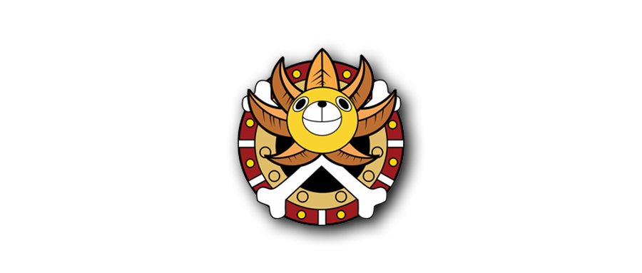

---

title: 看《海贼王》，学英文  
date: 2019-08-20   
updated: 2019-10-25    
categories: 英语学习    
tags: [英语, 动画] 

---

用 [美国 IP](https://tingtalk.me/fq/) 访问 [Funimation](https://www.funimation.com/shows/one-piece/)，即可观赏「英文字幕 + 日语配音」的《海贼王》（One Piece）。

<!-- more -->

## Season 13

### Episode 900

The Greatest Day of My Life! Otama and Her Sweet Red-bean Soup!

Otama's life is saved by Otsuru at her teahouse. The proud Otama finds it hard to take more kindness. The group learns of the Okobore Town - living on the cast-offs of the officials! Then, suddenly, they were attacked by the Shogun’s men!

`cast-off`
- 废弃物

`samurai` ['sæmə.raɪ]
- 武士

`sumo` ['sumoʊ] 
- 相扑

`wrestler` [ˈreslə(r)] 
- 摔跤手

`herb` [ɜrb] 
- 药草；香草

`weave` [wiv] 
- 编织

`sumptuous` ['sʌmptʃuəs] 
- 华丽的；丰盛的
- What a sumptuous treat.

`presumptuous` [prɪ'zʌmptʃuəs]
- 冒昧的；放肆的
- I don't mean to be presumptuous.   
  恕我放肆。

`leftover` ['left.oʊvər] 
- 吃剩的食物；残羹剩饭
- Those who live here get leftovers from the town of officials

`clan` [klæn] 
- 家族；宗派
- A clan called Kozuki had governed this Land of Wano for a very long time.

`vast` [væst]
- 辽阔的；巨大的

`monopolize` [mə'nɑpə.laɪz]
- 垄断；独占

`shogun` [ˈʃoʊɡən] 
- （日本古代的）幕府将军
- A military leader in Japan until the middle of the 19th century

`shrine` [ʃraɪn] 
- 神社；圣地；圣殿

`spoiler` ['spɔɪlər]
- 剧透
- Man, call "spoiler alert" before you say things like that.   
  老兄， 说之前给个" 剧透" 警告好吧。

`rebellious` [rɪ'beljəs]
- 反叛的；叛逆的
- I guess she's heading into a rebellious stage.  
  我想她快到反叛时期了。

`harbor` ['hɑrbər] 
- 港口；港湾；〈比喻〉避难所；窝藏
- Orochi-sama will never allow people to harbor a rebellious spirit!

`tsk` [tɪsk] 
- 啧
- Tsk. Tsk. He must be crazy.   
  啧……啧……他一定是疯了。

`subordinate` [sə'bɔrd(ə)n.eɪt]
- less important or powerful than something or someone
- This is a work environment. She's your subordinate.  
  这是工作场所，她是你下属。
- The minority is subordinate to the majority.  
  少数服从多数。

`thrive` [θraɪv] 
- 繁荣；茁壮成长
- Not only am I surviving, I'm thriving.   
  现在我不但活下来了 还活得有资有色。

`territory` ['terə.tɔri] 
- 领地
- What is the territory to be covered?   
  代理地区包括哪些地方？

`descend` [dɪ'send]
- formal to move from a higher level to a lower one
- As danger descends on Otama moment by moment, will Luffy and his clan be able to reach the enemy's territory?

### Episode 901

Charging into the Enemy's Territory! Bakura Town - Where Officials Thrive!

Otama has been kidnapped by the Gifters! She is taken to a flourishing town called Bakura Town where a creepy-looking Headliner was expecting her. Luffy and Zoro rush to rescue her along with a samurai, Okiku!

`kidnap` ['kɪdnæp] 
- 绑架

`flourishing` ['flɜrɪʃɪŋ] 
- 繁荣的

`creepy` ['kripi] 
- 恶心；可怕；让人起鸡皮疙瘩

`headliner`
- 主角

`brew` [bru]
- 酿造；泡茶
- The wine is brewed from rice.   
  这酒是用大米酿造的。
- He brewed a pot of tea for us.  
  他为我们泡了一壶茶。

`brat` [bræt] 
- (尤指）顽童；乳臭未干的小孩
- You are one spoiled, selfish, little brat.  
  你真是个被宠坏的自私鬼。

`pathetic` [pə'θetɪk] 
- 可悲的
- Honey, you're not pathetic. You're just sad.  
  你不可悲，你只是悲伤。

`gazelle` [ɡə'zel]
- 瞪羚羊

`tam` [tæm] 
- 驯服
- He tamed the lions for the circus.  
  他为马戏团驯服狮子。

`savage` ['sævɪdʒ] 
- 野蛮人；野蛮的
- This isn't the stone age. Animals don't go savage.  
  这已经不是石器时代。动物不会变野蛮的。

`baboon` [bæ'buːn]
- 狒狒
- I caught the brat who they said tamed the baboon.

`ronin` ['rɔnin] 
- 浪人
- A rōnin ("drifter" or "wanderer") was a samurai without a lord or master during the feudal period (1185–1868) of Japan.

`hostile` ['hɑst(ə)l]
- 敌意的；敌对分子

`groin` [ɡrɔɪn] 
- 腹股沟（大腿内侧）

`enticing` [ɪn'taɪsɪŋ] 
- 诱人的
- Her neck was short but rounded and her arms plump and enticing.  
  她的脖子短，但浑圆可爱；两臂丰腴，也很动人。by 《飘》
- This was enticing to Wozniak, even more than any prospect of getting rich.  
  这句话对沃兹尼亚克的诱惑太大了，比变成富人的诱惑还要大。by 《乔布斯传》

`tore` [tɔr] 
- the past tense of tear; 撕开
- Ross tore up the tickets.  
  门票被罗斯撕掉了。

`pincer` ['pɪnsər] 
- 钳子
- The husk is ripped off by powerful pincers.  
  外壳被强力的钳子扯掉。

`invader` [ɪn'veɪdər] 
- 入侵者
- He was fighting off a home invader.  
  他与入室窃贼殊死搏斗。

`weakling` ['wiklɪŋ] 
- 懦夫；弱者；虚弱的人
- Luffy! We don't have time to fight those weaklings!

### Episode 902

The Yokozuna Appears! The Invincible Urashima Goes After Okiku!

As Luffy, Zoro, and Okiku bounce through Bakura Town on Komachiyo’s back, a sumo wrestler comes flying towards them! Interested, they go down to watch a match, but the undefeated Urashima has been expecting Okiku.

`invincible` [ɪn'vɪnsəb(ə)l]
- 不可战胜的；无敌的

`bounce` [baʊns] 
- 弹跳；反弹
- Something tells me he's gonna bounce back.  
  我倒觉得他不会有事的。

`fuss` [fʌs] 
- 大惊小怪
- Don't fuss over such a minor matter.  
  不要为这样一件小事而大惊小怪。

`Observation Haki`
- 见闻色霸气

`Armament Haki`
- 武装色霸气

`Conqueror's Haki`
- 霸王色霸气（Haki of the Color of the Supreme King）

`vibrant` ['vaɪbrənt] 
- 充满活力的
- You are a vibrant, attractive woman.  
  你是个热情洋溢 魅力四射的女人。

`castle` ['kæs(ə)l] 
- 城堡
- castle town：城池

`merchant` ['mɜrtʃənt] 
- 商人
- They were the victims of a dishonest merchant.  
  他们都是奸商的受害者。

`deem` [diːm]
- Find another man that you deem honorable.  
  再找一个你认为品行高尚的人。

`take down`
- 打倒
- As expected, is there no one who can take down Tim?!

`rib` [rɪb]
- 肋骨
- What's for dinner at your place? Rib eye steak.  
  今晚晚饭吃什么? 肋眼牛排。

`engage` [ɪn'ɡeɪdʒ] 
- 雇用；订婚；吸引住（注意力、兴趣）
- You're engaged? To who? To Harlan.   
  你订婚了吗？跟谁？哈伦。
- You know, she got engaged.   
  你知道吗？她订婚了。

`frustrate` ['frʌstreɪt]
- 沮丧

`frontal` ['frʌnt(ə)l] 
- 正面的
- I know what you're thinking. Full frontal.  
  我知道你在想什么。正面全裸。

`frontal lobe`
- 前额叶
- She can't even walk by herself yet. She's got frontal lobe damage.   
  她前额叶受损了 自己连路都走不了。

`thrust` [θrʌst] 
- 刺；塞
- He thrust at me with a knife.   
  他用小刀朝我刺来。

`vulgar` ['vʌlɡər] 
- 粗俗的；庸俗的；低俗的；平民
- Well, it's just vulgar to discuss business at a party.  
  在晚会上谈论工作很不礼貌。

`commoner` ['kɑmənər] 
- 平民
- The reaction was that Hitler was a commoner. He's vulgar.  
  他们的反应是希特勒就是一个平民，一介匹夫。

`tramp`
- 荡妇（公共汽车）；流浪汉；长途步行
- Lady on the streets, tramp in the sheets.   
  出门是淑女 上床变荡妇。
- Real tramps are not beggars.   
  真正的流浪汉并不是乞丐。
- The soldiers tramped along the street.  
  士兵们脚步沉重地沿着街道行走。

`smelly tramp`
- 臭婊子

`bastard` ['bæstərd] 
- 浑蛋；杂种；野种
- How could I ever love that bastard?   
 我怎么会还爱着那个浑蛋？

`topknot` ['tɒpnɒt] 
- 头饰；顶髻；鸟的冠毛

`daring` ['derɪŋ] 
- 勇敢的；大胆的
- It's pretty daring for you.   
  这是个大胆的尝试。

`chop` [tʃɑp]
- 砍；劈；切碎；猪（或羊等）排
- Now chop chop and get me my lobster.  
  那就别傻站着了（快去快去），赶紧给我弄龙虾去。
- Which do you prefer, lamb chops or pork chops?  
  你比较喜欢小羊排，还是猪排？

`fierce` [fɪrs] 
- 凶猛的；暴躁的
- You're the fiercest woman I know.   
  你是我见过的最犀利的女人。

`opponent` [ə'poʊnənt] 
- 对手
- Most often our most challenging opponents is ourselves.  
  很多时候，最具挑战性的对手是我们自己。

### Episode 903

A Climactic Sumo Battle! Straw Hat vs. the Strongest Ever Yokozuna!

Luffy challenges Urashima, the strongest yokozuna in the Land of Wano, to a sumo match! But Urashima is willing to resort to illegal moves. Meanwhile, Holdem tells Otama that he must punish her for a crime she committed.

`climactic` [klaɪ'mæktɪk]
- forming a very exciting or important part of an event or story, especially near the end of it
- This is a climactic moment in the Potter's saga.   
  这是波特传奇中的高潮时刻。

`yokozuna` [,jəʊkə'zuːnə]
- 横纲（相扑比赛的最高级选手）；一级力士
- The highest-ranked-wrestlers, or Grand Champions, are called Yokozuna, and are like gods.   
  这些排名最前的摔跤手们，或者是伟大冠军们，被称作横纲，就像神一样。

`willing` ['wɪlɪŋ]
- Nothing is impossible to a willing heart.   
  心之所愿，无事不成。
- Are you willing to do your part?   
  愿意尽一份力吗？

`resort` [rɪ'zɔrt] 
- a place where a lot of people go for holidays；度假胜地；诉诸；采取
- Under no circumstances should you resort to force.   
  不管任何情况你都不应该诉诸暴力。
- The beggar resorted to me for one dollar.   
  乞丐向我要一美元。

`punish` ['pʌnɪʃ]
- The policeman punished the driver for speeding.   
  那个司机因超速被警察惩罚。
- He was severely punished for his carelessness.   
  他因为粗心受到严厉的惩罚。
- If you do wrong, you deserve punishment / you deserve to be punished.   
  你如果做了错事，就应当受罚。

`commit` [kə'mɪt] 
- 承诺；自杀；做出（错事）；犯（罪）
- He committed suicide.   
  那倒不必了 他畏罪自杀了。
- Trying to protect gaby, Carlos committed murder.   
  卡洛斯为了保护加布犯了谋杀。
- Well, we are committed to each other.   
  我们都忠于对方。

`infiltrate` [ɪn'fɪl.treɪt]
- 渗透；渗入；潜入
- To save Otama, Luffy and the others infiltrated Bakura Town.
- I'll infiltrate the Fellowship of the Sun.   
  我会潜入太阳会。

`stumble` ['stʌmb(ə)l] 
- 绊倒；失足
- A horse stumbles that has four legs.   
  人有失手日，马有失蹄时。
- What happens if she stumbles onto my collection?   
  要是她不小心看到我的收藏品怎么办？

`slap` [slæp] 
- to hit someone with the flat part of your hand 
- Would you slap me? Would you slap me right here in the face?   
  你能打我一巴掌，朝脸上这里打吗？

`dodge` [dɑdʒ] 
- They're dodging their landlords all the time.  
  他们一年到头躲着房东。
- You've been dodging my calls all day.  
  你一整天都躲着我电话啊。

`agile` [ˈæˌdʒəl]
- She is an agile swimmer, full of grace and speed.   
  她是一名游泳健将，泳姿优雅而动作矫健。
- He's so agile, isn't he? He could have been a sportsman.   
  他真灵活呀！他能当运动员。
- He is agile in his movements.   
  他动作敏捷。

`smash` [smæʃ]
- It's going to smash into Earth!   
  它将要撞击地球！
- We heard a smash in the kitchen.   
  我们听到厨房里的破碎声。
- So she smashed in my car windows.   
  所以她来砸烂了我的车窗。
- Change the channel, and I'll smash your face.  
  你敢换台，我就打烂你的脸。

`beat`
- But nothing will beat chocolate flavored Pocky. 但没有任何口味可以击败巧克力口味的Pocky。
- How did you beat the scary Uber? 你们是如何打败强大的Uber的呢？

`magistrate` [ˈmædʒɪˌstreɪt] 
- 地方行政长官；法官
- Each magistrate had a term of exactly 1 year.  
  每位行政官的任期都是一年。
- I don't think it'll help you with the magistrate.  
  怕是会给法官留下坏印象。

`ally` [ˈælaɪ]
- Well, I'm glad we're to be allies.   
  很高兴我们是同盟。
- You've never been an ally, have you?   
  你从来都不是我的盟友 不是吗？
- So, in truth, you have no allies.   
  所以喽 您其实没有盟友。
