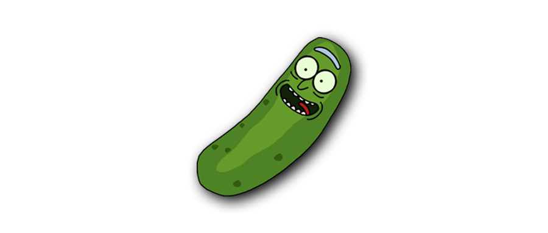

---

title: 跟《瑞克和莫蒂》学英语
date: 2020-01-10  
updated: 2020-01-16   
categories: 英语学习    
tags: [英语, 动画]  
permalink: rick-and-morty

---

Learn English with Rick and Morty.

<!-- more -->

这部地球上脑洞最大的科幻情景喜剧动画（Animated sitcom）于 2013 年 12 月 2 日首播，感叹相见恨晚。

## Learn English

### A

`advertised` 

`as advertised` 名不虚传

- One thing's for sure, you're just as pretty as advertised.   
  不过有件事可以确定，你和传言中一样帅气。

`authority` 

`I have it on good authority` 我敢保证

- I have it on very good authority that your life's in danger. 
  我有可靠消息，你现在有生命危险。

`axe` 裁员；撤销

- Over 500 staff are facing the axe.
  500 多位员工面临被解雇的命运。

### B

`best ` 击败；战胜
- You bested us, party beast. And to that, I doff my cap. 
  败给你们了，舞会魔王。为此，我脱帽致敬。

`bite` 上钩；咬钩；吞饵

-  Okay, I'll bite.
  我会上钩 / 咬饵（哎呀，别卖关子啦，快告诉我为什么。）
- He'll bite. Get him on the phone. 
  他会上钩的，给他打电话。

`bloated` 肿胀的；傲慢的；肚子胀的（吃撑了的）

- His face was bloated. 
  他的脸肿了。

### C

`cyberstalker` 网络跟踪狂
- the use of the Internet or other electronic means to stalk or harass an individual, group, or organization.

`cut class` 逃课

- Apparently, she's been cutting classes all week.   
  显然，她这周都没去学校。
- Dan, you've been sleeping all day, cutting class.   
  丹，你整天都在睡觉和翘课。
- Oh, my god. It was so worth cutting class to hear this.   
  哦，天呐！翘班听到这个消息真是太值得了。
- That's no excuse for talking back to your teacher, or cutting class, or dropping out of school. 
  这些不是你去跟老师顶嘴、逃学或缀学的借口。

### D

`deal`

`A deal's a deal ` 一言为定
- You ripped me off. A deal's a deal. 
  你坑了我。交易就是交易。
- Don't think you'll raise the price, a deal's a deal.
  你休想坐地起价，我们早有协议。
- Do we have a deal? 
  It's a deal. 就这么定了。

`down`

`be down with` 好的；同意；愿意
- Want to go grab some pizza?
  Okay, I'm down with that.
- I am up for movies, but I am not down with your movie choice. 
  我想去看个电影。但是你选的电影我觉得不行。
- We are going to the movies later tonight. Are you down?
  我们今晚晚些时候准备去看个电影。想一起吗？
- I'm down.
  我加一；我也要。

`come down with` 患上（小病）

- I think I'm coming down with flu.
  我想我染上流感了。

`duck` （快速低头或弓身以）躲闪

- Duck! Down! Hold on, hold on. 
  快趴下！快趴下！抓紧！抓紧！
- He ducked in time to avoid a blow. 
  他及时地弯下身，躲开了一击。

### E

`eon` /ˈiːən/ 千万年
- I've been here for eons. 
  我已经存在了亿万年。

`epitome` /ɪˈpɪtəmɪ/ 典型；缩影

- He's kind of the epitome of an American businessman. I really like that. He is self-established. 
  他是美国商人的典范。我真的很欣赏他这点。他是白手起家的。
- That epitome of rugged wildness, the grizzly bear, seems to be the only species other than humans to have invented the comb. 
  粗犷野性的象征——灰熊，看来是除了人类以外唯一一种发明了梳子的动物。
- In Nigeria, maybe now it's changing a little bit, but in Nigeria, eating plain, white rice is the epitome of poverty. 
  现在尼日利亚的情况可能有了一些改变，不过在尼日利亚，吃白饭代表着贫穷。
- Even now in her sixties, she is the epitome of French elegance.
  即使现在已经年届花甲，她仍堪称法国人优雅风度的典范。
- Maureen was the epitome of sophistication.
  莫琳是个典型的老油条。

### F

`finger`  

`put one's finger on sth`

- to discover the exact reason why a situation is the way it is, especially when something is wrong
- There's something odd about him, but I can't quite put my finger on it.
- He couldn't put his finger on the problem.   
  他无法指出问题的所在。
- I can't put my finger on why.  
  看不出问题所在。

`foot`  

`get off on the wrong foot` 出师不利
- Simon and I got off on the wrong  foot but we're good friends now.   
  我和西蒙一开始关系不好，但是现在成了好朋友。
- I know we got off on the wrong foot, but I'm willing to start over.
  我知道我们一开始就处不好，但是我愿意从头来过。
- I finally got a date with that new girl in class but I sure got off on the wrong foot with her: I had car trouble and got to her place almost two hours late.
  那天我终于和班上新来的那个女同学约好了出去玩。可是，当天我的车出了问题，晚了两个小时才去接她，所以我一开头就把事弄糟了。
- get/start off on the right foot
  一上来就一切顺利

`freebie` 赠品

- Freebie thanksgiving dinner is now officially over.   
  免费感恩晚餐正式结束。
- Everybody likes to get a freebie: something given to you to try for free. 
  大家都喜欢拿赠品。

### G

`gaslight` 煤气灯；心理操纵（mindfuck）
- Dont't gaslight me.

`get`

`get off sb's back` used to tell someone to stop criticizing you:

- I'm fine. Get off Rick's back. 我挺好的，别找 Rick 麻烦了。
- Why don't you get off my back! I'm doing my best.
- Get off my back, I didn't sleep last night. / can't you see how
  busy I am. / Don't you have anything better to do ?

`still got it`

- The old guy's still got it.   
  宝刀未老

`go with the flow` 随大流；随波逐流；顺其自然

- Most of them just go with the flow, ending up as something like a gas fitter or a policeman.
- In high school, I went with the flow.

### H

`heist`  /haɪst/ 盗窃（贵重物品）

- He didn't do the heist, I did.   
  偷东西的不是他，是我。

`Hook up`
- Friends hooking up is a bad idea. 
  朋友在一起是件坏事。
- Now Jack's hooked up, l'm single again. 
  现在杰克有了新对象，而我又恢复单身了。
- Are you two still hooking up? 
  你们俩还在一起吗？
- You really wanna hook up with her? 
  你真的很想跟她搞?

### I

`input` 投入物(指信息、资源等)

- we owe it all to everyone's input.
  我们的成功要归功于每个人的付出。
- We listen to our employees and value their input.  
  我们听取员工的想法，重视他们的意见和建议。

### L

`limit`

`push it to the limit` 超越极限

- I desperately wanna push this A12X to the limit.
  我破不急待想把 A12X 用到极限。
- Your expectations are too high so you push yourself to the limit , affecting your state of mind.
  你对自己的期待过高，也把自己逼到极限，这都会影响你的精神状态。

### M

`man` 有足够的勇气（或能力）
- I told him that he should be man enough to admit he had done wrong.
  我对他说，他应该勇于承认错误。
- You can search me if you think you're man enough.
  有胆的话，你可以搜我的身。

`moral`

- The moral of this story is bros before hoes.
  我们能从这件事中学到：兄弟比女人更重要。
  
- Friends 'til the end. Bros before hoes. 
  
  生死之交。绝不重色轻友。

### N

`nip (something) in the bud` 防患于未然
- `nip` 掐断
- `bud` 花蕾
- You gotta nip this in the bud.   
  你得趁早打消这种想法。

### O

`outnumbered` 敌众我寡
- We are outnumbered.
- They still outnumber us 1,000 to one.  
  他们的人数依然是我们的一千倍。

`on the count of three` 我数到三
- On the count of three, I want you to yell "Cheese."  One Mississippi，two Mississippi,  three Mississippi…
  我数到三，请大家喊出「茄子」。
- On the count of three, name your favorite creature.
  数一到三然后说出你最喜欢的东西
- Now I need your help on the count of three. 
  现在大家一起数到三。

### P

`pain`

- It pains me to sell it. 
  卖了它我也很心疼。
- It pains me to bring you this news.   
  我怀着沉痛的心情给你带来这个消息。
- I know that it pains you to see this. But I'm fine, ok? I'm fine. 
  我知道你见我这样很痛苦。但我没事，行了吧？我好极了。

`pass` 推后

- I think I'll pass on the hiking next time.  
  我想远足的事下次再说吧。
- "You can join us if you like." Brad shook his head. " I'll pass, thanks."   
  “你要乐意，可以加入我们。”布拉德摇了摇头。“下次吧，谢谢。”   

`pitch` 推销（说辞）

- She made a pitch for the job but she didn't get it.
  她竭力争取这份工作，但却未得到。
- She pitched her idea to me over a business lunch.
  她在一次吃工作午餐时竭力向我游说她的想法。
- Another client, another sales pitch, another moment of feeling disconnected from people. 
  又是一个客户，又是一通兜揽生意的套话（推销说辞），又是一阵脱离人群的空虚。

`pussy out` 怂了；打退堂鼓；（临阵）退缩

- Don't pussy out on me now.   
  你现在最好别惹恼我。 

### R

`reference` 梗
- Is this a JoJo reference.
  这是 JoJo 的梗。

`root`
- We're rooting for you.
  我们支持你。
- Excellent. Which scientists are you rooting for?   
  太棒了。你支持哪个科学家？

`rut` 车辙；刻板乏味的生活；（雄鹿等雄性动物的）发情期

- You keep going to the same bar. You're in a rut.   
  你每次都去同一间酒吧, 你墨守成规了。  
- Get out this rut we've been in lately.   
  摆脱近期的刻板生活。

### S

`screwdriver` 螺丝刀
- Now hand me that flat-head screwdriver.  
  把扁头的螺丝刀递给我。  

`shoe`

- I don't know when the other shoes' gonna drop.  
  祸不单行，不知道下一劫是何时。  
  咱们躲过了初一但是躲不了十五。  

`shoot hoops` 投篮；打篮球

- Miguel and I go to the park on Sundays, hang out, shoot hoops. 
  我和米格尔周末会去公园逛逛，打打球。
- Hey, Joe! Wanna shoot some hoops? 
  乔伊 你要去打篮球吗？
- Let's go. Time to go shoot hoops. 
  我们走吧，该去投篮了。

`sidekick` 助手；跟班

- Might make me his new sidekick? 
  我会成为 Rick 外公的新宠吗？

`skinny-dip` 裸泳

- They used to take off their clothes and go skinny dipping in the creek.  
  他们以前常常脱光衣服在小河里游泳。

`slippery slope` 滑坡效应
- 指坏情况或恶习一旦开始就很可能变得愈加严重；小时偷针，大时偷金
- Once we start doing that, it's a slippery slope.   
  一旦开了头就刹不住车。

`snap out of it` 振作起来

- I was in a funk, and I couldn't snap out of it.  
  我前段时间比较丧，就是开心不起来。
- Any idea when you will snap out of this?   
  你什么时候能摆脱这种负面情绪啊？

`stem`

- Your future stems from your present.
  未来源自当下。
- I think my problems stem from childhood. 
  我觉得我的问题源自儿时。
- It stems from fear. And fear stems from ignorance. 
  它是在恐惧中产生的，而恐惧来自无知。
-  Embryonic stem cells are particularly powerful.
  胚胎干细胞尤其强大。

`stride` 大步走（a long step）；从容处理

- Beth was struck by how Naomi took the mistake in her stride.
  娜奥米在失误面前表现得处乱不惊，给贝丝留下了深刻印象。
- Some people find retiring difficult, but he has taken it all in his stride.
  有些人感到退休生活很艰难，但他轻而易举地适应了。

`solid`  

`do me a solid` = `do me a favor` = `help me out` 帮我个忙

- Hey, would you do me a solid? 
  Well, what kind of solid?
- Do me a solid and stop talking.
- Could you do me a solid, Dan?   
  Sure. What is it?   
  Could you take this to HR, please?   
- Amy, I need you to do me a solid.
  Shoot. 说吧（交谈时指示对方开始说话）。  
  My husband and I are going to a party tonight. I can’t find a babysitter on such short notice.  
  Say no more（我懂了） . Just tell me what time you need me there. 

`split the difference` 折衷；各让一步

- How about splitting the difference, 2% off?   
  那么我们各自让一半，减价 2% 怎么样？
- Let's split the difference, and then I'll take it.  
  我们折中一下，我就买。

`straw`

- Alma said to me when Theodora didn't come to her party, it was the last straw. 
  阿尔玛跟我说，西奥多拉没有参加她的派对，这是最后一根稻草。
- That's the last straw. I'm just staying at home and watching TV tonight. 
  我忍无可忍了。我计划今晚待在家，看电视。
- Okay, that's it, that's the final straw. 
  好吧，就这样了，我也受够了。

`suffice`  [sə'faɪs] to be enough

- A simple "No, I didn't drink any beer" would've sufficed.   
  你直接说「我没喝啤酒」不就得了。
- A thank you would suffice.   
  说句谢谢就可以了。
- Suffice it to say, I was awesome.   
  只能说，我太厉害了。
- Just suffice to say she was really into you.   
  只能说她对你很着迷。

`Szechuan sauce` 川香酱

- Szechuan \ˈsech-ˌwän\  四川的  
- sauce 酱  

### T

`take`  

`it takes one to to know one` 彼此彼此
- You say that I'm a cheapskate, do you? well, it takes one to know one!
  你说我是个吝啬鬼，是不是？彼此彼此！

### W

`walk over` 苛刻对待
- You mustn't let him walk over you like that.  
  你不能让他那么欺负你。

`way to go` 棒棒哒

- used to express pleasure, approval, or excitement.

`wordplay` 文字游戏；文字梗；双关语

- Okay, I'm sensing this is some kind of wordplay.
  好的，我可以感到这是什么文字游戏的。

## Quotes

Rick: Listen Morty, I hate to break it to you, but what people calls "love" is just a chemical reaction that compels animals to breed. It hits hard, Morty, then it slowly fades, leaving you stranded in a failing marriage. I did it. Your parents are gonna do it. Break the cycle, Morty. Rise above. Focus on science.

Rick：Morty，我不想这么直白地跟你说，但是所谓的「爱」呢，不过就是让动物繁衍后代的化学反应而已。开始让人头昏脑热，然后就慢慢消退，只留给你一段失败的婚姻。我就是这样，你父母也会这样。别重蹈覆辙，应该把精力放在科学研究上。）

You have to think ahead and live in the moment.

在活在当下的同时，也要思考未来（未雨绸缪）。

Your future stems from your present, which, if you're living right, keeps changing. Truth is, anyone that knows how they're definitely gonna die is either boring as hell or about to get shot. People that spend their life avoiding death are already dead (直视死亡，方能解脱).

## References

| 公众号       | WeChat ID    | 作者        |
| :----------- | :----------- | :---------- |
| 英语学习笔记 | ericzenglish | 张海露 Eric |
| Zinger       | arealzinger  | 邱抓马      |

中文解说：[用心创造能让观众融入的故事世界 - 安迪视频](https://space.bilibili.com/357261525)

