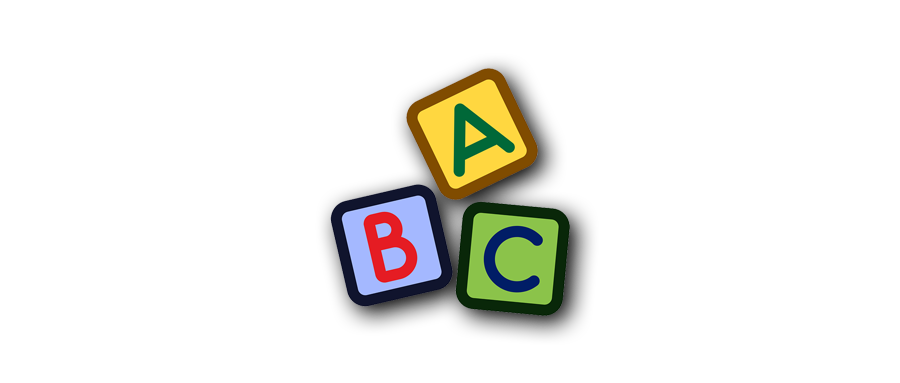

---

title: 如何学英语  
date: 2019-07-16  
updated: 2020-06-03  
categories: 英语学习   
tags: 英语
permalink: tinglish  

---

在学习英语过程中，我想把那些「怦然心动」的瞬间分享给读者们（seize the moment）。

<!-- more -->

## 微信群

添加庭勃士的微信 `804976336`，街头暗号是 `博客 + 英语群 `，邀你进群围观。Let's have fun and enjoy it.

**Group Notice**

- 表达你的想法时少用表情包，只发送有信息增量的消息。
- 尽量用英文（但也不排斥中文）去阐述。说错了也无妨，每纠正一次，意味你就进步一点。
- 请使用英文（半角）标点符号，并在标点符号后面空一格。更多书写细节，参阅这篇 [书写风格指南](https://tingtalk.me/style-guide/)。

**Getting Ready**

- 把群聊设置为「消息免打扰」。
- 把群昵称改成英文名：
    - 拼音起名：俞莲舟 👉🏿 Lianzhou Yu
    - [英文名背后的含义](https://www.behindthename.com/)
    - [英文名大全](https://babynames.net/)

第一次运营这么大的群聊，如有叨扰，请大胆地退出，这并不会影响我们之间的「交情」。

## 方法论

- 我们已经通过**模仿与重复**学会了一种语言：我们的母语。既然你已经学会了母语，那么其实你本身就知道学习一门语言的方法。只是因为母语习得太过自然，我们大都没有认真想过自己究竟是怎样学会一门语言的：模仿与重复是学习语言的唯一有效的方法。所以很多时候，语言学习给聪明人带来的痛苦甚至更大一些，因为他失去了「聪明」所能带来的巨大优势。

- 智商不够不是学不好英语的理由，学英语在大多数情况下和智商没有关系。如果你能够掌握自己的母语，那么你没有理由不能掌握另一门语言，因为这是刻在我们每个人基因里的能力。

- 当我们在学习英语的时候，只是在学习一种另一个国家人人都掌握的知识或技能而已。这种技能一定是能学会的（即与智商无关），否则不会人人都掌握；这种技能一定是有用的，否则没必要人人都掌握。

- 大部分人学不好英语的原因是：自己没有学习英语的需求。如果你做一件事情没有理由，那么你几乎不可能把它做好。外力的压迫永远战胜不了内心的追求。如果考试压力能够让你学得更好，那么不如你干脆报一个英语考试。

- 中学英语学习的主要目的不是学好英语，而是在高考英语中获得一个好成绩。

  - 为了考取高分，不得不对不同频率的英语用法给予了同等重视，甚至对不常见的英语用法给予了更多的重视，最后使用频率最高的日常英语用不出来。
  - 花大量的时间在错误的英语用法上，以至于我们大脑记忆中的用法有一多半都是错误的，脱口而出的自然也是错误的英语。
  - 我们的词汇量被锁定在一个远远不够用的水平。

by [郝海龙](https://sspai.com/series/77/)

### 打造英语环境

- 把手机（微信）、电脑和浏览器的语言全部切换为 English。
- 如果你喜欢某个事物或者人物，就去 Instagram、Facebook、Twitter、Reddit……找相关的频道和群组。兴趣和英语结合，将是最好的组合（或者去考雅思托福，逼着学）。例如我就会搜索 One Piece（海贼王）所有的兴趣社区。

## 查单词

阅读时查词典的正确方法：只查该单词在该语境下的意思。

### 查词工具

**[Saladict](https://saladict.crimx.com/)**：沙拉查词。

- Saladict 是一款聚合了大量权威词典的浏览器划词翻译插件，多个查词引擎可以交叉验证查词结果，助你全方位掌握外文词汇。涵盖中、英、日、韩、法、德、西等，支持网页翻译、剪贴板翻译、生词本、快捷键唤醒查词面板和生成当前页面二维码等功能，可以说完全满足了我对查词插件所有的期望。
- 详情参见 [沙拉查词：浏览器上最强大的划词翻译插件](https://tingtalk.me/saladict/)

**[词根词缀字典](http://dicts.cn/)**

- 官网：dicts.cn
- 支持 Android、iOS 和网页版

**[欧陆词典](https://www.eudic.net/v4/en/app/eudic)**

- **Macmillan English Dictionary 2nd Edition**  
  由简单的英文单词构成的英文释义，同义词丰富。
- **Merriam-Webster's Advanced Learner's Dictionary**  
  例句较多。
- **Merriam-Webster's Collegiate Dictionary**  
  极其专业准确的英英词典，会使用生词解释生词，母语者专用。
- **牛津英汉双解大词典（第二版）**  
  以防看不懂英英词典的释义。
- **Merriam-Webster's Collegiate Thesaurus**  
  最为权威、讲究和全面的同、近、反义词书。
- **听力原声例句（欧路词典自带）**  
  宝贵的例句库，真人原声朗读。

词典下载网址：freemdict.com

### 传统词典

在基础词汇不足的情况下，先使用以下英汉双解词典（推荐前三本）作为垫脚石。当你能够轻松读懂英文解释时，请使用地道的英英词典查单词。

[Oxford Advanced Learner’s Dictionary (OALD)](https://www.oxfordlearnersdictionaries.com/)

- 双语：《牛津高阶英汉双解词典》（OALD 英汉双解版）。
- 特点：历史最悠久，收词最多，用法示例也最为丰富。

[Collins COBUILD Advanced Dictionary (CCAD)](https://www.collinsdictionary.com/)

- 双语：《柯林斯高阶英汉双解学习词典》（CCAD 英汉双解版）。
- 特点：所有的单词都放到句子里去解释。

[Longman Dictionary of Contemporary English (LDOCE)](https://www.ldoceonline.com/)

- 译名：《朗文当代高级英语词典英英·英汉双解》（LDOCE 英汉双解版）
- 特点：如果你查完 OALD 觉得释义不是你习惯的中文的话，可以考虑换 LDOCE 试试。

[Macmillan English Dictionary for Advanced Learners (MEDAL)](https://www.macmillandictionary.com/)

- 双语：《麦克米伦高阶英汉双解词典》。

[Merriam-Webster’s Advanced Learner’s English Dictionary](https://learnersdictionary.com/)

- 双语：《韦氏高阶英汉双解词典》。

[Cambridge Advanced Learner’s Dictionary (CALD)](https://dictionary.cambridge.org/dictionary/learner-english/)

- 双语：《剑桥高阶英汉双解词典》。

其中，*Merriam-Webster’s Advanced Learner’s English Dictionary* 是美式英语词典，其他五本为英式英语词典。如果偏爱美式英语，推荐《柯林斯高级美式英语学习词典》。以上 6 本词典来自 [郝海龙](https://sspai.com/post/60782) 的推荐。

### 网络词典

万事不决问 [谷歌](https://www.google.com/ncr)：google.com

- 查单词：[imitate](https://www.google.com/search?q=imitate)
- 查定义：[define +imitate](https://www.google.com/search?q=define+imitate)
- 查辨析：[imitate vs simulate](https://www.google.com.hk/search?q=imitate+vs+simulate)
- 一图胜千言：输入单词，切换到 Google 图片。参见 [使用 Google 图片搜索学英语](https://imshuai.com/learn-english-by-google-image-search)。

当你在 Google 上搜索单词时，以下词典（Urban Dictionary、VoiceTube）就可能已经出现在搜索结果中了：

- **[市井词典](https://www.urbandictionary.com/)**：Urban Dictionary 的内容涵盖俚语、流行词汇、亚文化词汇或者某种现象的定义。
- **[VoiceTube](https://tw.voicetube.com/definition)**：看影片学英语。上万部 YouTube 影片教材，搭配中英文翻译字幕与英汉字典，轻松掌握日常对话、了解单字的发音与用法。
- **[Dim Sum factory](http://dimsumfactory.com/)**：琳琅满目的广式点心（早茶）对应的英文翻译。
- **[Genius](https://genius.com)**：对歌曲歌词、新闻故事、诗歌和文件等提供注释和解释。
**[DeepL](https://www.deepl.com/)**：自称刷新机器翻译的记录。

## [背单词](https://sspai.com/post/60654)

- 如果你读一篇文章，其中有一半以上的时间花在查词典上，那么我觉得专门花时间背单词效率会更高。
- COCA 20000 算是目前最好的词表选择（之一），[欧陆词典](https://www.eudic.net/v4/en/app/eudic) 搜得到这个词表。
- 目前看来，最具吸引力的背单词方案即严格按照艾宾浩斯遗忘曲线设计的方案。
- 当你看到一个英文单词时，能够立即想到它的一个中文意思，就可以认为这个单词你记住了。
- 一个生词有多个意思，你也只需要记其中一个意思。
- 记忆的要诀是重复，不是单次的时间长： 5 至 10 秒，最多 30 秒以内。
- 记忆单词的拼写确实很重要，但我们不需要专门做这件事，只要你背的遍数足够多，最终你自然而然就能掌握大部分词的拼写。
- 每天复习要求复习的单词，然后一天新背 300 至 400 个单词是个比较好的指标，感到压力大，至少从每天 100 个开始。

**对背单词软件的要求**

- 按照遗忘曲线设计的复习周期。
- 有（自动）发音功能。
- 背单词之前给出一个列表（只有英文单词，没有中文释义），手动删除此次认识的单词（不意味着到了下一个复习周期还认识，因此到下次轮到这些词时，依然要推送）。
- 内嵌词典的生词本功能。

## 多阅读

「读过就算」的阅读方式，最大的问题是：它把你的阅读水平锁死在了你现在的水平。只有你把原来读不懂的东西变成能够读懂的东西，阅读能力才真正能够提高。

### 阅读材料

#### 底子差

阅读成绩低于雅思 5.5 分。从《新概念英语》第三册和第四册的文章开始练起。每练习半本书，再自测一次，如果能达到雅思 5.5 分的水平，就开始阅读下面提到的文章。

#### 底子好

阅读成绩不低于雅思 5.5 分。

一次性挑选 700 词左右且不同领域的 100 篇文章，放在自己最方便获取的地方。

**前期**

- 托福 TPO（Toefl Practice Online）31 至 38 的所有阅读文章，共 24 篇
- 剑桥雅思（A 类） 11 和 12 的所有阅读文章，共 24 篇
-  [经济学人（Economist）](https://economist.com/) 👍👍👍
-  [时代周刊（Time）](https://time.com/)👍👍
-  [ScienceDaily.com](https://sciencedaily.com/) 👍
-  [每日电讯报（The Telegraph）](https://telegraph.co.uk/)

**后期**

- [科学美国人（Scientific American）](https://scientificamerican.com/)
- [金融时报（Financial Times）](https://ft.com/)
- [卫报（The Guardian）](https://www.theguardian.com/)
- [纽约时报（New York Times）](https://nytimes.com/)
- [纽约客（The New Yorker）](https://newyorker.com/)（难度较大）

### 辅助精读

之所以称其为辅助精读法，是因为我们在阅读时，加入了查词典、做句子分析、查语法书等辅助手段。

每篇文章需要读七遍：

- 前三遍解决词汇问题；
- 第四遍和第五遍解决语法问题；
- 第六遍和第七遍体验母语阅读感觉，并彻底读懂文章的字面意思。

这七遍阅读请尽量用整块时间一次性完成，并忽略阅读速度，最好能做到每天练习一篇，这样能起到最佳学习效果，对于养成阅读习惯也会有很大帮助。如果时间不允许，至少隔天完成一篇练习。

#### 第一遍

- 把握文章大意。
- 标记出所有不认识的单词，并尽可能根据语境去推测单词的意思，阅读过程中不要查词典。

在第一遍读完之后，你需要用你手里的词典，一次性查出所有不认识单词的意思，并找一张纸记下来。记的时候，注意几点：

- 如果一个单词有多个释义，只记单词在当前语境下的意思，这需要你通过文章其他内容去判断，看哪一个意思是最顺的。
- 将生词的汉语释义胡乱写在你手里的纸上：
  - 只写释义，不写单词。
  - 释义不要写在单词旁边。

#### 第二遍

- 如果你发现自己第一遍查出来的单词意思有可能并不是该语境下的意思，你需要针对这个释义作修正。
- 一种很常见的情况是，某个生单词你刚刚查过，马上就不记得了。这时首先请你努力想想它是什么意思，因为刚刚查过，有可能能想起来。如果实在想不起来，就在那张写着中文释义的纸上去找。

#### 第三遍

第三遍要做的事情和第二遍一致。我们期待三遍读完之后，你的单词问题应该能够全部解决。至少在读这篇文章的此时此刻，这些词的意思你都知道。

#### 第四遍

从第四遍开始，这篇文章当中已经没有你不认识的单词了。这时，你需要针对读不懂的句子做句法分析。

#### 第五遍

借助《英语阅读参考手册》，彻底弄清楚面前的语法现象，并把这种语法现象和相应的句子记录下来。

如果你查完语法书依然看不懂句子，这时可以去请教周围或者网上一些英语比较好的朋友，让他们给你彻底讲解清楚，并将他们的讲解记录下来。

#### 第六遍

可能还有些磕磕绊绊，但你终于把一篇文章从头至尾都读懂了。

#### 第七遍

等到第七遍的时候，你会有一种幻觉，觉得你似乎没有翻译，直接把英文读懂了。

**第七遍读完之后**

1. 将文章的意思讲给朋友听，或者自己总结文章大意自己读，判断自己是否读懂文章字面意思。对于读不懂的文章，尽量找到自己读不懂的原因，请教周围英语好的朋友。
2. 将生单词全部记录到生词本上（背单词软件），纳入到自己背单词的任务中。
3. 将第五遍阅读查阅语法书或询问朋友之后，记录下来的语法现象也添加到记忆软件中。在背单词时，一并复习。

使用辅助精读法完成 100 篇文章后，可以通过词根词缀巩固词汇，推荐以下两本英英词汇书：
- *Word Power Made Easy* by Norman Lewis
- *Merriam-Webster’s Vocabulary Builder* by Mary Wood Cornog

## 练听力

- [Daily English Dictation](https://www.bilibili.com/video/av24173069)：日常听力训练，找 Coach Shane。
- [喜马拉雅FM](https://www.ximalaya.com/) ：刷牙或洗澡的时候听

## 纠发音

[FanfaniShare](https://space.bilibili.com/346396741)：发音有问题，找 Fanfan 老师。

## 学语法

以《英语阅读参考手册》为主，点此下载 [电子书](https://github.com/xiaolai/a-new-english-reading-handbook)；《柯林斯 COBUILD 英语语法大全》为辅。

访问 tingtalk.me/english-grammar 查阅我平时收集的 [英语语法知识](https://tingtalk.me/english-grammar/)。

**时态**
- 过去时：I had lunch already. 我吃过午饭。
- 现在时：I am having lunch. 我正在吃午饭。
- 未来时：I am going to have lunch. 我（将要）去吃饭了。
- 现在完成时：I have had lunch. 我吃完午饭了。

## 工具集

### [微软小英写作](https://app.mtutor.engkoo.com/englishwriting/)

- 考试分类：覆盖 8 种考试类型，可根据自身需求选择不同评分标准。
- 语法检查：自动检查拼写和语法错误，提供修改建议。
- 图片识别：无须输入文字，可一键上传照片，自动识别作文内容。
- 写作助手：单词不会拼，逻辑连接词用哪个，写作助手全搞定。

详情请参阅：[英语作文难拿高分？「微软小英写作」帮你指点迷津 by SpencerWoo](https://sspai.com/post/58259)

### Grammarly

- 免费版提供语法纠正（Grammar）、拼写纠正（Spelling）和标点纠正（Punctuation）等基础功能。
- 支持 [网页版](https://app.grammarly.com/)、 [Mac 版](https://www.grammarly.com/native/mac)、[Windows 版](https://www.grammarly.com/native/windows)、[Word 插件](https://www.grammarly.com/office-addin) 和输入法。但和 Grammarly 最般配的是，把它装进浏览器里，不管是写邮件、还是在社交媒体上发 Post，它就是你身边的写作小助手。

### [Hemingway Editor](http://www.hemingwayapp.com/)

- 文章可读性：makes your writing bold and clear 
- 错误的拼写，副词、 被动语态
- 冗长的句子
- 复杂的单词

## 小尾巴

### 少儿英文

以友谊、协作和感情为主题的《小猪佩奇》（粉红猪小妹，Peppa Pig）在中国遭到了曲解，但不能否认这是一部非常优秀的情景动画片。你可以通过 [腾讯视频](https://v.qq.com/x/search/?q=%E5%B0%8F%E7%8C%AA%E4%BD%A9%E5%A5%87%E8%8B%B1%E6%96%87%E7%89%88)、[爱奇艺](https://so.iqiyi.com/so/q_%E5%B0%8F%E7%8C%AA%E4%BD%A9%E5%A5%87%E8%8B%B1%E6%96%87%E7%89%88)、[芒果 TV](https://so.mgtv.com/so/k-%E5%B0%8F%E7%8C%AA%E4%BD%A9%E5%A5%87%E8%8B%B1%E6%96%87%E7%89%88)、[优酷](https://so.youku.com/search_video/q_%E5%B0%8F%E7%8C%AA%E4%BD%A9%E5%A5%87%E8%8B%B1%E6%96%87%E7%89%88) 等平台（手机 App 或者智能电视 App）搜索「小猪佩奇英文版」，和小孩一起观看这部可爱的英文学习素材：

- 用语地道，风格幽默，内容贴近日常生活
- 佩奇一家亲密有爱
- 每集一个主题，关键词高度重复（强化记忆）
- 每集 5 分钟，拿得起放得下
- 小孩已经看过中文版，在了解剧情的情况下，会更专注学习动画片中的英语
- 增进亲子之间的交流（少玩手机，多陪孩子）

其实很多小伙伴的单词量都很不少，但就是开不了口，这也许是因为不知道如何把这些单词组合成一句话。那就让我们回到童年，和孩子一起，用最初的方式掌握一门语言。
