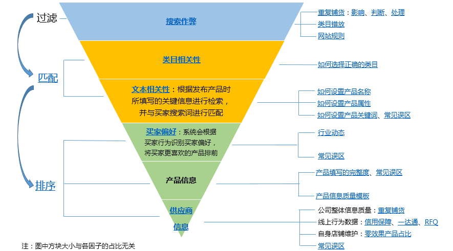

---

title: 阿里巴巴国际站：新手不完全入门指南  
date: 2019-09-06  
updated: 2019-11-19 
categories: 外贸之路  
tags: 外贸

---


要想数据好，信保订单少不了。烧 P4P 的人民币玩家，另当别论。

<!-- more -->


**有问题先找官方**

找小何，输入 `找拍档`，快速接入人工客户。

**关联阅读**

[新手如何运营阿里巴巴国际站旺铺 - 小朱笔记](https://www.zhudc.com/b2b/1935)

[油猴脚本](https://greasyfork.org/zh-CN/scripts/by-site/alibaba.com)


## 搭建国际站

### 平台注册

信息要填写完整，特别是 `管理公司信息` 中填写 `更多经营产品`：让客户知道你的主营产品是什么。

### 装修主页

- 产品分类清晰
- 店招和其它 Banner：1200 × 任意高度 px
- 大海报: 1920 × 任意高度 px
- 增加多语言板块（11 种）
- 公司视频：展示工厂有多大
- 客服入口


## 基础知识

### 搜索排序规则




把关键词放在 alibaba.com 搜索，从搜索结果页找到买家偏好因素。


## 关键词

### 收集关键词

**参考资料**

- [到底该怎么收集阿里巴巴国际站关键词 - 小朱笔记](https://www.zhudc.com/b2b/2449)
- [全自动收集阿里国际站关键词插件 Instant Data Scraper - 小朱笔记](https://www.zhudc.com/b2b/3156/)
- [油猴脚本：阿里巴巴国际站引流关键词批量下载 - Tuff Plus](https://greasyfork.org/zh-TW/scripts/408530-%E9%98%BF%E9%87%8C%E5%B7%B4%E5%B7%B4%E5%9B%BD%E9%99%85%E7%AB%99%E5%BC%95%E6%B5%81%E5%85%B3%E9%94%AE%E8%AF%8D%E6%89%B9%E9%87%8F%E4%B8%8B%E8%BD%BD) 


#### 首选来源

- `关键词指数` - `修改筛选条件`
- `直通车关键词` - `修改筛选条件` 
- `引流关键词` - `修改筛选条件` 每周一次


#### 备选来源

- `访客详情` 客户通过哪个词找到你（在  `全站偏好关键词` 那一栏，有打勾的放大镜标志（search-keyword），代表客户通过这个词找到你）
  - 油猴脚本：[阿里巴巴国际站批量下载访客详情数据 - Tuff Plus](https://greasyfork.org/zh-CN/scripts/408397-%E9%98%BF%E9%87%8C%E5%B7%B4%E5%B7%B4%E5%9B%BD%E9%99%85%E7%AB%99%E6%89%B9%E9%87%8F%E4%B8%8B%E8%BD%BD%E8%AE%BF%E5%AE%A2%E8%AF%A6%E6%83%85%E6%95%B0%E6%8D%AE)
- `营销中心` - `外贸直通车` - `关键词工具` 重点关注同行推词和行业词表
- Alibaba 搜索框联想词和搜索页底部的相关推荐
- 从 URL 收集：[阿里巴巴关键词挖掘秘籍！精准关键词其实不难找 - Park](https://park.mobayke.com/tools/alibaba-keywords.html)


### 筛选关键词

- 去除不想关的关键词
- 把英文关键词翻译成中文关键词，翻译不 出来的，可能是品牌词


## 发布产品

发产品是为了覆盖关键词，满足卖家的要求。

**参考资料**

- [阿里巴巴国际站商品发布指南](https://duang.alicdn.com/html/rkbKGsYLz)
- [商品信息滥发处罚规则解读](https://activity.alibaba.com/pc/02ade148.html) 
- [国际站图片质量规范](https://activity.alibaba.com/pc/588125f6.html)

### 类目

- 选择精准！
- 参考同行：搜索产品，看面包屑导航栏
- 不要放 Other 类目
- 以关键词为导向选择类目（同一个产品，使用不同的关键词，可能类目不同）

### 标题

#### 产品名称

| 2021 Hot | 16GB White |        MP3 Player         | for Women |
| :------: | :--------: | :-----------------------: | :-------: |
|  营销词  | 重要属性词 | 产品中心词/ 近义词 / 变体 | 使用场景  |

- 营销词：Best-selling、New style laptops
- 重要属性词：32GB、9.7''
- 产品中心词：Tablet PC
- 产品中心词近义词 / 变体：red laptops

---

- 不建议拆分核心词
- 核心关键词后置（蜘蛛从后往前抓），但在 for 和 with 前面
- 产品与类目、属性（详情页）匹配，不要欺骗客户
- 不要过长或过短：70 个字符至 80 个字符（12 个单词左右），其中一个原因是移动端只能显示 2 行
- 出现品牌名可能会扣分，但是可以放在 for 后面，例如 waterproof case for iPhone
- 如果必须加符号（`/` `-` `( )`)，请在符号前后加空格
- 同一个单词在标题中只使用一次
- 添加非行业内通用的产品型号，买家搜索热度可能不高
- 检查拼写是否有错误

#### 产品关键词

- 使用收集到的关键词
- 不要使用自造词、内部型号、侵权词

更多细则，见：[产品关键词如何设置？](https://service.alibaba.com/page/knowledge?pageId=127&category=1000059851&knowledge=20143731&language=zh)


### 主图

- 不要盗图
- 白底
- （近似）正方形尺寸，72 dpi 
  - 640 × 640 px：最低要求
  - 750 × 750 px：与详情图的宽度一致
  - 1000 × 1000 px：最大尺寸
- 添加图片守护即可，不用自己加水印
- 第一张主图是重中之重
- 认证：不加
- 放满 6 张

**视频**

产品功能、同行对比、破坏性试验……

- 主图视频：9 秒至 30 秒
- 详情视频：1 分钟至 3 分钟

参考资料：[产品视频拍摄建议](https://activity.alibaba.com/pc/video_regulations.html)

### 详情页

**FAB 法则**

- F（Feature）：产品本身的属性
- A（Advantage)：产品优点或作用
- B（Benefit）：产品给客户带来的利益


---


- 价格
  - 价格合理，参考同行
  - 使用阶梯价提高产品质量分
- 不要只有图片，关键词和参数要用文字描述
- 宽度 750 px，高度 800 px（做成 750 px，就可以和主图通用了）
- 智能编辑：可创建模板，一键同步
- 自定义属性：填满 10 个；不放 MOQ（重复）
- 关联营销：加链接
- 产品信息质量最高 4.9 分
- 产品介绍（60％）
  - 参数表格（4.9 分的必备）
  - 通过成品图、细节图、360 度图展示：材质、包装、卖点
  - 关联产品营销
- 公司介绍（40％）
  - 公司信息
  - 设计研发能力：资质证书、研发车间与流程
  - **证书（必须是自己的，不然后患无穷）**
  - 生产能力：流程、质检、材料与工艺、生产线展示、生产设备清单与最大产能展示
  - 运输方式：出口能力，包装，支付，物流地域说明
  - 服务优势：售前、售后、常见问题、相关提醒
  - 客户合影
  - 合作客户
  - FAQ


### 直接下单品（RTS）

- Ready To Ship：直接下单产品，承接现货需求，超 4 成客户不做定制
- 作用：快速累积店铺数据，提高店铺权重
- 主图：无 logo 和无水印
- 长宽高和毛重：太夸张是不会出现 `Ready To Ship` 的标识
  - 按件卖：按单个产品的长宽高
  - 按批卖：按一批的长宽高
- 交货期（15 天之内一定要发货）


#### 运费模板

入口：交易管理 - 运费模板（平台上线 + 开通信保）


##### 普通货物

- 不能选仓到门：全球化妆品专线
- 不能选仓到门：全球普货专线（仓库在上海）
- 不能选仓到门：全球电子烟专线
- 不能选自有物流：除非你对货代渠道非常熟悉


##### 带电货物（无 MSDS）

- 勾选仓到门：`20 kg 以上` 全球重货专线（HK DHL）`支持弱磁产品，例如蓝牙音箱和蓝牙耳机`
- 勾选仓到门：`20 kg 以下` 全球 3C 专线（HK DHL）`支持弱磁产品，例如蓝牙音箱和蓝牙耳机`


##### 带电货物（有 MSDS）

- 勾选仓到门：全球重货专线
- 勾选仓到门：全球 3C 专线
- 勾选仓到门：无忧专线（不接带磁）：只能去美国
- 勾选仓到门：Aramex
- 勾选仓到门：其它带 `香港` 或 `HK` 字样的


**其他设置**

- 运费类型：阿里物流价
- 发货地邮编：不要写 518000，尽量具体
- 调价率：110 ~ 120


**发货**

- 发货时按照客户选择的快递承运商发货
- 超过 ￥5000 要报关
- 包裹丢失是按申报金额索赔的
- 快递承运商量体积，卖家付快递费，才会出货


## 店铺运营

**RFQ**

- 前三条：客户单独收到邮件
- 后七条一次性打包给客户
- 主动搜索 RFQ


**访客营销**

- 推送一些未发布产品（例如仿牌产品）
- 查看营销管理，检查客户是否已读，查看旺旺是否在线


**星级提升**

- 询盘 24 小时内回复
- 旺旺 1 小时内回复（cn 除外）
- RFQ 报完
- P4P 操作
- 买家评价（差评无法删除）


**侵权**

- 产品管理 - 全文工具搜索：Apple
- 删干净：下架也会继续扣分，要删除，回收站也要删除


**其他**

- 看了产品详情页才算一个访客
- 下架零效果产品（90 天到 180 天），慢慢删除，慢慢替换
- 右上角的活动中心可能有优惠券
- 产品诊断优化，剔除重复铺货：图片相同、标题相同


## 免费营销

### RFQ

#### 核查 RFQ

- 假询盘：没有遵循英文的书写规范，例如没有在英文标点符号（`.`、`.`、`?`）空一格，可能中国人发布的虚假询盘。
- 短标题：如果是非产品标题（潜在客户自己写的），是一个比较好的 RFQ。
- 长标题：如果是产品标题，把标题中前 50 个字符（字母 + 空格）放在 alibaba.com 搜索，就能找到该产品。


#### 如何回复 RFQ 

- 产品名称：工厂优势、出货快、价格
- 产品细节：生产力、认证、物流、支付
- 产品图片：清晰
- 价格详情：用标题搜索产品，对比同行，价格适中
- 报价补充信息：包含 2 ~ 3 个问题
  - 物流方式
  - 支付方式
  - 下单时间
  - 下单量
  - 采购金额
  - 是否在国际站采购过
- 名字 → LinkedIn
- 手机号码 → WhatsApp
- 电子邮箱 → Skype
- 名字是否符合所在国家的命名规则
- [企业诚信查询](https://cha.cheng.xin/)
- 可能是垃圾询盘的国家：中国，印度，尼日利亚，香港，美国


#### 用邮件跟进 RFQ

Replied your buying lead posted in Alibaba and here write to check details with you.


```
Dear XXX, 
This is XXX from XXX, which specialized in 行业 for 多少年. 
So Glad to get your request on Alibaba About XXX (标题长的时候：复制客户重点关键词，标题不长的时候：粘贴客户发 RFQ 的标题)，We can do it!!! 
You have a good taste, This item is our hot selling by 2015 and will be trending product in 2016 also. 
Price is XXXusd (在后面列出这款产品与同行不一样的工艺、质量等，让客户知道为什么你报这个价格） 
Shipping to USA (国家）Door to Door service cost XXXusd. 
Do you need sample first?? 
Your reply will be much appreciate. 
Best Regards 
XXX
```


### 橱窗

橱窗只是一个排序加权的工具，我们需要去选择本来就有一定数据的产品，这类商品本来就具有一定流量，再结合橱窗推荐，才可以实现效果最大化。

- 设置主推产品为橱窗
- 如何查看其它店铺的橱窗产品：进入店铺主页 - Product - Top Picks
- 制作橱窗产品表格：
  - 产品图片
  - 产品标题
  - 产品关键词
    - 查：搜索指数有热度
    - 查：排名查询工具


### 邮件营销

> [官方教程](https://activity.alibaba.com/waimaoquan/kqfkyx.html)

属于 EDM 邮件营销的一种。

每天（美国时间）每个账号可以对 20 个访客申请营销。每个访客供应商最多发送 3 封邮件，且两封邮件之间间隔不少于 30 天。

如果多个供应商对同一访客申请营销，优先发送历史营销效果好的供应商邮件，同等条件下，按时间先后顺序发送。

**发起聊天**

1. 勾选 `已营销访客` 
2. 点击 `营销内容`，即可进入聊天窗口，查看客户信息
3. 加为客户（防止被同事抢走）


## 付费推广

### 直通车

**参考资料**

- [阿里巴巴国际站直通车 (P4P) 操作思路 - 小朱笔记](https://www.zhudc.com/b2b/2463)
- [直通车日常需要做哪些工作 - 阿里运营日记](https://mp.weixin.qq.com/s/WdcSpXIuLgJHLVfu_9K8iQ)


#### 排名原则


推广评分（⭐⭐⭐+） × 出价

**0 星至 2 星的升星攻略**

- 类目放正确
- 关键词相关产品
- 产品信息质量（100％）
- 是否有投诉或侵权

**3 星至 4 星的升星攻略**

  - 核心：提升买家偏好度
  - 关键词和标题、图片匹配度最佳
  - 图片清晰，产品突出
  - TM 在线，信保亮灯，及时回复率，MOQ & 价格优势，交易属性
  - 产品要有好的排名位置，曝光
  - 橱窗争取站内好的排名
  - P4P 优先推广 3 星至 4 星的产品，来获得大量曝光（试推，先烧再省）


#### 展示原则

**alibaba.com（PC 端）**

1. 顶展
2. P4P
3. P4P
4. P4P
5. P4P
6. P4P
7. 橱窗（有限）或者自然排名（从第 7 到第 50）


**m.alibaba.com（移动端）**

1. 顶展
2. P4P
3. P4P
4. 自然
5. P4P
6. P4P


**App**

1. 顶展
2. P4P
3. 自然
4. 自然
5. 自然
6. P4P


**offer.alibaba.com**

- 来自 Google 的客户，此页全部都是 P4P 产品


#### 扣费原则

- 扣费金额 =（后一名的出价 × 后一名的推广评分）/  我的推广评分 + 0.1
- 扣费 ≤ 出价
- 总扣费 ≤ 预算
- 扣费只发生在有效点击的情况下（中国大陆和尼日利亚不扣费；恶意点击和重复点击不扣费）


**推广策略**

- 建议把自己最想推广的产品设置优先推广。
- 不推广一星词和二星词
- 关键词按照热度分组：行业词（高热度）、核心词（中热度）、精准词（低热度）


**出价技巧**

- **量力而为：**在确保推广时长足够长的范围内出价
- **精准词争取前五：**例如 microfiberbeachtowel, 300 kg weighingscale, 12 V car charger……
- **泛词（行业大词）切勿为了抢前五而价格推太高：**例如 towel, flooring, led light, book……


**出价时间**

- **更新时间：**价格在北京时间下午 3:00（夏令时）或 4:00（冬令时）更新
- **价格趋势：**因此在时间更新后直通车关键词的价格就会开始飙高，而在早上上班的时候价格就会降下来。
- **调价时间：**刚上班、下班前（17:00 后，或者更晚）、睡觉前


### 顶级展位

- **视频**
  - **提前制作：**审核需要 1 个工作日左右
  - **内容：**产品介绍或者公司介绍，或者两者结合，突出核心卖点
  - **比例：**16:9（横屏）
  - **画质：**≥ 480p
  - **时长：**20 秒到 45  秒
- **封面：**
  - **内容：**突出核心卖点，吸引买家点击
  - **像素：**600 px × 338 px
- **广告语：**
  - **内容：**体现公司或产品优势
  - **字符：**36 个字符以内


**产品操作记录查询工具**

1. 登录主账号
2. 检查回收站
3. 打开 [产品操作记录查询工具](https://hz-productposting.alibaba.com/product/oplog/operationLogView.htm#product)

## 信保订单

样品单最高不能超过 500 USD。

- **支付方式**：
  - T/T 手续费：可能卖家承担，提醒客户支付，等款到了再发货（水单可能作假）
  - T/T：1029 账号支付时，强烈建议使用美元支付并且指定收款币种为美元，避免汇款过程中产生汇损
  - 卖家信用卡支付不能超过 12000 美金

- **买家邮箱**：一旦填写无法修改
- **发货日期**：填写发货日期时，请将周末和节假日时间加入，且填写确定的日期数，预付款到账前，供应商可直接修改；预付款到账后，供应商提交修改申请，买家确认。

- **出口方式**：
  - 出口方式一经选定，在付款前只可修改一次，付款后不能再修改
  - 订单总金额 5000 美金以上，必须选择 `通过一达通代理出口`，且发货需关联一达通委托单
  - 一达通：1.5% × 美金 = ¥，最低 200 ，最高 600，每次优惠 150，只能国内对公账户。不做退税，能不走，就不走。

- **订单备注：**有国际标的，写国际标准，无国际标准的，可参考行业通用标准或合格率或。总之，越明确越好。


**修改订单**

- 买家信息：买家邮箱一旦下单就不可修改，买家姓名在支付前可修改，其它买家信息全流程可修改。
- 出口方式：出口方式在支付前可以修改一次（暂不支持多次修改），一旦支付则无法进行修改。
- 预付款：预付款收齐前可修改全款和预付款金额。预付款收齐后则无法修改预付款金额。金额改小时，不可低于已经实收的金额。
- 尾款：尾款未收齐前可以通过修改订单总价来调整尾款金额。尾款收齐后则无法修改订单金额。金额改小时，不可低于已经实收的金额。
- 验货服务和产品质量要求：预付款收齐前支持修改，一旦预付款收齐则无法进行修改。
- 其它内容：在订单完结前都支持修改。


**信用卡支付失败怎么办？**

买家账号由于风险控制原因，故不支持使用信用卡支付，建议您让买家尝试更换其它支付方式操作：

- 美国买家：T/T 或 eChecking
- 法国和德国买家：T/T 或 SEPA
- 巴西买家：3000 USD 以下可推荐使用 Boleto
- 其他买家：仅推荐 T/T 交易方式


关联阅读：

- [信用保障常见问题](https://bao.alibaba.com/faq)
- [信用保障订单的交易服务费和提现手续费](https://service.alibaba.com/page/knowledge?pageId=127&category=9930531&knowledge=20302516&language=zh)


## 出口方式

开通入口：`交易管理` > `交易服务准入`

### 便捷发货

自主选择出口方式，订单金额要求小于 5000 美金。


### 自营出口

- 企业自身抬头报关出口
- 一般纳税人满 2 年以上
- 近一年有自营出口退免税经验。若无退税经验，您可通过购买阿里财税服务准入自营出口


### 一达通代理出口服务

收取基础服务费 200 RMB 至 600 RMB

一达通抬头报关出口

- 境内发货人：一达通 
- 生产销售单位：企业


**开通条件**

- 营业执照

- 进出口权（对外贸易经营者备案登记表）

- 出口退（免）税备案表（[办理流程](https://service.alibaba.com/page/knowledge?pageId=127&category=9214231&knowledge=24274076&language=zh)）：盖公章并手写一句话：以上信息与税局备案信息一致

  

#### 2 + N

适用于贸易型、生产型，不用验厂验税务

流程：下单 - 通关 - 外汇 - 代理出口货物证明 - 申报退免税 - 结算

**自行退税**，开具代理证给企业，企业财务去办理退税


#### 3 + N

工贸一体，需验厂验税务

代理退税，一达通融资垫税，您开票给一达通，由一达通代理您申报退税


## 结汇


香港花旗、新加坡花旗、香港中行、香港星展、香港摩根、新加坡摩根是可以入这
9大币种的 SGD/JPY/EUR/GBP/CNY/CAD/AUD/HKD/USD


## 提现

信用保障订单在买家款项挂账后在信用保障额度充足的情况下即可操作提现，无需等到买家确认收货。

[信用保障订单的交易服务费和提现手续费](https://service.alibaba.com/page/knowledge?pageId=127&category=9930531&knowledge=20302516&language=zh)

[信用保障卖家首页](https://bao.alibaba.com/faq?spm=a272g.13281213.jzi7zw3e.1.56901ef3kZrS9R)


---


**一些吐槽**

- 阿里巴巴（1688.com）：不登录不给看产品 / 搜产品 / 卖家店铺首页。

- 阿里巴巴国际站（alibaba.com）

  - （大概）每隔 1 个钟就要重新登录（包括阿里邮箱），提示 `Your session has timed out. Click OK to login again. (您的登录已经超时，请点击确定重新登录。)`
  - 已读的 RFQ 的显示未读。

  