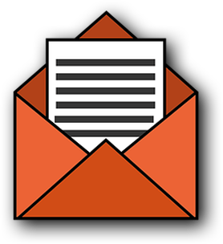

---

title: Cold Email（开发信）撰写指南   
date: 2019-11-11  
updated: 2019-12-31  
categories: 外贸之路
tags: [外贸, Email] 

---



如何写一封能收到回复的开发信？

<!-- more -->


## 方法


### 内容

这封邮件对客户有什么帮助？这是一个值得深思的问题。

- Background research 的时间要充足，才能打动高质量的潜在客户。
- 放弃模板，例如 To whom it may concern（敬启者）；对邮件进行私人订制。
- 第一封开发信，不是以卖东西为目的。真诚些，摒弃虚头巴脑的话术，用专业知识展示对客户的价值并建立联系。


**切入点**

- 从哪里得到客户的信息
- 我是谁，来自哪个公司
- 公司是做什么产品的（针对客人用得上的产品）
- 产品参数
- 产品的优势：专利、证书或者畅销的市场
- 合作过的大客户：供货能力和质量以及信誉上没问题
- 设计开发能力：能够满足他们的需求
- 诉求处理速度：表明合作有效率
- 交货时间以及付款方式
- 新客户的优惠以及能够给予哪些支持


### 行文

#### 拼写

出现错别字，是不能容忍的，让收件人看到你的细心。

- 注意专有名词的写法，发送之前检查一遍错别字和语法。
- 使用 [英文标点符号](https://TingTrade.me/style-guide/)，并在后面空一格（括号首尾空一格）。


#### 简单

客户「扫描」邮件的时间只有几秒钟，用通俗的英文（plain English）帮助客户聚焦你要传达的内容。不要「秀英文」，Keep it short & simple. 因为收件人的母语不一定是英语。

> We supply tomatoes for MyLife Inc. with high quality and competitive price. Hope to cooperate with you! （句子简单，但内容空泛）

还有，一封邮件一个主题内容。说不完的话，在末尾留个尾巴，不让下一封邮件无话可说，或没话找话说。


#### 排版

- 不用衬线体（sans-serif），多用非衬线体，例如 Arial。
- 不要花花绿绿的颜色，只留黑色（加粗），灰色（正文）和品牌色。
- 用 CAPITAL（大写）或**加粗**显示需要强调的信息，例如你的产品。
  LARGEST BUYER of Smartphone
- 使用列表（Ordered List or Unordered List）陈述 3 到 6 个 USP（Unique Selling Point）
  - TWO SWAROVSKI LICENCES.
  - Jewelleries made with Swarovski crystals, sterling silver 925, zirconia and pearl.
  - More than 120 new arrivals monthly, as well as 15,000 available designs.
  - NO nickle, lead and cadmium (REACH No. 1907/2006)


> 参考来源：[如何从外观上写一封漂亮的开发信和邮件 by Master 蔡浩](https://mp.weixin.qq.com/s/A_C4rTrnog7kLapuem5C3Q)


####  语气

根据客户的语言风格调整自己的内容，客户喜欢寒暄就跟着问候，喜欢单刀直入就要言简意赅。


**语气委婉**

Could you please help to give me a reply today?

**多用被动语态**

被动语态：既定的事实和一些已经达成的决定。突出特点，表现专业性。
✔️ Samples will be sent to you tomorrow.

主动语态：释放情感，展示温度，比如说写延期邮件的时候，用主动语态才更能体现出你的歉意和真诚。
❌ We'll send you the samples tomorrow.


### 其他

- 用公司的企业邮箱或国外邮箱（Outlook、Gmail……）。

- 发邮件的时间选在客户当地的上班时间（借助定时发送功能）。
- 第一次联系客人的时候尽量使用纯文本格式，不要出现图片、链接和附件（防 Spam）。
- 工作邮件少用 `I`、`my`、`me`，多用 `we`、`us`。


## 主题

**假设**
- `TingTrade Inc. ` 我的公司，卖番茄（Tomato）的。
- `MyLife Inc.` 我的（My）老客户，美国第二大番茄零售商。
- `NewLife Inc.` 潜在的新（New）客户。


**通用模板**

`NewLife Inc. / MyLife Inc. Vendor - Tomato / TingTrade Inc`

- `NewLife Inc.` 提及潜在客户的公司名，表示这不是群发邮件。
- `MyLife Inc. Vendor - Tomato` 表明我们是美国第二大番茄零售商的供应商。
- `TingTrade Inc` 表明发件人是谁。


**随着内容更换**

去掉多余的 Re。

1. Re: School Bag Offer - 20170314
2. Re: Sale Note for School Bag + 合同号
3. Re: School Bag - ready for shipment.


**其他 Subject**

- 到客户网站上找素材  
  假设网站标语 / 核心价值 / 总裁致辞是 `Secure Your Daily Work`。Subject 可以是: Secure Your Daily Work, can we involve?  
  
- 以客户利益为目标，越具体越好  
  NewLife Inc. - Economy safety products get revenue 20% up - TingTrade Inc.
  
- 以主打产品为标题，一目了然  
  Purchasing - Featured products / Safetyvests - TingTrade Inc.
  Hot-Selling Jewelry from VIP Customer of SWAROVSKI
  
- 以市场信息为标题  
  TingTrade Inc.: Nonwoven material rise in April
  
- 直接表明意图  
  How could we be your possible vendor - TingTrade Inc.


## 正文


### Salutation

- Hi Tim, 
- Dear Tim,


### Greetings

- Good day.  
  Nice day.
- Greetings.  
  Warm Greetings.
- How is going?  
  Hope you are doing well.  
  Hope you are good.  
  Hope all fine with you.   
  I trust all is well.  
  Trust you are well.  
- It is nice to write to you.
- Thanks for your reply.


---


- Kindly bear with us.
- Sorry to miss your email.
- Got your email with thanks.
- I will revert as soon as I reach my office.
- Currently I'm at the fair. Will get back to you by tomorrow.


### Body

- This is Tim from `***` China. 
  除非公司是行内巨头，不然你的名字比你公司名字更重要。

- We're glad to hear that you're on the market for...  
  Glad to hear that you're on the market for outdoor gear. We specialize in this field for several years.

- Here are details:   

- Below you will find more Info and details that we need from you.

- To quote better, would you please give me details:   
  Could you please send me the quotation with the details as below:  
  We have a few questions and will appreciate your help:


Remarks

- Price will be adjusted when exchange rate fluctuates more than 3% (based on USD:RMB = 1:6.85).
- Validity for this offer is one week. （慎用，万一客户度假回家，报价可能已经过期了。）


### Attachment

记得修改附件的名字，与正文所述一致。

- Attached is `***`.

- I’ve attached `***` with…

- Please `have` / `take` a look at the attached `***`.

- The `***` you asked for is attached.

- Please refer to the attached `***` for more details.

- The attached `***` includes…

- Let me know if you have any questions about the attachment.

- Relevant information is in the attached file.

- When you review the attached `***`, you will see…

  - Please check the attached catalog and let me know what products meet your interest.


### Ending


使用号召性用语（Call To Action）结尾，客户阅读到最后一句话时，明确知道自己要干什么。

- REPLY to get catalog and free samples!
- FREE SAMPLES will be sent for your evaluation!
- More photos and information can be updated upon receipt of your reply.
- Please copy and paste the questions and answers back to me.
- Thank you for choosing us. I would be glad to answer any questions.  
- Any inquiry or requirements will get our prompt attention. 
- Please further advise.  
  Please let us know if you would like to take the matter further.
- I value your feedback, so let me know what you think.  
  Let me know if you have any questions or suggestions. 
- Waiting for your details.  
  Looking forward to hearing from you  
  Looking forward to your response  
  Hope to get your updates soon.  
  Please keep us updated.  
  Kindly give us your ideas, please.  
  Will appreciate your quick response.  
  Any feedback will be much appreciated.
  Always happy to hear from you.  


注意：

- 少用 Please："Please..." 是祈使句，带着命令的口气。我有求于你，你这么做就能够让我高兴。


### Closing

- It was a pleasure doing business with you.
- All the best,
- Best Regards,  
  Kind regards,  
  Regard with thanks,
- Thank you for taking the time, 
  Thank you for your valuable time.
  Thank you in advance for your time,
  Thanks in advance and have a nice day,
- Many thanks,  
  Many thanks and look forward to hearing from you,
- Thanks and best regards,
- I really appreciate your support!
- Sincerely,  
  Yours sincerely,
- Cheers,  


### Signature

```markdown
Tim
- email: tim@tingtalk.me
- WhatsApp: +86 156 1024 1024
- ……
```


## 模板

尽可能少用模板，以下仅作为展示。

### 汪晟

Hi John,
My name is Mike, sales manager at ABC Company based in Hangzhou, China.We specialize in manufacturing XXX. 

I‘ve been following your company for some time now. And would like to discuss the possibility of xxx. 

Don't want to bore you with too much detail here. Relevant information is in the attached file.


---


I know you are busy, so please allow me to get straight to the point.
I want to pitch you our product with XXXXX. After researching your product line for like 40 minutes, I believe we can definitely make you more money.
Here is a sneak peek of my plan (see, I don't want to waste your time.)

1. 
2.  
3. 

Let's keep the ball rolling if you are interested.
Thank you for your time.


---

Hi John,
My name is Mike, sales manager at ABC Company.
We are going to hit hard in the US market this year with our newly released product line xxx. I've done my research. You are exactly the type of local partner we are looking to work with.
Will you have 6 minutes for me next week for a quick call?
Talk soon.


---


Dear Tim,

Please allow me to introduce myself. My Name is `***` and I manage the sales department here at `***` company.

Thank you for taking the time to review our products. Are there any in particular that you are interested in?

Attached is our latest brochure and price list. I would recommend you take a look at `***` and `***`, both are very unique and in high demand.

Any feedback you can give would be greatly appreciated. 

Let me know if you require samples.

Many thanks,

Jadon


---


`Subject` Hot-Selling Jewelry from VIP Customer of SWAROVSKI

Dear xxx Jewelry,

Glad to know you’re co-branding partner with Swarovski, and have a large quantity of stock!

As the LARGEST BUYER of Swarovski crystals (Dongguan 2014), we produce fashion jewelries since 1999, with competitive price.

- TWO SWAROVSKI LICENCES.
- Jewelleries made with Swarovski crystals, sterling silver 925, zirconia and pearl.
- More than 120 new arrivals monthly, as well as 15,000 available designs.
- NO nickle, lead and cadmium (REACH No. 1907/2006)

REPLY to get E-catalog and FOC samples!

Thank you,  
Master


---


Dear Christian,

Thanks for your reply.

This is Master from xxx Jewellery (LARGEST BUYER of Swarovski Crystals 2014 Dongguan).

We have full confidence in supporting you to develop your new customers. We proudly make fashion jewellery **since 1999 and 100,00+ existing designs**.

To quote better, would you please give me details:

- Target market
- Retail price range
- Prefer plating color

Waiting for your details.

Best regards,  
Master


---


Hi Tim,

I know you are busy, so I’ll just cut my bullshit and get straight to the point.

Find happy, find boloparty here, exporting creative and fantastic `***` product to make you different in 30 mins.

Call me, let’s talk details.

Jadon


---


Hi Tim,

I know you are busy, so please allow me get straight to the point.  

I want to pitch you with our product `***`. After researching your product line for like 40 minutes, I believe we can definitely make you more money.

Here is a sneak peek of my plan (see, I don’t want to waste your time.)

Let's keep the ball rolling if you are interested.

Thank you for your time.

Jadon


### 索菲

以下表达来自 [索菲外贸笔记的博客](https://sophienotes.cn/new-prospect-case/)，内容经过删改。


Hi Jadon,

Tim from `***` China. Hope this email finds you well.

Consolidating your purchases from China has never been easier, we have completed numerous projects in Europe and you may even know some of the brands we've worked with.

There are a wide range of variety of `***` can be offered for your budget. What will the sound of your brand be? Find me on WhatsApp: `+86 *** **** ****` and let's discuss more.

Best regards,

Tim


---


Hi Jadon,

Tim again. Last time I mentioned we can offer the `***`.

Trust you're very busy, but I've been wanting to have a quick chat about bringing `***` presentation to you.

If 10 minutes of your time isn't too much to ask, then maybe we could jump on a quick call to discuss this?

Best regards,

Tim


---


Hi Jadon,

Based upon your `***` you're a big fan of `***`, inspiring me to reach out to you again.

You know we have been also authorized to produce some `***` for `***`.

Please see attached the photos for your reference.

Best regards,

Tim

 

---


Hi Jadon,

Good day.

I'd like to share you with the inspection report for 20 kinds of `***` shipped recently.

Thank you for taking the time to read my email. Really hope we cross paths in future.

Best regards,

Tim


---


Hi Jadon,

Thanks for your feedback.

Many of our current customers have used different suppliers in the past. Despite how much I really want your business, I'm sincerely happy for you & your company and how your vendors have performed.

When struggling to overcome delivery, prices etc challenges, please come to us for a quote or solution. You can always depend on our quality service.

I will keep updating you our new arrival of `***` if it will not bother you.

Best regards,

Tim


I'm happy that you have a good relationship with your current vendor already. Does they bring you 100% the results you are expecting or are there still areas where value can be added?


At this point, I'm not asking you to rip anything out. We'd just like the opportunity to show you how we're different and how we've provided additional value to our clients. I can present you some case we've done for our other clients.


Have they ever let you down? Are you looking for a more reliable supplier you can have confidence in. If possible, we can schedule a follow up call


It sounds like things are pretty good. Is there anything that you think could or should be better? 


Thanks for your information. We'd like to be your backup if you don't mind. Any inquiry or requirements, you can get the prompt attention from us.


### 毅冰


#### BD Email 2.0

> Subject: Re: Trader Joe's - promotional ceramic mugs - TingTrading 

Hi Tim, 

Glad to hear that you are in the market for ceramic mugs. 

This is Jadon from TingTrading in China. We mainly export these items to the US market and have full experience in OEM for heavy branded customers like Pepsi, Costa, and Heineken. 

Free samples with a catalog could be provided on request. 

Thanks and best regards, 
Jadon


#### BD Email 3.0

Brief Introduction 

- Subject: Re: Trader Joe's - promotional ceramic mugs - TingTrading 
- Subject: Catalog for ceramic mugs 
- Subject: Offer sheet in detail - TingTrading 
- Subject: Testing reports for FDA approval & Prop 65 
- Subject: Re: Photos for showroom & hot-selling items 
- Subject: Packaging info to reduce the unit cost
- Subject: Factory audit report by Intertek 
- Subject: Updated quote recap for a new selection of Fall 2019 


#### BD Email 4.0：Blade mail


使用 Blade Mail 解决以下痛点：

- 太多无关的废话
- 主题毫无亮点，或过于推销化
- 过于正式的行文
- 一眼看过去，无法抓住核心内容
- 通篇错误单词、错误句型、错误时态、错误语法
- 内容又臭又长
- 过多的缩写
- 缺乏定制化的群发邮件
- 没有具体的收件人
- 细节把控不够，邮件过于粗糙


开场白

- 把精心准备的信息放在附件里，然后吸引客户打开附件。
- 第一封邮件加附件可能被 Spam，可以故意忘记。客户也许会反问：「附件在哪呢？」，这个时候客户就上钩了。


---


`Subject`: Offer recap (报价综述) 

Hi Tim, 

Offer sheet attached. 

Jadon


---


`Subject`: Sample photos 

Hi Tim, 

FYI.

Jadon


> FYI = For Your Information

---


`Subject`: Project updated 

Hi Tim, 

Please check the attachment.

Thanks,
Jadon


---


## Group Mail


### Get in Touch with Brief Introduction

- 简短。
- 展现相关性，第一时间吸引客户眼球。


May we take 1 minute from your busy schedule to talk about the way of business growth in `***`?

Regarding your company portfolio, we could see big potential with `***`, as below:

1. More profitable option in the `***` segment to fulfill different market demands along with `***`'s current vendor. （用产品做例证,并阐述自身优势）
2. The one-stop solution of `***` under the same brand image and relevant portfolio/customer base for wider market coverage as well as better sales promotion

Would you please check and let us know if any interest to know more details about our company, products, and prices?


### Core Competence and Value Delivery

- 研究目标市场。
- 研究目标客户产品线/品牌线/市场和需求痛点。
- 根据客户情况针对性展示你能提供的优势和价值，不必过多，以免过于分散难以聚焦。
- 提供具体化信息佐证你的描述。


We studied your portfolio carefully and here our proposal to help `***` grow sales together. 


- `***` Current Brands: `***`
- Main Items in `***`'s sales Channel: `***`


Pain-points: 

- The market trend is more tending to a high level with the latest generation. 
- There is a certain lack of competition in the gaming segment for `***`, it's difficult to build a reputation and full market range without a competitive solution in the high end 

What Benefits to Add with `***`? 

- More margin gap for `***` in the mainstream segment, items from `***` to `***`.
- More priority and advantage in    high end, e.g. `***` series to help `***` enhance market competitiveness in high end
- Equal product quality in a similar rank to `***`, as attached test report. 

Would you mind checking the possibility and discuss more potential together?


### Customized Business Proposal According to Customer’s Profile

- 行业竞争格局
- 市场特性
- 客户目前供应商/品牌状况及可优化空间
- 目标市场定位
- 品牌定位及与客户公司/市场匹配度
- 与现有供应商/市场竞争者对比及能带给客户的直观利益


As can see, `***` covers `***` market widely with `***` for the tier 1/2 market. There are chances for `***` to compete tier 2/3 market and reach the wider customer base for `***`. 

`***` Positioning with `***`


- Targeting in tier 2 market and cost-effective segment along with your current brands.
- More profitable options as a supplement to fulfill middle low budget groups and increase sales revenue as well as enhance market competitiveness. 

More Value Add to `***`
- `***`'s package of `***` will be quite cost-saving and quality-reliable for `***` assembly line. 
- One-stop distribution of relevant products under the same brand image and similar customer group as a bundle package


### Company Profile Sharing

在引起客户兴趣后，适当提供专业的 PPT 供客户更全面了解公司情况和发展。


### Product Highlights

- 产品特性
- 产品参数对比
- 产品测评
- 产品测试报告


### Customized Product Solution

分析客户网站列出的产品/型号，选出相对有优势的做推荐/对比分析，及适当抛出有吸引力的价格做诱饵。

列举具体型号，做直观对比分析：

- 采购价格成本对比分析
- 经销商价格对比分析
- 零售价格对比分析


### Case Study/Project Experience

相关市场的大客户背书/项目经验/案例分析/业绩回报分享，以及我们怎么做到的，进一步增强客户信心。


### Brand Positioning & Market Share Reference


植入关于公司品牌信息与价值：

- 品牌定位与匹配度
- 品牌历史与发展
- 市场占有率，尤其突出相关市场的合作情况
- 利用一切能利用的资源- 尤其线上可直接展示与分享的资源
- Trade Reference 如有必要


### Marketing Construction/ Development Plan

- 销售策略制定
- 营销计划制定
- Call to action – 需要客户协助的行动


### Market Analysis

价值信息传递

- Market Trend
- Market Feature
- Market Potential & Analysis
- Market Segments & Main Players
- Market Share of Brands
- Target Customer & Sales Channel
- Market Pain-points
- Company Strength and Solution to Market
- Hot Selling Items


来源：[Ms奥特曼](https://mp.weixin.qq.com/s/UeAJbgpealWr5I_v4h4kiA)


未完待续……