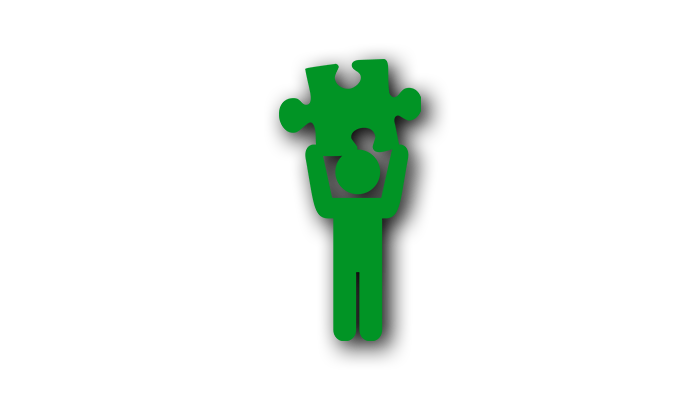

---

title: 如何组织一场全员参与的培训活动  
date: 2019-10-19   
updated: 2019-10-19  
categories: 杂七杂八  
tags: 工作  
permalink: organising-training-events    

---

不仅课程内容要有料有趣，如何设计活动流程，也是一门大学问。

<!-- more -->

## 课前

### 致学员

- **准时开课**：才对得起按时参加的同学
- **消失一天**：我今天（09:30 至 16:00）参加由 `***` 举办的第 `*` 期 `***`。我承诺一定完成今天的学习任务。培训期间不方便接听电话，有事请在微信留言，我会在课间休息的时候联系你。

### 举办方

- 1 人 1 份
    - 课程大纲 + 草稿纸
    - 签字笔
    - 纯净水
    - 姓名贴纸
    - 茶点
    - 午餐
- 若干助教
    - 计分
    - 保管手机（2 个小时看一次手机）
    - 传递话筒
- 倒计时动画：开课前 5 分钟开始倒计时
    - Windows 10 用户：`Windows 徽标键 + S` 打开搜索框，输入 `闹钟` 即可打开倒计时
- 背景音乐
- 演讲型 PPT：没有错别字，逻辑清晰，版式简洁
- 摄影师
- 奖品
- 分组牌
- 手机收纳袋（有组别标记）
- 计分板
- 课堂调查问卷

## 课时

### 热身

**规则**
- 有 Tim 说：执行动作
- 没 Tim 说：保持动作

**举例**
- 主持人：Tim 说举起右手
    - 学员：举起右手
- 主持人：放下右手
    - 学员：保持动作（不响应指示，因为 Tim 没说）
- 主持人：Tim 说举起左手
    - 学员：举起左手

### 分组

报数，并记住自己数字：

- 根据人数确定组数，例如 100 人，分 10 组
- 从 1 到 10 循环报数
- 数字 1 的人分到第一组 …… 数字 10 的人分到第十组
- 迟到的学员分到第 11 组

### 积分

- 每个组的基础分数是 5 分
- 答对加分
- 手机没静音扣分
- 奖励第一名
- 惩罚最后一名

### 反馈

- 根据学员的吸收程度调节语速

## 课后

- 扫二维码，填写课堂调查问卷，并奖励有建设性的意见。
- 颁奖
- 合影

---

关联视频：[如何开一场高效的会议 - Topbook](https://topbook.cc/overview?selectedArticle=1813)

