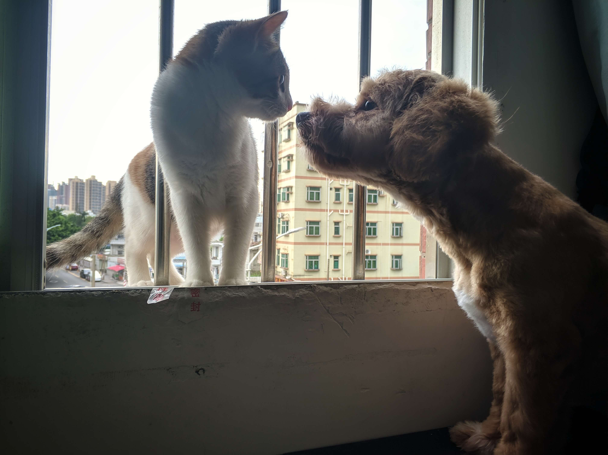

如何成为一名合格的铲屎官？路漫漫其修远兮。

<!-- more -->

2020 年 3 月 8 日，朋友送我一只小母猫。这只三花毛是她从路边捡的，但是家里人不同意她饲养，于是只好把她送给我饲养。她喜欢哆啦 A 梦，所以给这只难以驯服的小野猫取名为哆啦（Dora）。

2020 年 5 月 14 日，又一条叫叮当（Tinkle）的串串狗无人照顾（免费送给爱狗人士），而我白天都在上班，不如接过来给小猫做个伴，解解闷。

2020 年 7 月 26 日，因为各种原因，我把这只中国田园猫送给开奶茶店的朋友，作为「镇店之猫」，防治鼠患。空留一条狗子，在睡眠舱咆哮。

**养猫成本** `2020-03-08 至 2020-07-25`

| 日期       | 项目                      | 品牌       |     价格 | 购买渠道 |
| ---------- | ------------------------- | ---------- | -------: | -------- |
| 2020-03-15 | 猫三联疫苗 + 驱虫         | 妙三多     | ￥399.00 | 宠物医院 |
| 2020-04-15 | 猫砂 8 袋                 | 永驰       | ￥160.00 | 天猫商城 |
| 2020-05-17 | 体内外驱虫                | 大宠爱     |  ￥90.00 | 宠物医院 |
| 2020-05-18 | 无谷三拼肉宴幼猫粮 1.5 kg | 信元发育宝 | ￥147.91 | 京东商城 |
| 2020-06-07 | 全价猫粮 1.8 kg           | 网易严选   |  ￥82.30 | 京东商城 |
| 2020-06-21 | 狂犬疫苗（人类）          | 辽宁冻干   | ￥431.00 | 二甲医院 |
| 2020-07-18 | 全价幼猫粮 5.4 kg         | 网易严选   | ￥227.98 | 京东商城 |
| 2020-08-09 | 自动饮水器 3.8 L          | 迈仕       |  ￥15.90 | 天猫商城 |

**关联阅读**

- [三花猫（Calico Cat）花色形成的原因（上）](https://highscope.ch.ntu.edu.tw/wordpress/?p=1168)
- [三花猫（Calico Cat）花色形成的原因（下）](https://highscope.ch.ntu.edu.tw/wordpress/?p=1170)
- [你知道三花猫为什么是母猫咩？——猫咪毛色遗传规律 - 猫外婆MO桑](https://zhuanlan.zhihu.com/p/51757798)

**养狗成本** `2020-05-14 至今`

| 日期       | 项目                           | 品牌                   |     价格 | 购买渠道 |
| ---------- | ------------------------------ | ---------------------- | -------: | -------- |
| 2020-04-14 | 疫苗（第一针、第二针）         | 硕腾（卫佳伍、瑞比克） | ￥160.00 | 宠物医院 |
| 2020-05-15 | 幼犬狗粮 8 kg                  | 皇家                   |  ￥84.98 | 京东商城 |
| 2020-05-17 | 体内外驱虫                     | 超可信                 | ￥150.00 | 宠物医院 |
| 2020-05-17 | 体外驱虫喷剂（杀跳蚤）         | 福来恩                 | ￥149.00 | 宠物医院 |
| 2020-05-19 | 沐浴露 1 L                     | 雪貂留香               |  ￥41.00 | 拼多多   |
| 2020-05-19 | 自动饮水器 + 喂食器            | 瀚品                   |  ￥32.00 | 拼多多   |
| 2020-05-19 | 小号梳子                       |                        |   ￥7.80 | 拼多多   |
| 2020-05-19 | 剃毛 + 美容                    |                        | ￥140.00 | 宠物医院 |
| 2020-05-23 | 玩具（骨头、棉绳球、漏食球）   | 派乐特                 |  ￥23.90 | 京东商城 |
| 2020-07-04 | 疫苗（第三针）                 | 硕腾（卫佳伍）         |  ￥80.00 | 宠物医院 |
| 2020-07-05 | 疫苗（第四针；办理犬证用）     | 瑞贝康                 | ￥150.00 | 宠物医院 |
| 2020-07-17 | 溶液（治疗真菌感染）           | 宝疗微                 | ￥110.00 | 宠物医院 |
| 2020-07-17 | 伊丽莎白圈（宠物保护套）       | 焱松                   |  ￥25.00 | 宠物医院 |
| 2020-07-17 | 感冒针（一次 3 针，连打 3 天） |                        | ￥240.00 | 宠物医院 |
| 2020-07-17 | 衣服（防止着凉或晒伤）         |                        |  ￥11.45 | 淘宝     |

## 2020-03

### 2020-03-08

Dora 来了。`14:30`

眼泪汪汪的委屈样，看来经常被 Ashley 揍。
因为 Dora 的牙齿尖，喜欢咬人。

### 2020-03-09

被 Dora 吵醒了。`06:50`

Dora 是个胆小的疯婆子，现在无法驾驭。

迫不及待想要回去摸 Dora。

### 2020-03-10

Dora 喜欢把人类的脚当成猎物，冷不丁从远处发起攻击，一把抓住你的脚，挠啊挠。`00:56`

Dora 是猫型闹钟。`06:15`

一打开衣柜，Dora 就会冲进来，然后就撵不出去。`21:37`

### 2020-03-11

我坐在电脑前写博客，Dora 安静地躺在我的膝盖上，纵使有很多蚊子，脚上叮满了「红点」，我也不想惊醒这只让人又爱又恨的小猫咪。`00:08`

今晚不想把 Dora 关进笼子里，希望她不要打开我的蚊帐。`00:30`

有猫叫，没懒觉。`07:15`

### 2020-03-12

今晚开始，我要把 Dora 重新关进笼子里，一整晚在床上跳来跳去，咬我的脚趾头就算了，Dora 居然咬我的耳朵 ，还死死不松口。`07:43`

Dora 不吃肥猪肉。

### 2020-03-13

Dora 最近越来越疯癫了，刚刚居然抓我后背！`00:45`

梦到 Dora 死死咬住我的右手食指不放，然后我的食指就流出来「绿色的饭粒」。在我们那，「绿色的饭粒」是吓唬调皮小孩的话。

Dora 咬我下巴。

Dora 咬我奶头，隔着白色 T 恤衫，右边。`18:56`

Dora 霸占了我的枕头，谁来拯救我的睡眠舱？`00:33`

### 2020-03-14

Dora 打了第一针疫苗。`16:13`

Dora 打完针会嗜睡，今晚可以安宁了。`23:34`

### 2020-03-15

Dora 咬我的胳肢窝和肱二头肌。`07:11`

Dora 跟 WYR 玩得很好。

### 2020-03-16

Dora 在床上跳来跳去，又不忍心放她进笼子里。

### 2020-03-17

Dora 总要偷喝我杯子里凉白开。

Dora 不喜欢吃猪肉，火腿肠和骨头，但是喜欢吃炸鱼块。`20:38`

Dora 有时会把头埋进猫窝里，幻想妈妈在身边，她在喝奶。半个小时后，猫窝就湿了。可能是因为幼年流落寒冷的街头，断奶太早所致。

### 2020-03-18

今晚开始，绝不心软，一定要把 Dora 打入冷宫。因为睡眠严重不足。

### 2020-03-19

我已经把蚊帐盖的严严实实了，Dora 还是想办法爬进来和我睡。真是一个小机灵鬼。再纵容她一晚上。`01:12`

被 Dora 抓花了额头，已打入「冷宫」。`01:40`

Dora 在笼子里拉屎了，有点臭，起来收拾。而且一直喵个不停，只好放出来。这次我把文章用很多燕尾夹封死了，看她怎么破。

右脚踝被抓出血了，还没决定去打疫苗呢：
- 被城市小猫咬伤染上狂犬病的概率较低，大部分因狂犬病致死的人来自农村。（待求证）
- 作为在农村长大的孩子，我肯定被猫狗抓伤或咬伤，好像从来没有去打过疫苗，还好至今健在。
- 囊肿羞涩：费用大概四百多块；一共 5 针，还要请 5 天事假（扣工资那种）。
- 生亦何哀，死亦何苦，我也已经体验大部分人类生活了，离开人世，也没什么大的遗憾。
- 医院会增加感染新型冠状病毒的风险。
综上所述，再赌一把，暂时在家观察。我这个对生死看淡的懒人，做出了这个不科学不负责的决定，不吃惊。`02:11`

在蚊帐旁兜里一圈又一圈寻找突破口，太吵了，只好打开文章让 Dora 进来。让后她就像疯婆子一样在床上跑来跑去，时不时扑过来挠我。`02:20`

Dora 趁我去淘米，偷吃一块炸鱼，还把键盘弄得都是油。

左脸颊被 Dora 咬了。`20:58`

### 2020-03-20

Dora 在笼子也是挺乖的。

### 2020-03-21

还是一如既往的淘气。

Dora 睡在我的身旁，一只肉爪子按在我的脸蛋上，她此刻安详地打着呼噜，希望明天醒来，我没有毁容。`01:49`

每天都要和 Dora 大战三百回合。`09:02`

第一次独自一人给 Dora 洗澡，两只手不够用。`17:17`

### 2020-03-22

Dora 偷吃我做的的苦瓜丁炒饭，在轰走她的时候，打翻了我的水杯，所幸笔记本电脑还可以启动。`21:38`

### 2020-03-23

Dora 会跳到窗户上，从三楼凝望外面的世界。人类把宠物圈养起来，是残忍还是对动物的保护？

### 2020-03-24

现在我已经不担心 Dora 跳窗的事了，生物的本能会让她珍惜自己。

### 2020-03-25

Dora 今天早上唤醒主人的方式很过分：
- 左眉头处被抓了 1 厘米，虽然破相了，但是挺酷的。如果是下眼睑，那就更好了，用猫爪子刻下  [Luffy](https://zh.m.wikipedia.org/zh/%E8%92%99%E5%85%B6%C2%B7D%C2%B7%E9%AD%AF%E5%A4%AB) 同款的刀痕。
- 手心虎口处也被抓了，握紧摩托车的油门把手，微疼。

而且太吵了，我的睡眠严重不足，今天居然关了 3 次闹钟才起床成功（每次贪睡 5 分钟）。

Dora 会在厕所拉尿了，但是还是要在猫砂里拉屎。

### 2020-03-26

我是被你囚禁的猫，已经忘了窗有多高。如果离开你给我的小小城堡，不知还有谁能依靠。

我像是一个你可有可无的玩具，和寂寞交换着悲伤的心事。这撩乱的城市，容不下我的吃，是什么让我这样暴食，这样的放肆。

对胃无计可施，这无味的日子，我的饱腹是唯一的奢侈。

改编自：彭羚 1996 年演唱的歌曲《囚鸟》

### 2020-03-27

Dora 果然是夜猫子，一到晚上就疯了一样。`01:02`

### 2020-03-28

鼠标的线被咬坏了，不能用，去京东买了罗技 G102。

路由器的电源线也被咬坏了，但还可以用。

笔记本电脑的 delete 键也被她坐坏了。

气死我了，我要撸秃她。`08:34`

每次一打开衣柜，猫咪就会立即窜进衣柜。

### 2020-03-29

给 Dora 洗澡，这次比较乖了。

### 2020-03-30

Ashley 一口气给 Dora 买了 8 袋猫砂（保质期 12 个到 18 个月），2 瓶除菌除味喷雾。

### 2020-03-31

学习养猫的计划迟迟没有推进。

## 2020-04

### 2020-04-01

我在小时候就喜欢把小猫小狗抱到被窝里，虽然农村的动物都不洗澡，我也不嫌脏。Dora 也会钻进我的被窝里，但是她会咬我肚脐，手臂和裤腰带，完全不是「淑女」。

### 2020-04-02

Dora 最近不爱吃猫粮了，刚好可以减肥。`00:42`

Dora 总爬到我的水杯旁，偷喝我的白开水，于是我把水杯放在高处（位于笔记本电脑上方的隔板）。就在刚刚，水洒到笔记本上。

### 2020-04-03

终于深刻体验到什么是「夜猫子」了。Dora 白天睡觉，晚上胡闹。`01:34`

### 2020-04-04

要是 Dora 是一个可以听懂人话的猫精那该多好呀，也许我就不会把表达欲都倾泻在博客上了。`01:12`

带 Dora 去打第二针疫苗。太凶了，女兽医的针   刺不进去，只好转交给上次的男兽医处理。`09:50`

Dora 的品种原来是狸花（中华田园猫）。

Dora 被人遗弃，或自己走丢，小时候没喝到奶，只好幻想自己在喝奶。

### 2020-04-05

今天要出一趟远门，可能 2 天不回来。倒满了猫粮和水，打开衣柜换衣服，像往常一样，Dora 会窜进来。就在我准备出门的时候，发现哪里不对劲：猫去哪了？床底下也没找到，我呼唤 Dora，循着微弱的猫叫声，发现她被我随手关在衣柜里了。如果我在出门的时候，没有多留一个心眼，Dora 会不会把我的衣服都撕碎了？以及我又做回独居青年（猫死了）？

### 2020-04-06

今晚没有回去睡觉，希望 Dora 一切都好。

Dora 听到我的脚步声，还没开门，就哇哇的叫。一进门，就使命蹭我的脚，这是最令人享受的 Moment，人与动物之间，亲密无间。

但很快，我就把她锁在笼子里，因为她要咬我的鼠标线，手机数据线，笔记本电脑电源线……一碰她，也虎虎地咬我。

### 2020-04-07

Dora 喜欢咬我的头发，纵容下去，我迟早会变成性感的秃头先生。`01:36`

### 2020-04-08

Dora 睡在我的枕头旁边，我感到很幸福。

### 2020-04-09

宠物医院的兽医告诉我不能给宠物猫吃人类的食物，因为猫咪喜欢重口味之后，就不爱吃猫粮。但我还是到其道而行了，像农村养猫一样，不限制猫咪的食物种类，毕竟中华田园猫，生命力比较顽强。如果没东西吃，她自然会去吃猫粮。

### 2020-04-10

Dora 总是喜欢喝我水杯中的凉白开。

### 2020-04-11

今早照镜子发现，左脸颊被猫抓了一厘米左右的疤痕。`09:40`

### 2020-04-12

两周没给 Dora 洗澡了，因为兽医（好像）跟我说 7 个月内都不用洗澡，因为此时猫咪的免疫系统还不够强健。

### 2020-04-13

今天买了一个桌面电脑音箱，为了测试音质把音量调到最大声，可怕 Dora 吓坏了，怎么呼喊都不应，正当我准备出门找猫时，发现她躲在床底下瑟瑟发抖。过一点时间，Dora 就适应这个音箱了。

Dora 居然喜欢吃煮熟的红薯。

### 2020-04-14

Dora 喜欢躲在被窝里，钻到我的脚下睡觉。

### 2020-04-15

Dora 长得挺快的。

我把猫咪紧紧地拥入怀里，这样我就可以不用抱着寂寞入睡，虽然有一股猫骚味。

### 2020-04-16

Dora 咬了我的眉毛。

### 2020-04-17

Dora 终于见到了领居家的小狗。

### 2020-04-18

一只爱吃番薯和「打曲棍球」的猫。吃了一块红薯之后，就开始糟蹋食物，窝窝头就更别提了，玩得更欢。

### 2020-04-19

每天早上都要跟 Dora 大战 300 回合：她不停的扑过来咬我，我不停地把她降伏，而且越打她越来劲。`07:58`

### 2020-04-20

Dora 的泪痕好重。

### 2020-04-21

我抱着 Dora 一直转圈圈，她倒在地板上，我倒在床铺上。

一个人给猫咪剪指甲，好吃力。剪完之后，身上都是毛。

### 2020-04-22

吃饱饭就不想写作、学英语和找工作（未辞职），然后就躺在床上跟猫咪玩耍。`22:19`

Dora 喜欢用身子蹭我的脚，我喜欢用我的头蹭 Dora 的身子。`23:08`

### 2020-04-23

我的被子应该沾满了猫毛，但我不在乎。

Dora 居然可以跳到冰箱（中等高度）上，然后偷喝我的水，这意味着我每天都跟一只母猫间接接吻了。怪不得 Dora 自己的水杯总是满满的。`00:37`

### 2020-04-24

鼻子被 Dora 咬了一口。 `02:29`

### 2020-04-25

Dora 一直养着高处乌龟。`01:23`

枕着 Dora 睡觉😴，真舒服。`01:30`

带 Dora 去打了第三针疫苗，这次很乖，没有咬女兽医。`10:30`

### 2020-04-26

今天下班回来，发现 Dora 不在卧室，找啊找，发现 Ta 藏在被窝里睡觉。

### 2020-04-27

社区网格员来查房，看到 Dora 后，直呼可爱，忍不住逗她。

### 2020-04-28

Dora 会在厕所拉尿，为什么不在厕所拉屎呢？

### 2020-04-29

回家一周左右，Dora 交给球友 CZL 打理。每天晚上看看 Dora 有没有饿死或者越狱了。`22:10`

### 2020-04-30

Dora 挺乖的，没有收到临时监护人 CZL 的投诉。`01:35`

## 2020-05

### 2020-05-01

因为 CZL 明天要上班，所以 CZL 提前一天带 Dora 去打狂犬疫苗。

### 2020-05-02

Dora 还好吗？有点想她。`01:23`

### 2020-05-03

Dora 在干嘛呢？

### 2020-05-04

明天就可以回去被 Dora 欺负了。

### 2020-05-05

我把猫砂盆拿去泡水了（以便软化猫屎），所以 Dora 从下午到现在不能照常解手。只好去厕所拉便便，这是她第一次去解决。不过她的前一任主人买了很多猫砂，得先用完。不然，从今晚开始我就可以省了猫砂钱了。`22:33`

### 2020-05-06

我的上嘴唇 👄 被这只母猫 🐱 咬出血了，然后出现了两道可见的牙痕（大概 1 厘米长）。`23:49`

### 2020-05-07

Dora 经常喝我杯子里的白开水，一开始我会倒掉，现在我选择共饮。

### 2020-05-08

最近 Dora 吃得少，毛发也褪去了光泽。

### 2020-05-09

Dora 是孤独的猫，我是孤独的人，我们相拥而眠。

### 2020-05-10

猫的舌头 👅 像砂纸一样粗，舔我的脸的时候，这种感受更明显。

### 2020-05-11

Dora 今晚似乎恢复了活力，拉了好多便便。之前因为打了疫苗，生命活动不活跃，

### 2020-05-12

Dora 喜欢看我洗澡。

### 2020-05-13

我一回来，把她抱在怀里，然后我仰天躺在床上，这是 Dora 温暖的前爪就会捂住我的嘴🤫，似乎在说：「不要说话，撸我。」

### 2020-05-14

一条叫叮当（犬种是串串，出生日期是 2019 年 12 月）的狗狗没人照顾，就在 500 米，别人送我，今晚去接了起来，挺乖的，挺脏的，洗澡也没有叫，但是猫一直在叫。`23:19`

> 串串狗是所有杂交品种狗或品种特性不明显的狗的总称，不是某个具体的犬种，基因不纯。

### 2020-05-15

叮当有虱子。`00:25`

哆啦现在还对叮当虎虎生威。`01:25`

希望今晚下班回来（无人在家），狗子还有一个全尸。`06:47`

叮当的英文名哪个好：Jingle OR Tinkle？

下班回来，地板上都是狗尿，猫与狗也没有和解。

第一次出来遛狗，忘记带纸巾出来，万一狗拉便便，那就尴尬了。

叮当表面温顺，遇到其他狗子，也会吼。`20:12`

三姐我说这条狗太丑了，父亲让我把猫给放生了。`21:32`

### 2020-05-16

吃完宵夜，一进门：一堆狗屎，一滩狗尿，一堆猫屎（猫被狗带坏了，不在猫砂里解手）。

### 2020-05-17

狗子把我的睡眠仓搅得天翻地覆。

一起来，地上狗屎狗尿。

事实证明，被子上猫毛是洗不掉的。`10:55`

### 2020-05-18

驱虫好贵，猫粮好贵。`01:06`

早上起来，房间整洁，没有屎，只有尿。感觉不对劲，匆匆吃了早餐后，拿起纸巾和垃圾袋，套上狗绳，带狗子到外面释放排泄物。遛了五分钟，我终于获得「室外铲屎官」的成就，`07:30`

狗子偷吃了开封的零食（鸡小胸），不过没有在房间拉臭臭，就原谅他了。`20:47`

叮当吃了哆啦的（猫）屎。`21:02`

狗子体重 5.15 kg，猫咪体重 2.7 kg，我的体重 65.65 kg。

### 2020-05-19

放哆啦出去活动，没想到自个跑到上一个楼层（4 楼）去了，还不肯下来。

今晚遛狗，拉了软塌塌的便便，宠物医院的兽医说可以睡觉着凉了（肚子贴着冷地板）。`21:18`

把狗子（免费）寄养在宠物医院，明天宠物美容师就会把叮当梳洗好。`21:37`

狗吃猫粮，猫吃狗粮。

### 2020-05-20

理条 5 kg 的狗（毛），花了 ￥140，还要天天带他出去拉臭臭，还是养猫轻松。`21:09`

### 2020-05-21

地上都是狗屎，我还踩到了。`07:10`

下雨了，就不用下楼遛狗，那就上天台吧。`19:28`

### 2020-05-22

抱着狗子看美剧，幸福。`00:25`

狗子居然跑出来了，在楼道里拉屎，难道我没关门，或者没关紧。`10:17`

我知道原因了。我把包挂在门把手上，然后狗子咬我包的时候，不小心把门打开了。`10:26`

不慎踩到小猫，她立刻反咬我一口。

狗子居然自己下楼跑出去了，得亏唤回来了，不然我会比失恋还伤心的。`22:11`

### 2020-05-23

我成了天天捡狗屎的人。`19:33`

猫咪从窗户跳进杂物间，我进不去，她也不肯出来，不管了。`21:09`

### 2020-05-24

猫咪把我的陶瓷杯从冰箱上推倒书桌上，水洒了，杯子没碎。

把猫咪带到天台放风，她却怂了，要回家，但狗狗可喜欢天台了。`07:28`

谁放屁这么臭？狗子还是猫咪？`09:04`

打开窗一看，楼下停着一辆抽粪车。`09:10`

狗子把隔壁小姐姐的鞋子叼走了。

拖到现在才去打狂犬疫苗。理由：万一我死了，可能就没人照顾哆啦和叮当了。`10:19`

打狂犬疫苗，一点也不疼。`11:11`

虽然打完疫苗后，饮食要清淡，但我还是忍不住要吃辣椒。`11:53`

### 2020-05-25

狗子晚上六点半多就开始吵吵闹闹，啊，我那少得可怜的睡觉时间。`07:24`

狗子有把猫屎叼出来，弄得满地板都是。`14:17`

### 2020-05-26

狗子又在房间里拉便便了。

看着狗子在天台蹦跶，真羡慕。`07:33`

狗子被人投入气味大，猫咪居然跑到陌生邻居的床上窝了起来，太不省心了。`21:20`

狗子喜欢吃鸭汁饭。`22:35`

### 2020-05-27

狗子不安宁，真怕邻居投诉。`06:40`

狗子又在吃猫屎，头疼。`06:50`

### 2020-05-28

狗子睡得晚，起得早，还特别吵，我觉得邻居快要受不了。`07:08`

大半夜，大清早，狗子不停歇。如此扰民，打狗解气。

虽然 23:00 才回到睡眠仓，但是狗子没有房间拉屎，太棒了。接着立即带他去天台解手。

### 2020-05-29

狗子拉稀，难道是因为昨晚喂了一包湿粮？

狗子总是把猫砂盆里猫屎叼出来，满地都是。`07:56`

### 2020-05-30

自从叮当来了，宠物日志充满了狗子，微信猫咪省心，狗子闹心。`01:29`

### 2020-05-31

Good dog，今晚没有吠。`00:36`

Dora 居然跳到衣柜上面去了，比我身高还要高很多。`06:24`

## 2020-06

### 2020-06-01

这两个生物不到六点钟，就在房间里追赶跑跳蹦，搅得我不得安宁。

狗子昨晚没有把猫屎叼出来，也没有拉屎在睡眠仓，Good boy。`06:22`

狗不会被鱼刺卡到？

我的右手被 Dora 抓出去血了，这个疯婆子。`23:29`

### 2020-06-02

狗子在天台啃朽木。`06:50`

蒸了一个鸡蛋，猫吃蛋黄，狗吃蛋白和蛋黄。`07:07`

Dora 的更精确的叫法是三花猫（毛色由黑、白和红（黄/橘）构成），根据遗传规律，几乎都是暴脾气的小公主（染色体是 XX），很少是公猫（染色体突变为 XXY，非常稀有，在日本被视为幸运的象征）。

### 2020-06-03

不能养成早上六点多就要遛狗的习惯，不管狗子怎么呼唤，当前憋不住就先拉在房间吧，后期慢慢教。

睡了十分钟懒觉，然后就没时间去天台遛狗。

### 2020-06-04

狗子在天台拉完屎尿，要几分钟，自动会下楼梯。`00:16`

### 2020-06-05

捡猫屎，碰到猫屎了。`07:26`

给狗子吃骨头（鱼和鸭），应该不会卡到喉咙或肠胃吧？`22:18`

便便很硬，里面有骨头。

### 2020-06-06

早上，狗子又在房间拉屎了。`07:09`

父亲让我把猫狗扔了，特别是猫，越早越好，找不到人就丢在深山老林里。`23:05`

### 2020-06-07

左手手腕出被猫抓出血了，2 厘米长的口子。`07:48`

手上满是被 Dora 抓的爪痕，脖子上也有一些。

### 2020-06-08

从三楼走到六楼的天台，还没登顶，狗子就失禁了，把便便 💩 排泄在楼道里。

Boys often like dogs very much. The animals can listen to their masters. But my dog does not listen to me. `23:58`

### 2020-06-09

狗子晚上还会叫。

下班回到家，没有狗屎狗尿，很棒。`19:23`

今天狗子表现好，额外来天台放风一次。`22:08`

今晚看到 Dora 在蹲坑里拉便便 💩，Good girl。

斗鱼生了很多宝宝，花了很久才把 Ta 们与母体分开。没有活饵（例如草履虫）给小斗鱼开胃，只好放一些煮熟的蛋黄和粉末状的斗鱼饲料。

### 2020-06-10

不知是饿坏了（但是拉得不少），还是吃了我拌的饭，狗子吐带泡沫的黄疸水。

外出学习一两周，委托了两位朋友照看猫狗。走了软肋，我不再无所畏惧。

### 2020-06-11

串串狗昨晚吐了 2 滩黄水，早上又吐了 4 滩黄水。排泄物正常，生命活动正常（追赶跑跳，欺负猫咪），原因可能是：

- 吃了人类的食物（汤饭、炸猪皮）
- 不爱吃狗粮，喜欢吃猫粮

按照邻居养狗小姐姐的意见，煮了 2 个鸡蛋，狗子哗啦啦地吃完了。

今天早上，海绵抹布惨遭毒手，被狗子粉身碎骨，而公仔猪（毛绒玩具）早已命丧黄泉。

回到家，发现本来应该在床上的猫窝却落在地上。狗子上不了床，真凶就是 Dora。上次是把纸巾推到地下，Dora 真的是越来越坏了。

带狗子去天台拉臭臭，前五分钟在玩，我以为他今天便秘了。带他下楼回家，却拽不走，这时他才想想起没拉便便。

### 2020-06-12

猫咪把纸巾撕得满桌子都是，越来越坏了。把她抓到「犯罪现场」，痛扁了一顿。

把狗子拴在厕所里，把早上捡来的狗屎从垃圾桶里拿出来，放在一旁，吸引他在卫生间拉屎。他不停地叫，半个钟后，我就把他放出来了，一转眼在楼道里排泄完了。`23:28`

### 2020-06-13

养了猫狗之后，早上就没睡过懒觉了。`07:59`

胸口又被 Dora 抓伤了。

### 2020-06-14

周末给猫狗洗澡，忙得快递电话都没接到。`17:15`

### 2020-06-15

猫抓蚊子狗吃梨。

### 2020-06-16

猫咪趁我上班不在家，把被子推到床下，任由狗子蹂躏。

### 2020-06-17

启用漏食器（放狗粮进去）。`00:13`

狗子又把猫屎叼出来了。`07:26`

狗子疫苗没打完，我依稀记得上次去宠物医院，兽医说打完了。

### 2020-06-18

啦啦啦，啦啦啦，我是拖狗尿的小行家。

忘记关门，狗子跑到一楼去了，幸好朋友的妈妈遇见了。

### 2020-06-19

数据线耷拉下来，狗子没咬断。`07:12`

猫咪今天不爱吃猫粮了。

### 2020-06-20

一进门，浓重的狗骚味扑面而来。

在外面吃个烧鸡烧鸭，都会想着把骨头带回家给狗子吃。`21:56`

猫咪这几天吃得很少，会不会生病了？

狗子学会憋尿了，一天下来，只在房间尿了一小泡。`22:01`

### 2020-06-21

狗子一晚上没拉尿。

狗子今天洗澡很乖。

### 2020-06-22

早上起来，狗子没在房间拉屎拉尿，也没叼走我的拖鞋。`07:14`

狗子吃了骨头，拉出了白色的便便。

猫狗不吃死掉的斗鱼。`19:43`

### 2020-06-23

抱着狗子看连续剧，巴适。

下班回来带狗子出去拉屎，居然没有拉。`20:23`

### 2020-06-24

狗子会自己跳上我的电动摩托车了。

猫咪还是吃得少，也瘦了不少。`20:51`

### 2020-06-25

狗子喜欢「吃」乒乓球、哈密瓜皮和粽子。`09:19`

猫咪在桌子底下，抱着我的脚，像婴儿一张睡着了。`14:03`

### 2020-06-26

猫咪早上起来还是要咬我，但是狗子不会把猫砂里的狗屎叼出来了。`07:35`

猫咪占据我的椅子，不让我看剧和学习。

放在床底的瑜伽垫也遭殃了，没用几次。`23:39`

### 2020-06-27

狗子这两天屎量暴增，可我是定时定量喂食的呀。`00:10`

狗子学会一个新技能：虽然上不了主人的床，但是我可以把玩具「丢」到床上去。

猫咪把煮熟的蛋黄和蛋清都吃了，以前只吃蛋黄。`08:08`

猫咪睡觉的时候会翻白眼 🙄。`08:57`

父母让我把猫给扔了，因为猫在客家话中是「无」的意思，我不反对 Ta 们，但是一直没执行父母之命。

洒在地板上拍猫。`14:49`

带着狗子，一起出去打篮球，结果滚得脏兮兮。回来给他洗完冷水澡，吹风机不小心打到热风档（一开始是冷风档），稍微烫伤了狗子，因此狗子第一次朝我凶。

要上场打篮球，把狗子套在电动摩托车的脚架上，狗子力不小，一拉，电动摩托车倾倒了，没压到狗子，左刹车磕坏了。

狗子一直很想像猫咪一样上我的床玩耍，但是狗子太脏了。所以每周给狗子洗完澡，特例允许他
来我的被窝玩一会。

猫咪饭量变少了，瘦了很多。`22:19`

### 2020-06-28

小猫咪今天的眼屎好多，是想妈妈了？`08:35`

Dora 一天发疯两次：睡前和睡醒。时间到了，就会向狮子一样扑过来，抱住我的手，把我当老鼠 🐭 一样撕咬，怎么打都不松口，越揍越皮。`13:57`

狗子不吃西瓜皮，喜欢吃猪皮。`23:55`

### 2020-06-29

猫咪恢复食欲了，我的钱包却哭了，因为猫粮比狗粮贵得多。`07:32`

每天都要去公寓天台把狗屎捡到睡眠仓的垃圾桶里。有一天，我发现天台有个大大的空纸箱，犹豫几次后，我决定做一件恶趣味的事：把狗屎留在那个纸箱中。假以时日，集满一箱狗屎后，我就可以召唤幸运女神了（狗屎运）。

### 2020-06-30

带狗子出去好几次都不拉屎，回到房间，他才拉，无法无天了。`00:52`

狗子一晚上很乖，没有排泄在房间里。`08:45`

## 2020-07

### 2020-07-01

狗子应该学会控制尿意了。

打破记录，一天溜了四次狗：
- 早上一次：天台
- 晚上三次：天台一次和一楼两次

第四次是因为狗子越狱了，跑到一楼去了，即使狗绳套在桌子腿上。`00:17`

### 2020-07-02

狗子只有宠物健康免疫证，没有深圳市犬类免疫证。

狗子被同楼层的姑娘拉出去溜了。`20:19`

### 2020-07-03

狗子又调皮了，拉个便便还要分两处地方。`07:48`

狗子的眼屎真多。

我和狗子一起躺在地上吹空调。

猫咪总是冷不丁扑过来咬我一口。`21:44`

### 2020-07-04

狗子现在变聪明了。我带他上天台拉屎，趁我去捡狗屎的时候，就自己从 6 楼跑到 1 楼，看着他可怜楚楚的样子，于是只好带他出去溜一圈。

不过也好，可以出来买些包子当早餐。但是我可不会拿包子来打狗，太残忍了。`07:49`

狗子不吃烧卖。`07:59`

因为上个主人只给狗子打了 2 针疫苗，还有 2 针没打，但是疫苗本上写的下次注射日期是 2021 年 4 月 14 日。于是今天去原先的宠物店补了第三针（￥80/针）

从 5 月 18 日到 7 月 4 日，狗子从 5.15 kg 长到 7.3 kg，猫咪从 2.7 kg 长到 3.7 kg，我从 65.65 kg 瘦到了 64.8 kg。`22:47`

隔壁的小姐姐特别好心地过来提醒我要尽快去办理「狗证」（养犬证）。并且告诉我如何管教狗子：狠狠地打他鼻子👃，疼才会让他长记性。`23:37`

SYT 帮我遛狗：你家狗有点怕别的狗，还有点怕音响。路过别人跳舞，往音响那过不敢走，我抱走的。

我回复：之前都是他吼别的狗，前几天他被别的狗吼过后，现在就怂了。

### 2020-07-05

天气太热了，给狗子剃毛（￥100）：只剃身子和狗腿上半部分，头部和狗腿下半部分。

为了办理养犬证（狗证），又打了一针疫苗（￥50）。`12:05`

自从养了阿猫阿狗，我「爱」上做家务：
- 在家的话，每隔几个钟就要拖狗尿。
- 几乎每晚都要扫地拖地，以驱散狗骚味。
- 几乎每周日就要洗被子、枕套和竹席，一是因为猫脱毛，而是因为猫要上床，与我共枕。

话音刚落，狗子把洗好的枕套（放在水桶里）叼到床底下去了。

狗子跑出去了，死活都唤不回来。`18:44`

狗子又「越狱」了。`20:52`

### 2020-07-06

把狗子嘴巴下面的长毛剃掉了，我也不会嫌弃他「水淋淋」的大嘴巴。

申请犬证（狗证）需要一张全身照：四足站立，侧身，回头可看见狗的双眼。但是我翻遍了手机相册，也没有符合此站姿的照片，于是我只好发了一张类似站姿的「如厕照」，居然通过审核了。

> 【深圳政务大厅】温馨提示：尊敬的 `***`，您好，您在广东政务服务网提交的养犬初始登记申请，编号为：`***`，已网上预审通过。`10:58`

> 【深圳政务大厅】您好，您所申请的事项已完成，请自行在深圳市养犬服务小程序“个人中心”领取电子犬证。`11:21`

我现在后悔了，因为电子狗证的封面图居然是全身照，太不雅观了。`14:47`

猫狗喜欢吃炸腐竹（没放盐）。`19:14`

不想跟爸妈视频，又让我把猫狗送人或者扔了。`21:05`

每次倒猫粮，狗子都会突然出现在身旁。看着他渴望的大眼睛，只好抓一小撮猫粮给他尝尝。同屋不同命，猫粮比狗粮贵很多倍。`22:22`

猫粮是放在玻璃碗，碗放在一个小桌子上，以免狗子偷吃猫粮。就在刚刚，狗子把猫追到小桌子上，把碗打碎了，气死我了。`22:53`

### 2020-07-07

现在到了晚上，狗不叫了，猫却开始了，难道是发情期到了？Dora 才 一岁不到。`07:29`

Tinkle：我不是人，但你是真的狗！居然把我的身份证照（犬证封面）拍得这么丑，不过我已经开始以牙还牙了。
- 间接把盛猫粮的碗（玻璃）打碎了。
- 醒来就能闻到我的屎香味（拉在房间）。
- 无限追杀你那瘦下的小猫咪（心疼去吧）。

哼，愚蠢的狗奴才。

狗子太能拉屎了，要减少狗粮的供应。

### 2020-07-08

狗子不把我当人看。见我更衣时，他便站起来抱着我的腿，下体开始律动……泰迪（贵宾）属性开始显现。我这浓密的腿毛，是不是该剃了？

点了一份 30 块钱的牛骨，我把零星的肉吃了，骨头带回给 Tinkle 吃。`20:30`

Dora 发情了，变得很温柔，屁股撅得很高 or2，也吃得很少。`21:20`

### 2020-07-09

昨晚 Dora 一直在叫，发情期的母猫太可怕了。`07:27`

主人，我发情了。当我深夜娇滴滴地呼唤「意中猫」时，可以不要打我吗？

下班回来，狗子热情地扑过来，有人等你回家的感觉真好。`23:14`

### 2020-07-10

一晚上没睡好，猫咪发情喵喵叫，骂也不停，打也不听，好几次想把她从三楼扔下去。`07:12`

狗子也反常了，今天早上不拉屎。`07:43`

### 2020-07-11

早上做了木耳炒米粉（微辣）给外甥吃，但是太难吃，于是给狗子吃，没想到居然吃完了。不过宠物狗吃这么咸的人类食物，会挑食的这可是土狗的养法，我真是农村来的。`08:31`

发情中的母猫，寂寞难耐，辗转反侧。`23:01`

Tinkle 都快把 Dora 的耳朵 👂 咬得秃噜皮了。`23:16`

### 2020-07-12

从凌晨两点到四点，母猫都在嗷嗷叫，不管我怎么打她。`09:08`

周末坐在椅子上追剧《权力的游戏》，再拿狗子踮脚，巴适。`12:22`

午后的阳光照在狗子的肉体上，Beautiful。`14:16`

狗子剃光毛了，洗完澡，一下子就吹干了。`22:54`

### 2020-07-13

狗子终于会在厕所里拉臭臭了，奖励一根零食（由玉米淀粉、红薯粉和牛肉做成的狗骨头）。

### 2020-07-14

猫咪结束了发情期，我又成了她的猎物。

### 2020-07-15

狗子要越狱，猫咪守楼梯。

### 2020-07-16

Dora 又开始调皮了，把电动牙刷的充电线咬破了。`07:45`

### 2020-07-17

猫砂盆忘记放猫砂，Dora 就会在厕所里拉屎拉尿。`07:12`

Tinkle 的屁股上有 3 块藓？`07:50`

来到宠物医院，兽医说：
- 真菌感染，可能吃太咸（吃了人类的食物），买了一瓶宝疗微溶液（￥110，一天喷 4 次），和一个伊丽莎白圈（￥25）。
- 因为受凉，有点咳嗽，应该是感冒了，要连续打 3 天针（￥240），并给在淘宝上给狗子买了一件衣服（￥11.45）

### 2020-07-18

猫粮选了几个钟。`00:03`

给 Tinkle 带上耻辱圈后，他就喜欢蹲在卫生间，非常无奈的样子。`00:15`

### 2020-07-19

我光着膀子，转进不容翻身的床底下，不嫌弃狗骚味，对狗子说悄悄话。`15:52`

分析了一天的《隐秘的角落》，累了，躺在地上（每天都会拖地），任狗子舔我的肚子。

Dora 来我这里也有四个月了，但是一直都没有偷跑出去，纵使发情的时候。我觉得这样对她太无聊了，于是想带她出去转转。没有猫绳，就用狗绳遛猫。没想到去到一楼，还是寸步难行，四只猫爪子紧紧地「勾」在水泥板上，猫绳拽不走，只能把 Dora 提回家。`20:03`

狗子拉稀了。

### 2020-07-20

狗屎太软，纸巾一碰就穿了。`19:32`

### 2020-07-21

我在朋友圈说：

不想养猫了，因为：
- 脱毛
- 猫粮贵
- 摸不得
- 爱咬人（佛祖割肉喂鹰。在猫的眼里，我就是她的猎物。）
- 发情时半夜叫

居然真的找到下家了，任务是给仓库抓老鼠。Dora 要走了，突然有些伤感。昨晚，Dora 钻进我的被窝，之前我抱她睡觉，她都不肯。

下班回来，狗子会跟我亲热，猫只会咬我和数据线（最近又开始要电动牙刷充电线）。

> 是不是觉得狗让你的心灵得到了慰藉，就觉得下班回来看到它摇着尾巴，一天的累都觉得不累了。by 咕噜咕噜

Tinkle 的咳嗽不见好，反而加重了。也养成了一个坏习惯，拉便便要找两个地方，不是一次性搞定。`20:57`

骨头泡水，去除调味料，才敢给狗子吃。`21:07`

### 2020-07-22

骨头还留在便便里。`07:37`

Dora 把我的圆珠笔推到地下，然后 Tinkle 就能把它咬碎。这可是我唯一的一支笔。`20:25`

### 2020-07-23

每次上班出门前，都会跟家里的两只宠物说再见。

只要家里有好吃的，狗子在天台拉完便便，就会自己跑回房间。`22:09`

### 2020-07-24

早上贪睡了十几分钟，狗子就把便便拉在房间里。`07:28`

### 2020-07-25

在我坚持不懈的训导下，狗子憋不住的时候，终于学会在厕所里拉  了。我二话不说，把他抱到「案发现场」，奖励一块狗「骨头」，以资鼓励，再接再厉。`01:15`

早上六点多，猫狗就在嬉戏打闹，然后我就被吵醒了。`07:09`

狗子又在厕所里拉臭臭，实在太棒了。`15:05`

最后一晚，舍不得 Dora 送人。`23:52`

### 2020-07-26

我在朋友圈吐槽说不想养猫了，免费送人，没想到真找到新的主人了。刚买的 2 个月猫粮，还没开始吃呢。

把 Dora 的行李打包好了：
- 狗子爱吃猫粮，于是留了一半。
- 指甲剪也就给狗子了。

离别之夜，猫狗干了一架，在大半夜里。`02:21`

狗子今晚开始穿衣服睡觉，因为还是会咳嗦。`02:32`

Dora 见到地上的尿和便便，不管是不是自己拉的，都想把它埋了。`07:35`

装进猫书包，送给新主人。与我相处的时间是 2020-03-08 14:20 至 2020-07-26 08:20，总计 140 天。

Dora 的新任务是给奶茶店（大概 70 ㎡）看店抓老鼠。`11:22`

送走了猫，留下一席孤枕。

这么晚回到家，狗子居然没在房间拉屎拉尿奖励猫粮 20 g。`23:30`

### 2020-07-27

有过几次半夜发情的经历，怎么安抚和大骂都不管用，而且昨晚深夜猫狗大战。过于扰民，只好割爱。

看到笔记本电脑和风扇上满是猫毛，怀念又讨厌。`22:03`

### 2020-07-28

Tinkle 便秘了。`20:33`

### 2020-07-29

毛绒玩具惨遭开膛手 Tinkle 屠杀。

### 2020-07-30

狗子趁我不在家，把我被子拖到地板上「蹂躏」。`19:00`

### 2020-07-31

早上出去公园遛狗，Tinkle 居然用侧脸去蹭地上的狗屎，于是不得不给他洗澡。但是热水器不常开，只好洗冷水澡。要是感冒了，还要去打针（￥240）。

理发（￥150），皮肤病喷剂（￥100），去一趟宠物医院，没花个几百块，就别想出来。`08:07`

## 2020-08

### 2020-08-01

回到家，狗粮没吃完，也不拉屎，家里倒是挺乱的。`22:37`

### 2020-08-02

Tinkle 把鞋从鞋柜里叼到床底下，拼命地咬，怎么打，都不改。

狗绳快被 Tinkle 咬断了。`11:10`

Tinkle 和我一样，也有白发了，难道这就是「物以类聚，人以群分」?`17:09`

### 2020-08-03

狗子眼屎剧增，难道是因为吃了骨头？

### 2020-08-04

膝下无子，猫狗双全。

狗子还在咳嗦。`07:48`

### 2020-08-05

看到路边的猫，回想起送走的 Dora。

### 2020-08-06

Tinkle 还是会咳嗽，还是会逃跑出去玩，不听使唤。`22:08`

狗子放屁，一看，在房间拉稀。抱到厕所，教育他在厕所解决。`23:15`

### 2020-08-07

邻居小姐姐又过来帮我遛狗了，途中还给狗子买了牛奶。`22:19`

### 2020-08-08

狗子洗澡越来越不反抗了。

Tinkle 把我的鞋带咬坏了。

周末不在家，成功委托邻居女孩帮我遛狗。

### 2020-08-09

来龙华的奶茶店找 Dora，她出去玩了，寻了一圈，未见踪影。`15:30`

正当我放弃时，在门前的车底下看到一只猫，肚子消瘦。我过去，但她没有扑到我怀里。抱她，不反抗，相处几分钟，还会用身子蹭我。

我给 Dora 倒了一杯清水，她非常渴，猛喝起来。为了防止店员忘记蓄水，于是在网上买了自动饮水器（￥15.9）。

猫舍很脏，猫砂盆里都是猫屎。我清洁好后，嘱咐店员不要放满一整盆猫砂，不然底部会因为猫尿而结块。

还有另外一只跟她差不多的猫，在隔壁车底。两只猫相处得不融洽。

随访结束后，希望店员可以好好待 Dora。`17:33`

Tinkle 连垃圾桶都咬。`23:56`

### 2020-08-10

狗子把新买的「胸背带」咬断了！

早上出去遛狗，Tinkle 拉了臭臭，和其他狗子玩累后，就自己跑回家了，真棒。`08:07`

### 2020-08-11

狗子不咳嗽了，也不会在房间拉屎拉尿了。`07:25`

挑了一下子的狗粮，还没选定。`18:51`

### 2020-08-12

狗子最近不爱吃狗粮了。

### 2020-08-13

狗子又逃跑，叫不回来，打也打不怕。

狗子发情了，抱着我的粗毛腿，交配起来。我没有阻止他，怪我没有时间带他出去社交。

### 2020-08-14

下班回来，地上有四五滩狗尿。这几天狗子都没有在房间拉排泄物。还有新买的 狗粮也没吃，今天怎么了？

和往常一样，带 Tinkle 出去拉便便，然后用一次性袋子捡起来，丢进垃圾桶，不过今天是便利店门前的垃圾桶。没走几步，中年老板娘就跑过来，让我把狗屎从垃圾桶里拿走。我理亏，只好照做。这时，一旁帮我修电动摩托车的师傅说道：这家店的老板很奇葩的。今天疫情严重期间（2 月份），有一个人偷拿了便利店m两瓶水，然后便利店一家人穷追不舍，把小偷抓回来按在地上，私下调解失败，便利店居然报警了。可是，当前的警力都派去防控疫情。当巡逻民警到达现场后，也感到特别无奈，国难当头，浪费警力在这件小事上，特别生气，给店家 10 块钱，息事宁人。

### 2020-08-15

养狗之后，从此没有懒觉睡。昨晚 3 点睡，狗子照常 7 点吵着要出去。

狗子抱着大腿就是干，这次动了真格的，我也看到公狗的生殖器。找不到交配的母狗，于是去网上搜索发泄工具，还真有。`22:28`

### 2020-08-16

Dora 住在外面。下雨天会不会淋雨？

Tinkle 发情了，见到小母狗，下体就不受控制。不让他「玩」小母狗，就把兽欲发泄下小母狗女主人的大腿上，脑壳疼？`23:55`